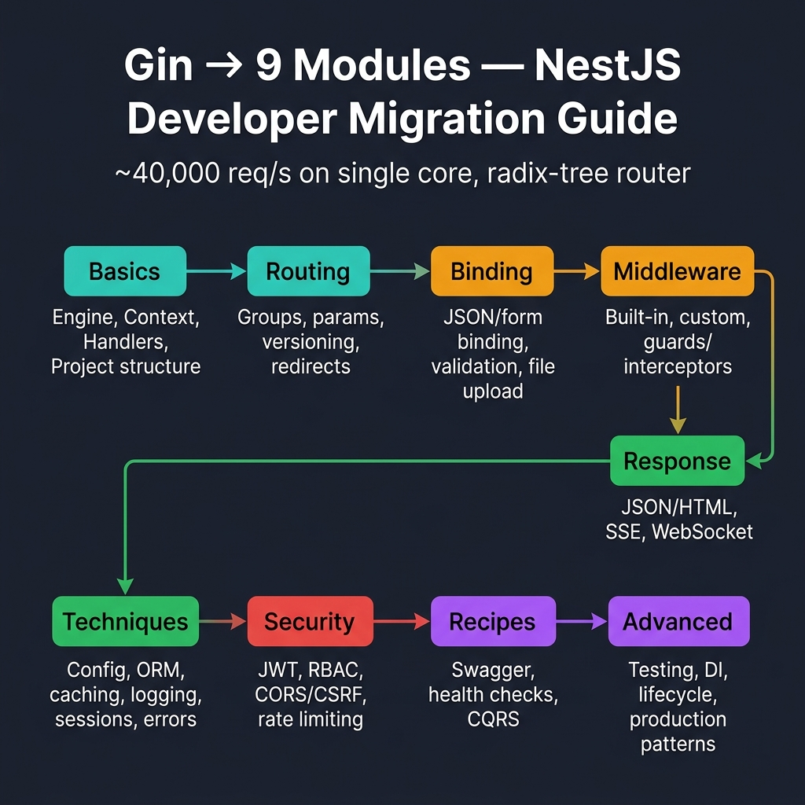
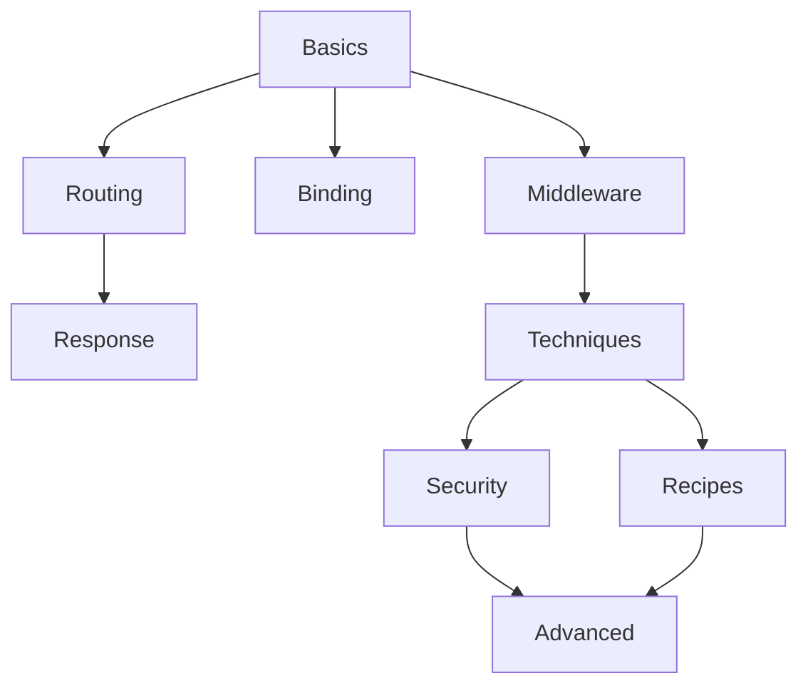
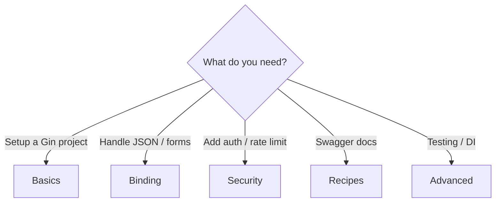

<!-- tags: golang, overview -->
# Gin Web Framework — NestJS → Go Migration Guide

> **Library**: Gin is a high-performance HTTP framework for Go. This hub organizes all Gin documentation by topic.

📅 Updated: 2026-04-19 · ⏱️ 6 min read

## 1. DEFINE

Gin maps HTTP verbs to handler functions through a radix-tree router that benchmarks at ~40,000 requests/second on a single core. Unlike full-stack frameworks (NestJS, Rails), Gin provides routing + middleware + context — everything else (ORM, auth, validation) is your choice.

This README serves as the navigation hub. Each subdirectory covers one concern:

### Learning Path

| Order | Module | What you learn |
|-------|--------|----------------|
| 1 | **Basics** | Engine bootstrapping, `gin.Context`, handler functions |
| 2 | **Routing** | Route groups, path parameters, versioning, redirects |
| 3 | **Binding** | JSON/form binding, struct validation, file uploads |
| 4 | **Middleware** | Built-in middleware, custom middleware, guards |
| 5 | **Response** | JSON/HTML responses, SSE, WebSocket streaming |
| 6 | **Techniques** | Config, ORM integration, caching, logging, sessions, error handling |
| 7 | **Security** | JWT auth, RBAC, CORS/CSRF, rate limiting |
| 8 | **Recipes** | Swagger, health checks, graceful shutdown |
| 9 | **Advanced** | Testing, DI, lifecycle hooks, production patterns |

## 2. VISUAL



*Figure: Learning path — Basics → Routing → Binding → Middleware → Response → Techniques → Security → Recipes → Advanced. Each module maps NestJS concepts to idiomatic Go Gin patterns.*



*Figure: Module dependency map — start with Basics, branch into Middleware/Binding, then specialize into Security, Recipes, or Advanced.*



*Figure: Decision tree — choose your starting point based on what you need to build.*

### Quick Navigation

```text
Need to handle HTTP requests?     → basics/01-engine-context-handlers.md
Need auth or security?            → security/01-authentication-jwt.md
Need request validation?          → binding/01-json-form-validation.md
Need custom middleware?            → middleware/01-builtin-custom.md
Need graceful shutdown?            → advanced/01-testing-production.md
```

## 3. CODE

### Example 1: Basic — Route Selector

```go
    // ━━━━━━━━━━━━━━━━━━━━━━━━━━━━━━━━━━━━━━━━━
    // Maps a goal keyword to the correct documentation file
    // ━━━━━━━━━━━━━━━━━━━━━━━━━━━━━━━━━━━━━━━━━
    func chooseLane(goal string) string {
        switch goal {
        case "request flow", "context", "handlers":
            return "./basics/01-engine-context-handlers.md"
        case "middleware order", "abort", "custom middleware":
            return "./middleware/01-builtin-custom.md"
        case "binding", "validation", "multipart":
            return "./binding/01-json-form-validation.md"
        case "jwt", "rbac", "browser security":
            return "./security/01-authentication-jwt.md"
        case "lifecycle", "shutdown", "streaming", "realtime":
            return "./advanced/README.md"
        default: return "./README.md"
        }
    }
```

---

## 4. PITFALLS

| # | Severity | Defect | Impact | Fix |
| --- | --- | --- | --- | --- |
| 1 | 🔴 Fatal | Reading documentation out of order (e.g., Security before Basics) | Missing foundational concepts causes confusion | Follow the learning path: Basics → Routing → Binding → Middleware |
| 2 | 🟡 Common | Skipping to Advanced without understanding Context | Cannot debug middleware chain or handler flow | Complete Basics + Middleware first |

---

## 5. REF

| Resource | Link |
| --- | --- |
| Gin Official | [gin-gonic.com/en/docs/](https://gin-gonic.com/en/docs/) |
| Gin Godoc | [pkg.go.dev/github.com/gin-gonic/gin](https://pkg.go.dev/github.com/gin-gonic/gin) |

---

## 6. RECOMMEND

| Extension | When | Rationale | Resource |
| --- | --- | --- | --- |
| Basics | Starting a new Gin project | Covers Engine, Context, and Handler — the three primitives everything else builds on | [./basics/01-engine-context-handlers.md](./basics/01-engine-context-handlers.md) |
| Middleware | After basic routes work | Learn request interception, logging, auth guards, and abort flow | [./middleware/01-builtin-custom.md](./middleware/01-builtin-custom.md) |
| Binding | When accepting user input | Covers JSON/form binding, struct validation tags, and file uploads | [./binding/01-json-form-validation.md](./binding/01-json-form-validation.md) |
| Security | Before deploying to production | JWT authentication, RBAC authorization, CORS, CSRF, rate limiting | [./security/01-authentication-jwt.md](./security/01-authentication-jwt.md) |
| Advanced | When scaling beyond MVP | Graceful shutdown, DI patterns, lifecycle hooks, streaming | [./advanced/README.md](./advanced/README.md) |
| Go System | When exploring beyond Gin | Navigate to other Go framework and pattern documentation | [../README.md](../README.md) |
