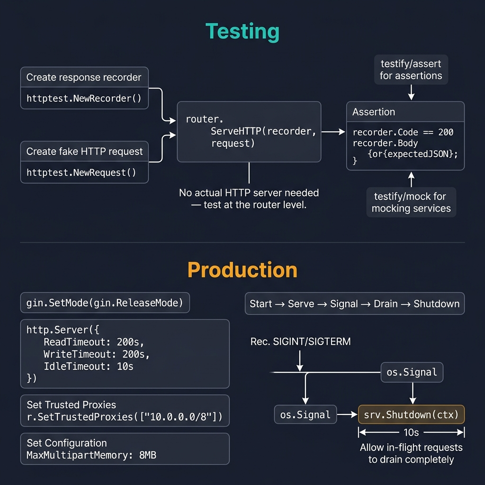

<!-- tags: golang, testing --> # ⚙️ Nâng cao — Thử nghiệm, Tắt máy nhẹ nhàng, Sản xuất

> **Thư viện**: Trình xử lý Gin thử nghiệm đơn vị với `httptest` + `testify` , triển khai với quá trình tắt máy và hết thời gian chờ sản xuất một cách duyên dáng.

📅 Đã cập nhật: 19-04-2026 · ⏱️ 15 phút đọc

## 1. ĐỊNH NGHĨA

Việc kiểm tra trình xử lý Gin yêu cầu `httptest.NewRecorder()` để nắm bắt các phản hồi HTTP mà không cần khởi động máy chủ thực. Trong quá trình sản xuất, `gin.SetMode(gin.ReleaseMode)` vô hiệu hóa tính năng ghi nhật ký gỡ lỗi và `http.Server` với thời gian chờ rõ ràng sẽ ngăn chặn các cuộc tấn công Slowloris.

| Khía cạnh | Chi tiết rượu Gin |
| ------------ | ------------------------------------ |
| **Thử nghiệm** | `net/http/httptest` + `gin.TestMode` |
| **Tắt máy** | Ranh giới tín hiệu thủ công duyên dáng |
| **Triển khai** | Giới hạn chế độ sản xuất + Thời gian chờ |

### Bất biến chính

- **Luôn đặt `gin.SetMode(gin.TestMode)` trong các thử nghiệm.** Ngăn chặn đầu ra gỡ lỗi và ngăn chặn nhật ký kiểm tra không ổn định.
- **Không bao giờ sử dụng `r.Run()` trong sản xuất.** Sử dụng `http.Server{}` với `ReadTimeout` , `WriteTimeout` , `IdleTimeout` để tránh cạn kiệt tài nguyên.

## 2. HÌNH ẢNH  *Hình: Kiểm tra — httptest.NewRecorder + NewRequest → router.ServeHTTP → xác nhận phản hồi. Sản xuất — ReleaseMode, hết thời gian chờ, SIGTERM → os.Signal → srv.Shutdown(ctx) với thời gian tiêu hao là 10 giây.*```mermaid
flowchart LR
    subgraph Testing
        A["gin.TestMode"] --> B["httptest.NewRecorder"]
        B --> C["r.ServeHTTP(w, req)"]
        C --> D["assert status + body"]
    end
    subgraph Production
        E["http.Server + timeouts"] --> F["ListenAndServe"]
        F --> G["SIGTERM"]
        G --> H["srv.Shutdown(ctx)"]
    end
```*Hình: Đường dẫn thử nghiệm sử dụng trình ghi httptest; đường dẫn sản xuất sử dụng http.Server với tính năng tắt nhẹ nhàng trên SIGTERM.*

### Thử nghiệm và quy trình sản xuất```text
Test:  gin.TestMode → httptest.NewRecorder → ServeHTTP → assert
Prod:  ReleaseMode  → http.Server{timeouts} → signal.Notify → Shutdown(ctx)
```## 3. MÃ

### Ví dụ 1: Cơ bản — Trình xử lý kiểm thử đơn vị```go
    // ━━━━━━━━━━━━━━━━━━━━━━━━━━━━━━━━━━━━━━━━━
    // Unit test: create router in TestMode, register handler,
    // send request via httptest, assert status code.
    // ━━━━━━━━━━━━━━━━━━━━━━━━━━━━━━━━━━━━━━━━━
    package handler_test

    import (
        "encoding/json"
        "net/http"
        "net/http/httptest"
        "testing"
        "github.com/gin-gonic/gin"
        "github.com/stretchr/testify/assert"
        "github.com/stretchr/testify/mock"
    )

    func setupRouter() *gin.Engine {
        gin.SetMode(gin.TestMode)  
        r := gin.New()
        return r
    }

    func TestGetUser_Success(t *testing.T) {
        mockService := new(MockUserService)
        mockService.On("GetByID", mock.Anything, "1").Return(
            &User{ID: 1, Name: "Alice"},
            nil,
        )

        handler := &UserHandler{service: mockService}
        r := setupRouter()
        r.GET("/users/:id", handler.GetUser)

        req := httptest.NewRequest("GET", "/users/1", nil)
        w := httptest.NewRecorder()
        r.ServeHTTP(w, req)

        assert.Equal(t, http.StatusOK, w.Code)
        mockService.AssertExpectations(t)
    }
```### Ví dụ 2: Trung cấp — Tắt máy chủ sản xuất```go
    // ━━━━━━━━━━━━━━━━━━━━━━━━━━━━━━━━━━━━━━━━━
    // Production server: ReleaseMode + explicit timeouts.
    // Graceful shutdown: trap SIGINT/SIGTERM, drain in-flight.
    // ━━━━━━━━━━━━━━━━━━━━━━━━━━━━━━━━━━━━━━━━━
    package main

    import (
        "context"
        "log/slog"
        "net/http"
        "os"
        "os/signal"
        "syscall"
        "time"
        "github.com/gin-gonic/gin"
    )

    func main() {
        gin.SetMode(gin.ReleaseMode)
        r := gin.New()

        srv := &http.Server{
            Addr:              ":8080",
            Handler:           r,
            ReadTimeout:       15 * time.Second,
            WriteTimeout:      30 * time.Second,
            IdleTimeout:       120 * time.Second,
            MaxHeaderBytes:    1 << 20, 
        }

        go func() {
            if err := srv.ListenAndServe(); err != nil && err != http.ErrServerClosed {
                slog.Error("server error", "error", err)
            }
        }()

        quit := make(chan os.Signal, 1)
        signal.Notify(quit, syscall.SIGINT, syscall.SIGTERM)
        <-quit
        slog.Info("shutting down")

        ctx, cancel := context.WithTimeout(context.Background(), 30*time.Second)
        defer cancel()

        if err := srv.Shutdown(ctx); err != nil {
            slog.Error("shutdown error", "error", err)
        }

        slog.Info("server stopped")
    }
```---

## 4. Cạm bẫy

| # | Mức độ nghiêm trọng | Khiếm khuyết | Tác động | Sửa chữa |
| --- | --- | --- | --- | --- |
| 1 | 🔴 Gây tử vong | Sử dụng `r.Run()` trong sản xuất mà không hết thời gian chờ | Các cuộc tấn công Slowloris giữ kết nối vô thời hạn; máy chủ sử dụng hết các bộ mô tả tập tin | Sử dụng `http.Server{}` với `ReadTimeout: 15s` , `WriteTimeout: 30s` |
| 2 | 🟡 Chung | Không cài đặt `gin.TestMode` trong các bài kiểm tra | Đầu ra gỡ lỗi làm ô nhiễm nhật ký kiểm tra; lỗi kiểm tra rất khó đọc | Gọi `gin.SetMode(gin.TestMode)` trong `setupRouter()` |

---

## 5. GIỚI THIỆU

| Tài nguyên | Liên kết |
| --- | --- |
| httptest | [pkg.go.dev/net/http/httptest](https://pkg.go.dev/net/http/httptest) |
| làm chứng | [github.com/stretchr/testify](https://github.com/stretchr/testify) |

---

## 6. KHUYẾN NGHỊ

| Gia hạn | Khi nào | Cơ sở lý luận | Tài nguyên |
| --- | --- | --- | --- |
| Tiêm phụ thuộc | Khi bạn cần đổi dịch vụ thực lấy mô hình thử nghiệm | DI dựa trên giao diện giúp các trình xử lý có thể kiểm tra được mà không cần DB | [./02-dependency-injection.md](./02-dependency-injection.md) |