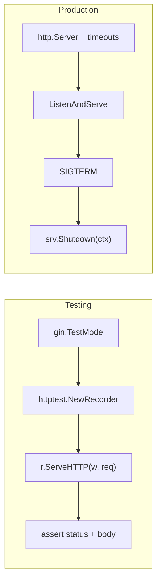

<!-- tags: golang, testing -->
# ⚙️ Advanced — Testing, Graceful Shutdown, Production

> **Library**: Unit test Gin handlers with `httptest` + `testify`, deploy with graceful shutdown and production timeouts.

📅 Updated: 2026-04-19 · ⏱️ 15 min read

## 1. DEFINE

Testing Gin handlers requires `httptest.NewRecorder()` to capture HTTP responses without starting a real server. In production, `gin.SetMode(gin.ReleaseMode)` disables debug logging, and `http.Server` with explicit timeouts prevents slowloris attacks.

| Aspect       | Gin Detail                           |
| ------------ | ------------------------------------ |
| **Testing**  | `net/http/httptest` + `gin.TestMode` |
| **Shutdown** | Graceful manual signal boundaries    |
| **Deploy**   | Production mode limits + Timeouts    |

### Key Invariants

- **Always set `gin.SetMode(gin.TestMode)` in tests.** Suppresses debug output and prevents flaky test logs.
- **Never use `r.Run()` in production.** Use `http.Server{}` with `ReadTimeout`, `WriteTimeout`, `IdleTimeout` to prevent resource exhaustion.

## 2. VISUAL


*Figure: Testing — httptest.NewRecorder + NewRequest → router.ServeHTTP → assert response. Production — ReleaseMode, timeouts, SIGTERM → os.Signal → srv.Shutdown(ctx) with 10s drain.*



*Figure: Testing path uses httptest recorder; production path uses http.Server with graceful shutdown on SIGTERM.*

### Test vs Production Flow

```text
Test:  gin.TestMode → httptest.NewRecorder → ServeHTTP → assert
Prod:  ReleaseMode  → http.Server{timeouts} → signal.Notify → Shutdown(ctx)
```

## 3. CODE

### Example 1: Basic — Unit Testing Handlers

```go
    // ━━━━━━━━━━━━━━━━━━━━━━━━━━━━━━━━━━━━━━━━━
    // Unit test: create router in TestMode, register handler,
    // send request via httptest, assert status code.
    // ━━━━━━━━━━━━━━━━━━━━━━━━━━━━━━━━━━━━━━━━━
    package handler_test

    import (
        "encoding/json"
        "net/http"
        "net/http/httptest"
        "testing"
        "github.com/gin-gonic/gin"
        "github.com/stretchr/testify/assert"
        "github.com/stretchr/testify/mock"
    )

    func setupRouter() *gin.Engine {
        gin.SetMode(gin.TestMode)  
        r := gin.New()
        return r
    }

    func TestGetUser_Success(t *testing.T) {
        mockService := new(MockUserService)
        mockService.On("GetByID", mock.Anything, "1").Return(
            &User{ID: 1, Name: "Alice"},
            nil,
        )

        handler := &UserHandler{service: mockService}
        r := setupRouter()
        r.GET("/users/:id", handler.GetUser)

        req := httptest.NewRequest("GET", "/users/1", nil)
        w := httptest.NewRecorder()
        r.ServeHTTP(w, req)

        assert.Equal(t, http.StatusOK, w.Code)
        mockService.AssertExpectations(t)
    }
```

### Example 2: Intermediate — Production Server Shutdown

```go
    // ━━━━━━━━━━━━━━━━━━━━━━━━━━━━━━━━━━━━━━━━━
    // Production server: ReleaseMode + explicit timeouts.
    // Graceful shutdown: trap SIGINT/SIGTERM, drain in-flight.
    // ━━━━━━━━━━━━━━━━━━━━━━━━━━━━━━━━━━━━━━━━━
    package main

    import (
        "context"
        "log/slog"
        "net/http"
        "os"
        "os/signal"
        "syscall"
        "time"
        "github.com/gin-gonic/gin"
    )

    func main() {
        gin.SetMode(gin.ReleaseMode)
        r := gin.New()

        srv := &http.Server{
            Addr:              ":8080",
            Handler:           r,
            ReadTimeout:       15 * time.Second,
            WriteTimeout:      30 * time.Second,
            IdleTimeout:       120 * time.Second,
            MaxHeaderBytes:    1 << 20, 
        }

        go func() {
            if err := srv.ListenAndServe(); err != nil && err != http.ErrServerClosed {
                slog.Error("server error", "error", err)
            }
        }()

        quit := make(chan os.Signal, 1)
        signal.Notify(quit, syscall.SIGINT, syscall.SIGTERM)
        <-quit
        slog.Info("shutting down")

        ctx, cancel := context.WithTimeout(context.Background(), 30*time.Second)
        defer cancel()

        if err := srv.Shutdown(ctx); err != nil {
            slog.Error("shutdown error", "error", err)
        }

        slog.Info("server stopped")
    }
```

---

## 4. PITFALLS

| # | Severity | Defect | Impact | Fix |
| --- | --- | --- | --- | --- |
| 1 | 🔴 Fatal | Using `r.Run()` in production without timeouts | Slowloris attacks hold connections indefinitely; server exhausts file descriptors | Use `http.Server{}` with `ReadTimeout: 15s`, `WriteTimeout: 30s` |
| 2 | 🟡 Common | Not setting `gin.TestMode` in tests | Debug output pollutes test logs; test failures are hard to read | Call `gin.SetMode(gin.TestMode)` in `setupRouter()` |

---

## 5. REF

| Resource | Link |
| --- | --- |
| httptest | [pkg.go.dev/net/http/httptest](https://pkg.go.dev/net/http/httptest) |
| testify | [github.com/stretchr/testify](https://github.com/stretchr/testify) |

---

## 6. RECOMMEND

| Extension | When | Rationale | Resource |
| --- | --- | --- | --- |
| Dependency Injection | When you need to swap real services for mocks in tests | Interface-based DI makes handlers testable without DB | [./02-dependency-injection.md](./02-dependency-injection.md) |
