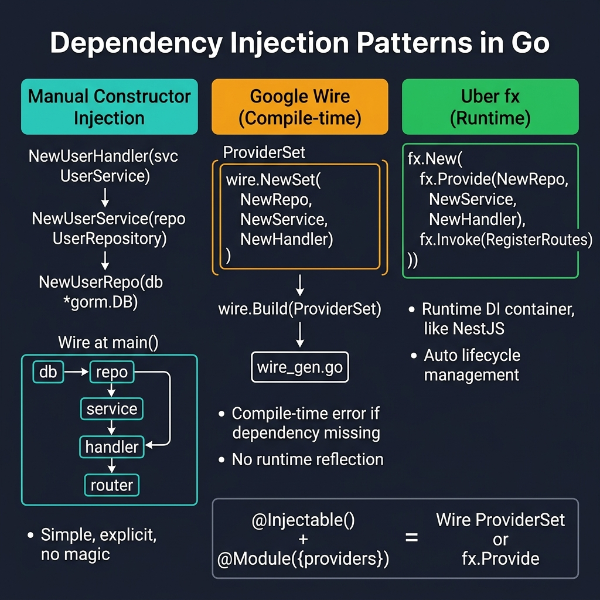
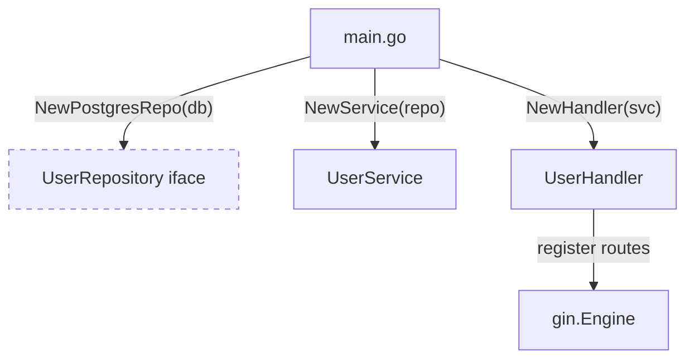

<!-- tags: golang -->
# 💉 Dependency Injection — NestJS DI Container → Go Manual/Wire/fx

> **Library**: Manual constructor injection or compile-time code generation with Google Wire — replacing NestJS DI container.

📅 Updated: 2026-04-19 · ⏱️ 14 min read

## 1. DEFINE

NestJS has a built-in IoC container with `@Injectable()` decorators. Go has no runtime DI — you wire dependencies manually in `main.go` or use compile-time code generation tools like Google Wire. Both approaches accept interfaces, enabling mock injection in tests.

| NestJS                               | Go Equivalent                             |
| ------------------------------------ | ----------------------------------------- |
| `@Injectable()` + `@Inject()`        | Explicit runtime constructor arguments    |
| `@Module({ providers: [...] })`      | `main.go` wiring or Google Wire files     |
| `useClass`, `useValue`, `useFactory` | Direct instantiation returning interfaces |

### Key Invariants

- **Accept interfaces, return structs.** Constructors take `UserRepository` (interface), return `*UserService` (concrete).
- **Wire in `main.go`, not in domain packages.** Domain code should not know how it’s assembled.

## 2. VISUAL



*Figure: Three Go DI approaches — Manual (explicit, main() wiring), Google Wire (compile-time codegen, no reflection), Uber fx (runtime container like NestJS).*



*Figure: DI wiring in `main.go` — concrete types flow down, interfaces face up. Domain packages never import `main`.*

### DI Approaches

```text
Manual:  main.go creates all deps in order (simplest, ~20 deps)
Wire:    compile-time codegen from provider sets (scales to 100+ deps)
fx:      runtime container with lifecycle hooks (Uber pattern)
```

## 3. CODE

### Example 1: Basic — Manual Injection

```go
    // ━━━━━━━━━━━━━━━━━━━━━━━━━━━━━━━━━━━━━━━━━
    // Manual DI: create deps in main.go, pass via constructors.
    // Each New* function accepts interfaces, returns concrete.
    // ━━━━━━━━━━━━━━━━━━━━━━━━━━━━━━━━━━━━━━━━━
    package main

    import (
        "log"
        "myapp/internal/config"
        "myapp/internal/database"
        "myapp/internal/users"
        "github.com/gin-gonic/gin"
    )

    func main() {
        cfg := config.Load()
        db := database.Connect(cfg.Database)

        userRepo := users.NewPostgresRepository(db)
        userService := users.NewService(userRepo)
        userHandler := users.NewHandler(userService)

        r := gin.Default()
        api := r.Group("/api/v1")

        users.RegisterRoutes(api, userHandler)

        log.Fatal(r.Run(":" + cfg.App.Port))
    }
```

### Example 2: Intermediate — Compile-Time Wire

```go
    // ━━━━━━━━━━━━━━━━━━━━━━━━━━━━━━━━━━━━━━━━━
    // Google Wire: declare provider sets, Wire generates
    // the InitializeApp() function at compile time.
    // ━━━━━━━━━━━━━━━━━━━━━━━━━━━━━━━━━━━━━━━━━
    //go:build wireinject

    package main

    import (
        "myapp/internal/config"
        "myapp/internal/database"
        "myapp/internal/users"
        "github.com/google/wire"
        "github.com/gin-gonic/gin"
    )

    var infrastructureSet = wire.NewSet(
        config.Load,
        database.Connect,
    )

    var userSet = wire.NewSet(
        users.NewPostgresRepository,
        wire.Bind(new(users.Repository), new(*users.PostgresRepository)),
        users.NewService,
        users.NewHandler,
    )

    func InitializeApp() (*gin.Engine, error) {
        wire.Build(
            infrastructureSet,
            userSet,
            newRouter,
        )
        return nil, nil
    }

    func newRouter(userHandler *users.Handler) *gin.Engine {
        r := gin.Default()
        api := r.Group("/api/v1")
        users.RegisterRoutes(api, userHandler)
        return r
    }
```

---

## 4. PITFALLS

| # | Severity | Defect | Impact | Fix |
| --- | --- | --- | --- | --- |
| 1 | 🔴 Fatal | Accepting concrete types in constructors instead of interfaces | Cannot swap implementations for testing; handler is coupled to Postgres | `NewService(repo UserRepository)` not `NewService(repo *PostgresRepo)` |
| 2 | 🟡 Common | Circular dependency between packages | Compile error or init deadlock | Extract shared interfaces into a separate `domain` package |

---

## 5. REF

| Resource | Link |
| --- | --- |
| Google Wire | [github.com/google/wire](https://github.com/google/wire) |

---

## 6. RECOMMEND

| Extension | When | Rationale | Resource |
| --- | --- | --- | --- |
| Lifecycle Hooks | When you need startup/shutdown orchestration | Manage DB connections, cache warmup, and graceful drain | [./03-lifecycle-hooks.md](./03-lifecycle-hooks.md) |
