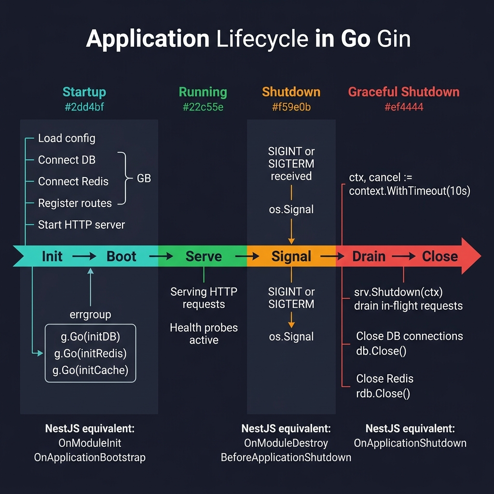

<!-- tags: golang, modules --> # ♻️ Móc vòng đời — NestJS OnModuleInit → Khởi động/Tắt máy

> **Thư viện**: Khởi động, tắt máy nhẹ nhàng và điều phối `errgroup` — thay thế NestJS `OnModuleInit` / `OnApplicationShutdown` .

📅 Đã cập nhật: 19-04-2026 · ⏱️ 10 phút đọc

## 1. ĐỊNH NGHĨA

NestJS có các móc vòng đời ( `OnModuleInit` , `OnApplicationShutdown` ). Trong Go, bạn cấu trúc thủ công: hàm tạo cho init, `defer` để dọn dẹp và `signal.Notify` + `context.WithTimeout` để tắt máy một cách nhẹ nhàng. Đối với nhiều goroutine chạy dài, `errgroup.Group` điều phối việc khởi động đồng thời và xử lý nhanh mọi lỗi.

| NestJS | Đi tương đương |
| ----------------------------- | ---------------------------------------- |
| `OnModuleInit` | Lời gọi hàm xây dựng/init |
| `OnApplicationBootstrap` | Trình xử lý sau lệnh gọi khởi động `gin.New()` |
| `OnModuleDestroy` | Các khối logic `defer cleanup()` được xác định |
| `OnApplicationShutdown` | Vòng lặp `srv.Shutdown(ctx)` rõ ràng |

### Bất biến chính

- **Thứ tự tắt máy ngược với thứ tự ban đầu.** Đóng máy chủ trước (dừng chấp nhận), sau đó vào bộ đệm, sau đó là DB.
- **Luôn sử dụng `context.WithTimeout` để tắt máy.** Nếu không có nó, kết nối DB bị kẹt sẽ chặn việc tắt máy vĩnh viễn.

## 2. HÌNH ẢNH  *Hình: Dòng thời gian của vòng đời — Khởi động (init song song của nhóm lỗi) → Đang chạy (phục vụ + thăm dò tình trạng) → Tín hiệu (SIGTERM) → Tắt máy duyên dáng (yêu cầu thoát, đóng DB/Redis).*```mermaid
flowchart TD
    A["main()"] -->|"1. Load config"| B["NewApp(cfg)"]
    B -->|"2. Connect DB + Cache"| C["app.Bootstrap()"]
    C -->|"3. Setup routes"| D["ListenAndServe"]
    D -->|"SIGTERM"| E["app.Shutdown(ctx)"]
    E -->|"4. srv.Shutdown"| F["5. cache.Close"]
    F --> G["6. db.Close"]
    G --> H["✅ Exit 0"]
```*Hình: Luồng vòng đời — khởi tạo theo thứ tự (cấu hình → DB → bộ đệm → tuyến), tắt theo chiều ngược lại (máy chủ → bộ đệm → DB).*

### Các giai đoạn của vòng đời```text
Init:     LoadConfig → NewDatabase → NewCache → Bootstrap (routes)
Run:      ListenAndServe (blocks until signal)
Shutdown: srv.Shutdown → cache.Close → db.Close (reverse order)
```## 3. MÃ

### Ví dụ 1: Cơ bản — Cấu trúc ứng dụng mô-đun```go
    // ━━━━━━━━━━━━━━━━━━━━━━━━━━━━━━━━━━━━━━━━━
    // App struct owns all resources. NewApp() inits DB + cache.
    // Bootstrap() sets up routes. Shutdown() tears down in reverse.
    // ━━━━━━━━━━━━━━━━━━━━━━━━━━━━━━━━━━━━━━━━━
    package main

    import (
        "context"
        "log/slog"
        "net/http"
        "os"
        "os/signal"
        "syscall"
        "time"
        "github.com/gin-gonic/gin"
    )

    type App struct {
        db     *Database
        cache  *Cache
        server *http.Server
    }

    func NewApp(cfg *Config) *App {
        slog.Info("initializing application")
        db := NewDatabase(cfg.Database)       
        cache := NewCache(cfg.Redis)          
        return &App{db: db, cache: cache}
    }

    func (a *App) Bootstrap() *gin.Engine {
        slog.Info("bootstrapping application")
        gin.SetMode(gin.ReleaseMode)
        r := gin.New()
        r.Use(gin.Recovery())

        a.setupRoutes(r)
        a.db.AutoMigrate()
        a.cache.Warmup()

        return r
    }

    func (a *App) Shutdown(ctx context.Context) {
        if err := a.server.Shutdown(ctx); err != nil {
            slog.Error("server shutdown error", "error", err)
        }
        if err := a.cache.Close(); err != nil {
            slog.Error("cache close error", "error", err)
        }
        if err := a.db.Close(); err != nil {
            slog.Error("database close error", "error", err)
        }
        slog.Info("application stopped")
    }

    func main() {
        cfg := LoadConfig()
        app := NewApp(cfg)
        router := app.Bootstrap()

        app.server = &http.Server{
            Addr:         ":8080",
            Handler:      router,
            ReadTimeout:  15 * time.Second,
            WriteTimeout: 30 * time.Second,
            IdleTimeout:  120 * time.Second,
        }

        go func() {
            if err := app.server.ListenAndServe(); err != nil && err != http.ErrServerClosed {
                os.Exit(1)
            }
        }()

        quit := make(chan os.Signal, 1)
        signal.Notify(quit, syscall.SIGINT, syscall.SIGTERM)
        <-quit

        ctx, cancel := context.WithTimeout(context.Background(), 30*time.Second)
        defer cancel()
        app.Shutdown(ctx)
    }
```### Ví dụ 2: Trung cấp — Nhóm lỗi điều phối```go
    // ━━━━━━━━━━━━━━━━━━━━━━━━━━━━━━━━━━━━━━━━━
    // errgroup: run API server, metrics server, and consumer
    // concurrently. If any fails, context cancels all others.
    // ━━━━━━━━━━━━━━━━━━━━━━━━━━━━━━━━━━━━━━━━━
    package main

    import (
        "context"
        "fmt"
        "log/slog"
        "net/http"
        "golang.org/x/sync/errgroup"
    )

    func Run(ctx context.Context, apiSrv, metricsSrv *http.Server, consumer Consumer) error {
        g, ctx := errgroup.WithContext(ctx)

        g.Go(func() error {
            if err := apiSrv.ListenAndServe(); err != nil && err != http.ErrServerClosed {
                return fmt.Errorf("api server: %w", err)
            }
            return nil
        })

        g.Go(func() error {
            if err := metricsSrv.ListenAndServe(); err != nil && err != http.ErrServerClosed {
                return fmt.Errorf("metrics server: %w", err)
            }
            return nil
        })

        g.Go(func() error {
            return consumer.Run(ctx)
        })

        return g.Wait()
    }
```---

## 4. Cạm bẫy

| # | Mức độ nghiêm trọng | Khiếm khuyết | Tác động | Sửa chữa |
| --- | --- | --- | --- | --- |
| 1 | 🔴 Gây tử vong | Tắt DB trước khi máy chủ ngừng nhận yêu cầu | Các yêu cầu trên chuyến bay gặp lỗi "đóng kết nối" | Tắt máy chủ trước, sau đó phụ thuộc theo thứ tự ban đầu ngược lại |
| 2 | 🟡 Chung | Không có thời gian chờ khi tắt máy | Bị kẹt kết nối DB chặn tắt vô thời hạn | `context.WithTimeout(ctx, 30*time.Second)` |

---

## 5. GIỚI THIỆU

| Tài nguyên | Liên kết |
| --- | --- |
| net/http Server.Shutdown | [pkg.go.dev/net/http#Server.Shutdown](https://pkg.go.dev/net/http#Server.Shutdown) |

---

## 6. KHUYẾN NGHỊ

| Gia hạn | Khi nào | Cơ sở lý luận | Tài nguyên |
| --- | --- | --- | --- |
| Xác thực + Giới hạn tỷ lệ | Khi bạn cần bảo vệ API sản xuất theo lớp | Kết hợp xác thực JWT, RBAC và giới hạn tốc độ cho mỗi người dùng | [./04-auth-rate-limit-production.md](./04-auth-rate-limit-production.md) |