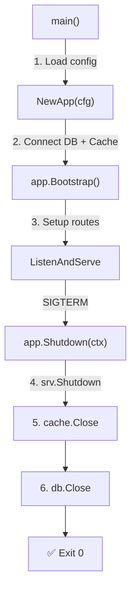

<!-- tags: golang, modules -->
# ♻️ Lifecycle Hooks — NestJS OnModuleInit → Go Startup/Shutdown

> **Library**: Startup init, graceful shutdown, and `errgroup` orchestration — replacing NestJS `OnModuleInit`/`OnApplicationShutdown`.

📅 Updated: 2026-04-19 · ⏱️ 10 min read

## 1. DEFINE

NestJS has lifecycle hooks (`OnModuleInit`, `OnApplicationShutdown`). In Go, you structure this manually: constructors for init, `defer` for cleanup, and `signal.Notify` + `context.WithTimeout` for graceful shutdown. For multiple long-running goroutines, `errgroup.Group` coordinates concurrent startup and fail-fast on any error.

| NestJS                      | Go Equivalent                            |
| --------------------------- | ---------------------------------------- |
| `OnModuleInit`              | Constructor / init function invocations  |
| `OnApplicationBootstrap`    | Handlers after `gin.New()` startup calls |
| `OnModuleDestroy`           | Defined `defer cleanup()` logic blocks   |
| `OnApplicationShutdown`     | Explicit `srv.Shutdown(ctx)` loops       |

### Key Invariants

- **Shutdown order is reverse of init order.** Close server first (stop accepting), then cache, then DB.
- **Always use `context.WithTimeout` for shutdown.** Without it, a stuck DB connection blocks shutdown forever.

## 2. VISUAL


*Figure: Lifecycle timeline — Startup (errgroup parallel init) → Running (serve + health probes) → Signal (SIGTERM) → Graceful Shutdown (drain requests, close DB/Redis).*



*Figure: Lifecycle flow — init in order (config → DB → cache → routes), shutdown in reverse (server → cache → DB).*

### Lifecycle Phases

```text
Init:     LoadConfig → NewDatabase → NewCache → Bootstrap (routes)
Run:      ListenAndServe (blocks until signal)
Shutdown: srv.Shutdown → cache.Close → db.Close (reverse order)
```

## 3. CODE

### Example 1: Basic — Modular App Structure

```go
    // ━━━━━━━━━━━━━━━━━━━━━━━━━━━━━━━━━━━━━━━━━
    // App struct owns all resources. NewApp() inits DB + cache.
    // Bootstrap() sets up routes. Shutdown() tears down in reverse.
    // ━━━━━━━━━━━━━━━━━━━━━━━━━━━━━━━━━━━━━━━━━
    package main

    import (
        "context"
        "log/slog"
        "net/http"
        "os"
        "os/signal"
        "syscall"
        "time"
        "github.com/gin-gonic/gin"
    )

    type App struct {
        db     *Database
        cache  *Cache
        server *http.Server
    }

    func NewApp(cfg *Config) *App {
        slog.Info("initializing application")
        db := NewDatabase(cfg.Database)       
        cache := NewCache(cfg.Redis)          
        return &App{db: db, cache: cache}
    }

    func (a *App) Bootstrap() *gin.Engine {
        slog.Info("bootstrapping application")
        gin.SetMode(gin.ReleaseMode)
        r := gin.New()
        r.Use(gin.Recovery())

        a.setupRoutes(r)
        a.db.AutoMigrate()
        a.cache.Warmup()

        return r
    }

    func (a *App) Shutdown(ctx context.Context) {
        if err := a.server.Shutdown(ctx); err != nil {
            slog.Error("server shutdown error", "error", err)
        }
        if err := a.cache.Close(); err != nil {
            slog.Error("cache close error", "error", err)
        }
        if err := a.db.Close(); err != nil {
            slog.Error("database close error", "error", err)
        }
        slog.Info("application stopped")
    }

    func main() {
        cfg := LoadConfig()
        app := NewApp(cfg)
        router := app.Bootstrap()

        app.server = &http.Server{
            Addr:         ":8080",
            Handler:      router,
            ReadTimeout:  15 * time.Second,
            WriteTimeout: 30 * time.Second,
            IdleTimeout:  120 * time.Second,
        }

        go func() {
            if err := app.server.ListenAndServe(); err != nil && err != http.ErrServerClosed {
                os.Exit(1)
            }
        }()

        quit := make(chan os.Signal, 1)
        signal.Notify(quit, syscall.SIGINT, syscall.SIGTERM)
        <-quit

        ctx, cancel := context.WithTimeout(context.Background(), 30*time.Second)
        defer cancel()
        app.Shutdown(ctx)
    }
```

### Example 2: Intermediate — Orchestrating Error Groups

```go
    // ━━━━━━━━━━━━━━━━━━━━━━━━━━━━━━━━━━━━━━━━━
    // errgroup: run API server, metrics server, and consumer
    // concurrently. If any fails, context cancels all others.
    // ━━━━━━━━━━━━━━━━━━━━━━━━━━━━━━━━━━━━━━━━━
    package main

    import (
        "context"
        "fmt"
        "log/slog"
        "net/http"
        "golang.org/x/sync/errgroup"
    )

    func Run(ctx context.Context, apiSrv, metricsSrv *http.Server, consumer Consumer) error {
        g, ctx := errgroup.WithContext(ctx)

        g.Go(func() error {
            if err := apiSrv.ListenAndServe(); err != nil && err != http.ErrServerClosed {
                return fmt.Errorf("api server: %w", err)
            }
            return nil
        })

        g.Go(func() error {
            if err := metricsSrv.ListenAndServe(); err != nil && err != http.ErrServerClosed {
                return fmt.Errorf("metrics server: %w", err)
            }
            return nil
        })

        g.Go(func() error {
            return consumer.Run(ctx)
        })

        return g.Wait()
    }
```

---

## 4. PITFALLS

| # | Severity | Defect | Impact | Fix |
| --- | --- | --- | --- | --- |
| 1 | 🔴 Fatal | Shutting down DB before server stops accepting requests | In-flight requests get "connection closed" errors | Shutdown server first, then dependencies in reverse init order |
| 2 | 🟡 Common | No timeout on shutdown context | Stuck DB connection blocks shutdown indefinitely | `context.WithTimeout(ctx, 30*time.Second)` |

---

## 5. REF

| Resource | Link |
| --- | --- |
| net/http Server.Shutdown | [pkg.go.dev/net/http#Server.Shutdown](https://pkg.go.dev/net/http#Server.Shutdown) |

---

## 6. RECOMMEND

| Extension | When | Rationale | Resource |
| --- | --- | --- | --- |
| Auth + Rate Limit | When you need layered production API protection | Combines JWT auth, RBAC, and per-user rate limiting | [./04-auth-rate-limit-production.md](./04-auth-rate-limit-production.md) |
