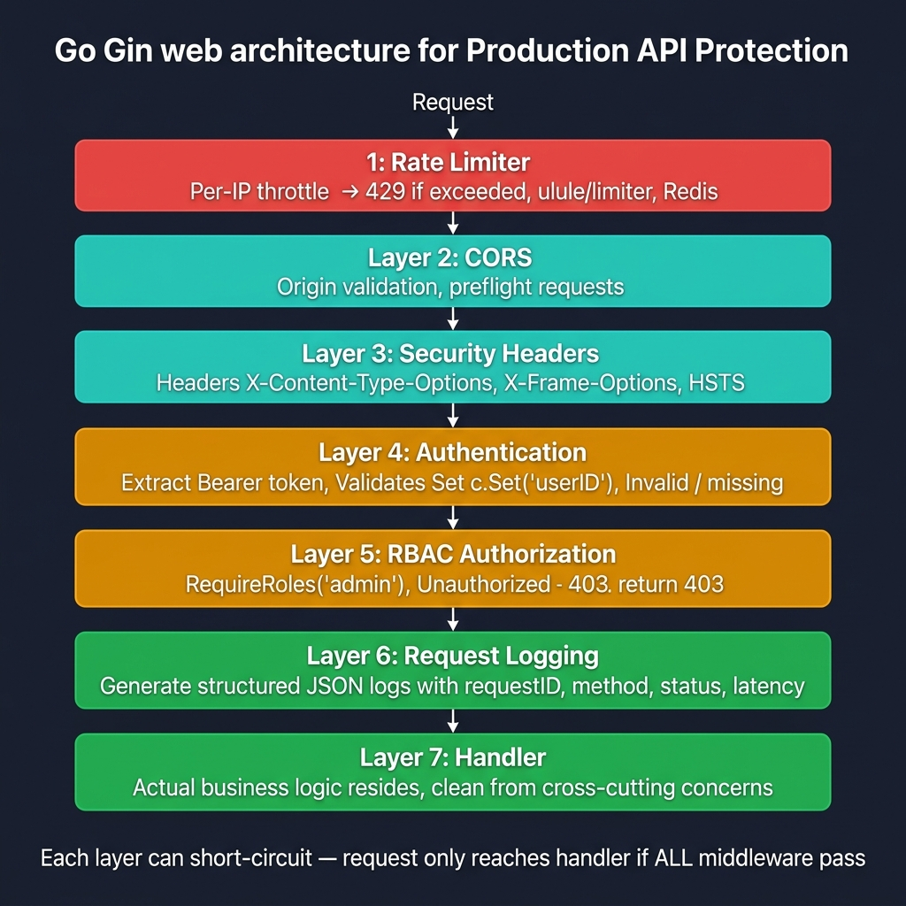
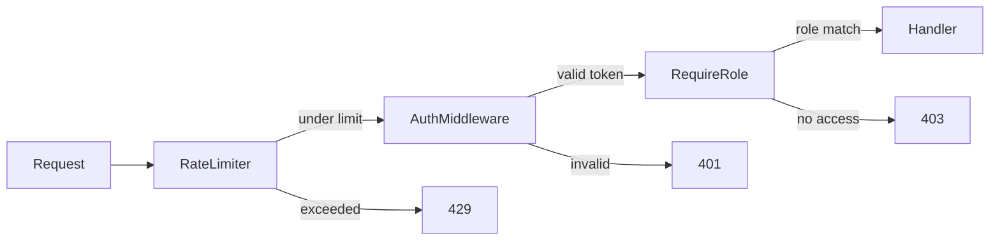

<!-- tags: golang -->
# 🔐 Auth & Rate Limit — Production API Protection in Gin

> **Library**: Layered middleware for JWT auth, role checks, and per-user/IP rate limiting in production Gin APIs.

📅 Updated: 2026-04-19 · ⏱️ 16 min read

## 1. DEFINE

Production APIs need three middleware layers in order: **authentication** (who is calling?), **authorization** (are they allowed?), **rate limiting** (are they abusing?). Each layer is a separate Gin middleware that calls `c.Next()` on success or `c.Abort*` on failure.

| Layer          | Purpose                                   |
| -------------- | ----------------------------------------- |
| Authentication | Validates Bearer token, sets `claims` in context |
| Authorization  | Checks role/permission from claims        |
| Rate Limiting  | Throttles by user ID or IP address        |
| Audit Logging  | Logs denied requests for security review  |

### Key Invariants

- **Auth before rate limit.** Rate-limit by user ID requires knowing who the user is first.
- **Accept `TokenVerifier` interface, not a concrete JWT lib.** Enables swapping JWKS, Paseto, or mocks.

## 2. VISUAL



*Figure: Layered protection — Rate Limiter → CORS → Security Headers → JWT Auth → RBAC → Logging → Handler. Each layer can short-circuit; request reaches handler only if all pass.*



*Figure: Three-layer middleware chain — rate limit (global) → auth (identity) → role check (permission). Each layer short-circuits on failure.*

### Middleware Order

```text
Global:   RateLimit (by IP)
Auth:     AuthMiddleware (Bearer token → claims)
Route:    RequireRole("admin") (per-endpoint)
```

## 3. CODE

### Example 1: Basic — Native Token Validation

```go
    // ━━━━━━━━━━━━━━━━━━━━━━━━━━━━━━━━━━━━━━━━━
    // Auth middleware: extract Bearer token, verify via interface,
    // set claims in gin.Context for downstream handlers.
    // ━━━━━━━━━━━━━━━━━━━━━━━━━━━━━━━━━━━━━━━━━
    package advanced

    import (
        "net/http"
        "strings"
        "github.com/gin-gonic/gin"
    )

    type Claims struct {
        Subject string
        Role    string
    }

    type TokenVerifier interface {
        Verify(token string) (Claims, error)
    }

    func AuthMiddleware(verifier TokenVerifier) gin.HandlerFunc {
        return func(c *gin.Context) {
            header := c.GetHeader("Authorization")
            if !strings.HasPrefix(header, "Bearer ") {
                c.AbortWithStatusJSON(http.StatusUnauthorized, gin.H{"error": "missing bearer token"})
                return
            }

            claims, err := verifier.Verify(strings.TrimPrefix(header, "Bearer "))
            if err != nil {
                c.AbortWithStatusJSON(http.StatusUnauthorized, gin.H{"error": "invalid token"})
                return
            }

            c.Set("claims", claims)
            c.Next()
        }
    }
```

### Example 2: Intermediate — Mapped Role Restrictions

```go
    // ━━━━━━━━━━━━━━━━━━━━━━━━━━━━━━━━━━━━━━━━━
    // Role guard: read claims from context, check role match.
    // 403 if role doesn't match expected value.
    // ━━━━━━━━━━━━━━━━━━━━━━━━━━━━━━━━━━━━━━━━━
    package advanced

    import (
        "net/http"
        "github.com/gin-gonic/gin"
    )

    func RequireRole(expected string) gin.HandlerFunc {
        return func(c *gin.Context) {
            value, ok := c.Get("claims")
            if !ok {
                c.AbortWithStatusJSON(http.StatusUnauthorized, gin.H{"error": "missing auth context"})
                return
            }

            claims, ok := value.(Claims)
            if !ok {
                c.AbortWithStatusJSON(http.StatusUnauthorized, gin.H{"error": "invalid auth context"})
                return
            }
            if claims.Role != expected {
                c.AbortWithStatusJSON(http.StatusForbidden, gin.H{"error": "forbidden"})
                return
            }

            c.Next()
        }
    }
```

### Example 3: Advanced — Throttling Context Keys

```go
    // ━━━━━━━━━━━━━━━━━━━━━━━━━━━━━━━━━━━━━━━━━
    // Per-key rate limiter using x/time/rate. Keyed by user ID
    // (if authenticated) or client IP (fallback).
    // ━━━━━━━━━━━━━━━━━━━━━━━━━━━━━━━━━━━━━━━━━
    package advanced

    import (
        "net/http"
        "sync"
        "github.com/gin-gonic/gin"
        "golang.org/x/time/rate"
    )

    func RateLimitPerKey(limit rate.Limit, burst int, keyFn func(*gin.Context) string) gin.HandlerFunc {
        var (
            mu       sync.Mutex
            limiters = map[string]*rate.Limiter{}
        )

        return func(c *gin.Context) {
            key := keyFn(c)

            mu.Lock()
            limiter, ok := limiters[key]
            if !ok {
                limiter = rate.NewLimiter(limit, burst)
                limiters[key] = limiter
            }
            mu.Unlock()

            if !limiter.Allow() {
                c.Header("Retry-After", "1")
                c.AbortWithStatusJSON(http.StatusTooManyRequests, gin.H{"error": "rate limit exceeded"})
                return
            }

            c.Next()
        }
    }

    func KeyByUserOrIP(c *gin.Context) string {
        if value, ok := c.Get("claims"); ok {
            if claims, ok := value.(Claims); ok && claims.Subject != "" {
                return claims.Subject
            }
        }
        return c.ClientIP()
    }
```

---

## 4. PITFALLS

| # | Severity | Defect | Impact | Fix |
| --- | --- | --- | --- | --- |
| 1 | 🔴 Fatal | Rate limiting without authentication first | Rate limit key is IP only; authenticated users share limits behind NAT | Run auth middleware before rate limiter, key by user ID |
| 2 | 🟡 Common | Unbounded in-memory limiter map (no eviction) | Memory grows linearly with unique IPs; OOM after days | Use TTL-based cache or Redis-backed limiter in production |

---

## 5. REF

| Resource | Link |
| --- | --- |
| Middleware Docs | [gin-gonic.com/en/docs/examples/using-middleware/](https://gin-gonic.com/en/docs/examples/using-middleware/) |

---

## 6. RECOMMEND

| Extension | When | Rationale | Resource |
| --- | --- | --- | --- |
| Upload Streaming | When you handle large file uploads/downloads | Stream via `io.Copy` to avoid loading entire file in memory | [./05-upload-download-streaming.md](./05-upload-download-streaming.md) |
