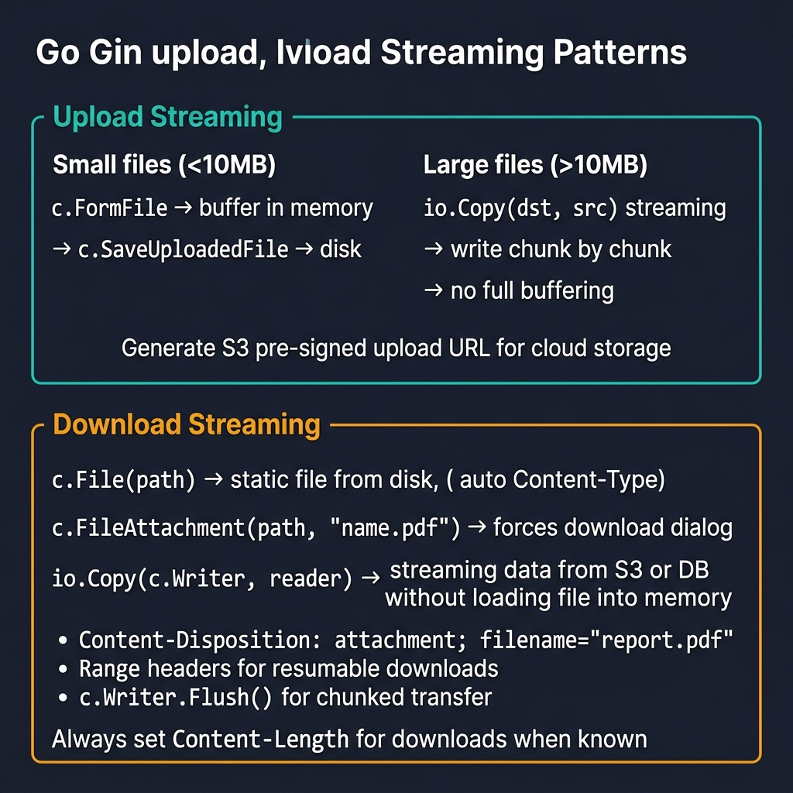
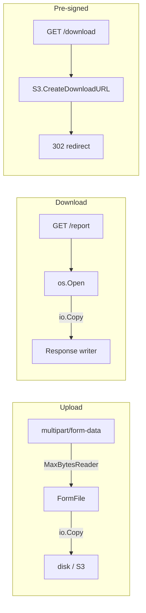

<!-- tags: golang -->
# 📤 Upload & Download Streaming — Large Files in Gin

> **Library**: Stream large uploads via `io.Copy`, serve downloads with proper headers, offload to S3 pre-signed URLs.

📅 Updated: 2026-04-19 · ⏱️ 16 min read

## 1. DEFINE

Loading a 500MB file into memory with `ioutil.ReadAll` kills the process. Instead: use `http.MaxBytesReader` to cap body size, stream with `io.Copy` to avoid buffering, and for downloads set `Content-Disposition` + `Content-Length` headers. For production, offload to S3/GCS pre-signed URLs.

| Concern         | Solution                                  |
| --------------- | ----------------------------------------- |
| Total Size      | `http.MaxBytesReader(w, body, maxBytes)`  |
| Validation      | Check extension + MIME before saving      |
| Safe Streaming  | `io.Copy(dst, file)` — no full buffer    |
| Correct Headers | `Content-Disposition: attachment`          |

### Key Invariants

- **Always set `MaxBytesReader` before reading body.** Without it, a 10GB upload consumes all RAM.
- **Use `filepath.Base()` on user filenames.** Prevents path traversal attacks (`../../etc/passwd`).

## 2. VISUAL



*Figure: Upload — small files buffer in memory (c.FormFile), large files stream via io.Copy. Download — c.File (static), c.FileAttachment (force download), io.Copy (stream from S3/DB).*



*Figure: Three patterns — stream upload via io.Copy, stream download with proper headers, offload via pre-signed URL.*

### Pattern Decision

```text
Small file (≤10MB):  c.SaveUploadedFile (Gin built-in)
Large file (≥10MB):  MaxBytesReader + io.Copy (streamed)
Production:          Pre-signed S3/GCS URL (no server bandwidth)
```

## 3. CODE

### Example 1: Basic — Multipart Write Streams

```go
    // ━━━━━━━━━━━━━━━━━━━━━━━━━━━━━━━━━━━━━━━━━
    // Streamed upload: cap body with MaxBytesReader,
    // extract file, validate name, stream via io.Copy.
    // ━━━━━━━━━━━━━━━━━━━━━━━━━━━━━━━━━━━━━━━━━
    package advanced

    import (
        "io"
        "net/http"
        "os"
        "path/filepath"
        "github.com/gin-gonic/gin"
    )

    func UploadDocument(c *gin.Context) {
        c.Request.Body = http.MaxBytesReader(c.Writer, c.Request.Body, 20<<20)

        file, header, err := c.Request.FormFile("file")
        if err != nil {
            c.JSON(http.StatusBadRequest, gin.H{"error": "invalid multipart file"})
            return
        }
        defer file.Close()

        safeName := filepath.Base(header.Filename)
        dst, err := os.Create(filepath.Join("/tmp/uploads", safeName))
        if err != nil {
            c.JSON(http.StatusInternalServerError, gin.H{"error": "create destination failed"})
            return
        }
        defer dst.Close()

        if _, err := io.Copy(dst, file); err != nil {
            c.JSON(http.StatusInternalServerError, gin.H{"error": "stream upload failed"})
            return
        }

        c.JSON(http.StatusCreated, gin.H{"file": safeName})
    }
```

### Example 2: Intermediate — Response Streaming Headers

```go
    // ━━━━━━━━━━━━━━━━━━━━━━━━━━━━━━━━━━━━━━━━━
    // Streamed download: open file, set Content-Disposition
    // + Content-Length headers, stream via io.Copy.
    // ━━━━━━━━━━━━━━━━━━━━━━━━━━━━━━━━━━━━━━━━━
    package advanced

    import (
        "io"
        "net/http"
        "os"
        "strconv"
        "github.com/gin-gonic/gin"
    )

    func DownloadReport(c *gin.Context) {
        file, err := os.Open("/tmp/reports/report-2026-03.csv")
        if err != nil {
            c.JSON(http.StatusNotFound, gin.H{"error": "report not found"})
            return
        }
        defer file.Close()

        stat, err := file.Stat()
        if err != nil {
            c.JSON(http.StatusInternalServerError, gin.H{"error": "stat failed"})
            return
        }

        c.Header("Content-Type", "text/csv")
        c.Header("Content-Disposition", `attachment; filename="report-2026-03.csv"`)
        c.Header("Content-Length", strconv.FormatInt(stat.Size(), 10))
        c.Status(http.StatusOK)
        _, _ = io.Copy(c.Writer, file)
    }
```

### Example 3: Advanced — Pre-Signed Object URLs

```go
    // ━━━━━━━━━━━━━━━━━━━━━━━━━━━━━━━━━━━━━━━━━
    // Pre-signed URL: generate time-limited S3 download URL.
    // Client downloads directly from S3, no server bandwidth.
    // ━━━━━━━━━━━━━━━━━━━━━━━━━━━━━━━━━━━━━━━━━
    package advanced

    import (
        "net/http"
        "time"
        "github.com/gin-gonic/gin"
    )

    type SignedURLProvider interface {
        CreateDownloadURL(objectKey string, expiresIn time.Duration) (string, error)
    }

    func RequestReportDownload(provider SignedURLProvider) gin.HandlerFunc {
        return func(c *gin.Context) {
            url, err := provider.CreateDownloadURL("reports/report-2026-03.csv", 15*time.Minute)
            if err != nil {
                c.JSON(http.StatusInternalServerError, gin.H{"error": "signed url generation failed"})
                return
            }

            c.JSON(http.StatusAccepted, gin.H{
                "delivery": "signed_url",
                "url":      url,
                "expires":  "15m",
            })
        }
    }
```

---

## 4. PITFALLS

| # | Severity | Defect | Impact | Fix |
| --- | --- | --- | --- | --- |
| 1 | 🔴 Fatal | Not using `MaxBytesReader` on upload endpoints | 10GB upload consumes all RAM; process OOM-killed | `http.MaxBytesReader(c.Writer, c.Request.Body, 20<<20)` |
| 2 | 🔴 Fatal | Using user-provided filename directly in `os.Create` | Path traversal: `../../etc/passwd` overwrites system files | `filepath.Base(header.Filename)` to strip path components |

---

## 5. REF

| Resource | Link |
| --- | --- |
| Mime/Multipart | [pkg.go.dev/mime/multipart](https://pkg.go.dev/mime/multipart) |

---

## 6. RECOMMEND

| Extension | When | Rationale | Resource |
| --- | --- | --- | --- |
| SSE & WebSocket | When you need real-time push to clients | SSE for one-way feeds, WebSocket for bidirectional chat/notifications | [./06-sse-websocket-real-time.md](./06-sse-websocket-real-time.md) |
