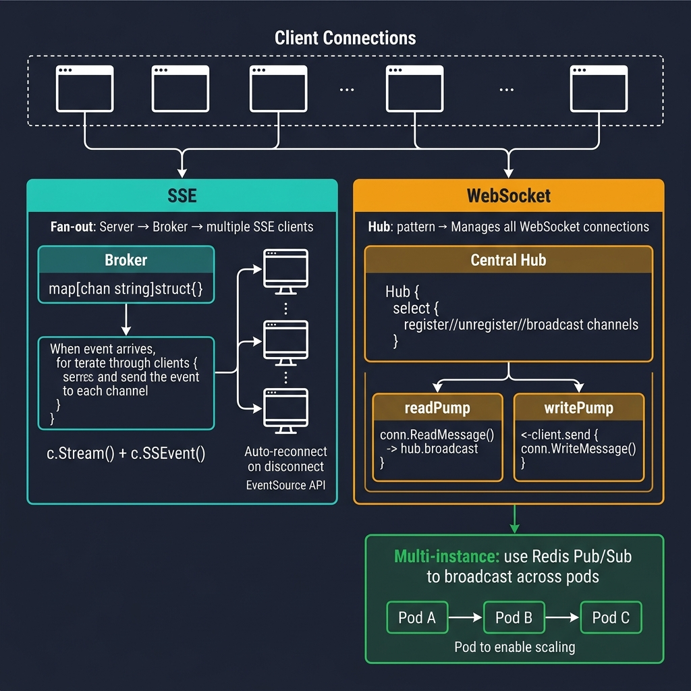
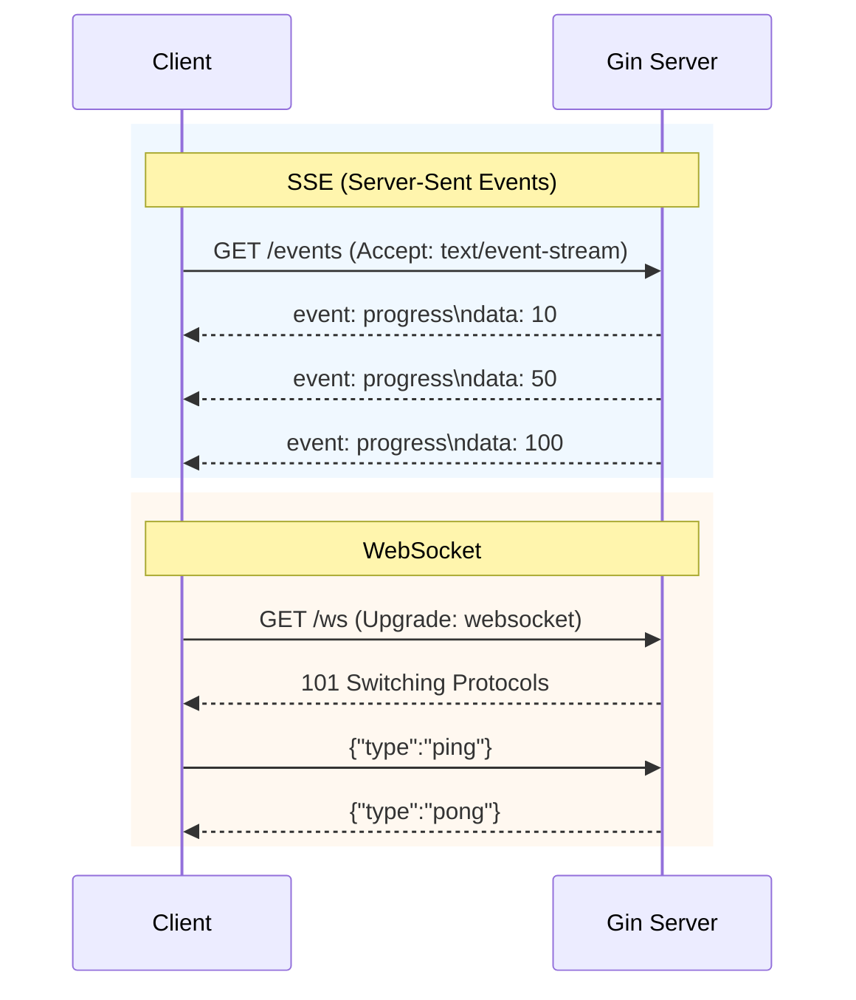

<!-- tags: golang -->
# 📡 SSE & WebSocket — Real-time Delivery Patterns in Gin

> **Library**: SSE for server-push feeds, WebSocket for bidirectional real-time via `gorilla/websocket` + channel-based Hub.

📅 Updated: 2026-04-19 · ⏱️ 17 min read

## 1. DEFINE

SSE pushes events from server to client over a single HTTP connection (`text/event-stream`). WebSocket upgrades HTTP to a persistent, full-duplex TCP connection. In Gin, SSE uses `c.Writer.Flush()` with `text/event-stream` headers; WebSocket uses `gorilla/websocket` upgrader.

| Standard  | Core Advantage                            |
| --------- | ----------------------------------------- |
| SSE       | Unidirectional, auto-reconnect, HTTP/2 OK |
| WebSocket | Bidirectional, persistent, low latency    |

### Key Invariants

- **Always check `c.Request.Context().Done()` in SSE loops.** Without it, disconnected clients leak goroutines.
- **Use a Hub pattern for broadcast WebSocket.** Direct conn-to-conn sends don’t scale and create race conditions.

## 2. VISUAL



*Figure: SSE Broker (fan-out to subscriber channels) + WebSocket Hub (readPump/writePump per client, select on register/unregister/broadcast). Scale via Redis Pub/Sub across pods.*



*Figure: SSE = server pushes events over HTTP; WebSocket = bidirectional after protocol upgrade.*

### When to Use Which

```text
SSE:       Notifications, progress bars, live dashboards (one-way)
WebSocket: Chat, collaborative editing, gaming (two-way)
Polling:   Last resort when SSE/WS are blocked by infra
```

## 3. CODE

### Example 1: Basic — SSE Feeds

```go
    // ━━━━━━━━━━━━━━━━━━━━━━━━━━━━━━━━━━━━━━━━━
    // SSE handler: set text/event-stream headers, loop with
    // ticker, flush after each write, exit on context cancel.
    // ━━━━━━━━━━━━━━━━━━━━━━━━━━━━━━━━━━━━━━━━━
    package advanced

    import (
        "fmt"
        "time"
        "github.com/gin-gonic/gin"
    )

    func ProgressSSE(c *gin.Context) {
        c.Writer.Header().Set("Content-Type", "text/event-stream")
        c.Writer.Header().Set("Cache-Control", "no-cache")
        c.Writer.Header().Set("Connection", "keep-alive")

        ticker := time.NewTicker(2 * time.Second)
        defer ticker.Stop()

        for progress := 10; progress <= 100; progress += 10 {
            select {
            case <-c.Request.Context().Done():
                return
            case <-ticker.C:
                _, _ = fmt.Fprintf(c.Writer, "event: progress\ndata: %d\n\n", progress)
                c.Writer.Flush()
            }
        }
    }
```

### Example 2: Intermediate — WebSocket Echo

```go
    // ━━━━━━━━━━━━━━━━━━━━━━━━━━━━━━━━━━━━━━━━━
    // WebSocket echo: upgrade HTTP, read message, write it
    // back. Exit loop on read error (client disconnected).
    // ━━━━━━━━━━━━━━━━━━━━━━━━━━━━━━━━━━━━━━━━━
    package advanced

    import (
        "net/http"
        "github.com/gin-gonic/gin"
        "github.com/gorilla/websocket"
    )

    var upgrader = websocket.Upgrader{
        CheckOrigin: func(r *http.Request) bool { return true },
    }

    func EchoWebSocket(c *gin.Context) {
        conn, err := upgrader.Upgrade(c.Writer, c.Request, nil)
        if err != nil {
            c.Status(http.StatusBadRequest)
            return
        }
        defer conn.Close()

        for {
            messageType, payload, err := conn.ReadMessage()
            if err != nil {
                return
            }
            if err := conn.WriteMessage(messageType, payload); err != nil {
                return
            }
        }
    }
```

### Example 3: Advanced — Managed Broadcast Hub

```go
    // ━━━━━━━━━━━━━━━━━━━━━━━━━━━━━━━━━━━━━━━━━
    // Broadcast Hub: manage client registration/unregistration
    // via channels. Non-blocking send with default close.
    // ━━━━━━━━━━━━━━━━━━━━━━━━━━━━━━━━━━━━━━━━━
    package advanced

    type Client struct {
        Send chan []byte
    }

    type Hub struct {
        Register   chan *Client
        Unregister chan *Client
        Broadcast  chan []byte
        clients    map[*Client]struct{}
    }

    func NewHub() *Hub {
        return &Hub{
            Register:   make(chan *Client),
            Unregister: make(chan *Client),
            Broadcast:  make(chan []byte, 128),
            clients:    make(map[*Client]struct{}),
        }
    }

    func (h *Hub) Run() {
        for {
            select {
            case client := <-h.Register:
                h.clients[client] = struct{}{}
            case client := <-h.Unregister:
                delete(h.clients, client)
                close(client.Send)
            case msg := <-h.Broadcast:
                for client := range h.clients {
                    select {
                    case client.Send <- msg:
                    default:
                        delete(h.clients, client)
                        close(client.Send)
                    }
                }
            }
        }
    }
```

---

## 4. PITFALLS

| # | Severity | Defect | Impact | Fix |
| --- | --- | --- | --- | --- |
| 1 | 🔴 Fatal | SSE loop without `ctx.Done()` check | Disconnected client leaks goroutine; thousands pile up | `select { case <-c.Request.Context().Done(): return }` |
| 2 | 🔴 Fatal | WebSocket `CheckOrigin` returning `true` in production | Any origin can connect; enables CSWSH attacks | Validate origin against an allowlist |

---

## 5. REF

| Resource | Link |
| --- | --- |
| Gorilla WS | [github.com/gorilla/websocket](https://github.com/gorilla/websocket) |

---

## 6. RECOMMEND

| Extension | When | Rationale | Resource |
| --- | --- | --- | --- |
| Testing Tools | When you need to test SSE/WebSocket handlers | Use `httptest` for SSE, `gorilla/websocket.Dial` for WS tests | [./01-testing-production.md](./01-testing-production.md) |
