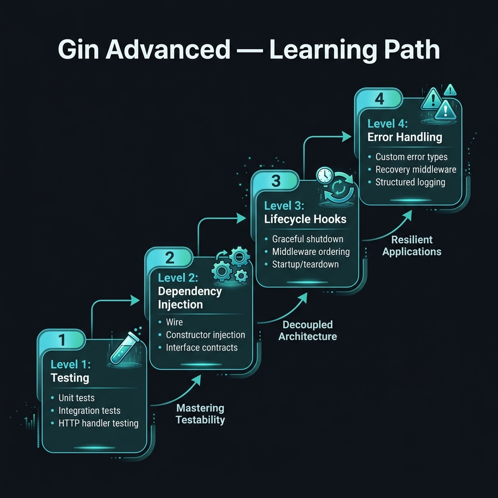
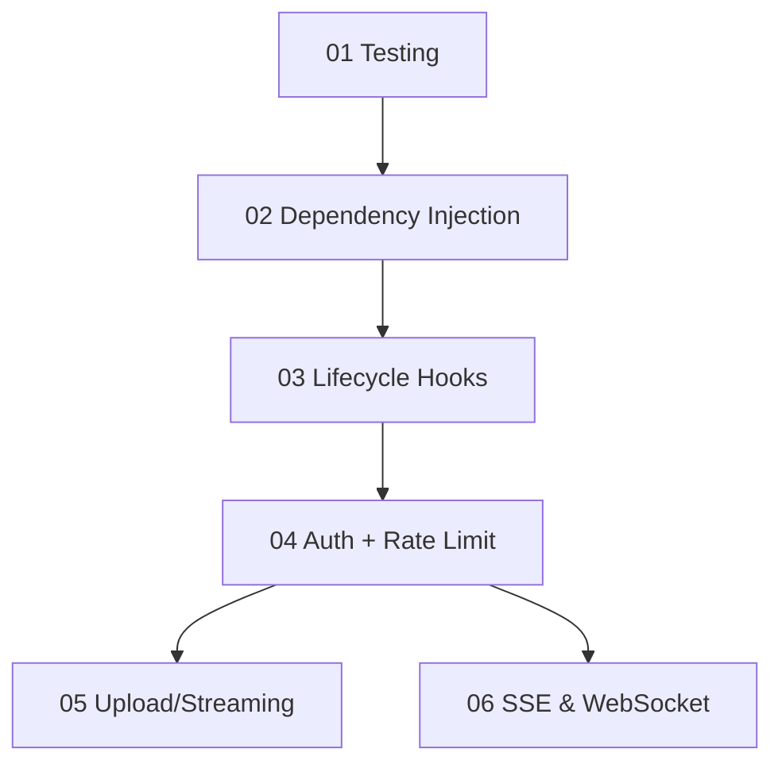

<!-- tags: golang, overview -->
# 🏢 Gin Advanced

> **Overview**: Production-grade patterns — testing, DI, lifecycle hooks, auth hardening, streaming, and real-time.

📅 Updated: 2026-04-19 · ⏱️ 6 min read

## 1. DEFINE

This module covers topics that matter once your Gin app goes to production: how to test handlers, wire dependencies, manage startup/shutdown lifecycle, harden auth, stream large files, and push real-time events.

### Learning Path

- **Testing & Production** → unit test handlers + graceful shutdown
- **Dependency Injection** → manual wiring, Google Wire, uber/fx
- **Lifecycle Hooks** → startup/shutdown orchestration with errgroup
- **Auth + Rate Limit** → layered middleware for production APIs
- **Upload/Streaming** → large file handling without OOM
- **SSE & WebSocket** → real-time delivery patterns

## 2. VISUAL

The definition set the scope. The diagram below routes by topic progression so you can jump to exactly the pain point you face in production.





*Figure: Advanced module reading order — start with testing, then DI, lifecycle, then branch into auth/streaming/real-time.*

### Quick Navigation

```text
GET /health       → 01-testing-production.md
DI wiring?        → 02-dependency-injection.md
Startup/shutdown? → 03-lifecycle-hooks.md
Auth hardening?   → 04-auth-rate-limit-production.md
Large files?      → 05-upload-download-streaming.md
Real-time?        → 06-sse-websocket-real-time.md
```

## 3. CODE

### Example 1: Router Context

```go
    // ━━━━━━━━━━━━━━━━━━━━━━━━━━━━━━━━━━━━━━━━━
    // Route chooser: given a goal, return the right doc path.
    // This is a navigation helper, not production code.
    // ━━━━━━━━━━━━━━━━━━━━━━━━━━━━━━━━━━━━━━━━━
    package router

    func RouteGoal(goal string) string {
        switch goal {
        case "testing": return "./01-testing-production.md"
        case "dependency": return "./02-dependency-injection.md"
        case "lifecycle": return "./03-lifecycle-hooks.md"
        case "auth": return "./04-auth-rate-limit-production.md"
        case "upload": return "./05-upload-download-streaming.md"
        case "sse": return "./06-sse-websocket-real-time.md"
        default: return "./README.md"
        }
    }
```

---

## 4. PITFALLS

| # | Severity | Defect | Impact | Fix |
| --- | --- | --- | --- | --- |
| 1 | 🔴 Fatal | Skipping graceful shutdown in production | SIGTERM kills in-flight requests; clients see connection reset | Implement `srv.Shutdown(ctx)` with signal trapping |
| 2 | 🟡 Common | Reading advanced topics before basics | Misunderstanding middleware chain breaks auth/DI patterns | Complete Basics → Middleware → Techniques before Advanced |

---

## 5. REF

| Resource | Link |
| --- | --- |
| Gin Official Docs | [gin-gonic.com/en/docs/](https://gin-gonic.com/en/docs/) |

---

## 6. RECOMMEND

| Extension | When | Rationale | Resource |
| --- | --- | --- | --- |
| Testing & Production | When you need unit tests and graceful shutdown | Foundation for all production deployments | [./01-testing-production.md](./01-testing-production.md) |
| Dependency Injection | When you need to swap implementations for testing | Decouple handlers from concrete dependencies | [./02-dependency-injection.md](./02-dependency-injection.md) |
