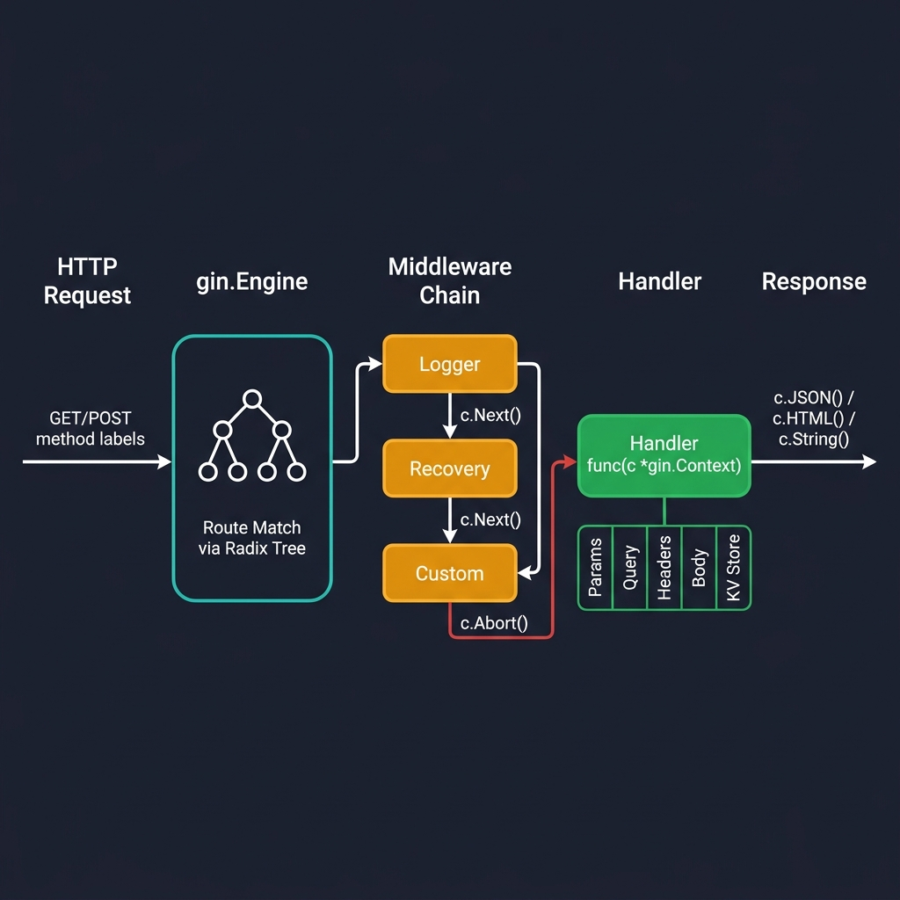
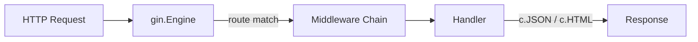
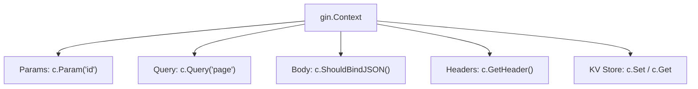

<!-- tags: golang, context -->
# 🚀 Gin Basics — Router, Context, Handlers

> **Library**: Gin’s three core primitives — Engine (router), Context (per-request state), and Handler (business logic entry point).

📅 Updated: 2026-04-19 · ⏱️ 14 min read

## 1. DEFINE

Every Gin application starts with three primitives: the **Engine** (creates the router and holds middleware), the **Context** (carries request data, response writer, and per-request key-value storage through the middleware chain), and the **Handler** (a function with signature `func(c *gin.Context)` that processes a single request).

| Component       | Role                                         | Code                   |
| --------------- | -------------------------------------------- | ---------------------- |
| **Engine**      | Creates the router; registers routes and middleware | `gin.Default()`        |
| **Context**     | Per-request envelope: params, query, headers, body, KV store | `*gin.Context`   |
| **Handler**     | Business logic entry point for a single route | `func(c *gin.Context)` |
| **RouterGroup** | Groups routes under a shared prefix and middleware set | `/api/v1`              |
| **gin.H**       | Shorthand for `map[string]any` — used in JSON responses | `gin.H{"key": "val"}`  |

### Key Invariants

- **Context is NOT goroutine-safe.** Passing `*gin.Context` into a goroutine without `.Copy()` causes data races and panics.
- **`gin.Default()` includes Logger and Recovery middleware.** Use `gin.New()` for a bare engine when you want full control.

## 2. VISUAL



*Figure: Gin request lifecycle — HTTP request enters the Engine's radix tree for route matching, passes through the middleware chain (Logger → Recovery → Custom), reaches the handler with a fully populated `gin.Context`, and writes the response.*



*Figure: Request lifecycle — incoming HTTP request → Engine route match → middleware chain → handler → response.*



*Figure: Context boundary — each request gets its own `gin.Context` with params, query, headers, body, and a KV store.*

### Request Flow

```text
Client HTTP Request
    │
    ├── Engine matches route via radix tree
    ├── Middleware chain executes (Logger → Recovery → Custom)
    ├── Handler receives *gin.Context with all request data
    └── Handler writes response via c.JSON / c.HTML / c.String
```

## 3. CODE

### Example 1: Basic — Engine Bootstrapping

```go
package main

import (
    "net/http"
    "github.com/gin-gonic/gin"
)

// ━━━━━━━━━━━━━━━━━━━━━━━━━━━━━━━━━━━━━━━━━
// gin.Default() creates an Engine with Logger + Recovery middleware.
// Each HTTP verb (GET, POST, PUT, DELETE) maps a path to a handler.
// ━━━━━━━━━━━━━━━━━━━━━━━━━━━━━━━━━━━━━━━━━
func main() {
    r := gin.Default()

    r.GET("/ping", func(c *gin.Context) {
        c.JSON(http.StatusOK, gin.H{
            "message": "pong",
        })
    })

    r.POST("/users", func(c *gin.Context) {
        c.JSON(http.StatusCreated, gin.H{
            "message": "user created",
        })
    })

    r.PUT("/users/:id", func(c *gin.Context) {
        id := c.Param("id")
        c.JSON(http.StatusOK, gin.H{
            "message": "user updated",
            "id":      id,
        })
    })

    r.DELETE("/users/:id", func(c *gin.Context) {
        id := c.Param("id")
        c.JSON(http.StatusOK, gin.H{
            "message": "user deleted",
            "id":      id,
        })
    })

    r.Any("/health", func(c *gin.Context) {
        c.JSON(http.StatusOK, gin.H{
            "status": "ok",
            "method": c.Request.Method,
        })
    })

    r.NoRoute(func(c *gin.Context) {
        c.JSON(http.StatusNotFound, gin.H{
            "error": "route not found",
            "path":  c.Request.URL.Path,
        })
    })

    r.Run(":8080")
}
```

### Example 2: Intermediate — Context Extraction

```go
package main

import (
    "fmt"
    "net/http"
    "time"
    "github.com/gin-gonic/gin"
)

// ━━━━━━━━━━━━━━━━━━━━━━━━━━━━━━━━━━━━━━━━━
// Context provides typed accessors for all request data:
// Param (path), Query (querystring), Header, ClientIP, Get/Set (KV store)
// ━━━━━━━━━━━━━━━━━━━━━━━━━━━━━━━━━━━━━━━━━
func main() {
    r := gin.Default()

    r.GET("/users/:id", func(c *gin.Context) {
        id := c.Param("id")                  
        c.JSON(http.StatusOK, gin.H{"id": id})
    })

    r.GET("/search", func(c *gin.Context) {
        query := c.Query("q")                          
        page := c.DefaultQuery("page", "1")            
        limit := c.DefaultQuery("limit", "20")         
        sort := c.Query("sort")                        

        c.JSON(http.StatusOK, gin.H{
            "query": query,
            "page":  page,
            "limit": limit,
            "sort":  sort,
        })
    })

    r.GET("/headers", func(c *gin.Context) {
        contentType := c.GetHeader("Content-Type")
        userAgent := c.GetHeader("User-Agent")
        auth := c.GetHeader("Authorization")
        clientIP := c.ClientIP()

        c.JSON(http.StatusOK, gin.H{
            "content_type": contentType,
            "user_agent":   userAgent,
            "auth":         auth,
            "client_ip":    clientIP,
        })
    })

    r.GET("/context-demo", func(c *gin.Context) {
        c.Set("userID", 42)
        c.Set("role", "admin")
        
        userID, _ := c.Get("userID")

        c.JSON(http.StatusOK, gin.H{
            "userID": userID,
            "role":   c.GetString("role"),
        })
    })

    r.Run(":8080")
}
```

### Example 3: Advanced — Production Target Engines

```go
package main

import (
    "context"
    "log"
    "net/http"
    "os"
    "os/signal"
    "syscall"
    "time"
    "github.com/gin-gonic/gin"
)

// ━━━━━━━━━━━━━━━━━━━━━━━━━━━━━━━━━━━━━━━━━
// Production setup: gin.New() (no default middleware), custom recovery,
// trusted proxies, timeouts, and graceful shutdown via os.Signal.
// ━━━━━━━━━━━━━━━━━━━━━━━━━━━━━━━━━━━━━━━━━
func main() {
    gin.SetMode(gin.ReleaseMode)
    r := gin.New()

    r.Use(gin.CustomRecovery(func(c *gin.Context, err any) {
        c.AbortWithStatusJSON(http.StatusInternalServerError, gin.H{
            "error":   "internal server error",
            "message": "something went wrong",
        })
    }))

    r.SetTrustedProxies([]string{"127.0.0.1", "10.0.0.0/8"})
    r.MaxMultipartMemory = 8 << 20 

    r.GET("/health", func(c *gin.Context) {
        c.JSON(http.StatusOK, gin.H{"status": "ok"})
    })

    srv := &http.Server{
        Addr:         ":8080",
        Handler:      r,
        ReadTimeout:  10 * time.Second,
        WriteTimeout: 30 * time.Second,
        IdleTimeout:  120 * time.Second,
    }

    go func() {
        if err := srv.ListenAndServe(); err != nil && err != http.ErrServerClosed {
            log.Fatalf("listen: %s\n", err)
        }
    }()

    quit := make(chan os.Signal, 1)
    signal.Notify(quit, syscall.SIGINT, syscall.SIGTERM)
    <-quit

    ctx, cancel := context.WithTimeout(context.Background(), 10*time.Second)
    defer cancel()

    if err := srv.Shutdown(ctx); err != nil {
        log.Fatal("Server forced to shutdown:", err)
    }
}
```

---

## 4. PITFALLS

| # | Severity | Defect | Impact | Fix |
| --- | --- | --- | --- | --- |
| 1 | 🔴 Fatal | Using `gin.Default()` in production without custom recovery | Default recovery logs panic to stdout but returns no structured error response | Use `gin.New()` + `gin.CustomRecovery(...)` to return JSON error bodies |
| 2 | 🔴 Fatal | Passing `*gin.Context` to a goroutine without `.Copy()` | Data race: context is recycled after the handler returns | Call `cCopy := c.Copy()` and use `cCopy` in the goroutine |

---

## 5. REF

| Resource | Link |
| --- | --- |
| Gin Official | [gin-gonic.com/en/docs/](https://gin-gonic.com/en/docs/) |
| Gin Repo | [github.com/gin-gonic/gin](https://github.com/gin-gonic/gin) |

---

## 6. RECOMMEND

| Extension | When | Rationale | Resource |
| --- | --- | --- | --- |
| Routing | When you need route groups, path params, or API versioning | Builds on Engine and Context to organize large APIs | [../routing/01-groups-params.md](../routing/01-groups-params.md) |
| Middleware | When you need logging, auth, or request interception | Middleware wraps handlers — understanding Context flow is a prerequisite | [../middleware/01-builtin-custom.md](../middleware/01-builtin-custom.md) |
