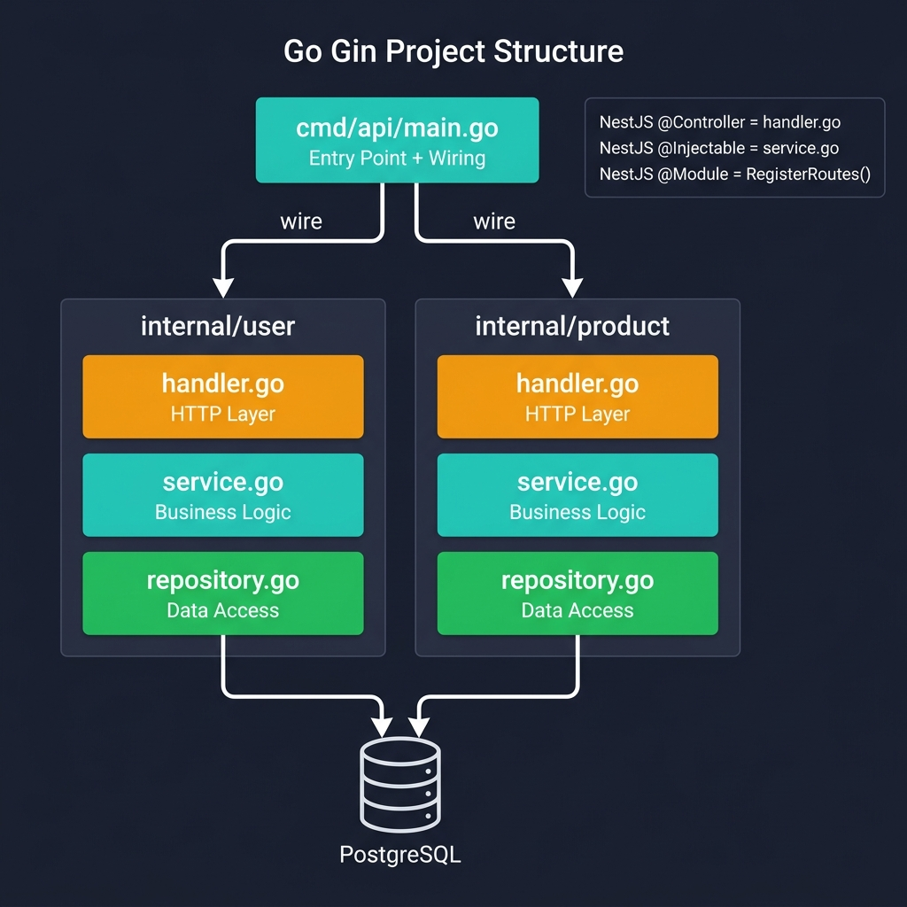
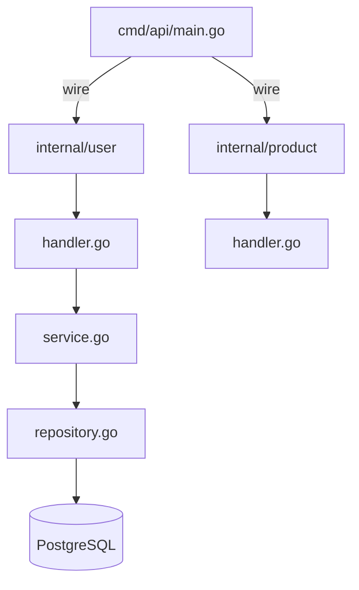

<!-- tags: golang, structs, modules -->
# 🏗️ Project Structure — NestJS Modules → Go Gin Architecture

> **Library**: Mapping NestJS’s Module/Controller/Service pattern to Go’s package-based architecture in Gin.

📅 Updated: 2026-04-19 · ⏱️ 15 min read

## 1. DEFINE

NestJS uses decorators (`@Controller`, `@Injectable`, `@Module`) to organize code into dependency-injected modules. Go has no DI framework — you organize by **packages** and wire dependencies manually through constructor functions.

| NestJS Concept        | Gin Equivalent                          |
| --------------------- | --------------------------------------- |
| `@Controller()`       | Handler struct with `*gin.Context` methods |
| `@Injectable()`       | Service struct, injected via constructor |
| `@Module()`           | `RegisterRoutes(r *gin.RouterGroup)` function |
| `@Inject()`           | Constructor parameter: `NewHandler(svc *Service)` |
| `main.ts bootstrap`   | `cmd/api/main.go` with manual wiring |
| DTO (class-validator)  | Struct with `binding:"required"` tags |

### Key Invariants

- **One package per domain concept** (e.g., `internal/users/`). Import cycles in Go are compile errors, not warnings.
- **Handlers depend on Services, Services depend on Repositories.** Never import handlers from services.

## 2. VISUAL



*Figure: Go Gin project structure — `cmd/api/main.go` wires dependencies into domain packages (`internal/user`, `internal/product`), each following a handler → service → repository layering.*



*Figure: Layered architecture — `cmd/` bootstraps the app, `internal/` contains domain packages, each with handler → service → repository.*

### Dependency Flow

```text
cmd/api/main.go
    │
    ├── Creates *gorm.DB, *gin.Engine
    ├── Wires: repo := NewRepository(db)
    ├── Wires: svc  := NewService(repo)
    ├── Wires: handler := NewHandler(svc)
    └── Calls: RegisterRoutes(router, handler)
```

## 3. CODE

### Example 1: Basic — Structuring Handlers

```go
    // ━━━━━━━━━━━━━━━━━━━━━━━━━━━━━━━━━━━━━━━━━
    // Handler struct holds a service dependency. Methods map to HTTP routes.
    // ━━━━━━━━━━━━━━━━━━━━━━━━━━━━━━━━━━━━━━━━━
    package users

    import (
        "net/http"
        "github.com/gin-gonic/gin"
    )

    type Handler struct {
        service *Service 
    }

    func NewHandler(service *Service) *Handler {
        return &Handler{service: service}
    }

    func (h *Handler) List(c *gin.Context) {
        users, err := h.service.FindAll(c.Request.Context())
        if err != nil {
            c.JSON(http.StatusInternalServerError, gin.H{"error": err.Error()})
            return
        }
        c.JSON(http.StatusOK, gin.H{"data": users})
    }

    func (h *Handler) GetByID(c *gin.Context) {
        id := c.Param("id")
        user, err := h.service.FindByID(c.Request.Context(), id)
        if err != nil {
            c.JSON(http.StatusNotFound, gin.H{"error": "user not found"})
            return
        }
        c.JSON(http.StatusOK, gin.H{"data": user})
    }
```

### Example 2: Intermediate — Service + Repository Interface

```go
    // ━━━━━━━━━━━━━━━━━━━━━━━━━━━━━━━━━━━━━━━━━
    // Service depends on a Repository interface, not a concrete type.
    // This allows swapping implementations for testing.
    // ━━━━━━━━━━━━━━━━━━━━━━━━━━━━━━━━━━━━━━━━━
    package users

    import "context"

    type Service struct {
        repo Repository 
    }

    func NewService(repo Repository) *Service {
        return &Service{repo: repo}
    }

    func (s *Service) FindAll(ctx context.Context) ([]User, error) {
        return s.repo.FindAll(ctx)
    }

    func (s *Service) FindByID(ctx context.Context, id string) (*User, error) {
        return s.repo.FindByID(ctx, id)
    }

    type Repository interface {
        FindAll(ctx context.Context) ([]User, error)
        FindByID(ctx context.Context, id string) (*User, error)
        Create(ctx context.Context, user *User) (*User, error)
    }
```

### Example 3: Advanced — Route Registration Function

```go
    // ━━━━━━━━━━━━━━━━━━━━━━━━━━━━━━━━━━━━━━━━━
    // Each domain package exports a RegisterRoutes function.
    // main.go calls it to mount the package’s endpoints on the router.
    // ━━━━━━━━━━━━━━━━━━━━━━━━━━━━━━━━━━━━━━━━━
    package users

    import "github.com/gin-gonic/gin"

    func RegisterRoutes(r *gin.RouterGroup, service *Service) {
        handler := NewHandler(service)

        users := r.Group("/users")
        {
            users.GET("", handler.List)
            users.GET("/:id", handler.GetByID)
            users.POST("", handler.Create)
        }
    }
```

---

## 4. PITFALLS

| # | Severity | Defect | Impact | Fix |
| --- | --- | --- | --- | --- |
| 1 | 🔴 Fatal | Putting all handlers, services, and models in one package | Import cycles impossible to break; untestable monolith | One package per domain: `internal/users/`, `internal/orders/` |
| 2 | 🔴 Fatal | Handler directly calling the database (skipping service layer) | Business logic scattered across HTTP handlers; no reuse | Handler → Service → Repository; handler only calls service methods |

---

## 5. REF

| Resource | Link |
| --- | --- |
| NestJS Layout | [docs.nestjs.com/controllers](https://docs.nestjs.com/controllers) |
| Standard Layout | [github.com/golang-standards/project-layout](https://github.com/golang-standards/project-layout) |

---

## 6. RECOMMEND

| Extension | When | Rationale | Resource |
| --- | --- | --- | --- |
| Routing | When you need route groups, versioning, or path params | Builds on the `RegisterRoutes` pattern to organize complex APIs | [../routing/01-groups-params.md](../routing/01-groups-params.md) |
