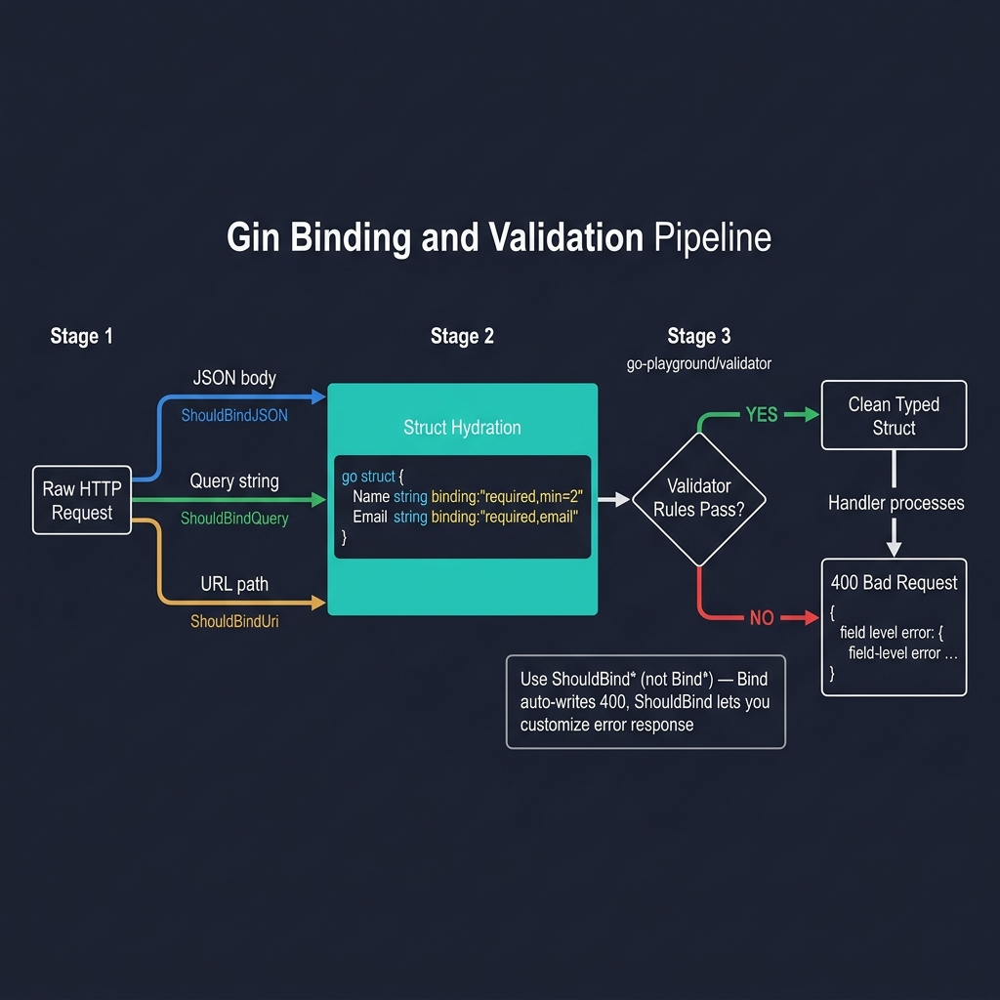
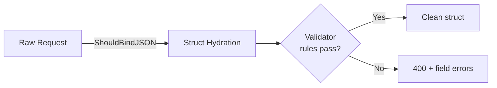
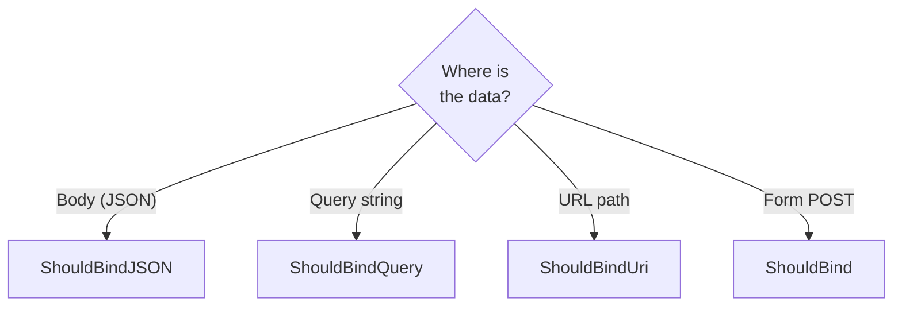

<!-- tags: golang -->
# 📦 Binding & Validation — JSON, Form, File Upload

> **Library**: Bind JSON/form/URI data to Go structs and validate with `binding:` tags powered by `go-playground/validator`.

📅 Updated: 2026-04-19 · ⏱️ 14 min read

## 1. DEFINE

Gin’s `ShouldBind*` methods decode request data into a struct and run `go-playground/validator` rules from `binding:` tags — one line replaces manual parsing.

| Method                    | Source                             |
| ------------------------- | ---------------------------------- |
| `c.ShouldBindJSON(&obj)`  | JSON request body                  |
| `c.ShouldBindQuery(&obj)` | URL query parameters (`?page=2`)   |
| `c.ShouldBindUri(&obj)`   | Path parameters (`:id`)            |

### Key Invariants

- **Use `ShouldBind*` (not `Bind*`) for custom error responses.** `Bind*` auto-writes 400.
- **Pointer fields + `omitempty` = PATCH semantics.** Non-nil means the client sent this field.

## 2. VISUAL



*Figure: Gin binding pipeline — raw request data from JSON body, query string, or URL path flows through ShouldBind\* into a typed struct, then go-playground/validator checks binding tags. Pass = clean struct, Fail = 400 with field-level errors.*



*Figure: Binding pipeline — raw request → ShouldBindJSON → struct hydration → validator rules → error or clean struct.*



*Figure: Decision tree — choose ShouldBindJSON (body), ShouldBindQuery (querystring), or ShouldBindUri (path).*

### Binding Flow

```text
POST /users  {"name":"Alice","email":"a@b.com","age":17}
    ├── ShouldBindJSON decodes into CreateUserRequest
    ├── Validator checks: age gte=18 → FAIL
    └── Handler returns 400 with validation details
```

## 3. CODE

### Example 1: Basic — JSON Property Bindings

```go
    // ━━━━━━━━━━━━━━━━━━━━━━━━━━━━━━━━━━━━━━━━━
    // CreateUserRequest: binding tags validate on decode.
    // UpdateUserRequest: pointer fields for PATCH (nil = not sent).
    // ━━━━━━━━━━━━━━━━━━━━━━━━━━━━━━━━━━━━━━━━━
    package main

    import (
        "net/http"
        "github.com/gin-gonic/gin"
    )

    type CreateUserRequest struct {
        Name     string `json:"name"     binding:"required,min=2,max=50"`
        Email    string `json:"email"    binding:"required,email"`
        Password string `json:"password" binding:"required,min=8,max=72"`
        Age      int    `json:"age"      binding:"required,gte=18,lte=120"`
        Role     string `json:"role"     binding:"required,oneof=user admin"`
    }

    type UpdateUserRequest struct {
        Name  *string `json:"name"  binding:"omitempty,min=2,max=50"`
        Email *string `json:"email" binding:"omitempty,email"`
        Age   *int    `json:"age"   binding:"omitempty,gte=18,lte=120"`
    }

    type UserResponse struct {
        ID    int64  `json:"id"`
        Name  string `json:"name"`
        Email string `json:"email"`
        Role  string `json:"role"`
    }

    func createUser(c *gin.Context) {
        var req CreateUserRequest

        if err := c.ShouldBindJSON(&req); err != nil {
            c.JSON(http.StatusBadRequest, gin.H{
                "error":   "validation failed",
                "details": err.Error(),
            })
            return
        }

        c.JSON(http.StatusCreated, gin.H{
            "data": UserResponse{
                ID:    1,
                Name:  req.Name,
                Email: req.Email,
                Role:  req.Role,
            },
        })
    }
```

### Example 2: Intermediate — Query and URI Targeting

```go
    // ━━━━━━━━━━━━━━━━━━━━━━━━━━━━━━━━━━━━━━━━━
    // ShouldBindQuery: maps ?page=2&sort=name to struct.
    // ShouldBindUri: maps :id path param using uri: tags.
    // ━━━━━━━━━━━━━━━━━━━━━━━━━━━━━━━━━━━━━━━━━
    type ListUsersQuery struct {
        Page    int    `form:"page"    binding:"omitempty,min=1"`
        Limit   int    `form:"limit"   binding:"omitempty,min=1,max=100"`
        Sort    string `form:"sort"    binding:"omitempty,oneof=name email"`
        Order   string `form:"order"   binding:"omitempty,oneof=asc desc"`
    }

    func listUsers(c *gin.Context) {
        query := ListUsersQuery{
            Page:  1,    
            Limit: 20,
            Sort:  "created_at",
            Order: "desc",
        }

        if err := c.ShouldBindQuery(&query); err != nil {
            c.JSON(400, gin.H{"error": err.Error()})
            return
        }

        c.JSON(200, gin.H{"query": query})
    }

    type UserURI struct {
        ID int64 `uri:"id" binding:"required,gt=0"`
    }

    func getUser(c *gin.Context) {
        var uri UserURI
        if err := c.ShouldBindUri(&uri); err != nil {
            c.JSON(400, gin.H{"error": "invalid user ID"})
            return
        }

        c.JSON(200, gin.H{"id": uri.ID})
    }
```

---

## 4. PITFALLS

| # | Severity | Defect | Impact | Fix |
| --- | --- | --- | --- | --- |
| 1 | 🔴 Fatal | Using `c.BindJSON` instead of `c.ShouldBindJSON` | Auto-writes 400; can’t customize error body | Always use `ShouldBind*` and handle errors yourself |
| 2 | 🔴 Fatal | Accepting raw `map[string]any` instead of typed struct | No validation, no type safety | Define request structs with `binding:` tags |

---

## 5. REF

| Resource | Link |
| --- | --- |
| Validator | [github.com/go-playground/validator](https://github.com/go-playground/validator) |
| Gin Official | [gin-gonic.com/en/docs](https://gin-gonic.com/en/docs/) |

---

## 6. RECOMMEND

| Extension | When | Rationale | Resource |
| --- | --- | --- | --- |
| File Uploads | When accepting binary uploads (images, docs) | Multipart parsing, size limits, content-type validation | [./02-file-upload-multipart.md](./02-file-upload-multipart.md) |
