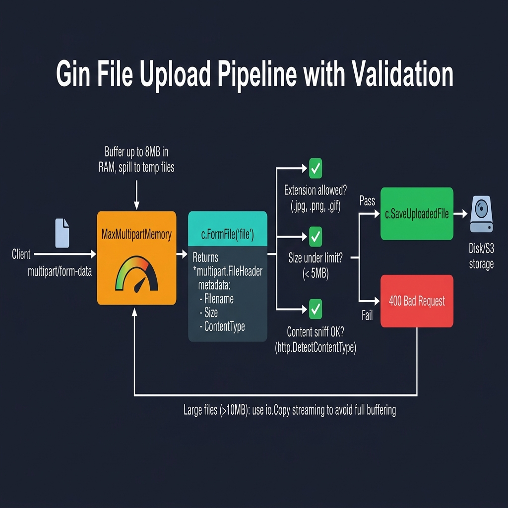

<!-- tags: golang --> # 📁 Tải lên tệp & nhiều phần — NestJS FileInterceptor → Gin

> **Thư viện**: Xử lý tải lên một tệp và nhiều tệp bằng `c.FormFile` , `c.MultipartForm` , xác thực loại nội dung và phát trực tuyến `io.Copy` .

📅 Cập nhật: 2026-04-19 · ⏱️ 12 phút đọc

## 1. ĐỊNH NGHĨA

Gin đệm toàn bộ nội dung nhiều phần vào bộ nhớ lên tới `MaxMultipartMemory` (mặc định 32 MB), sau đó tràn vào các tệp tạm thời. Nếu không có giới hạn kích thước rõ ràng và xác thực loại nội dung, một lần tải lên độc hại có thể làm hỏng vùng chứa của bạn.

| NestJS | Gin |
| --------------------------------------------- | ------------------------------------------------- |
| `@UseInterceptors(FileInterceptor('file'))` | `file, _ := c.FormFile("file")` |
| `@UploadedFile() file` | `file, header, err := c.Request.FormFile("file")` |
| `FilesInterceptor('files', 5)` | `form, _ := c.MultipartForm()` |
| `file.buffer` / `file.stream` | `file.Open()` trả về `io.Reader` |

### Bất biến chính

- **Đặt `r.MaxMultipartMemory` một cách rõ ràng.** Mặc định 32 MB là quá cao đối với hầu hết các API.
- **Xác thực bằng cách đánh hơi nội dung, không phải phần mở rộng tệp.** Phần mở rộng có thể bị giả mạo.

## 2. HÌNH ẢNH  *Hình: Luồng tải tệp lên — yêu cầu nhiều phần được lưu vào bộ đệm bởi MaxMultipartMemory → c.FormFile trích xuất tiêu đề → xác thực (phần mở rộng, kích thước, đánh hơi nội dung) → lưu hoặc từ chối. Các tệp lớn sử dụng tính năng phát trực tuyến io.Copy.*```mermaid
flowchart LR
    A["multipart/form-data"] -->|"c.FormFile('file')"| B["*multipart.FileHeader"]
    B --> C["validate size + ext"]
    C -->|"pass"| D["c.SaveUploadedFile"]
    D --> E["disk / S3"]
    C -->|"fail"| F["400 error"]
```*Hình: Luồng tải tệp lên — biểu mẫu nhiều phần → trích xuất tiêu đề tệp → xác thực → lưu vào đĩa hoặc bộ lưu trữ đám mây.*

### Luồng tải lên```text
POST /upload  (multipart/form-data, file: photo.jpg)
    ├── Gin parses multipart body (buffered up to 8 MB)
    ├── c.FormFile("file") returns *multipart.FileHeader
    ├── Validate: extension, size, content-type
    └── c.SaveUploadedFile(file, dst) writes to disk
```## 3. MÃ

### Ví dụ 1: Cơ bản — Lưu tệp vật lý```go
    // ━━━━━━━━━━━━━━━━━━━━━━━━━━━━━━━━━━━━━━━━━
    // Single file upload: rename with UUID to avoid collisions.
    // MaxMultipartMemory caps in-memory buffering at 8 MB.
    // ━━━━━━━━━━━━━━━━━━━━━━━━━━━━━━━━━━━━━━━━━
    package main

    import (
        "fmt"
        "net/http"
        "path/filepath"
        "github.com/gin-gonic/gin"
        "github.com/google/uuid"
    )

    func main() {
        r := gin.Default()
        r.MaxMultipartMemory = 8 << 20 

        r.POST("/upload", func(c *gin.Context) {
            file, err := c.FormFile("file")
            if err != nil {
                c.JSON(http.StatusBadRequest, gin.H{"error": "no file provided"})
                return
            }

            ext := filepath.Ext(file.Filename)
            newName := fmt.Sprintf("%s%s", uuid.New().String(), ext)
            dst := filepath.Join("./uploads", newName)

            if err := c.SaveUploadedFile(file, dst); err != nil {
                c.JSON(http.StatusInternalServerError, gin.H{"error": "failed to save"})
                return
            }

            c.JSON(http.StatusOK, gin.H{
                "filename": newName,
                "size":     file.Size,
                "type":     file.Header.Get("Content-Type"),
            })
        })

        r.Run(":8080")
    }
```### Ví dụ 2: Trung cấp — Xác minh loại nội dung```go
    // ━━━━━━━━━━━━━━━━━━━━━━━━━━━━━━━━━━━━━━━━━
    // Validate file extension and size BEFORE saving.
    // MultipartForm handles multiple files under one field name.
    // ━━━━━━━━━━━━━━━━━━━━━━━━━━━━━━━━━━━━━━━━━
    const maxFileSize = 5 << 20 // 5MB

    var allowedTypes = map[string]bool{
        ".jpg": true, ".jpeg": true, ".png": true, ".gif": true, ".webp": true,
    }

    func validateFile(filename string, size int64) (string, bool) {
        ext := strings.ToLower(filepath.Ext(filename))
        if !allowedTypes[ext] {
            return "file type not allowed", false
        }
        if size > maxFileSize {
            return "file too large (max 5MB)", false
        }
        return "", true
    }

    // Inside Handler
    func uploadMultiple(c *gin.Context) {
        form, err := c.MultipartForm()
        if err != nil {
            c.JSON(http.StatusBadRequest, gin.H{"error": "invalid form"})
            return
        }

        files := form.File["photos"]
        for _, file := range files {
            if msg, ok := validateFile(file.Filename, file.Size); !ok {
                c.JSON(http.StatusBadRequest, gin.H{
                    "error": msg,
                    "file":  file.Filename,
                })
                return
            }
            dst := filepath.Join("./uploads", file.Filename)
            c.SaveUploadedFile(file, dst)
        }
    }
```### Ví dụ 3: Nâng cao — Bản sao luồng liên tục```go
    // ━━━━━━━━━━━━━━━━━━━━━━━━━━━━━━━━━━━━━━━━━
    // Stream upload via io.Copy: avoids buffering entire file in RAM.
    // Use for large files (>10 MB) or when memory is constrained.
    // ━━━━━━━━━━━━━━━━━━━━━━━━━━━━━━━━━━━━━━━━━
    package main

    import (
        "io"
        "net/http"
        "os"
        "github.com/gin-gonic/gin"
    )

    func main() {
        r := gin.Default()

        r.POST("/upload/stream", func(c *gin.Context) {
            file, header, err := c.Request.FormFile("file")
            if err != nil {
                c.JSON(http.StatusBadRequest, gin.H{"error": err.Error()})
                return
            }
            defer file.Close()

            dst, err := os.Create("./uploads/" + header.Filename)
            if err != nil {
                c.JSON(http.StatusInternalServerError, gin.H{"error": err.Error()})
                return
            }
            defer dst.Close()

            written, err := io.Copy(dst, file) 
            if err != nil {
                c.JSON(http.StatusInternalServerError, gin.H{"error": err.Error()})
                return
            }

            c.JSON(http.StatusOK, gin.H{
                "filename": header.Filename,
                "bytes":    written,
            })
        })

        r.Run(":8080")
    }
```---

## 4. Cạm bẫy

| # | Mức độ nghiêm trọng | Khiếm khuyết | Tác động | Sửa chữa |
| --- | --- | --- | --- | --- |
| 1 | 🔴 Gây tử vong | Không đặt giới hạn `MaxMultipartMemory` | Một lần tải lên 1 GB OOM chứa vùng chứa | Đặt `r.MaxMultipartMemory = 8 << 20` (8 MB) |
| 2 | 🔴 Gây tử vong | Tin tưởng vào phần mở rộng tập tin mà không đánh hơi nội dung | Kẻ tấn công tải lên `.exe` được đổi tên thành `.jpg` | Sử dụng `http.DetectContentType` trên 512 byte đầu tiên |

---

## 5. GIỚI THIỆU

| Tài nguyên | Liên kết |
| --- | --- |
| Ví dụ tải lên Gin | [gin-gonic.com/docs/examples/upload-file](https://gin-gonic.com/docs/examples/upload-file/) |

---

## 6. KHUYẾN NGHỊ

| Gia hạn | Khi nào | Cơ sở lý luận | Tài nguyên |
| --- | --- | --- | --- |
| Các loại phản hồi | Khi trả về tệp, HTML hoặc truyền dữ liệu | Bao gồm các mẫu JSON, HTML, SSE và phản hồi tải xuống nhị phân | [../response/01-json-html-streaming.md](../response/01-json-html-streaming.md) |