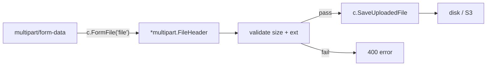

<!-- tags: golang -->
# 📁 File Upload & Multipart — NestJS FileInterceptor → Gin

> **Library**: Handle single and multi-file uploads with `c.FormFile`, `c.MultipartForm`, content-type validation, and streaming `io.Copy`.

📅 Updated: 2026-04-19 · ⏱️ 12 min read

## 1. DEFINE

Gin buffers the entire multipart body into memory up to `MaxMultipartMemory` (default 32 MB), then spills to temp files. Without explicit size limits and content-type validation, a single malicious upload can OOM your container.

| NestJS                                      | Gin                                               |
| ------------------------------------------- | ------------------------------------------------- |
| `@UseInterceptors(FileInterceptor('file'))` | `file, _ := c.FormFile("file")`                   |
| `@UploadedFile() file`                      | `file, header, err := c.Request.FormFile("file")` |
| `FilesInterceptor('files', 5)`              | `form, _ := c.MultipartForm()`                    |
| `file.buffer` / `file.stream`               | `file.Open()` returns an `io.Reader`              |

### Key Invariants

- **Set `r.MaxMultipartMemory` explicitly.** The 32 MB default is too high for most APIs.
- **Validate by content sniffing, not file extension.** Extensions can be spoofed.

## 2. VISUAL


*Figure: File upload flow — multipart request buffered by MaxMultipartMemory → c.FormFile extracts header → validation (extension, size, content sniff) → save or reject. Large files use io.Copy streaming.*



*Figure: File upload flow — multipart form → extract file header → validate → save to disk or cloud storage.*

### Upload Flow

```text
POST /upload  (multipart/form-data, file: photo.jpg)
    ├── Gin parses multipart body (buffered up to 8 MB)
    ├── c.FormFile("file") returns *multipart.FileHeader
    ├── Validate: extension, size, content-type
    └── c.SaveUploadedFile(file, dst) writes to disk
```

## 3. CODE

### Example 1: Basic — Physical File Saving

```go
    // ━━━━━━━━━━━━━━━━━━━━━━━━━━━━━━━━━━━━━━━━━
    // Single file upload: rename with UUID to avoid collisions.
    // MaxMultipartMemory caps in-memory buffering at 8 MB.
    // ━━━━━━━━━━━━━━━━━━━━━━━━━━━━━━━━━━━━━━━━━
    package main

    import (
        "fmt"
        "net/http"
        "path/filepath"
        "github.com/gin-gonic/gin"
        "github.com/google/uuid"
    )

    func main() {
        r := gin.Default()
        r.MaxMultipartMemory = 8 << 20 

        r.POST("/upload", func(c *gin.Context) {
            file, err := c.FormFile("file")
            if err != nil {
                c.JSON(http.StatusBadRequest, gin.H{"error": "no file provided"})
                return
            }

            ext := filepath.Ext(file.Filename)
            newName := fmt.Sprintf("%s%s", uuid.New().String(), ext)
            dst := filepath.Join("./uploads", newName)

            if err := c.SaveUploadedFile(file, dst); err != nil {
                c.JSON(http.StatusInternalServerError, gin.H{"error": "failed to save"})
                return
            }

            c.JSON(http.StatusOK, gin.H{
                "filename": newName,
                "size":     file.Size,
                "type":     file.Header.Get("Content-Type"),
            })
        })

        r.Run(":8080")
    }
```

### Example 2: Intermediate — Content Type Verification

```go
    // ━━━━━━━━━━━━━━━━━━━━━━━━━━━━━━━━━━━━━━━━━
    // Validate file extension and size BEFORE saving.
    // MultipartForm handles multiple files under one field name.
    // ━━━━━━━━━━━━━━━━━━━━━━━━━━━━━━━━━━━━━━━━━
    const maxFileSize = 5 << 20 // 5MB

    var allowedTypes = map[string]bool{
        ".jpg": true, ".jpeg": true, ".png": true, ".gif": true, ".webp": true,
    }

    func validateFile(filename string, size int64) (string, bool) {
        ext := strings.ToLower(filepath.Ext(filename))
        if !allowedTypes[ext] {
            return "file type not allowed", false
        }
        if size > maxFileSize {
            return "file too large (max 5MB)", false
        }
        return "", true
    }

    // Inside Handler
    func uploadMultiple(c *gin.Context) {
        form, err := c.MultipartForm()
        if err != nil {
            c.JSON(http.StatusBadRequest, gin.H{"error": "invalid form"})
            return
        }

        files := form.File["photos"]
        for _, file := range files {
            if msg, ok := validateFile(file.Filename, file.Size); !ok {
                c.JSON(http.StatusBadRequest, gin.H{
                    "error": msg,
                    "file":  file.Filename,
                })
                return
            }
            dst := filepath.Join("./uploads", file.Filename)
            c.SaveUploadedFile(file, dst)
        }
    }
```

### Example 3: Advanced — Constant Stream Copies

```go
    // ━━━━━━━━━━━━━━━━━━━━━━━━━━━━━━━━━━━━━━━━━
    // Stream upload via io.Copy: avoids buffering entire file in RAM.
    // Use for large files (>10 MB) or when memory is constrained.
    // ━━━━━━━━━━━━━━━━━━━━━━━━━━━━━━━━━━━━━━━━━
    package main

    import (
        "io"
        "net/http"
        "os"
        "github.com/gin-gonic/gin"
    )

    func main() {
        r := gin.Default()

        r.POST("/upload/stream", func(c *gin.Context) {
            file, header, err := c.Request.FormFile("file")
            if err != nil {
                c.JSON(http.StatusBadRequest, gin.H{"error": err.Error()})
                return
            }
            defer file.Close()

            dst, err := os.Create("./uploads/" + header.Filename)
            if err != nil {
                c.JSON(http.StatusInternalServerError, gin.H{"error": err.Error()})
                return
            }
            defer dst.Close()

            written, err := io.Copy(dst, file) 
            if err != nil {
                c.JSON(http.StatusInternalServerError, gin.H{"error": err.Error()})
                return
            }

            c.JSON(http.StatusOK, gin.H{
                "filename": header.Filename,
                "bytes":    written,
            })
        })

        r.Run(":8080")
    }
```

---

## 4. PITFALLS

| # | Severity | Defect | Impact | Fix |
| --- | --- | --- | --- | --- |
| 1 | 🔴 Fatal | No `MaxMultipartMemory` limit set | A single 1 GB upload OOMs the container | Set `r.MaxMultipartMemory = 8 << 20` (8 MB) |
| 2 | 🔴 Fatal | Trusting file extension without content sniffing | Attacker uploads `.exe` renamed to `.jpg` | Use `http.DetectContentType` on the first 512 bytes |

---

## 5. REF

| Resource | Link |
| --- | --- |
| Gin Upload Example | [gin-gonic.com/docs/examples/upload-file](https://gin-gonic.com/docs/examples/upload-file/) |

---

## 6. RECOMMEND

| Extension | When | Rationale | Resource |
| --- | --- | --- | --- |
| Response Types | When returning files, HTML, or streaming data | Covers JSON, HTML templates, SSE, and binary download responses | [../response/01-json-html-streaming.md](../response/01-json-html-streaming.md) |
