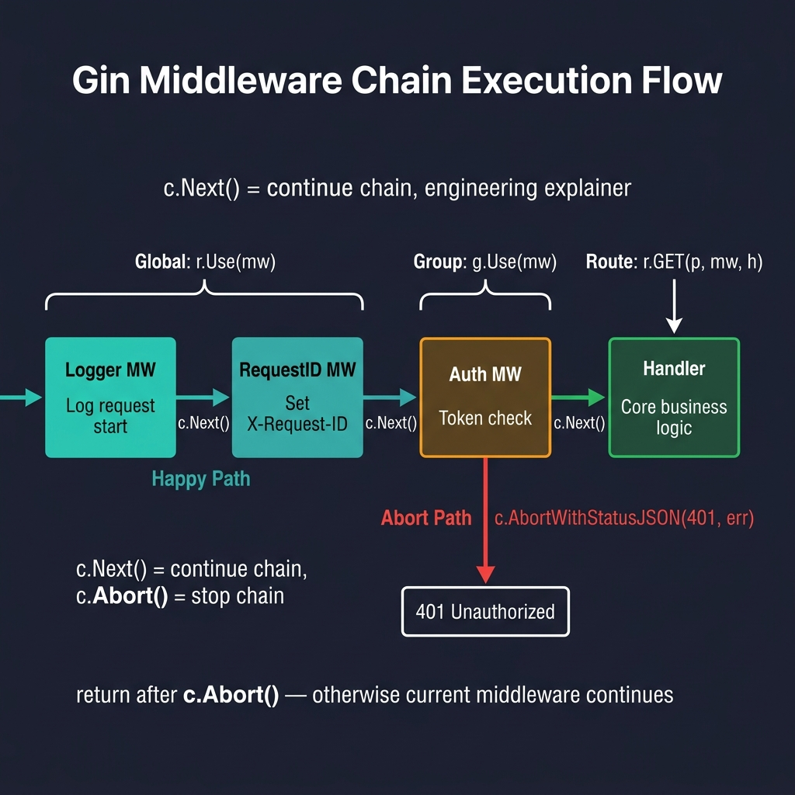
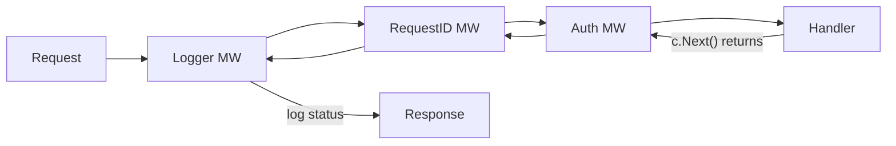

<!-- tags: golang -->
# 🛡️ Middleware — Logger, Recovery, Auth, CORS, Custom

> **Library**: Chain middleware functions that run before/after every handler — logging, recovery, auth, CORS, request ID.

📅 Updated: 2026-04-19 · ⏱️ 15 min read

## 1. DEFINE

A Gin middleware is a `gin.HandlerFunc` that runs in a chain before (and optionally after) the final handler. `c.Next()` advances to the next middleware; `c.Abort()` stops the chain. Middleware can be applied globally, per group, or per route.

| Scope      | Application    | Use case                     |
| ---------- | -------------- | ---------------------------- |
| **Global** | `r.Use(mw)`    | Logger, recovery, CORS       |
| **Group**  | `g.Use(mw)`    | Auth for `/api/v1` routes    |
| **Route**  | `r.GET(p, mw, h)` | Rate limit on a single endpoint |

### Key Invariants

- **Call `c.Next()` to continue the chain.** Without it, downstream handlers never execute.
- **Call `return` after `c.Abort*()`.** Without `return`, the current middleware continues executing after the abort.

## 2. VISUAL



*Figure: Middleware chain — Logger and RequestID are global (r.Use), Auth is group-scoped (g.Use). Happy path flows via c.Next(); abort path short-circuits with c.AbortWithStatusJSON(401).*



*Figure: Middleware chain — Logger → RequestID → Auth → Handler → (post-handler logging on the way back up).*

```text
Before c.Next() → pre-processing (set headers, validate, start timer)
c.Next()         → runs next middleware / handler
After c.Next()   → post-processing (log status, record duration)
```

*Figure: Before/after flow — `c.Next()` runs downstream, then control returns for post-processing (timing, status logging).*

### Execution Order

```text
Request arrives
  → Logger (before)  → RequestID (before)  → Handler executes
  ← Logger (after: logs status + duration) ← RequestID (after)
Response sent
```

## 3. CODE

### Example 1: Basic — Built-in Chains

```go
    // ━━━━━━━━━━━━━━━━━━━━━━━━━━━━━━━━━━━━━━━━━
    // Two custom middleware: RequestLogger (before/after via c.Next)
    // and RequestID (reads or generates X-Request-Id header).
    // ━━━━━━━━━━━━━━━━━━━━━━━━━━━━━━━━━━━━━━━━━
    package main

    import (
        "fmt"
        "log"
        "time"
        "github.com/gin-gonic/gin"
    )

    func main() {
        r := gin.Default()

        r.Use(RequestLogger())
        r.Use(RequestID())

        r.GET("/ping", func(c *gin.Context) {
            requestID := c.GetString("requestID")
            c.JSON(200, gin.H{
                "message":    "pong",
                "request_id": requestID,
            })
        })

        r.Run(":8080")
    }

    func RequestLogger() gin.HandlerFunc {
        return func(c *gin.Context) {
            start := time.Now()
            path := c.Request.URL.Path
            method := c.Request.Method

            log.Printf("→ %s %s", method, path)

            c.Next()  

            duration := time.Since(start)
            status := c.Writer.Status()
            log.Printf("← %s %s %d %v", method, path, status, duration)
        }
    }

    func RequestID() gin.HandlerFunc {
        return func(c *gin.Context) {
            requestID := c.GetHeader("X-Request-Id")
            if requestID == "" {
                requestID = generateID()  
            }

            c.Set("requestID", requestID)
            c.Header("X-Request-Id", requestID)

            c.Next()
        }
    }

    func generateID() string {
        return fmt.Sprintf("%d", time.Now().UnixNano())
    }
```

### Example 2: Intermediate — JWT and CORS Protection

```go
    // ━━━━━━━━━━━━━━━━━━━━━━━━━━━━━━━━━━━━━━━━━
    // JWTAuth: aborts with 401 if Authorization header is missing.
    // CORSMiddleware: sets CORS headers; handles OPTIONS preflight.
    // ━━━━━━━━━━━━━━━━━━━━━━━━━━━━━━━━━━━━━━━━━
    func JWTAuth() gin.HandlerFunc {
        return func(c *gin.Context) {
            authHeader := c.GetHeader("Authorization")

            if authHeader == "" {
                c.AbortWithStatusJSON(http.StatusUnauthorized, gin.H{
                    "error": "missing authorization header",
                })
                return
            }

            c.Set("userID", 123) 

            c.Next()
        }
    }

    func CORSMiddleware() gin.HandlerFunc {
        return func(c *gin.Context) {
            c.Header("Access-Control-Allow-Origin", "*")
            c.Header("Access-Control-Allow-Methods", "GET, POST, OPTIONS")
            c.Header("Access-Control-Allow-Headers", "Authorization, Content-Type")

            if c.Request.Method == "OPTIONS" {
                c.AbortWithStatus(http.StatusNoContent)
                return
            }

            c.Next()
        }
    }
```

### Example 3: Advanced — Custom Recovery

```go
    // ━━━━━━━━━━━━━━━━━━━━━━━━━━━━━━━━━━━━━━━━━
    // CustomRecovery replaces gin.Recovery() to return JSON error
    // bodies instead of default text/plain panic output.
    // ━━━━━━━━━━━━━━━━━━━━━━━━━━━━━━━━━━━━━━━━━
    func CustomRecovery() gin.HandlerFunc {
        return gin.CustomRecovery(func(c *gin.Context, err any) {
            log.Printf("PANIC: %v", err)

            c.AbortWithStatusJSON(http.StatusInternalServerError, gin.H{
                "error":   "internal server error",
                "message": "an unexpected error occurred",
            })
        })
    }
```

---

## 4. PITFALLS

| # | Severity | Defect | Impact | Fix |
| --- | --- | --- | --- | --- |
| 1 | 🔴 Fatal | Calling `c.Abort()` without `return` in the same function | Code after Abort still executes; may write conflicting responses | Always write `c.AbortWithStatusJSON(...); return` |
| 2 | 🔴 Fatal | Placing Recovery middleware after Logger | Panics in Logger crash the process without recovery | Recovery must be the first middleware in the chain |

---

## 5. REF

| Resource | Link |
| --- | --- |
| Custom Middleware | [gin-gonic.com/docs/examples/custom-middleware](https://gin-gonic.com/docs/examples/custom-middleware/) |
| Gin CORS | [github.com/gin-contrib/cors](https://github.com/gin-contrib/cors) |

---

## 6. RECOMMEND

| Extension | When | Rationale | Resource |
| --- | --- | --- | --- |
| Guards & Interceptors | When you need role-based access or structured error handling | Builds on middleware to implement NestJS-style Guards/Interceptors/Filters | [./02-guards-interceptors.md](./02-guards-interceptors.md) |
