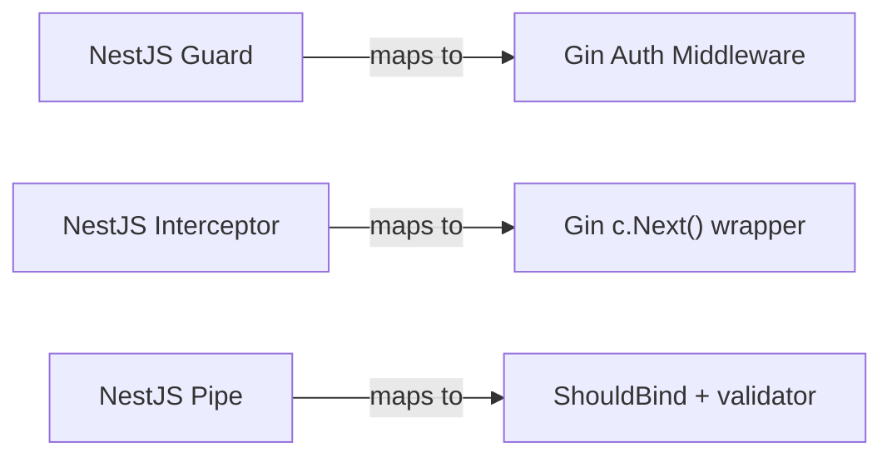

<!-- tags: golang -->
# 🛡️ Guards & Interceptors — NestJS Patterns → Gin Middleware

> **Library**: Implement NestJS Guards, Interceptors, Pipes, and Exception Filters as plain Gin middleware functions.

📅 Updated: 2026-04-19 · ⏱️ 14 min read

## 1. DEFINE

NestJS has four distinct pipeline stages (Guards → Interceptors → Pipes → Filters) with dedicated decorators. Gin collapses all four into a single concept: **middleware**. A middleware that checks roles before `c.Next()` is a Guard. One that times the request around `c.Next()` is an Interceptor. One that collects `c.Errors` after `c.Next()` is an Exception Filter.

| NestJS Concept                 | Gin Equivalent                                     |
| ------------------------------ | -------------------------------------------------- |
| `@UseGuards(AuthGuard)`        | Middleware that aborts with 401/403 before `c.Next()` |
| `@UseInterceptors()`           | Middleware that wraps `c.Next()` (before + after)  |
| `@UsePipes(ValidationPipe)`    | `c.ShouldBind*()` inside the handler               |
| `@UseFilters(ExceptionFilter)` | Middleware that reads `c.Errors` after `c.Next()`  |

### Key Invariants

- **Guards run before the handler.** They call `c.Abort()` + `return` if authorization fails.
- **Interceptors wrap `c.Next()`.** Code before `c.Next()` is pre-processing; code after is post-processing.

## 2. VISUAL


*Figure: NestJS pipeline concepts → Gin middleware — Guard (abort before c.Next), Interceptor (wrap c.Next), Pipe (ShouldBind in handler), Exception Filter (read c.Errors after c.Next).*



*Figure: NestJS Guards → Gin auth middleware, Interceptors → c.Next() wrappers, Pipes → ShouldBind + validation.*

### Pipeline Mapping

```text
NestJS:  Guard → Interceptor(before) → Pipe → Handler → Interceptor(after) → Filter
Gin:     AuthMW → LoggingMW(before)  → [bind in handler] → Handler → LoggingMW(after) → ErrorHandler
```

## 3. CODE

### Example 1: Basic — Auth Guards

```go
    // ━━━━━━━━━━━━━━━━━━━━━━━━━━━━━━━━━━━━━━━━━
    // RolesGuard: checks c.Get("role") against allowed roles.
    // Aborts with 403 if role missing or not permitted.
    // ━━━━━━━━━━━━━━━━━━━━━━━━━━━━━━━━━━━━━━━━━
    package middleware

    import (
        "net/http"
        "github.com/gin-gonic/gin"
    )

    func RolesGuard(allowedRoles ...string) gin.HandlerFunc {
        return func(c *gin.Context) {
            role, exists := c.Get("role")
            if !exists {
                c.AbortWithStatusJSON(http.StatusForbidden, gin.H{
                    "error": "no role found",
                })
                return
            }

            userRole := role.(string)
            for _, allowed := range allowedRoles {
                if userRole == allowed {
                    c.Next()
                    return
                }
            }

            c.AbortWithStatusJSON(http.StatusForbidden, gin.H{
                "error": "insufficient permissions",
            })
        }
    }
```

### Example 2: Intermediate — Interceptors

```go
    // ━━━━━━━━━━━━━━━━━━━━━━━━━━━━━━━━━━━━━━━━━
    // LoggingInterceptor wraps c.Next(): logs before + after.
    // Uses slog for structured logging with duration tracking.
    // ━━━━━━━━━━━━━━━━━━━━━━━━━━━━━━━━━━━━━━━━━
    package middleware

    import (
        "log/slog"
        "time"
        "github.com/gin-gonic/gin"
    )

    func LoggingInterceptor() gin.HandlerFunc {
        return func(c *gin.Context) {
            start := time.Now()
            method := c.Request.Method

            slog.Info("→ incoming request", "method", method)

            c.Next() 

            duration := time.Since(start)
            status := c.Writer.Status()

            slog.Info("← response sent", "status", status, "duration", duration)
        }
    }
```

### Example 3: Advanced — Exception Filters

```go
    // ━━━━━━━━━━━━━━━━━━━━━━━━━━━━━━━━━━━━━━━━━
    // ErrorHandler reads c.Errors after c.Next().
    // Maps AppError to structured JSON; unknown errors → 500.
    // ━━━━━━━━━━━━━━━━━━━━━━━━━━━━━━━━━━━━━━━━━
    package middleware

    import (
        "errors"
        "net/http"
        "github.com/gin-gonic/gin"
    )

    type AppError struct {
        Code    int    `json:"code"`
        Message string `json:"message"`
    }

    func (e *AppError) Error() string { return e.Message }

    func ErrorHandler() gin.HandlerFunc {
        return func(c *gin.Context) {
            c.Next()

            if len(c.Errors) == 0 {
                return
            }

            err := c.Errors.Last().Err

            var appErr *AppError
            if errors.As(err, &appErr) {
                c.JSON(appErr.Code, gin.H{
                    "error":   appErr.Message,
                })
                return
            }

            c.JSON(http.StatusInternalServerError, gin.H{
                "error": "internal server error",
            })
        }
    }
```

---

## 4. PITFALLS

| # | Severity | Defect | Impact | Fix |
| --- | --- | --- | --- | --- |
| 1 | 🔴 Fatal | Calling `c.AbortWithStatusJSON()` without `return` | Handler code below the abort still executes, writing a second response | Always pair `c.Abort*()` with an immediate `return` |
| 2 | 🟡 Common | Type-asserting `c.Get("role")` without checking `exists` | Panic on nil interface assertion if auth middleware was skipped | Always check the `exists` bool from `c.Get()` |

---

## 5. REF

| Resource | Link |
| --- | --- |
| Custom Middleware | [gin-gonic.com/docs/examples/custom-middleware](https://gin-gonic.com/docs/examples/custom-middleware/) |

---

## 6. RECOMMEND

| Extension | When | Rationale | Resource |
| --- | --- | --- | --- |
| Response Types | When you need structured JSON, HTML, or streaming responses | Covers output formatting after middleware has processed the request | [../response/01-json-html-streaming.md](../response/01-json-html-streaming.md) |
