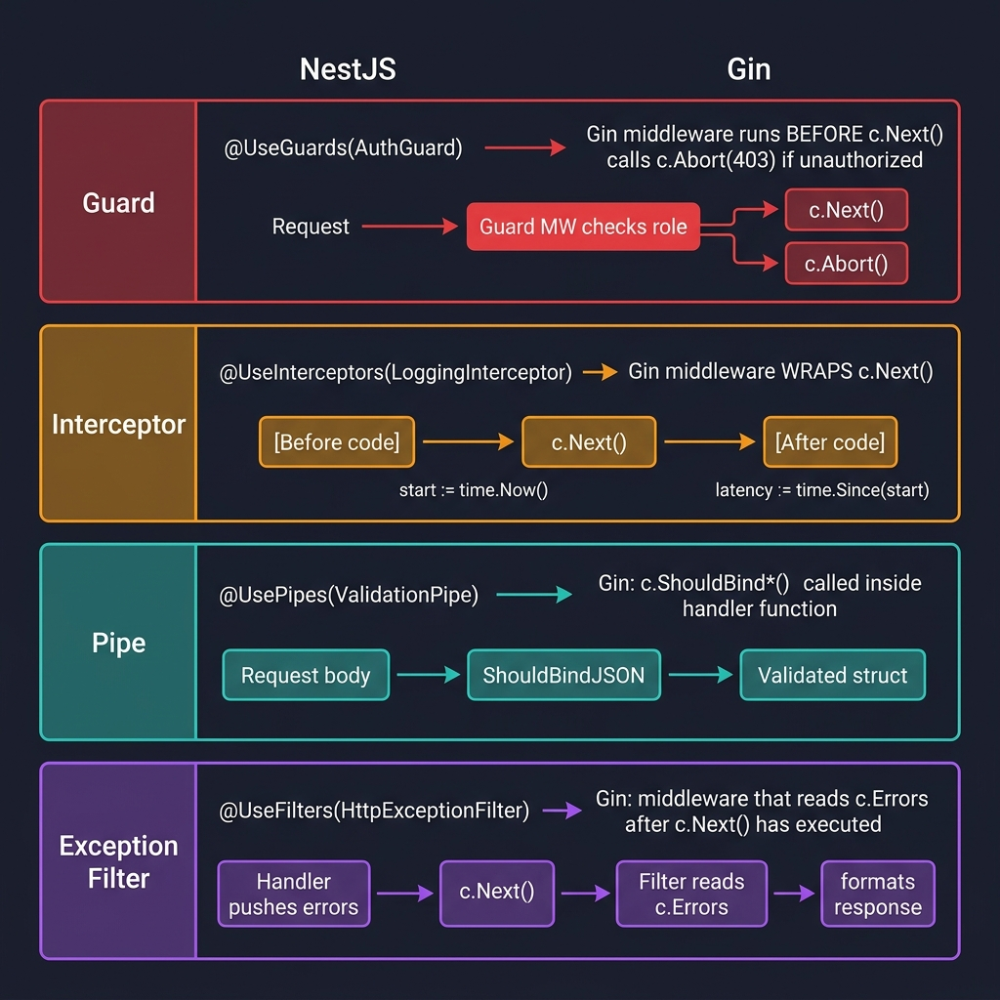

<!-- tags: golang --> # 🛡️ Guards & Interceptors — NestJS Patterns → Gin Middleware

> **Thư viện**: Triển khai Bộ bảo vệ, Bộ chặn, Đường ống và Bộ lọc ngoại lệ của NestJS dưới dạng các chức năng phần mềm trung gian đơn giản của Gin.

📅 Cập nhật: 2026-04-19 · ⏱️ 14 phút đọc

## 1. ĐỊNH NGHĨA

NestJS có bốn giai đoạn quy trình riêng biệt (Bộ bảo vệ → Bộ chặn → Đường ống → Bộ lọc) với các bộ trang trí chuyên dụng. Gin gộp cả bốn thành một khái niệm duy nhất: **middleware**. Phần mềm trung gian kiểm tra vai trò trước `c.Next()` là Guard. Một lần yêu cầu xung quanh `c.Next()` là một Thiết bị chặn. Một bộ thu thập `c.Errors` sau `c.Next()` là Bộ lọc ngoại lệ.

| Khái niệm NestJS | Tương đương Gin |
| ------------------------------ | -------------------------------------------------- |
| `@UseGuards(AuthGuard)` | Phần mềm trung gian hủy bỏ với 401/403 trước `c.Next()` |
| `@UseInterceptors()` | Phần mềm trung gian bao bọc `c.Next()` (trước + sau) |
| `@UsePipes(ValidationPipe)` | `c.ShouldBind*()` bên trong trình xử lý |
| `@UseFilters(ExceptionFilter)` | Phần mềm trung gian đọc `c.Errors` sau `c.Next()` |

### Bất biến chính

- **Người bảo vệ chạy trước người xử lý.** Họ gọi `c.Abort()` + `return` nếu ủy quyền không thành công.
- **Bộ chặn bao bọc `c.Next()` .** Mã trước `c.Next()` đang xử lý trước; mã sau là xử lý hậu kỳ.

## 2. HÌNH ẢNH  *Hình: Các khái niệm về đường dẫn NestJS → Phần mềm trung gian Gin — Guard (hủy bỏ trước c.Next), Interceptor (bọc c.Next), Pipe (ShouldBind trong trình xử lý), Bộ lọc ngoại lệ (đọc c.Errors sau c.Next).*```mermaid
flowchart LR
    A["NestJS Guard"] -->|"maps to"| B["Gin Auth Middleware"]
    C["NestJS Interceptor"] -->|"maps to"| D["Gin c.Next() wrapper"]
    E["NestJS Pipe"] -->|"maps to"| F["ShouldBind + validator"]
```*Hình: NestJS Guards → Gin auth middleware, Interceptors → trình bao bọc c.Next(), Pipes → ShouldBind + xác thực.*

### Lập bản đồ đường ống```text
NestJS:  Guard → Interceptor(before) → Pipe → Handler → Interceptor(after) → Filter
Gin:     AuthMW → LoggingMW(before)  → [bind in handler] → Handler → LoggingMW(after) → ErrorHandler
```## 3. MÃ

### Ví dụ 1: Cơ bản — Auth Guards```go
    // ━━━━━━━━━━━━━━━━━━━━━━━━━━━━━━━━━━━━━━━━━
    // RolesGuard: checks c.Get("role") against allowed roles.
    // Aborts with 403 if role missing or not permitted.
    // ━━━━━━━━━━━━━━━━━━━━━━━━━━━━━━━━━━━━━━━━━
    package middleware

    import (
        "net/http"
        "github.com/gin-gonic/gin"
    )

    func RolesGuard(allowedRoles ...string) gin.HandlerFunc {
        return func(c *gin.Context) {
            role, exists := c.Get("role")
            if !exists {
                c.AbortWithStatusJSON(http.StatusForbidden, gin.H{
                    "error": "no role found",
                })
                return
            }

            userRole := role.(string)
            for _, allowed := range allowedRoles {
                if userRole == allowed {
                    c.Next()
                    return
                }
            }

            c.AbortWithStatusJSON(http.StatusForbidden, gin.H{
                "error": "insufficient permissions",
            })
        }
    }
```### Ví dụ 2: Trung cấp — Interceptor```go
    // ━━━━━━━━━━━━━━━━━━━━━━━━━━━━━━━━━━━━━━━━━
    // LoggingInterceptor wraps c.Next(): logs before + after.
    // Uses slog for structured logging with duration tracking.
    // ━━━━━━━━━━━━━━━━━━━━━━━━━━━━━━━━━━━━━━━━━
    package middleware

    import (
        "log/slog"
        "time"
        "github.com/gin-gonic/gin"
    )

    func LoggingInterceptor() gin.HandlerFunc {
        return func(c *gin.Context) {
            start := time.Now()
            method := c.Request.Method

            slog.Info("→ incoming request", "method", method)

            c.Next() 

            duration := time.Since(start)
            status := c.Writer.Status()

            slog.Info("← response sent", "status", status, "duration", duration)
        }
    }
```### Ví dụ 3: Nâng cao — Bộ lọc ngoại lệ```go
    // ━━━━━━━━━━━━━━━━━━━━━━━━━━━━━━━━━━━━━━━━━
    // ErrorHandler reads c.Errors after c.Next().
    // Maps AppError to structured JSON; unknown errors → 500.
    // ━━━━━━━━━━━━━━━━━━━━━━━━━━━━━━━━━━━━━━━━━
    package middleware

    import (
        "errors"
        "net/http"
        "github.com/gin-gonic/gin"
    )

    type AppError struct {
        Code    int    `json:"code"`
        Message string `json:"message"`
    }

    func (e *AppError) Error() string { return e.Message }

    func ErrorHandler() gin.HandlerFunc {
        return func(c *gin.Context) {
            c.Next()

            if len(c.Errors) == 0 {
                return
            }

            err := c.Errors.Last().Err

            var appErr *AppError
            if errors.As(err, &appErr) {
                c.JSON(appErr.Code, gin.H{
                    "error":   appErr.Message,
                })
                return
            }

            c.JSON(http.StatusInternalServerError, gin.H{
                "error": "internal server error",
            })
        }
    }
```---

## 4. Cạm bẫy

| # | Mức độ nghiêm trọng | Khiếm khuyết | Tác động | Sửa chữa |
| --- | --- | --- | --- | --- |
| 1 | 🔴 Gây tử vong | Gọi `c.AbortWithStatusJSON()` không có `return` | Mã xử lý bên dưới lệnh hủy bỏ vẫn thực thi, viết phản hồi thứ hai | Luôn ghép nối `c.Abort*()` với `return` |
| 2 | 🟡 Chung | Xác nhận kiểu `c.Get("role")` mà không kiểm tra `exists` | Hoảng sợ khi xác nhận giao diện không nếu phần mềm trung gian xác thực bị bỏ qua | Luôn kiểm tra bool `exists` từ `c.Get()` |

---

## 5. GIỚI THIỆU

| Tài nguyên | Liên kết |
| --- | --- |
| Phần mềm trung gian tùy chỉnh | [gin-gonic.com/docs/examples/custom-middleware](https://gin-gonic.com/docs/examples/custom-middleware/) |

---

## 6. KHUYẾN NGHỊ

| Gia hạn | Khi nào | Cơ sở lý luận | Tài nguyên |
| --- | --- | --- | --- |
| Các loại phản hồi | Khi bạn cần phản hồi có cấu trúc JSON, HTML hoặc phát trực tuyến | Bao gồm định dạng đầu ra sau khi phần mềm trung gian xử lý yêu cầu | [../response/01-json-html-streaming.md](../response/01-json-html-streaming.md) |