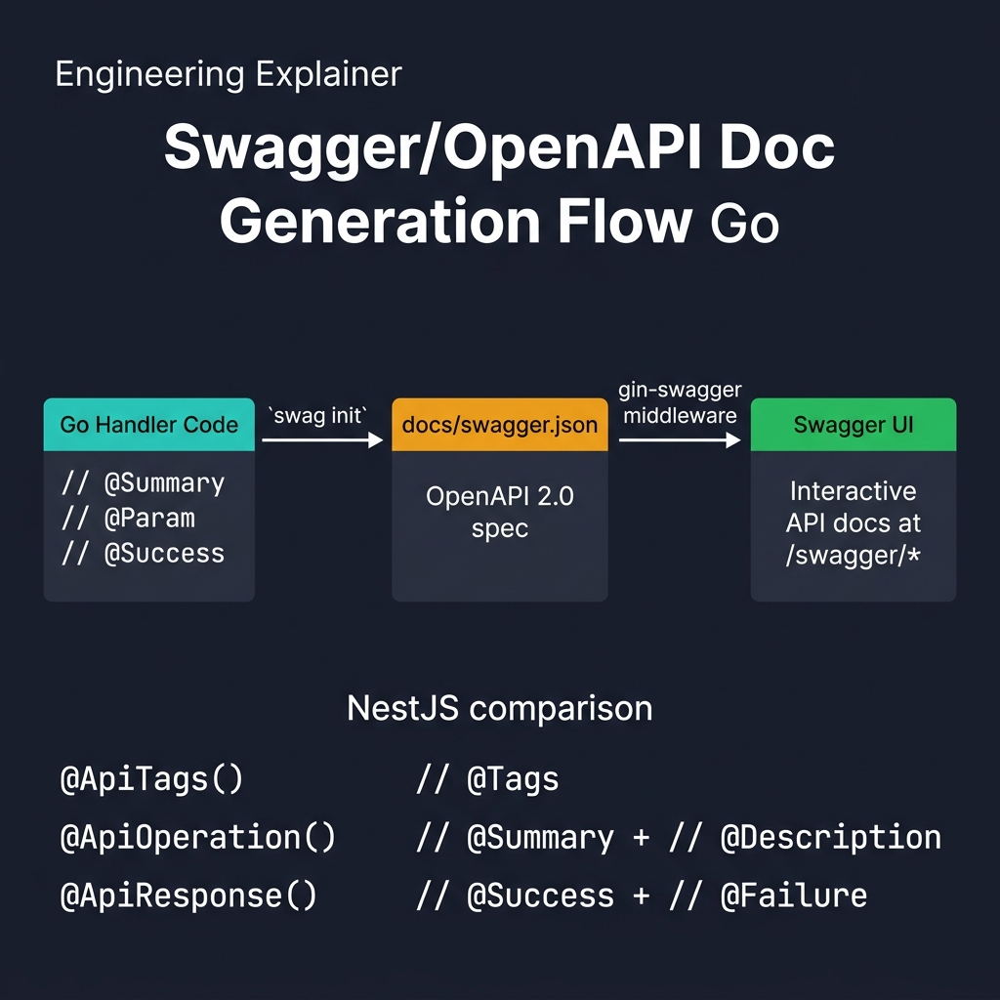

<!-- tags: golang --> # 📖 Swagger & OpenAPI — NestJS @nestjs/swagger → Go swaggo

> **Thư viện**: Tạo thông số OpenAPI từ nhận xét Go bằng `swaggo/swag` , phân phát giao diện người dùng Swagger thông qua `gin-swagger` .

📅 Đã cập nhật: 19-04-2026 · ⏱️ 10 phút đọc

## 1. ĐỊNH NGHĨA

NestJS sử dụng trình trang trí `@nestjs/swagger` ( `@ApiTags` , `@ApiResponse` ) để tự động tạo thông số OpenAPI. Trong Go, `swaggo/swag` đọc các nhận xét đặc biệt phía trên trình xử lý và tạo `docs/swagger.json` . Giao diện người dùng Swagger được phục vụ bởi `gin-swagger` .

| NestJS | Gin / Đi |
| ----------------------------------- | ---------------------------------------------- |
| `@ApiTags('users')` | `// @Tags users` bình luận |
| `@ApiResponse({ status: 200 })` | `// @Success 200 {object} User` |
| `@ApiBody({ type: CreateUserDto })` | `// @Param request body CreateUserDTO true` |
| `SwaggerModule.setup('api', app)` | `ginSwagger.WrapHandler(swaggerFiles.Handler)` |

### Bất biến chính

- **Chạy `swag init` trong CI.** Nếu bạn tạo cục bộ nhưng quên, thông số được triển khai đã cũ.
- **Giữ chú thích gần mã xử lý.** Di chuyển chúng sang các tệp riêng biệt sẽ tạo ra sự trôi dạt.

## 2. HÌNH ẢNH  *Hình: Luồng OpenAPI — chú thích swaggo trong trình xử lý Go → `swag init` tạo swagger.json → gin-swagger phục vụ giao diện người dùng Swagger tương tác tại /swagger/\*.*```mermaid
flowchart LR
    A["Handler + // @Tags\n// @Success comments"] -->|"swag init"| B["docs/swagger.json"]
    B --> C["ginSwagger.WrapHandler"]
    C --> D["Swagger UI at /swagger"]
```*Hình: Quy trình chuyển đổi — trình xử lý chú thích bằng nhận xét → `swag init` tạo thông số kỹ thuật → gin-swagger phục vụ giao diện người dùng tương tác.*

### Quy trình tạo thế hệ```text
1. Write // @Tags, // @Summary, // @Param, // @Success comments
2. Run: swag init -g cmd/api/main.go
3. Import _ "myapp/docs" in main.go
4. Mount: r.GET("/swagger/*any", ginSwagger.WrapHandler(...))
```## 3. MÃ

### Ví dụ 1: Cơ bản — Chú thích vênh vang```go
    // ━━━━━━━━━━━━━━━━━━━━━━━━━━━━━━━━━━━━━━━━━
    // Swagger annotations: each handler gets // @Summary, // @Tags,
    // // @Param, // @Success, // @Router comments above it.
    // ━━━━━━━━━━━━━━━━━━━━━━━━━━━━━━━━━━━━━━━━━
    package handler

    import (
        "net/http"
        "github.com/gin-gonic/gin"
    )

    // ListUsers godoc
    // @Summary      List all users
    // @Description  Get paginated list of users
    // @Tags         users
    // @Accept       json
    // @Produce      json
    // @Param        page  query  int  false  "Page number"  default(1)
    // @Param        limit query  int  false  "Items per page" default(20)
    // @Success      200  {object}  map[string]interface{}
    // @Failure      500  {object}  map[string]interface{}
    // @Router       /users [get]
    func ListUsers(c *gin.Context) {
        c.JSON(http.StatusOK, gin.H{"data": []gin.H{}})
    }

    // CreateUser godoc
    // @Summary      Create a new user
    // @Description  Register a new user account
    // @Tags         users
    // @Accept       json
    // @Produce      json
    // @Param        request body CreateUserDTO true "User data"
    // @Success      201  {object}  User
    // @Failure      400  {object}  map[string]interface{}
    // @Security     BearerAuth
    // @Router       /users [post]
    func CreateUser(c *gin.Context) {
        // ...
    }
```### Ví dụ 2: Trung cấp — Setup & Serve```go
    // ━━━━━━━━━━━━━━━━━━━━━━━━━━━━━━━━━━━━━━━━━
    // Serve Swagger UI: import generated docs package,
    // mount ginSwagger at /swagger/*any.
    // ━━━━━━━━━━━━━━━━━━━━━━━━━━━━━━━━━━━━━━━━━
    package main

    import (
        "github.com/gin-gonic/gin"
        swaggerFiles "github.com/swaggo/files"
        ginSwagger "github.com/swaggo/gin-swagger"
        _ "myapp/docs" 
    )

    // @title          My API
    // @version        1.0
    // @description    API server for My Application
    // @host           localhost:8080
    // @BasePath       /api/v1
    // @securityDefinitions.apikey BearerAuth
    // @in             header
    // @name           Authorization
    func main() {
        r := gin.Default()

        r.GET("/swagger/*any", ginSwagger.WrapHandler(swaggerFiles.Handler))

        r.Run(":8080")
    }

    // Generate docs: swag init -g cmd/api/main.go
```---

## 4. Cạm bẫy

| # | Mức độ nghiêm trọng | Khiếm khuyết | Tác động | Sửa chữa |
| --- | --- | --- | --- | --- |
| 1 | 🔴 Gây tử vong | Không chạy `swag init` trong CI | Thông số đã triển khai đã cũ; khách hàng thực hiện sai hợp đồng | Thêm bước `swag init` vào quy trình CI trước khi xây dựng |
| 2 | 🟡 Chung | Sử dụng `map[string]interface{}` làm loại phản hồi | Swagger hiển thị lược đồ trống; người tiêu dùng không thể xác thực | Xác định cấu trúc phản hồi được đặt tên cho mọi điểm cuối |

---

## 5. GIỚI THIỆU

| Tài nguyên | Liên kết |
| --- | --- |
| Tài liệu Swaggo | [github.com/swaggo/swag](https://github.com/swaggo/swag) |

---

## 6. KHUYẾN NGHỊ

| Gia hạn | Khi nào | Cơ sở lý luận | Tài nguyên |
| --- | --- | --- | --- |
| Kiểm tra sức khỏe | Khi bạn cần thăm dò mức độ sẵn sàng/sống động | Điểm cuối hiển thị /sức khỏe cho người điều phối và bộ cân bằng tải | [./02-health-check.md](./02-health-check.md) |