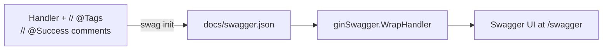

<!-- tags: golang -->
# 📖 Swagger & OpenAPI — NestJS @nestjs/swagger → Go swaggo

> **Library**: Generate OpenAPI specs from Go comments with `swaggo/swag`, serve Swagger UI via `gin-swagger`.

📅 Updated: 2026-04-19 · ⏱️ 10 min read

## 1. DEFINE

NestJS uses `@nestjs/swagger` decorators (`@ApiTags`, `@ApiResponse`) to auto-generate OpenAPI specs. In Go, `swaggo/swag` reads special comments above handlers and generates `docs/swagger.json`. The Swagger UI is served by `gin-swagger`.

| NestJS                              | Gin / Go                                       |
| ----------------------------------- | ---------------------------------------------- |
| `@ApiTags('users')`                 | `// @Tags users` comment                       |
| `@ApiResponse({ status: 200 })`     | `// @Success 200 {object} User`                |
| `@ApiBody({ type: CreateUserDto })` | `// @Param request body CreateUserDTO true`    |
| `SwaggerModule.setup('api', app)`   | `ginSwagger.WrapHandler(swaggerFiles.Handler)` |

### Key Invariants

- **Run `swag init` in CI.** If you generate locally but forget, the deployed spec is stale.
- **Keep annotations near handler code.** Moving them to separate files creates drift.

## 2. VISUAL


*Figure: OpenAPI flow — swaggo annotations in Go handlers → `swag init` generates swagger.json → gin-swagger serves interactive Swagger UI at /swagger/\*.*



*Figure: Swagger pipeline — annotate handlers with comments → `swag init` generates spec → gin-swagger serves interactive UI.*

### Generation Workflow

```text
1. Write // @Tags, // @Summary, // @Param, // @Success comments
2. Run: swag init -g cmd/api/main.go
3. Import _ "myapp/docs" in main.go
4. Mount: r.GET("/swagger/*any", ginSwagger.WrapHandler(...))
```

## 3. CODE

### Example 1: Basic — Swagger Annotations

```go
    // ━━━━━━━━━━━━━━━━━━━━━━━━━━━━━━━━━━━━━━━━━
    // Swagger annotations: each handler gets // @Summary, // @Tags,
    // // @Param, // @Success, // @Router comments above it.
    // ━━━━━━━━━━━━━━━━━━━━━━━━━━━━━━━━━━━━━━━━━
    package handler

    import (
        "net/http"
        "github.com/gin-gonic/gin"
    )

    // ListUsers godoc
    // @Summary      List all users
    // @Description  Get paginated list of users
    // @Tags         users
    // @Accept       json
    // @Produce      json
    // @Param        page  query  int  false  "Page number"  default(1)
    // @Param        limit query  int  false  "Items per page" default(20)
    // @Success      200  {object}  map[string]interface{}
    // @Failure      500  {object}  map[string]interface{}
    // @Router       /users [get]
    func ListUsers(c *gin.Context) {
        c.JSON(http.StatusOK, gin.H{"data": []gin.H{}})
    }

    // CreateUser godoc
    // @Summary      Create a new user
    // @Description  Register a new user account
    // @Tags         users
    // @Accept       json
    // @Produce      json
    // @Param        request body CreateUserDTO true "User data"
    // @Success      201  {object}  User
    // @Failure      400  {object}  map[string]interface{}
    // @Security     BearerAuth
    // @Router       /users [post]
    func CreateUser(c *gin.Context) {
        // ...
    }
```

### Example 2: Intermediate — Setup & Serve

```go
    // ━━━━━━━━━━━━━━━━━━━━━━━━━━━━━━━━━━━━━━━━━
    // Serve Swagger UI: import generated docs package,
    // mount ginSwagger at /swagger/*any.
    // ━━━━━━━━━━━━━━━━━━━━━━━━━━━━━━━━━━━━━━━━━
    package main

    import (
        "github.com/gin-gonic/gin"
        swaggerFiles "github.com/swaggo/files"
        ginSwagger "github.com/swaggo/gin-swagger"
        _ "myapp/docs" 
    )

    // @title          My API
    // @version        1.0
    // @description    API server for My Application
    // @host           localhost:8080
    // @BasePath       /api/v1
    // @securityDefinitions.apikey BearerAuth
    // @in             header
    // @name           Authorization
    func main() {
        r := gin.Default()

        r.GET("/swagger/*any", ginSwagger.WrapHandler(swaggerFiles.Handler))

        r.Run(":8080")
    }

    // Generate docs: swag init -g cmd/api/main.go
```

---

## 4. PITFALLS

| # | Severity | Defect | Impact | Fix |
| --- | --- | --- | --- | --- |
| 1 | 🔴 Fatal | Not running `swag init` in CI | Deployed spec is stale; clients implement wrong contracts | Add `swag init` step to CI pipeline before build |
| 2 | 🟡 Common | Using `map[string]interface{}` as response type | Swagger shows empty schema; consumers can't validate | Define named response structs for every endpoint |

---

## 5. REF

| Resource | Link |
| --- | --- |
| Swaggo Docs | [github.com/swaggo/swag](https://github.com/swaggo/swag) |

---

## 6. RECOMMEND

| Extension | When | Rationale | Resource |
| --- | --- | --- | --- |
| Health Check | When you need readiness/liveness probes | Expose /health endpoint for orchestrators and load balancers | [./02-health-check.md](./02-health-check.md) |
