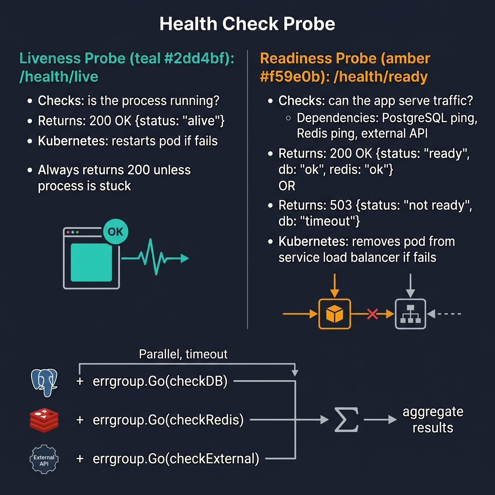
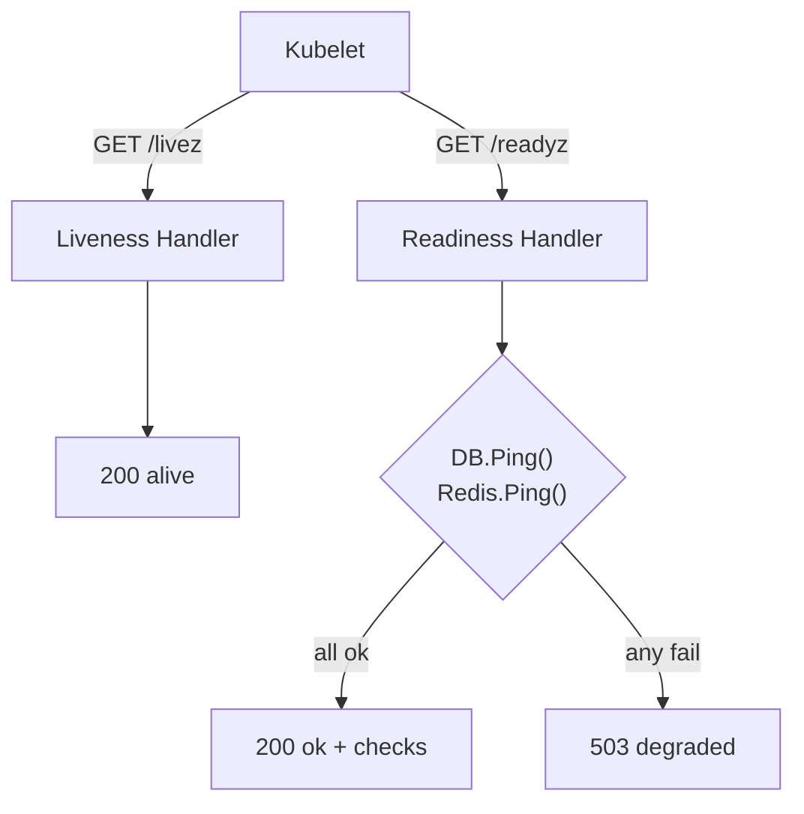

<!-- tags: golang -->
# 🏥 Health Check — NestJS Terminus → Gin Health Endpoints

> **Library**: Liveness and readiness probes via custom Gin handlers checking DB, Redis, and external services.

📅 Updated: 2026-04-19 · ⏱️ 8 min read

## 1. DEFINE

Kubernetes needs two probe types: **liveness** (is the process alive?) and **readiness** (can it accept traffic?). NestJS uses Terminus. In Gin, you write handler functions that ping each dependency and return a structured JSON response.

| NestJS                               | Gin / Go                          |
| ------------------------------------ | --------------------------------- |
| `TerminusModule`                     | Custom handler functions          |
| `@HealthCheck()` decorator           | `r.GET("/health", healthHandler)` |
| `HealthCheckService.check([])`       | Check each dependency manually    |
| `TypeOrmHealthIndicator.pingCheck()` | `db.Ping()`                       |
| `HttpHealthIndicator.pingCheck()`    | `http.Get(url)`                   |

### Key Invariants

- **Liveness must be instant.** Never put DB checks in liveness — a slow DB causes unnecessary pod restarts.
- **Readiness checks all dependencies.** Return 503 if any critical dependency (DB, Redis, queue) is unreachable.

## 2. VISUAL



*Figure: Liveness (/health/live) = process alive, K8s restarts if fails. Readiness (/health/ready) = can serve traffic, checks DB/Redis/external via errgroup, K8s removes from LB if fails.*



*Figure: Kubelet probes — liveness returns immediately; readiness checks all dependencies and returns 503 if any are down.*

### Probe Types

```text
/livez    → always 200 (process is alive)
/readyz   → 200 if DB + Redis + queue reachable, 503 otherwise
/health   → comprehensive status with per-dependency results
```

## 3. CODE

### Example 1: Basic — Simple Health Check

```go
    // ━━━━━━━━━━━━━━━━━━━━━━━━━━━━━━━━━━━━━━━━━
    // Simple health check: return 200 with uptime.
    // Mount at /health or /livez.
    // ━━━━━━━━━━━━━━━━━━━━━━━━━━━━━━━━━━━━━━━━━
    package main

    import (
        "net/http"
        "time"
        "github.com/gin-gonic/gin"
    )

    var startTime = time.Now()

    func main() {
        r := gin.Default()

        r.GET("/health", func(c *gin.Context) {
            c.JSON(http.StatusOK, gin.H{
                "status": "ok",
                "uptime": time.Since(startTime).String(),
            })
        })

        r.Run(":8080")
    }
```

### Example 2: Intermediate — Comprehensive Health Check

```go
    // ━━━━━━━━━━━━━━━━━━━━━━━━━━━━━━━━━━━━━━━━━
    // Comprehensive health checker: checks DB + Redis.
    // Returns per-dependency status with duration.
    // ━━━━━━━━━━━━━━━━━━━━━━━━━━━━━━━━━━━━━━━━━
    package health

    import (
        "context"
        "net/http"
        "time"
        "github.com/gin-gonic/gin"
        "github.com/redis/go-redis/v9"
        "gorm.io/gorm"
    )

    type Checker struct {
        db    *gorm.DB
        redis *redis.Client
    }

    type Status struct {
        Status    string            `json:"status"`
        Uptime    string            `json:"uptime"`
        Timestamp string            `json:"timestamp"`
        Checks    map[string]Check  `json:"checks"`
    }

    type Check struct {
        Status   string `json:"status"`
        Duration string `json:"duration,omitempty"`
        Error    string `json:"error,omitempty"`
    }

    func NewChecker(db *gorm.DB, rdb *redis.Client) *Checker {
        return &Checker{db: db, redis: rdb}
    }

    func (h *Checker) Handler(startTime time.Time) gin.HandlerFunc {
        return func(c *gin.Context) {
            ctx, cancel := context.WithTimeout(c.Request.Context(), 5*time.Second)
            defer cancel()

            checks := map[string]Check{
                "database": h.checkDB(ctx),
                "redis":    h.checkRedis(ctx),
            }

            overall := "ok"
            statusCode := http.StatusOK
            for _, check := range checks {
                if check.Status != "ok" {
                    overall = "degraded"
                    statusCode = http.StatusServiceUnavailable
                }
            }

            c.JSON(statusCode, Status{
                Status:    overall,
                Uptime:    time.Since(startTime).String(),
                Timestamp: time.Now().Format(time.RFC3339),
                Checks:    checks,
            })
        }
    }

    func (h *Checker) checkDB(ctx context.Context) Check {
        start := time.Now()
        sqlDB, err := h.db.DB()
        if err != nil {
            return Check{Status: "error", Error: err.Error()}
        }
        if err := sqlDB.PingContext(ctx); err != nil {
            return Check{Status: "error", Error: err.Error()}
        }
        return Check{Status: "ok", Duration: time.Since(start).String()}
    }

    func (h *Checker) checkRedis(ctx context.Context) Check {
        start := time.Now()
        if err := h.redis.Ping(ctx).Err(); err != nil {
            return Check{Status: "error", Error: err.Error()}
        }
        return Check{Status: "ok", Duration: time.Since(start).String()}
    }

    func (h *Checker) LivenessHandler() gin.HandlerFunc {
        return func(c *gin.Context) {
            c.JSON(http.StatusOK, gin.H{"status": "alive"})
        }
    }

    func (h *Checker) ReadinessHandler() gin.HandlerFunc {
        return h.Handler(time.Now()) 
    }
```

---

## 4. PITFALLS

| # | Severity | Defect | Impact | Fix |
| --- | --- | --- | --- | --- |
| 1 | 🔴 Fatal | Putting DB checks in the liveness probe | Slow DB query causes Kubelet to restart healthy pods | Use instant liveness; put dependency checks in readiness only |
| 2 | 🟡 Common | Health check without timeout on dependency pings | One slow dependency blocks the entire health response | Use `context.WithTimeout(ctx, 5*time.Second)` |

---

## 5. REF

| Resource | Link |
| --- | --- |
| Kubernetes Probes | [kubernetes.io/docs/tasks/configure-pod-container/configure-liveness-readiness-startup-probes/](https://kubernetes.io/docs/tasks/configure-pod-container/configure-liveness-readiness-startup-probes/) |

---

## 6. RECOMMEND

| Extension | When | Rationale | Resource |
| --- | --- | --- | --- |
| CQRS Pattern | When read and write loads diverge | Separate read/write models allow independent scaling | [./03-graceful-cqrs.md](./03-graceful-cqrs.md) |
