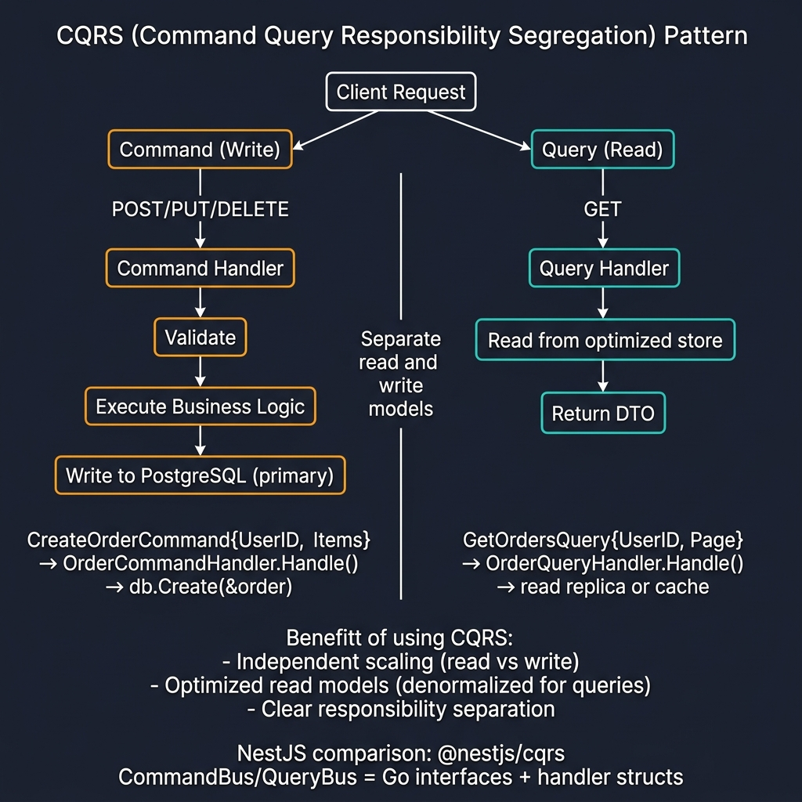
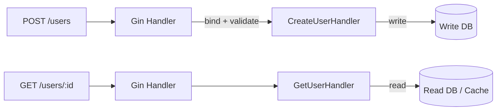

<!-- tags: golang -->
# 🔄 CQRS Pattern — NestJS @nestjs/cqrs → Go Command/Query Separation

> **Library**: Separate read and write models using Command/Query handlers with explicit data flow.

📅 Updated: 2026-04-19 · ⏱️ 12 min read

## 1. DEFINE

CQRS splits read and write operations into separate handler types. NestJS has `@nestjs/cqrs` with `CommandBus`/`QueryBus`. In Go, you implement this as plain structs with a `Handle(ctx, input)` method — no bus abstraction needed for most projects.

| NestJS                               | Gin / Go                                   |
| ------------------------------------ | ------------------------------------------ |
| `CommandBus.execute(command)`        | `handler.Handle(ctx, command)` direct call |
| `QueryBus.execute(query)`            | `handler.Handle(ctx, query)` direct call   |
| `@CommandHandler(CreateUserCommand)` | `type CreateUserHandler struct`            |
| `EventBus.publish(event)`            | Channel-based or interface event bus       |
| `@EventsHandler(UserCreatedEvent)`   | `type UserCreatedHandler struct`           |

### Key Invariants

- **Commands return minimal data.** A command handler returns only an ID or error — not the full entity.
- **Queries never mutate state.** If a query handler calls `db.Save()`, the separation is broken.

## 2. VISUAL



*Figure: CQRS — Command path (POST/PUT/DELETE → validate → write to primary DB) separated from Query path (GET → read from optimized store/cache). Independent scaling, clear responsibility.*



*Figure: CQRS boundary — POST routes go through command handlers (write path); GET routes go through query handlers (read path). Each path can scale independently.*

### Command vs Query

```text
Command: POST/PUT/DELETE → validates → mutates → returns ID or error
Query:   GET              → reads     → returns DTO (never mutates)
```

## 3. CODE

### Example 1: Basic — Command Handler

```go
    // ━━━━━━━━━━━━━━━━━━━━━━━━━━━━━━━━━━━━━━━━━
    // Command handler: validates input, hashes password,
    // creates user, returns minimal result (ID + email).
    // ━━━━━━━━━━━━━━━━━━━━━━━━━━━━━━━━━━━━━━━━━
    package commands

    import "context"

    type CreateUserCommand struct {
        Name     string
        Email    string
        Password string
    }

    type CreateUserHandler struct {
        userRepo UserRepository
        hasher   PasswordHasher
    }

    func NewCreateUserHandler(repo UserRepository, hasher PasswordHasher) *CreateUserHandler {
        return &CreateUserHandler{userRepo: repo, hasher: hasher}
    }

    type CreateUserResult struct {
        ID    string
        Email string
    }

    func (h *CreateUserHandler) Handle(ctx context.Context, cmd CreateUserCommand) (*CreateUserResult, error) {
        exists, _ := h.userRepo.ExistsByEmail(ctx, cmd.Email)
        if exists {
            return nil, ErrEmailTaken
        }

        hashed, err := h.hasher.Hash(cmd.Password)
        if err != nil {
            return nil, err
        }

        user := &User{Name: cmd.Name, Email: cmd.Email, Password: hashed}
        if err := h.userRepo.Create(ctx, user); err != nil {
            return nil, err
        }

        return &CreateUserResult{ID: user.ID, Email: user.Email}, nil
    }
```

### Example 2: Intermediate — Query Handler

```go
    // ━━━━━━━━━━━━━━━━━━━━━━━━━━━━━━━━━━━━━━━━━
    // Query handler: reads from read-optimized repo,
    // returns DTO directly — no mutation, no side effects.
    // ━━━━━━━━━━━━━━━━━━━━━━━━━━━━━━━━━━━━━━━━━
    package queries

    import "context"

    type GetUserQuery struct {
        ID string
    }

    type UserDTO struct {
        ID        string `json:"id"`
        Name      string `json:"name"`
        Email     string `json:"email"`
        CreatedAt string `json:"created_at"`
    }

    type GetUserHandler struct {
        readRepo UserReadRepository 
    }

    func NewGetUserHandler(repo UserReadRepository) *GetUserHandler {
        return &GetUserHandler{readRepo: repo}
    }

    func (h *GetUserHandler) Handle(ctx context.Context, q GetUserQuery) (*UserDTO, error) {
        return h.readRepo.FindByID(ctx, q.ID)
    }
```

### Example 3: Advanced — Wiring CQRS in Gin Handler

```go
    // ━━━━━━━━━━━━━━━━━━━━━━━━━━━━━━━━━━━━━━━━━
    // Wiring CQRS: Gin handler delegates to command/query
    // handlers. Handler never contains business logic.
    // ━━━━━━━━━━━━━━━━━━━━━━━━━━━━━━━━━━━━━━━━━
    package http

    import (
        "net/http"
        "myapp/internal/application/commands"
        "myapp/internal/application/queries"
        "github.com/gin-gonic/gin"
    )

    type UserHandler struct {
        createUser *commands.CreateUserHandler
        getUser    *queries.GetUserHandler
    }

    func NewUserHandler(
        createUser *commands.CreateUserHandler,
        getUser *queries.GetUserHandler,
    ) *UserHandler {
        return &UserHandler{createUser: createUser, getUser: getUser}
    }

    func (h *UserHandler) Create(c *gin.Context) {
        var req struct {
            Name     string `json:"name" binding:"required"`
            Email    string `json:"email" binding:"required,email"`
            Password string `json:"password" binding:"required,min=8"`
        }
        if err := c.ShouldBindJSON(&req); err != nil {
            c.JSON(http.StatusBadRequest, gin.H{"error": err.Error()})
            return
        }

        result, err := h.createUser.Handle(c.Request.Context(), commands.CreateUserCommand{
            Name:     req.Name,
            Email:    req.Email,
            Password: req.Password,
        })
        if err != nil {
            c.JSON(http.StatusInternalServerError, gin.H{"error": err.Error()})
            return
        }

        c.JSON(http.StatusCreated, gin.H{"data": result})
    }

    func (h *UserHandler) Get(c *gin.Context) {
        result, err := h.getUser.Handle(c.Request.Context(), queries.GetUserQuery{
            ID: c.Param("id"),
        })
        if err != nil {
            c.JSON(http.StatusNotFound, gin.H{"error": err.Error()})
            return
        }

        c.JSON(http.StatusOK, gin.H{"data": result})
    }
```

---

## 4. PITFALLS

| # | Severity | Defect | Impact | Fix |
| --- | --- | --- | --- | --- |
| 1 | 🔴 Fatal | Query handler calls `db.Save()` or `db.Create()` | Breaks read/write separation; read replicas see stale data | Queries must only call read-only repository methods |
| 2 | 🟡 Common | Using CQRS for simple CRUD with no read/write divergence | Adds handler boilerplate without benefit | Only adopt CQRS when read and write models genuinely differ |

---

## 5. REF

| Resource | Link |
| --- | --- |
| Fowler CQRS | [martinfowler.com/bliki/CQRS.html](https://martinfowler.com/bliki/CQRS.html) |

---

## 6. RECOMMEND

| Extension | When | Rationale | Resource |
| --- | --- | --- | --- |
| Database/ORM | When you need to persist CQRS entities | Repository pattern integrates cleanly with command/query handlers | [../techniques/02-database-orm.md](../techniques/02-database-orm.md) |
