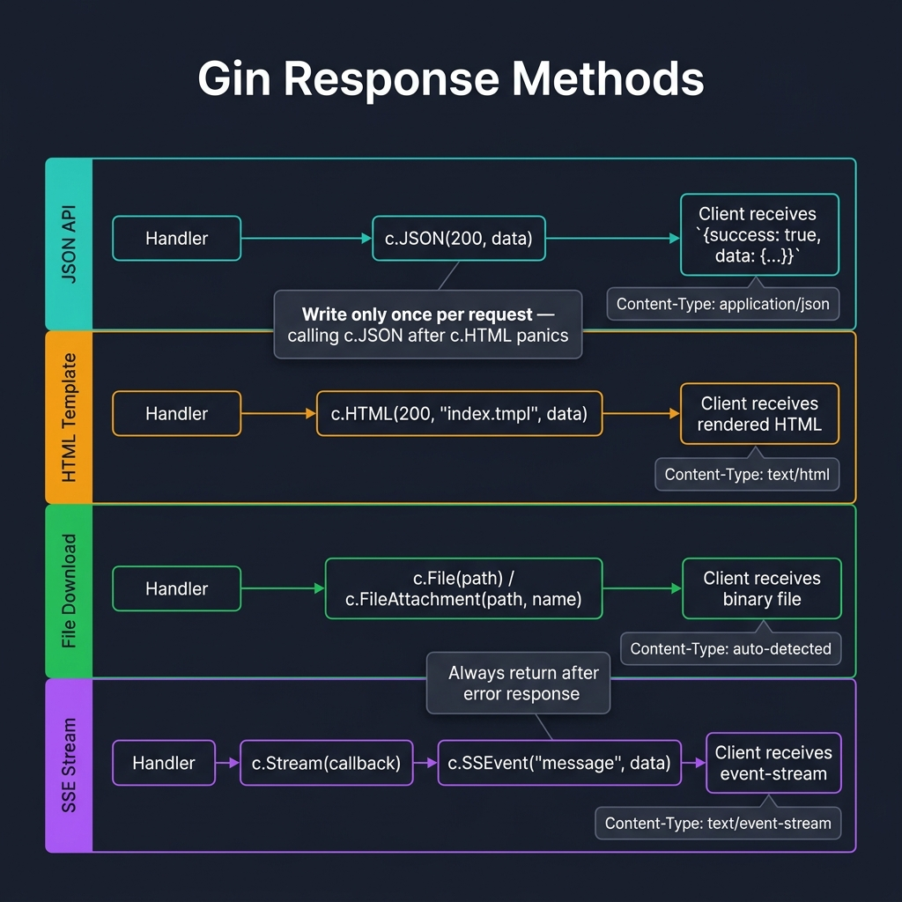
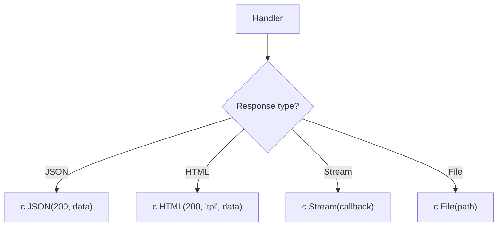

<!-- tags: golang -->
# 📤 Response — JSON, HTML, Streaming, SSE

> **Library**: Gin response methods — `c.JSON`, `c.HTML`, `c.File`, `c.Stream` — and building a consistent API envelope.

📅 Updated: 2026-04-19 · ⏱️ 12 min read

## 1. DEFINE

Gin provides typed response methods that set `Content-Type` and serialize data in one call. Wrap them in a shared `APIResponse` envelope so every endpoint returns `{success, data, error}`.

| Method                         | Content-Type                 | Use case         |
| ------------------------------ | ---------------------------- | ---------------- |
| `c.JSON(code, obj)`            | `application/json`           | REST API         |
| `c.String(code, fmt, args)`    | `text/plain`                 | Simple text      |
| `c.HTML(code, name, data)`     | `text/html`                  | Templates        |
| `c.File(path)`                 | Auto-detect                  | Download/preview |

### Key Invariants

- **Write only once per request.** Calling `c.JSON` after `c.HTML` panics with "headers already written."
- **Always `return` after an error response.** Otherwise the handler writes a second body.

## 2. VISUAL



*Figure: Four response lanes — JSON API (c.JSON), HTML Template (c.HTML), File Download (c.File/c.FileAttachment), SSE Stream (c.Stream + c.SSEvent). Write only once per request.*



*Figure: Response shapes — JSON for APIs, HTML for templates, Stream for real-time, File for downloads.*

### Response Decision

```text
Structured API data?        → c.JSON(status, envelope)
Server-rendered HTML?       → c.HTML(status, template, data)
File download/preview?      → c.File(path) / c.FileAttachment(path, name)
Real-time server push?      → c.Stream() + c.SSEvent()
```

## 3. CODE

### Example 1: Basic — JSON Envelopes

```go
    // ━━━━━━━━━━━━━━━━━━━━━━━━━━━━━━━━━━━━━━━━━
    // Unified envelope: {success, data, error}.
    // RespondOK/RespondError ensure every endpoint matches this shape.
    // ━━━━━━━━━━━━━━━━━━━━━━━━━━━━━━━━━━━━━━━━━
    package main

    import (
        "net/http"
        "github.com/gin-gonic/gin"
    )

    type APIResponse struct {
        Success bool        `json:"success"`
        Data    interface{} `json:"data,omitempty"`
        Error   *APIError   `json:"error,omitempty"`
    }

    type APIError struct {
        Code    string `json:"code"`
        Message string `json:"message"`
    }

    func RespondOK(c *gin.Context, data interface{}) {
        c.JSON(http.StatusOK, APIResponse{
            Success: true,
            Data:    data,
        })
    }

    func RespondError(c *gin.Context, status int, code, message string) {
        c.JSON(status, APIResponse{
            Success: false,
            Error: &APIError{
                Code:    code,
                Message: message,
            },
        })
    }

    func main() {
        r := gin.Default()

        r.GET("/users/:id", func(c *gin.Context) {
            user := gin.H{"id": 1, "name": "Alice"}
            RespondOK(c, user)
        })

        r.GET("/not-found", func(c *gin.Context) {
            RespondError(c, 404, "USER_NOT_FOUND", "user does not exist")
        })

        r.Run(":8080")
    }
```

### Example 2: Intermediate — File Responses

```go
    // ━━━━━━━━━━━━━━━━━━━━━━━━━━━━━━━━━━━━━━━━━
    // c.File serves inline; c.FileAttachment forces download.
    // c.Data writes raw bytes with a custom Content-Type.
    // ━━━━━━━━━━━━━━━━━━━━━━━━━━━━━━━━━━━━━━━━━
    func setupResponses(r *gin.Engine) {
        
        r.GET("/preview/:filename", func(c *gin.Context) {
            filename := c.Param("filename")
            filepath := path.Join("uploads", filename)
            c.File(filepath)
        })

        r.GET("/download/:filename", func(c *gin.Context) {
            filename := c.Param("filename")
            filepath := path.Join("uploads", filename)
            c.FileAttachment(filepath, filename)
        })

        r.GET("/report/csv", func(c *gin.Context) {
            data := "id,name\n1,Alice"
            c.Data(http.StatusOK, "text/csv", []byte(data))
        })
    }
```

### Example 3: Advanced — Live Streaming

```go
    // ━━━━━━━━━━━━━━━━━━━━━━━━━━━━━━━━━━━━━━━━━
    // SSE via c.Stream + c.SSEvent. Ping keeps connection alive.
    // Context.Done() detects client disconnect.
    // ━━━━━━━━━━━━━━━━━━━━━━━━━━━━━━━━━━━━━━━━━
    func sseHandler(c *gin.Context) {
        c.Header("Content-Type", "text/event-stream")
        c.Header("Cache-Control", "no-cache")
        c.Header("Connection", "keep-alive")

        messageChan := make(chan string)

        c.Stream(func(w io.Writer) bool {
            select {
            case msg := <-messageChan:
                c.SSEvent("message", msg)
                return true  
            case <-c.Request.Context().Done():
                return false  
            case <-time.After(30 * time.Second):
                c.SSEvent("ping", gin.H{"status": "alive"})
                return true
            }
        })
    }
```

---

## 4. PITFALLS

| # | Severity | Defect | Impact | Fix |
| --- | --- | --- | --- | --- |
| 1 | 🔴 Fatal | Calling `c.JSON()` twice in same handler | Panic: "headers already written" | Always `return` after error response |
| 2 | 🟡 Common | Using `c.File()` with unsanitized user input | Path traversal attack | Use `filepath.Clean` and restrict to upload dir |

---

## 5. REF

| Resource | Link |
| --- | --- |
| Gin Rendering | [gin-gonic.com/en/docs](https://gin-gonic.com/en/docs/) |

---

## 6. RECOMMEND

| Extension | When | Rationale | Resource |
| --- | --- | --- | --- |
| SSE & WebSocket | When you need real-time bidirectional communication | SSE for server push, WebSocket for full-duplex | [./02-sse-websocket.md](./02-sse-websocket.md) |
