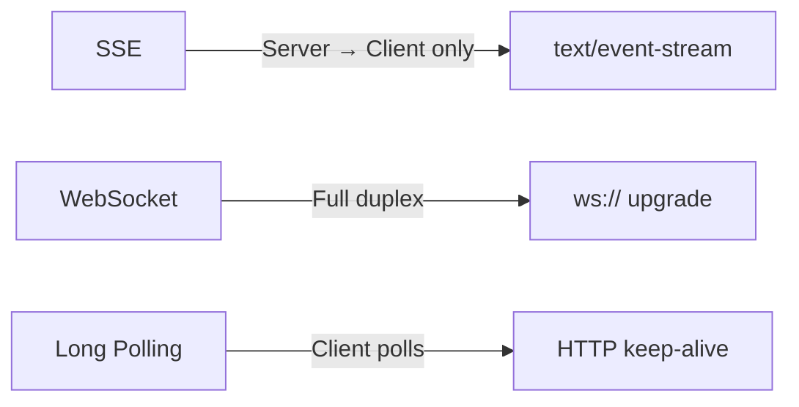

<!-- tags: golang -->
# 📡 SSE & WebSocket — NestJS Events → Gin Real-time

> **Library**: Server-Sent Events via `c.Stream`/`c.SSEvent`, and full-duplex WebSocket via `gorilla/websocket`.

📅 Updated: 2026-04-19 · ⏱️ 14 min read

## 1. DEFINE

SSE is one-way (server → client) over HTTP/1.1. WebSocket is bidirectional over a persistent TCP connection. Gin supports SSE natively via `c.Stream()`. For WebSocket, use `gorilla/websocket` to upgrade the HTTP connection.

| NestJS                              | Gin Equivalent                           |
| ----------------------------------- | ---------------------------------------- |
| `@Sse('events')`                    | `c.Stream()` + `c.SSEvent()`             |
| `@WebSocketGateway()`               | `gorilla/websocket.Upgrader`             |
| `@SubscribeMessage('chat')`         | Manual `conn.ReadMessage()` loop         |
| `server.emit('event', data)`        | `hub.Broadcast(msg)` to all clients      |

### Key Invariants

- **Always `defer conn.Close()`** after WebSocket upgrade. Leaked connections exhaust file descriptors.
- **Use `sync.RWMutex` for the client map.** Concurrent register/unregister/broadcast without a lock causes data races.

## 2. VISUAL


*Figure: SSE = one-way server push (c.Stream + c.SSEvent), WebSocket = full-duplex persistent TCP (gorilla/websocket). Hub pattern manages concurrent clients with sync.RWMutex for thread-safe register/unregister/broadcast.*



*Figure: SSE = one-way server push, WebSocket = full duplex, Long Polling = client-driven fallback.*

### Transport Comparison

```text
SSE:       Server ──push──▶ Client   (one-way, auto-reconnect, text/event-stream)
WebSocket: Server ◀─────▶ Client   (two-way, persistent TCP, binary or text)
```

## 3. CODE

### Example 1: Basic — Server-Sent Events

```go
    // ━━━━━━━━━━━━━━━━━━━━━━━━━━━━━━━━━━━━━━━━━
    // SSE: set text/event-stream headers, then loop with c.Stream.
    // c.SSEvent writes "event: message\ndata: {json}\n\n".
    // ━━━━━━━━━━━━━━━━━━━━━━━━━━━━━━━━━━━━━━━━━
    package main

    import (
        "io"
        "time"
        "github.com/gin-gonic/gin"
    )

    func main() {
        r := gin.Default()

        r.GET("/events", func(c *gin.Context) {
            c.Header("Content-Type", "text/event-stream")
            c.Header("Cache-Control", "no-cache")
            c.Header("Connection", "keep-alive")

            c.Stream(func(w io.Writer) bool {
                c.SSEvent("message", gin.H{
                    "time": time.Now().Format(time.RFC3339),
                    "data": "hello",
                })
                time.Sleep(1 * time.Second)
                return true 
            })
        })

        r.Run(":8080")
    }
```

### Example 2: Intermediate — WebSocket Upgrades

```go
    // ━━━━━━━━━━━━━━━━━━━━━━━━━━━━━━━━━━━━━━━━━
    // WebSocket: upgrade HTTP → WS, Hub manages client map.
    // ReadMessage loop per client; Broadcast writes to all.
    // ━━━━━━━━━━━━━━━━━━━━━━━━━━━━━━━━━━━━━━━━━
    package main

    import (
        "log/slog"
        "net/http"
        "sync"
        "github.com/gin-gonic/gin"
        "github.com/gorilla/websocket"
    )

    var upgrader = websocket.Upgrader{
        CheckOrigin: func(r *http.Request) bool { return true }, 
    }

    type Hub struct {
        mu      sync.RWMutex
        clients map[*websocket.Conn]bool
    }

    func NewHub() *Hub {
        return &Hub{clients: make(map[*websocket.Conn]bool)}
    }

    func (h *Hub) Register(conn *websocket.Conn) {
        h.mu.Lock()
        h.clients[conn] = true
        h.mu.Unlock()
    }

    func (h *Hub) Unregister(conn *websocket.Conn) {
        h.mu.Lock()
        delete(h.clients, conn)
        h.mu.Unlock()
    }

    func (h *Hub) Broadcast(msg []byte) {
        h.mu.RLock()
        defer h.mu.RUnlock()
        for conn := range h.clients {
            conn.WriteMessage(websocket.TextMessage, msg)
        }
    }

    func main() {
        r := gin.Default()
        hub := NewHub()

        r.GET("/ws", func(c *gin.Context) {
            conn, err := upgrader.Upgrade(c.Writer, c.Request, nil)
            if err != nil {
                return
            }
            defer conn.Close()

            hub.Register(conn)
            defer hub.Unregister(conn)

            for {
                _, msg, err := conn.ReadMessage()
                if err != nil {
                    break
                }
                hub.Broadcast(msg) 
            }
        })

        r.Run(":8080")
    }
```

### Example 3: Advanced — Room Segmenting

```go
    // ━━━━━━━━━━━━━━━━━━━━━━━━━━━━━━━━━━━━━━━━━
    // Room-based WebSocket: clients join rooms, broadcast targets one room.
    // ━━━━━━━━━━━━━━━━━━━━━━━━━━━━━━━━━━━━━━━━━
    type RoomHub struct {
        mu    sync.RWMutex
        rooms map[string]map[*websocket.Conn]bool
    }

    func NewRoomHub() *RoomHub {
        return &RoomHub{rooms: make(map[string]map[*websocket.Conn]bool)}
    }

    func (h *RoomHub) EmitToRoom(room string, data []byte) {
        h.mu.RLock()
        defer h.mu.RUnlock()
        
        for conn := range h.rooms[room] {
            conn.WriteMessage(websocket.TextMessage, data)
        }
    }
```

---

## 4. PITFALLS

| # | Severity | Defect | Impact | Fix |
| --- | --- | --- | --- | --- |
| 1 | 🔴 Fatal | Missing `defer conn.Close()` after WebSocket upgrade | Connection leaks exhaust file descriptors | Always `defer conn.Close()` + `defer hub.Unregister(conn)` |
| 2 | 🔴 Fatal | `CheckOrigin` returning `true` for all origins in production | Any domain can open WebSocket connections to your server | Validate origin against an allowlist |

---

## 5. REF

| Resource | Link |
| --- | --- |
| gorilla/websocket | [pkg.go.dev/github.com/gorilla/websocket](https://pkg.go.dev/github.com/gorilla/websocket) |

---

## 6. RECOMMEND

| Extension | When | Rationale | Resource |
| --- | --- | --- | --- |
| JWT Auth | When WebSocket connections need authentication | Validate JWT before or after upgrade to prevent unauthorized access | [../security/01-authentication-jwt.md](../security/01-authentication-jwt.md) |
