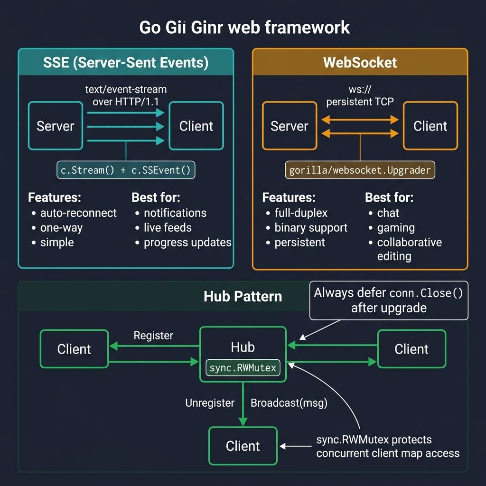

<!-- tags: golang --> # 📡 SSE & WebSocket — Sự kiện NestJS → Gin Real-time

> **Thư viện**: Sự kiện do máy chủ gửi qua `c.Stream` / `c.SSEvent` và WebSocket song công hoàn toàn qua `gorilla/websocket` .

📅 Cập nhật: 2026-04-19 · ⏱️ 14 phút đọc

## 1. ĐỊNH NGHĨA

SSE là một chiều (máy chủ → máy khách) qua HTTP/1.1. WebSocket hoạt động hai chiều qua kết nối TCP liên tục. Gin hỗ trợ SSE nguyên bản thông qua `c.Stream()` . Đối với WebSocket, hãy sử dụng `gorilla/websocket` để nâng cấp kết nối HTTP.

| NestJS | Tương đương Gin |
| ----------------------------------- | ---------------------------------------- |
| `@Sse('events')` | `c.Stream()` + `c.SSEvent()` |
| `@WebSocketGateway()` | `gorilla/websocket.Upgrader` |
| `@SubscribeMessage('chat')` | Vòng lặp `conn.ReadMessage()` thủ công |
| `server.emit('event', data)` | `hub.Broadcast(msg)` tới tất cả khách hàng |

### Bất biến chính

- **Luôn luôn `defer conn.Close()` ** sau khi nâng cấp WebSocket. Bộ mô tả tập tin xả kết nối bị rò rỉ.
- **Sử dụng `sync.RWMutex` cho bản đồ khách hàng.** Đăng ký/hủy đăng ký/phát sóng đồng thời mà không khóa sẽ gây ra xung đột dữ liệu.

## 2. HÌNH ẢNH  *Hình: SSE = đẩy máy chủ một chiều (c.Stream + c.SSEvent), WebSocket = TCP liên tục song công hoàn toàn (gorilla/websocket). Mẫu Hub quản lý các máy khách đồng thời với sync.RWMutex để đăng ký/hủy đăng ký/phát sóng an toàn theo luồng.*```mermaid
flowchart LR
    A["SSE"] -->|"Server → Client only"| B["text/event-stream"]
    C["WebSocket"] -->|"Full duplex"| D["ws:// upgrade"]
    E["Long Polling"] -->|"Client polls"| F["HTTP keep-alive"]
```*Hình: SSE = đẩy máy chủ một chiều, WebSocket = song công hoàn toàn, Bỏ phiếu dài = dự phòng do khách hàng điều khiển.*

### So sánh vận tải```text
SSE:       Server ──push──▶ Client   (one-way, auto-reconnect, text/event-stream)
WebSocket: Server ◀─────▶ Client   (two-way, persistent TCP, binary or text)
```## 3. MÃ

### Ví dụ 1: Cơ bản — Sự kiện do máy chủ gửi```go
    // ━━━━━━━━━━━━━━━━━━━━━━━━━━━━━━━━━━━━━━━━━
    // SSE: set text/event-stream headers, then loop with c.Stream.
    // c.SSEvent writes "event: message\ndata: {json}\n\n".
    // ━━━━━━━━━━━━━━━━━━━━━━━━━━━━━━━━━━━━━━━━━
    package main

    import (
        "io"
        "time"
        "github.com/gin-gonic/gin"
    )

    func main() {
        r := gin.Default()

        r.GET("/events", func(c *gin.Context) {
            c.Header("Content-Type", "text/event-stream")
            c.Header("Cache-Control", "no-cache")
            c.Header("Connection", "keep-alive")

            c.Stream(func(w io.Writer) bool {
                c.SSEvent("message", gin.H{
                    "time": time.Now().Format(time.RFC3339),
                    "data": "hello",
                })
                time.Sleep(1 * time.Second)
                return true 
            })
        })

        r.Run(":8080")
    }
```### Ví dụ 2: Trung cấp — Nâng cấp WebSocket```go
    // ━━━━━━━━━━━━━━━━━━━━━━━━━━━━━━━━━━━━━━━━━
    // WebSocket: upgrade HTTP → WS, Hub manages client map.
    // ReadMessage loop per client; Broadcast writes to all.
    // ━━━━━━━━━━━━━━━━━━━━━━━━━━━━━━━━━━━━━━━━━
    package main

    import (
        "log/slog"
        "net/http"
        "sync"
        "github.com/gin-gonic/gin"
        "github.com/gorilla/websocket"
    )

    var upgrader = websocket.Upgrader{
        CheckOrigin: func(r *http.Request) bool { return true }, 
    }

    type Hub struct {
        mu      sync.RWMutex
        clients map[*websocket.Conn]bool
    }

    func NewHub() *Hub {
        return &Hub{clients: make(map[*websocket.Conn]bool)}
    }

    func (h *Hub) Register(conn *websocket.Conn) {
        h.mu.Lock()
        h.clients[conn] = true
        h.mu.Unlock()
    }

    func (h *Hub) Unregister(conn *websocket.Conn) {
        h.mu.Lock()
        delete(h.clients, conn)
        h.mu.Unlock()
    }

    func (h *Hub) Broadcast(msg []byte) {
        h.mu.RLock()
        defer h.mu.RUnlock()
        for conn := range h.clients {
            conn.WriteMessage(websocket.TextMessage, msg)
        }
    }

    func main() {
        r := gin.Default()
        hub := NewHub()

        r.GET("/ws", func(c *gin.Context) {
            conn, err := upgrader.Upgrade(c.Writer, c.Request, nil)
            if err != nil {
                return
            }
            defer conn.Close()

            hub.Register(conn)
            defer hub.Unregister(conn)

            for {
                _, msg, err := conn.ReadMessage()
                if err != nil {
                    break
                }
                hub.Broadcast(msg) 
            }
        })

        r.Run(":8080")
    }
```### Ví dụ 3: Nâng cao — Phân chia phòng```go
    // ━━━━━━━━━━━━━━━━━━━━━━━━━━━━━━━━━━━━━━━━━
    // Room-based WebSocket: clients join rooms, broadcast targets one room.
    // ━━━━━━━━━━━━━━━━━━━━━━━━━━━━━━━━━━━━━━━━━
    type RoomHub struct {
        mu    sync.RWMutex
        rooms map[string]map[*websocket.Conn]bool
    }

    func NewRoomHub() *RoomHub {
        return &RoomHub{rooms: make(map[string]map[*websocket.Conn]bool)}
    }

    func (h *RoomHub) EmitToRoom(room string, data []byte) {
        h.mu.RLock()
        defer h.mu.RUnlock()
        
        for conn := range h.rooms[room] {
            conn.WriteMessage(websocket.TextMessage, data)
        }
    }
```---

## 4. Cạm bẫy

| # | Mức độ nghiêm trọng | Khiếm khuyết | Tác động | Sửa chữa |
| --- | --- | --- | --- | --- |
| 1 | 🔴 Gây tử vong | Thiếu `defer conn.Close()` sau khi nâng cấp WebSocket | Bộ mô tả tập tin xả rò rỉ kết nối | Luôn `defer conn.Close()` + `defer hub.Unregister(conn)` |
| 2 | 🔴 Gây tử vong | `CheckOrigin` trả lại `true` cho tất cả nguồn gốc trong sản xuất | Bất kỳ miền nào cũng có thể mở kết nối WebSocket tới máy chủ của bạn | Xác thực nguồn gốc theo danh sách cho phép |

---

## 5. GIỚI THIỆU

| Tài nguyên | Liên kết |
| --- | --- |
| khỉ đột/websocket | [pkg.go.dev/github.com/gorilla/websocket](https://pkg.go.dev/github.com/gorilla/websocket) |

---

## 6. KHUYẾN NGHỊ

| Gia hạn | Khi nào | Cơ sở lý luận | Tài nguyên |
| --- | --- | --- | --- |
| Xác thực JWT | Khi kết nối WebSocket cần xác thực | Xác thực JWT trước hoặc sau khi nâng cấp để ngăn chặn truy cập trái phép | [../security/01-authentication-jwt.md](../security/01-authentication-jwt.md) |