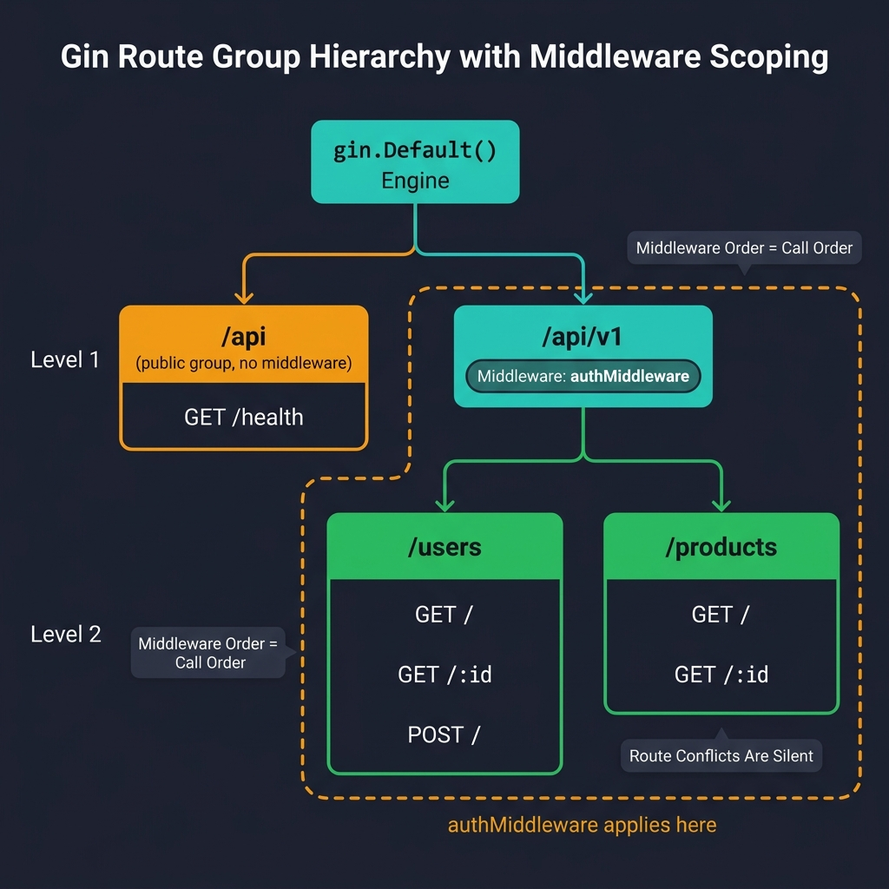
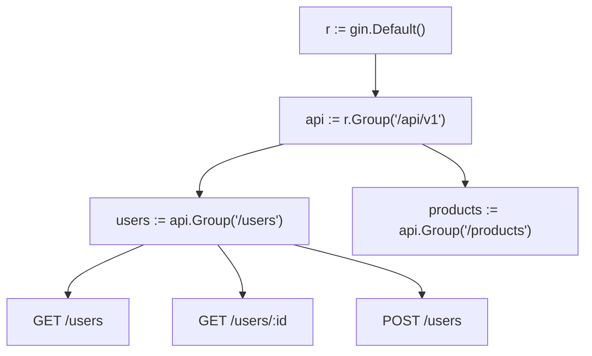

<!-- tags: golang -->
# 🛤️ Routing — Groups, Params, Versioning

> **Library**: Organize routes with `RouterGroup`, extract path/query params, and apply middleware to specific groups.

📅 Updated: 2026-04-19 · ⏱️ 12 min read

## 1. DEFINE

Gin’s `RouterGroup` lets you prefix routes, attach middleware to subsets, and nest groups for resource hierarchies. Without groups, every route repeats its prefix and middleware attachment — a maintenance nightmare in APIs with 50+ endpoints.

| Feature        | Role                                     | Syntax                            |
| -------------- | ---------------------------------------- | --------------------------------- |
| **Prefix**     | Shared URL prefix for a group of routes  | `r.Group("/api/v1")`              |
| **Middleware** | Runs on every route in the group         | `r.Group("/", authMiddleware)`    |
| **Nesting**    | Sub-groups for resource hierarchies      | `v1.Group("/users")`              |
| **Static**     | Serves files from a local directory      | `r.Static("/assets", "./public")` |

### Key Invariants

- **Middleware order is call order.** `v1.Use(A, B)` runs A before B on every request in v1.
- **Route conflicts are silent.** Two groups registering `GET /api/users` will shadow each other without error.

## 2. VISUAL



*Figure: Route group hierarchy — Engine branches into public `/api` (no middleware) and protected `/api/v1` (with authMiddleware). Sub-groups `/users` and `/products` inherit the middleware scope.*



*Figure: Route hierarchy — Engine → `/api/v1` group → `/users` sub-group with parameterized `:id` route.*

### Route Resolution

```text
GET /api/health          → public group (no middleware)
GET /api/v1/users        → v1 group → authMiddleware → listUsers handler
GET /api/v1/users/:id    → v1 group → authMiddleware → getUser handler
POST /api/v1/users       → v1 group → authMiddleware → createUser handler
```

## 3. CODE

### Example 1: Basic — Endpoint Versioning

```go
    // ━━━━━━━━━━━━━━━━━━━━━━━━━━━━━━━━━━━━━━━━━
    // Public routes need no auth. Protected routes (v1) share authMiddleware.
    // c.Param("id") extracts :id from the path; c.DefaultQuery provides fallbacks.
    // ━━━━━━━━━━━━━━━━━━━━━━━━━━━━━━━━━━━━━━━━━
    package main

    import (
        "net/http"
        "github.com/gin-gonic/gin"
    )

    func main() {
        r := gin.Default()

        public := r.Group("/api")
        {
            public.GET("/health", healthHandler)
        }

        v1 := r.Group("/api/v1")
        v1.Use(authMiddleware())  
        {
            users := v1.Group("/users")
            {
                users.GET("", listUsers)        
                users.GET("/:id", getUser)      
                users.POST("", createUser)      
            }
        }

        r.Run(":8080")
    }

    func healthHandler(c *gin.Context) {
        c.JSON(http.StatusOK, gin.H{"status": "ok"})
    }

    func listUsers(c *gin.Context) {
        page := c.DefaultQuery("page", "1")
        limit := c.DefaultQuery("limit", "20")

        c.JSON(http.StatusOK, gin.H{
            "page":  page,
            "limit": limit,
            "users": []gin.H{},
        })
    }

    func getUser(c *gin.Context) {
        id := c.Param("id")
        c.JSON(http.StatusOK, gin.H{"id": id, "name": "Alice"})
    }

    func createUser(c *gin.Context) { c.JSON(201, gin.H{"message": "created"}) }

    func authMiddleware() gin.HandlerFunc {
        return func(c *gin.Context) {
            token := c.GetHeader("Authorization")
            if token == "" {
                c.AbortWithStatusJSON(401, gin.H{"error": "unauthorized"})
                return
            }
            c.Next()
        }
    }
```

### Example 2: Intermediate — Modular Route Registration

```go
    // ━━━━━━━━━━━━━━━━━━━━━━━━━━━━━━━━━━━━━━━━━
    // Each domain package owns a RegisterRoutes function.
    // Setup() wires public vs protected groups with their middleware.
    // ━━━━━━━━━━━━━━━━━━━━━━━━━━━━━━━━━━━━━━━━━
    package router

    import "github.com/gin-gonic/gin"

    func Setup(r *gin.Engine) {
        public := r.Group("/api")
        RegisterAuthRoutes(public)

        protected := r.Group("/api")
        protected.Use(AuthMiddleware())
        RegisterUserRoutes(protected)
    }

    func RegisterUserRoutes(rg *gin.RouterGroup) {
        users := rg.Group("/users")
        handler := NewUserHandler()  
        {
            users.GET("", handler.List)
            users.GET("/:id", handler.Get)
            users.POST("", handler.Create)
        }
    }
```

---

## 4. PITFALLS

| # | Severity | Defect | Impact | Fix |
| --- | --- | --- | --- | --- |
| 1 | 🔴 Fatal | Registering duplicate paths across groups (e.g., two `GET /api/users`) | Second handler silently shadows the first | Audit all groups for path conflicts; use `gin.DebugPrintRouteFunc` |
| 2 | 🟡 Common | Applying auth middleware at the engine level instead of the group level | Health check and public endpoints also require tokens | Attach middleware to specific groups, not the engine |

---

## 5. REF

| Resource | Link |
| --- | --- |
| Gin Router | [gin-gonic.com/en/docs](https://gin-gonic.com/en/docs/) |
| HttpRouter | [github.com/julienschmidt/httprouter](https://github.com/julienschmidt/httprouter) |

---

## 6. RECOMMEND

| Extension | When | Rationale | Resource |
| --- | --- | --- | --- |
| Versioning & Redirects | When you need to deprecate old API versions | Covers redirect rules and version negotiation patterns | [./02-versioning-redirect.md](./02-versioning-redirect.md) |
