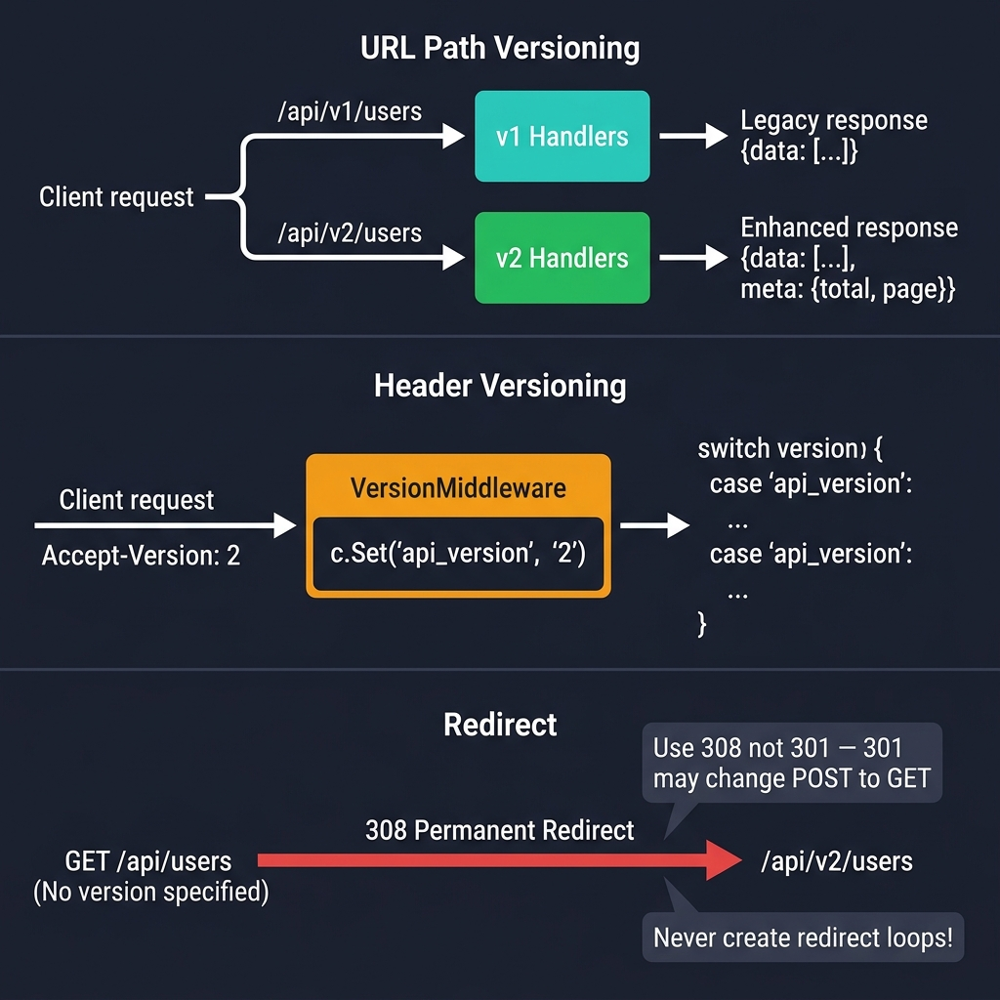

<!-- tags: golang --> # 🔀 Lập phiên bản & Chuyển hướng - Phiên bản NestJS → Tuyến đường Gin

> **Thư viện**: Lập phiên bản API thông qua các nhóm tuyến, đàm phán phiên bản dựa trên tiêu đề và chiến lược chuyển hướng cho các điểm cuối không được dùng nữa.

📅 Đã cập nhật: 19-04-2026 · ⏱️ 10 phút đọc

## 1. ĐỊNH NGHĨA

Các thay đổi API vi phạm sẽ phá hủy các ứng dụng khách hiện có. Gin không có phiên bản tích hợp sẵn - bạn triển khai nó thông qua các nhóm tuyến đường ( `/v1/` , `/v2/` ), phần mềm trung gian tiêu đề ( `Accept-Version` ) hoặc quy tắc chuyển hướng. Bài viết này bao gồm cả ba mẫu.

| NestJS | Gin |
| -------------------------------- | ---------------------------------------- |
| `app.enableVersioning()` | Nhóm tuyến: `r.Group("/v1")` |
| `@Version('1')` | Trình xử lý được gắn vào một nhóm được phiên bản |
| `res.redirect('/new-path')` | `c.Redirect(301, "/new")` |
| `app.use(VersioningType.HEADER)` | Đọc phần mềm trung gian tùy chỉnh `Accept-Version` |

### Bất biến chính

- **Sử dụng 308 (Chuyển hướng vĩnh viễn), không phải 301, cho các chuyển hướng API.** 301 có thể thay đổi POST thành GET trong một số ứng dụng khách.
- **Không bao giờ tạo vòng lặp chuyển hướng.** `/v1/users` → `/v2/users` → `/v1/users` làm hỏng máy khách.

## 2. HÌNH ẢNH  *Hình: Ba chiến lược tạo phiên bản — đường dẫn URL ( `/v1/` , `/v2/` ), phần mềm trung gian dựa trên tiêu đề ( `Accept-Version` ) và chuyển hướng (Chuyển hướng vĩnh viễn 308 từ không phiên bản sang mới nhất).*```mermaid
flowchart LR
    A["Client"] --> B{"/api/v1 or /api/v2?"}
    B -->|v1| C["v1 Group handlers"]
    B -->|v2| D["v2 Group handlers"]
    E["GET /old-path"] -->|"301 Redirect"| F["GET /new-path"]
```*Hình: Lập phiên bản đường dẫn URL — các nhóm tuyến đường riêng biệt cho mỗi phiên bản. Chuyển hướng phần mềm trung gian ánh xạ các đường dẫn cũ sang đường dẫn mới.*

### Luồng phân giải phiên bản```text
Client sends GET /api/v1/users
    → v1 group matches → listUsersV1 handler (legacy response)

Client sends GET /api/v2/users
    → v2 group matches → listUsersV2 handler (response with pagination meta)

Client sends GET /api/users (no version)
    → redirect rule → 308 to /api/v2/users
```## 3. MÃ

### Ví dụ 1: Cơ bản — Trình xử lý đường dẫn cụ thể```go
    // ━━━━━━━━━━━━━━━━━━━━━━━━━━━━━━━━━━━━━━━━━
    // Path-based versioning: /api/v1 and /api/v2 are separate groups.
    // v2 adds pagination metadata to the response.
    // ━━━━━━━━━━━━━━━━━━━━━━━━━━━━━━━━━━━━━━━━━
    package main

    import (
        "net/http"
        "github.com/gin-gonic/gin"
    )

    type User struct {
        ID   string `json:"id"`
        Name string `json:"name"`
    }

    func listUsersV1(c *gin.Context) {
        c.JSON(http.StatusOK, gin.H{
            "version": "v1",
            "data":    []User{{ID: "1", Name: "Alice"}},
        })
    }

    func listUsersV2(c *gin.Context) {
        c.JSON(http.StatusOK, gin.H{
            "version": "v2",
            "data":    []User{{ID: "1", Name: "Alice"}},
            "meta":    gin.H{"total": 1, "page": 1}, 
        })
    }

    func main() {
        r := gin.Default()

        v1 := r.Group("/api/v1")
        {
            v1.GET("/users", listUsersV1)
        }

        v2 := r.Group("/api/v2")
        {
            v2.GET("/users", listUsersV2)
        }

        r.Run(":8080")
    }
```### Ví dụ 2: Trung cấp — Phiên bản siêu dữ liệu```go
    // ━━━━━━━━━━━━━━━━━━━━━━━━━━━━━━━━━━━━━━━━━
    // Header-based versioning: middleware reads Accept-Version header,
    // stores it in context, and handler switches behavior by version.
    // ━━━━━━━━━━━━━━━━━━━━━━━━━━━━━━━━━━━━━━━━━
    func VersionMiddleware() gin.HandlerFunc {
        return func(c *gin.Context) {
            version := c.GetHeader("Accept-Version")
            if version == "" {
                version = "1" 
            }
            c.Set("api_version", version)
            c.Next()
        }
    }

    func listUsers(c *gin.Context) {
        version := c.GetString("api_version")

        switch version {
        case "2":
            c.JSON(http.StatusOK, gin.H{
                "version": "v2",
                "data":    []gin.H{{"id": "1", "name": "Alice"}},
                "meta":    gin.H{"total": 1},
            })
        default: 
            c.JSON(http.StatusOK, gin.H{
                "version": "v1",
                "data":    []gin.H{{"id": "1", "name": "Alice"}},
            })
        }
    }
```### Ví dụ 3: Nâng cao — Tuyến đường dự phòng```go
    // ━━━━━━━━━━━━━━━━━━━━━━━━━━━━━━━━━━━━━━━━━
    // Redirect unversioned paths to the latest version.
    // NoRoute and NoMethod return structured JSON errors.
    // ━━━━━━━━━━━━━━━━━━━━━━━━━━━━━━━━━━━━━━━━━
    package main

    import (
        "net/http"
        "github.com/gin-gonic/gin"
    )

    func main() {
        r := gin.Default()

        r.GET("/api/users", func(c *gin.Context) {
            c.Redirect(http.StatusPermanentRedirect, "/api/v2/users") 
        })

        r.NoRoute(func(c *gin.Context) {
            c.JSON(http.StatusNotFound, gin.H{
                "error":   "route not found",
                "path":    c.Request.URL.Path,
            })
        })

        r.HandleMethodNotAllowed = true
        r.NoMethod(func(c *gin.Context) {
            c.JSON(http.StatusMethodNotAllowed, gin.H{
                "error":  "method not allowed",
                "method": c.Request.Method,
            })
        })

        r.Run(":8080")
    }
```---

## 4. Cạm bẫy

| # | Mức độ nghiêm trọng | Khiếm khuyết | Tác động | Sửa chữa |
| --- | --- | --- | --- | --- |
| 1 | 🔴 Gây tử vong | Vòng lặp chuyển hướng: `/v1/users` → `/v2/users` → `/v1/users` | Trình duyệt/máy khách bị treo hoặc lỗi "quá nhiều chuyển hướng" | Luôn chuyển hướng đến một đích tuyệt đối; không bao giờ chuyển hướng chuỗi |
| 2 | 🟡 Chung | Sử dụng 301 (Đã di chuyển vĩnh viễn) để chuyển hướng API | Một số máy khách HTTP thay đổi POST thành GET trên 301 | Sử dụng 308 (Chuyển hướng vĩnh viễn) để duy trì phương thức HTTP |

---

## 5. GIỚI THIỆU

| Tài nguyên | Liên kết |
| --- | --- |
| Phiên bản NestJS | [docs.nestjs.com/techniques/versioning](https://docs.nestjs.com/techniques/versioning) |
| Chuyển hướng Gin | [gin-gonic.com/docs/examples/redirects](https://gin-gonic.com/docs/examples/redirects/) |

---

## 6. KHUYẾN NGHỊ

| Gia hạn | Khi nào | Cơ sở lý luận | Tài nguyên |
| --- | --- | --- | --- |
| Ràng buộc & Xác nhận | Khi bạn cần xác thực nội dung yêu cầu và thông số truy vấn | Thẻ cấu trúc ( `binding:"required"` ) phát hiện đầu vào xấu trước khi nó đến dịch vụ của bạn | [../binding/01-json-form-validation.md](../binding/01-json-form-validation.md) |