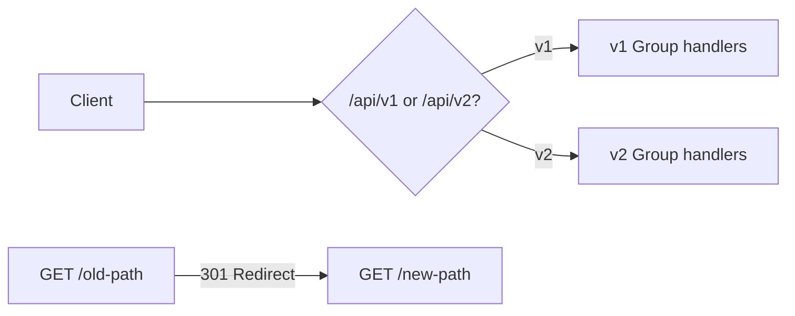

<!-- tags: golang -->
# 🔀 Versioning & Redirects — NestJS Versioning → Gin Routes

> **Library**: API versioning via route groups, header-based version negotiation, and redirect strategies for deprecated endpoints.

📅 Updated: 2026-04-19 · ⏱️ 10 min read

## 1. DEFINE

Breaking API changes destroy existing clients. Gin has no built-in versioning — you implement it through route groups (`/v1/`, `/v2/`), header middleware (`Accept-Version`), or redirect rules. This article covers all three patterns.

| NestJS                           | Gin                                      |
| -------------------------------- | ---------------------------------------- |
| `app.enableVersioning()`         | Route group: `r.Group("/v1")`            |
| `@Version('1')`                  | Handler attached to a versioned group    |
| `res.redirect('/new-path')`      | `c.Redirect(301, "/new")`                |
| `app.use(VersioningType.HEADER)` | Custom middleware reading `Accept-Version` |

### Key Invariants

- **Use 308 (Permanent Redirect), not 301, for API redirects.** 301 may change POST to GET in some clients.
- **Never create redirect loops.** `/v1/users` → `/v2/users` → `/v1/users` crashes the client.

## 2. VISUAL


*Figure: Three versioning strategies — URL path (`/v1/`, `/v2/`), header-based (`Accept-Version` middleware), and redirect (308 Permanent Redirect from unversioned to latest).*



*Figure: URL-path versioning — separate route groups per version. Redirect middleware maps old paths to new ones.*

### Version Resolution Flow

```text
Client sends GET /api/v1/users
    → v1 group matches → listUsersV1 handler (legacy response)

Client sends GET /api/v2/users
    → v2 group matches → listUsersV2 handler (response with pagination meta)

Client sends GET /api/users (no version)
    → redirect rule → 308 to /api/v2/users
```

## 3. CODE

### Example 1: Basic — Specific Path Handlers

```go
    // ━━━━━━━━━━━━━━━━━━━━━━━━━━━━━━━━━━━━━━━━━
    // Path-based versioning: /api/v1 and /api/v2 are separate groups.
    // v2 adds pagination metadata to the response.
    // ━━━━━━━━━━━━━━━━━━━━━━━━━━━━━━━━━━━━━━━━━
    package main

    import (
        "net/http"
        "github.com/gin-gonic/gin"
    )

    type User struct {
        ID   string `json:"id"`
        Name string `json:"name"`
    }

    func listUsersV1(c *gin.Context) {
        c.JSON(http.StatusOK, gin.H{
            "version": "v1",
            "data":    []User{{ID: "1", Name: "Alice"}},
        })
    }

    func listUsersV2(c *gin.Context) {
        c.JSON(http.StatusOK, gin.H{
            "version": "v2",
            "data":    []User{{ID: "1", Name: "Alice"}},
            "meta":    gin.H{"total": 1, "page": 1}, 
        })
    }

    func main() {
        r := gin.Default()

        v1 := r.Group("/api/v1")
        {
            v1.GET("/users", listUsersV1)
        }

        v2 := r.Group("/api/v2")
        {
            v2.GET("/users", listUsersV2)
        }

        r.Run(":8080")
    }
```

### Example 2: Intermediate — Metadata Versioning

```go
    // ━━━━━━━━━━━━━━━━━━━━━━━━━━━━━━━━━━━━━━━━━
    // Header-based versioning: middleware reads Accept-Version header,
    // stores it in context, and handler switches behavior by version.
    // ━━━━━━━━━━━━━━━━━━━━━━━━━━━━━━━━━━━━━━━━━
    func VersionMiddleware() gin.HandlerFunc {
        return func(c *gin.Context) {
            version := c.GetHeader("Accept-Version")
            if version == "" {
                version = "1" 
            }
            c.Set("api_version", version)
            c.Next()
        }
    }

    func listUsers(c *gin.Context) {
        version := c.GetString("api_version")

        switch version {
        case "2":
            c.JSON(http.StatusOK, gin.H{
                "version": "v2",
                "data":    []gin.H{{"id": "1", "name": "Alice"}},
                "meta":    gin.H{"total": 1},
            })
        default: 
            c.JSON(http.StatusOK, gin.H{
                "version": "v1",
                "data":    []gin.H{{"id": "1", "name": "Alice"}},
            })
        }
    }
```

### Example 3: Advanced — Fallback Routes

```go
    // ━━━━━━━━━━━━━━━━━━━━━━━━━━━━━━━━━━━━━━━━━
    // Redirect unversioned paths to the latest version.
    // NoRoute and NoMethod return structured JSON errors.
    // ━━━━━━━━━━━━━━━━━━━━━━━━━━━━━━━━━━━━━━━━━
    package main

    import (
        "net/http"
        "github.com/gin-gonic/gin"
    )

    func main() {
        r := gin.Default()

        r.GET("/api/users", func(c *gin.Context) {
            c.Redirect(http.StatusPermanentRedirect, "/api/v2/users") 
        })

        r.NoRoute(func(c *gin.Context) {
            c.JSON(http.StatusNotFound, gin.H{
                "error":   "route not found",
                "path":    c.Request.URL.Path,
            })
        })

        r.HandleMethodNotAllowed = true
        r.NoMethod(func(c *gin.Context) {
            c.JSON(http.StatusMethodNotAllowed, gin.H{
                "error":  "method not allowed",
                "method": c.Request.Method,
            })
        })

        r.Run(":8080")
    }
```

---

## 4. PITFALLS

| # | Severity | Defect | Impact | Fix |
| --- | --- | --- | --- | --- |
| 1 | 🔴 Fatal | Redirect loop: `/v1/users` → `/v2/users` → `/v1/users` | Browser/client hangs or errors with "too many redirects" | Always redirect to an absolute destination; never chain redirects |
| 2 | 🟡 Common | Using 301 (Moved Permanently) for API redirects | Some HTTP clients change POST to GET on 301 | Use 308 (Permanent Redirect) to preserve the HTTP method |

---

## 5. REF

| Resource | Link |
| --- | --- |
| NestJS Versioning | [docs.nestjs.com/techniques/versioning](https://docs.nestjs.com/techniques/versioning) |
| Gin Redirects | [gin-gonic.com/docs/examples/redirects](https://gin-gonic.com/docs/examples/redirects/) |

---

## 6. RECOMMEND

| Extension | When | Rationale | Resource |
| --- | --- | --- | --- |
| Binding & Validation | When you need to validate request bodies and query params | Struct tags (`binding:"required"`) catch bad input before it reaches your service | [../binding/01-json-form-validation.md](../binding/01-json-form-validation.md) |
