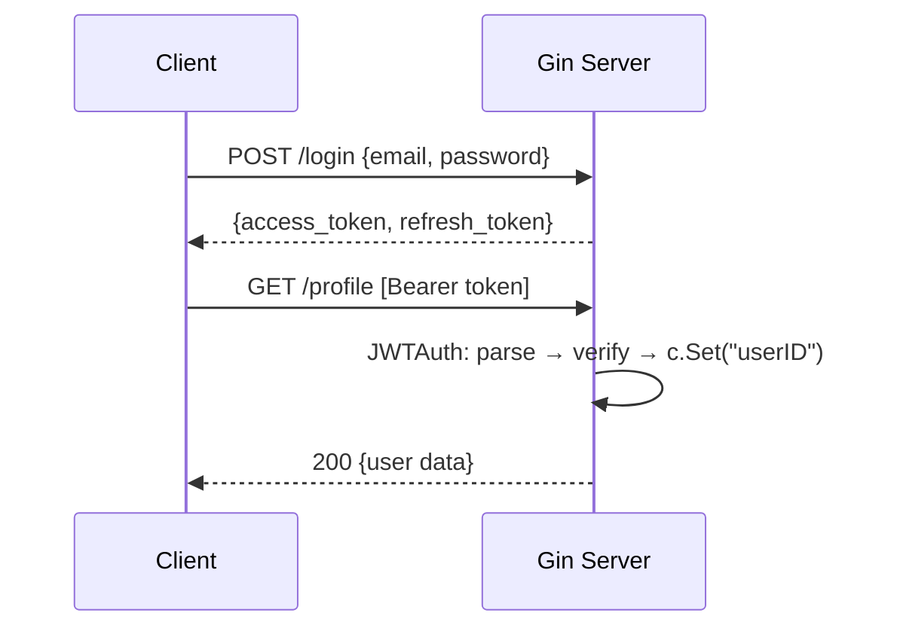

<!-- tags: golang -->
# 🔐 Authentication & JWT — NestJS Passport → Gin JWT Middleware

> **Library**: Issue and validate JWTs with `golang-jwt/jwt/v5`, extract claims in Gin middleware.

📅 Updated: 2026-04-19 · ⏱️ 16 min read

## 1. DEFINE

NestJS uses Passport strategies + `JwtModule`. In Go, you sign tokens with `jwt.NewWithClaims()` and validate them in middleware using `jwt.ParseWithClaims()`. No framework magic — every step is explicit.

| NestJS                           | Gin Equivalent                              |
| -------------------------------- | ------------------------------------------- |
| `AuthModule` + `JwtModule`       | `auth.GenerateTokenPair()` + `auth.ValidateToken()` |
| `@UseGuards(AuthGuard('jwt'))`   | `r.Use(auth.JWTAuth(secret))` middleware    |
| `PassportStrategy(Strategy.JWT)` | `jwt.ParseWithClaims()` + signing method check |
| `JwtService.sign(payload)`       | `jwt.NewWithClaims(HS256, claims).SignedString(key)` |
| `@Request() req → req.user`      | `c.Set("userID", claims.UserID)` → `c.Get("userID")` |

### Key Invariants

- **Always verify the signing method.** Without `t.Method.(*jwt.SigningMethodHMAC)` check, an attacker can forge tokens with `alg: none`.
- **Use short-lived access tokens (15–30 min) + refresh tokens.** Never issue non-expiring JWTs.

## 2. VISUAL


*Figure: JWT flow — Login: client sends credentials → server issues access (15min) + refresh (7d) tokens. Protected: Bearer token extracted → jwt.ParseWithClaims validates signing method + expiry → c.Set("userID") → handler.*



*Figure: Login → generate access+refresh tokens → client sends `Authorization: Bearer <token>` → middleware validates → sets claims in context.*

### Auth Flow

```text
POST /login {email, password}
    → Validate credentials → GenerateTokenPair(userID, role)
    → Response: {access_token, refresh_token, expires_in}

GET /profile  [Authorization: Bearer <access_token>]
    → JWTAuth middleware: parse → verify signature → check expiry
    → c.Set("userID", claims.UserID) → handler reads c.Get("userID")
```

## 3. CODE

### Example 1: Basic — Native Token Services

```go
    // ━━━━━━━━━━━━━━━━━━━━━━━━━━━━━━━━━━━━━━━━━
    // GenerateTokenPair: creates access (short) + refresh (long) JWTs.
    // ValidateToken: parses, verifies signing method, returns Claims.
    // ━━━━━━━━━━━━━━━━━━━━━━━━━━━━━━━━━━━━━━━━━
    package auth

    import (
        "errors"
        "time"
        "github.com/golang-jwt/jwt/v5"
    )

    type JWTConfig struct {
        Secret         string
        AccessExpiry   time.Duration
        RefreshExpiry  time.Duration
    }

    type Claims struct {
        jwt.RegisteredClaims
        UserID string `json:"user_id"`
        Role   string `json:"role"`
    }

    type TokenPair struct {
        AccessToken  string `json:"access_token"`
        RefreshToken string `json:"refresh_token"`
        ExpiresIn    int64  `json:"expires_in"`
    }

    func GenerateTokenPair(cfg JWTConfig, userID, role string) (*TokenPair, error) {
        now := time.Now()

        accessClaims := Claims{
            RegisteredClaims: jwt.RegisteredClaims{
                Subject:   userID,
                IssuedAt:  jwt.NewNumericDate(now),
                ExpiresAt: jwt.NewNumericDate(now.Add(cfg.AccessExpiry)),
            },
            UserID: userID,
            Role:   role,
        }
        accessToken, err := jwt.NewWithClaims(jwt.SigningMethodHS256, accessClaims).
            SignedString([]byte(cfg.Secret))
        if err != nil {
            return nil, err
        }

        refreshClaims := jwt.RegisteredClaims{
            Subject:   userID,
            IssuedAt:  jwt.NewNumericDate(now),
            ExpiresAt: jwt.NewNumericDate(now.Add(cfg.RefreshExpiry)),
        }
        refreshToken, err := jwt.NewWithClaims(jwt.SigningMethodHS256, refreshClaims).
            SignedString([]byte(cfg.Secret))
        if err != nil {
            return nil, err
        }

        return &TokenPair{
            AccessToken:  accessToken,
            RefreshToken: refreshToken,
            ExpiresIn:    int64(cfg.AccessExpiry.Seconds()),
        }, nil
    }

    func ValidateToken(secret, tokenStr string) (*Claims, error) {
        token, err := jwt.ParseWithClaims(tokenStr, &Claims{}, func(t *jwt.Token) (any, error) {
            if _, ok := t.Method.(*jwt.SigningMethodHMAC); !ok {
                return nil, errors.New("unexpected signing method")
            }
            return []byte(secret), nil
        })
        if err != nil {
            return nil, err
        }

        claims, ok := token.Claims.(*Claims)
        if !ok || !token.Valid {
            return nil, errors.New("invalid token")
        }
        return claims, nil
    }
```

### Example 2: Intermediate — Middleware Pipeline

```go
    // ━━━━━━━━━━━━━━━━━━━━━━━━━━━━━━━━━━━━━━━━━
    // JWTAuth middleware: extracts Bearer token, validates,
    // stores claims in gin.Context for downstream handlers.
    // ━━━━━━━━━━━━━━━━━━━━━━━━━━━━━━━━━━━━━━━━━
    package auth

    import (
        "net/http"
        "strings"
        "github.com/gin-gonic/gin"
    )

    func JWTAuth(secret string) gin.HandlerFunc {
        return func(c *gin.Context) {
            header := c.GetHeader("Authorization")
            if !strings.HasPrefix(header, "Bearer ") {
                c.AbortWithStatusJSON(http.StatusUnauthorized, gin.H{
                    "error": "missing authorization header",
                })
                return
            }

            tokenStr := strings.TrimPrefix(header, "Bearer ")
            claims, err := ValidateToken(secret, tokenStr)
            if err != nil {
                c.AbortWithStatusJSON(http.StatusUnauthorized, gin.H{
                    "error": "invalid expired token",
                })
                return
            }

            c.Set("userID", claims.UserID)
            c.Set("role", claims.Role)
            c.Set("claims", claims)

            c.Next()
        }
    }
```

---

## 4. PITFALLS

| # | Severity | Defect | Impact | Fix |
| --- | --- | --- | --- | --- |
| 1 | 🔴 Fatal | Not checking `t.Method` in `ParseWithClaims` keyfunc | Attacker sets `alg: none` to forge valid tokens | Assert `t.Method.(*jwt.SigningMethodHMAC)` before returning key |
| 2 | 🔴 Fatal | Issuing JWTs with no expiry (`ExpiresAt` omitted) | Stolen tokens remain valid forever | Set `ExpiresAt` to 15–30 min for access, 7 days for refresh |

---

## 5. REF

| Resource | Link |
| --- | --- |
| JWT Specs | [auth0.com/blog/a-look-at-the-latest-draft-for-jwt-bcp](https://auth0.com/blog/a-look-at-the-latest-draft-for-jwt-bcp/) |

---

## 6. RECOMMEND

| Extension | When | Rationale | Resource |
| --- | --- | --- | --- |
| Authorization & RBAC | After authentication is established | Restrict routes by role/permission using the claims set by JWTAuth | [./02-authorization-rbac.md](./02-authorization-rbac.md) |
