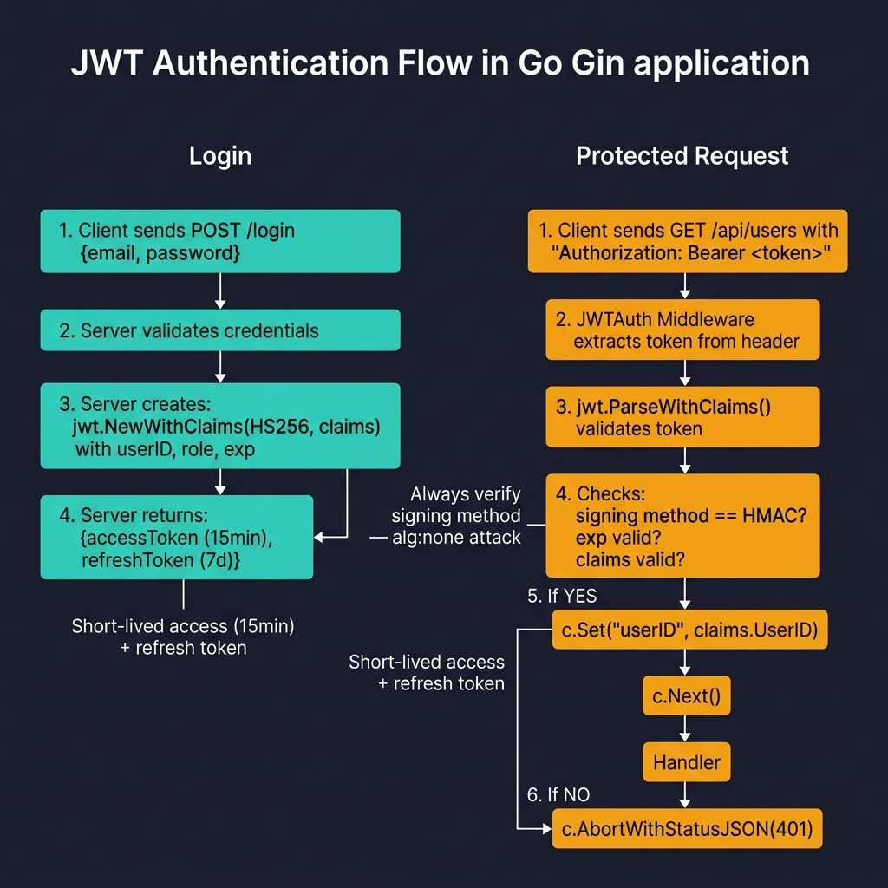

<!-- tags: golang --> # 🔐 Xác thực & JWT — NestJS Passport → Gin JWT Middleware

> **Thư viện**: Phát hành và xác thực JWT bằng `golang-jwt/jwt/v5` , trích xuất các xác nhận quyền sở hữu trong phần mềm trung gian Gin.

📅 Đã cập nhật: 2026-04-19 · ⏱️ 16 phút đọc

## 1. ĐỊNH NGHĨA

NestJS sử dụng chiến lược Passport + `JwtModule` . Trong Go, bạn ký mã thông báo bằng `jwt.NewWithClaims()` và xác thực chúng trong phần mềm trung gian bằng cách sử dụng `jwt.ParseWithClaims()` . Không có phép thuật khuôn khổ nào - mọi bước đều rõ ràng.

| NestJS | Tương đương Gin |
| -------------------------------- | --------------------------------------------- |
| `AuthModule` + `JwtModule` | `auth.GenerateTokenPair()` + `auth.ValidateToken()` |
| `@UseGuards(AuthGuard('jwt'))` | `r.Use(auth.JWTAuth(secret))` phần mềm trung gian |
| `PassportStrategy(Strategy.JWT)` | `jwt.ParseWithClaims()` + kiểm tra phương thức ký |
| `JwtService.sign(payload)` | `jwt.NewWithClaims(HS256, claims).SignedString(key)` |
| `@Request() req → req.user` | `c.Set("userID", claims.UserID)` → `c.Get("userID")` |

### Bất biến chính

- **Luôn xác minh phương thức ký.** Nếu không kiểm tra `t.Method.(*jwt.SigningMethodHMAC)` , kẻ tấn công có thể giả mạo mã thông báo bằng `alg: none` .
- **Sử dụng mã thông báo truy cập có thời hạn sử dụng ngắn (15–30 phút) + mã thông báo làm mới.** Không bao giờ phát hành JWT không hết hạn.

## 2. HÌNH ẢNH  *Hình: Luồng JWT - Đăng nhập: máy khách gửi thông tin xác thực → máy chủ phát hành mã thông báo truy cập (15 phút) + làm mới (7 ngày). Được bảo vệ: Mã thông báo mang được trích xuất → jwt.ParseWithClaims xác thực phương thức ký + hết hạn → c.Set("userID") → handler.*```mermaid
sequenceDiagram
    participant C as Client
    participant S as Gin Server
    C->>S: POST /login {email, password}
    S-->>C: {access_token, refresh_token}
    C->>S: GET /profile [Bearer token]
    S->>S: JWTAuth: parse → verify → c.Set("userID")
    S-->>C: 200 {user data}
```*Hình: Đăng nhập → tạo quyền truy cập+làm mới mã thông báo → khách hàng gửi `Authorization: Bearer <token>` → xác thực phần mềm trung gian → đặt xác nhận quyền sở hữu trong ngữ cảnh.*

### Luồng xác thực```text
POST /login {email, password}
    → Validate credentials → GenerateTokenPair(userID, role)
    → Response: {access_token, refresh_token, expires_in}

GET /profile  [Authorization: Bearer <access_token>]
    → JWTAuth middleware: parse → verify signature → check expiry
    → c.Set("userID", claims.UserID) → handler reads c.Get("userID")
```## 3. MÃ

### Ví dụ 1: Cơ bản — Dịch vụ mã thông báo gốc```go
    // ━━━━━━━━━━━━━━━━━━━━━━━━━━━━━━━━━━━━━━━━━
    // GenerateTokenPair: creates access (short) + refresh (long) JWTs.
    // ValidateToken: parses, verifies signing method, returns Claims.
    // ━━━━━━━━━━━━━━━━━━━━━━━━━━━━━━━━━━━━━━━━━
    package auth

    import (
        "errors"
        "time"
        "github.com/golang-jwt/jwt/v5"
    )

    type JWTConfig struct {
        Secret         string
        AccessExpiry   time.Duration
        RefreshExpiry  time.Duration
    }

    type Claims struct {
        jwt.RegisteredClaims
        UserID string `json:"user_id"`
        Role   string `json:"role"`
    }

    type TokenPair struct {
        AccessToken  string `json:"access_token"`
        RefreshToken string `json:"refresh_token"`
        ExpiresIn    int64  `json:"expires_in"`
    }

    func GenerateTokenPair(cfg JWTConfig, userID, role string) (*TokenPair, error) {
        now := time.Now()

        accessClaims := Claims{
            RegisteredClaims: jwt.RegisteredClaims{
                Subject:   userID,
                IssuedAt:  jwt.NewNumericDate(now),
                ExpiresAt: jwt.NewNumericDate(now.Add(cfg.AccessExpiry)),
            },
            UserID: userID,
            Role:   role,
        }
        accessToken, err := jwt.NewWithClaims(jwt.SigningMethodHS256, accessClaims).
            SignedString([]byte(cfg.Secret))
        if err != nil {
            return nil, err
        }

        refreshClaims := jwt.RegisteredClaims{
            Subject:   userID,
            IssuedAt:  jwt.NewNumericDate(now),
            ExpiresAt: jwt.NewNumericDate(now.Add(cfg.RefreshExpiry)),
        }
        refreshToken, err := jwt.NewWithClaims(jwt.SigningMethodHS256, refreshClaims).
            SignedString([]byte(cfg.Secret))
        if err != nil {
            return nil, err
        }

        return &TokenPair{
            AccessToken:  accessToken,
            RefreshToken: refreshToken,
            ExpiresIn:    int64(cfg.AccessExpiry.Seconds()),
        }, nil
    }

    func ValidateToken(secret, tokenStr string) (*Claims, error) {
        token, err := jwt.ParseWithClaims(tokenStr, &Claims{}, func(t *jwt.Token) (any, error) {
            if _, ok := t.Method.(*jwt.SigningMethodHMAC); !ok {
                return nil, errors.New("unexpected signing method")
            }
            return []byte(secret), nil
        })
        if err != nil {
            return nil, err
        }

        claims, ok := token.Claims.(*Claims)
        if !ok || !token.Valid {
            return nil, errors.New("invalid token")
        }
        return claims, nil
    }
```### Ví dụ 2: Trung cấp — Middleware Pipeline```go
    // ━━━━━━━━━━━━━━━━━━━━━━━━━━━━━━━━━━━━━━━━━
    // JWTAuth middleware: extracts Bearer token, validates,
    // stores claims in gin.Context for downstream handlers.
    // ━━━━━━━━━━━━━━━━━━━━━━━━━━━━━━━━━━━━━━━━━
    package auth

    import (
        "net/http"
        "strings"
        "github.com/gin-gonic/gin"
    )

    func JWTAuth(secret string) gin.HandlerFunc {
        return func(c *gin.Context) {
            header := c.GetHeader("Authorization")
            if !strings.HasPrefix(header, "Bearer ") {
                c.AbortWithStatusJSON(http.StatusUnauthorized, gin.H{
                    "error": "missing authorization header",
                })
                return
            }

            tokenStr := strings.TrimPrefix(header, "Bearer ")
            claims, err := ValidateToken(secret, tokenStr)
            if err != nil {
                c.AbortWithStatusJSON(http.StatusUnauthorized, gin.H{
                    "error": "invalid expired token",
                })
                return
            }

            c.Set("userID", claims.UserID)
            c.Set("role", claims.Role)
            c.Set("claims", claims)

            c.Next()
        }
    }
```---

## 4. Cạm bẫy

| # | Mức độ nghiêm trọng | Khiếm khuyết | Tác động | Sửa chữa |
| --- | --- | --- | --- | --- |
| 1 | 🔴 Gây tử vong | Không kiểm tra `t.Method` trong `ParseWithClaims` keyfunc | Kẻ tấn công đặt `alg: none` để giả mạo mã thông báo hợp lệ | Xác nhận `t.Method.(*jwt.SigningMethodHMAC)` trước khi trả lại khóa |
| 2 | 🔴 Gây tử vong | Phát hành JWT không hết hạn ( `ExpiresAt` bỏ qua) | Token bị đánh cắp vẫn có hiệu lực mãi mãi | Đặt `ExpiresAt` thành 15–30 phút để truy cập, 7 ngày để làm mới |

---

## 5. GIỚI THIỆU

| Tài nguyên | Liên kết |
| --- | --- |
| Thông số JWT | [auth0.com/blog/a-look-at-the-latest-draft-for-jwt-bcp](https://auth0.com/blog/a-look-at-the-latest-draft-for-jwt-bcp/) |

---

## 6. KHUYẾN NGHỊ

| Gia hạn | Khi nào | Cơ sở lý luận | Tài nguyên |
| --- | --- | --- | --- |
| Ủy quyền & RBAC | Sau khi xác thực được thiết lập | Hạn chế các tuyến đường theo vai trò/quyền bằng cách sử dụng các xác nhận quyền sở hữu do JWTAuth | [./02-authorization-rbac.md](./02-authorization-rbac.md) |