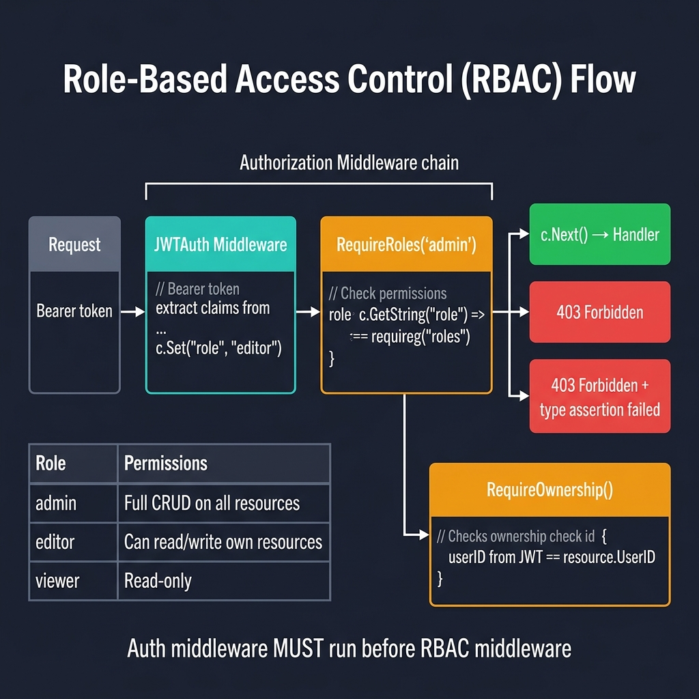

<!-- tags: golang --> # 👤 Ủy quyền & RBAC — NestJS Guards → Gin Role Middleware

> **Thư viện**: Kiểm soát quyền truy cập dựa trên vai trò và quyền thông qua phần mềm trung gian Gin, bao gồm kiểm tra quyền sở hữu tài nguyên.

📅 Cập nhật: 2026-04-19 · ⏱️ 12 phút đọc

## 1. ĐỊNH NGHĨA

Câu trả lời xác thực "bạn là ai?" Câu trả lời ủy quyền "bạn có thể làm gì?" Trong NestJS, `@Roles()` + `RolesGuard` xử lý việc này. Trong Gin, bạn viết `RequireRoles("admin")` hoặc `RequirePermission("create", "users")` làm phần mềm trung gian.

| NestJS | Tương đương Gin |
| ------------------------------------- | --------------------------------------------- |
| `@Roles('admin')` | `RequireRoles("admin")` phần mềm trung gian |
| `@SetMetadata('roles', [...])` | Vai trò được lưu trữ trong `c.Get("role")` từ JWT |
| `RolesGuard canActivate()` | Vai trò kiểm tra phần mềm trung gian → `c.Next()` hoặc `c.Abort()` |
| CASL `ability.can('read', 'Article')` | `RequirePermission("read", "articles")` |

### Bất biến chính

- **Phần mềm trung gian ủy quyền phải chạy sau JWTAuth.** Nó đọc `role` từ ngữ cảnh do phần mềm trung gian xác thực đặt.
- **Luôn xử lý việc thiếu `c.Get("role")` .** Xác nhận loại bằng kiểm tra `ok` — vai trò bị thiếu sẽ trả về 403, đừng hoảng sợ.

## 2. HÌNH ẢNH  *Hình: Đường dẫn RBAC — JWTAuth trích xuất vai trò từ mã thông báo → RequireRoles kiểm tra các vai trò bắt buộc → khớp vai trò = trình xử lý, không khớp = 403. Phân cấp vai trò: quản trị viên (CRUD đầy đủ), trình soạn thảo (tài nguyên riêng), trình xem (chỉ đọc).*```mermaid
flowchart LR
    A["Request"] --> B["JWTAuth"]
    B -->|"c.Set('role')"| C["RequireRoles"]
    C -->|"role match"| D["Handler"]
    C -->|"no match"| E["403 Forbidden"]
```*Hình: Vai trò → Ánh xạ quyền. JWTAuth đặt vai trò → RequireRoles kiểm tra nó → RequirePermission kiểm tra hành động:resource.*

### Chuỗi ủy quyền```text
GET /admin/users
    → JWTAuth: c.Set("role", "admin")
    → RequireRoles("admin"): c.Get("role") == "admin" → c.Next()
    → Handler: return user list
```## 3. MÃ

### Ví dụ 1: Cơ bản — Người gác cổng vai trò```go
    // ━━━━━━━━━━━━━━━━━━━━━━━━━━━━━━━━━━━━━━━━━
    // RequireRoles: checks c.Get("role") against allowed list.
    // Must run after JWTAuth which sets the "role" key.
    // ━━━━━━━━━━━━━━━━━━━━━━━━━━━━━━━━━━━━━━━━━
    package middleware

    import (
        "net/http"
        "github.com/gin-gonic/gin"
    )

    func RequireRoles(roles ...string) gin.HandlerFunc {
        return func(c *gin.Context) {
            userRole, exists := c.Get("role")
            if !exists {
                c.AbortWithStatusJSON(http.StatusForbidden, gin.H{
                    "error": "no role assigned",
                })
                return
            }

            role := userRole.(string)
            for _, allowed := range roles {
                if role == allowed {
                    c.Next()
                    return
                }
            }

            c.AbortWithStatusJSON(http.StatusForbidden, gin.H{
                "error":    "insufficient permissions",
                "required": roles,
            })
        }
    }
```### Ví dụ 2: Trung cấp — Bản đồ hành động```go
    // ━━━━━━━━━━━━━━━━━━━━━━━━━━━━━━━━━━━━━━━━━
    // Permission-based RBAC: rolePermissions maps role → actions.
    // RequirePermission checks action:resource pair for the user's role.
    // ━━━━━━━━━━━━━━━━━━━━━━━━━━━━━━━━━━━━━━━━━
    package middleware

    import (
        "net/http"
        "github.com/gin-gonic/gin"
    )

    type Permission struct {
        Action   string 
        Resource string 
    }

    var rolePermissions = map[string][]Permission{
        "admin": {
            {Action: "read", Resource: "users"},
            {Action: "create", Resource: "users"},
        },
        "viewer": {
            {Action: "read", Resource: "posts"},
        },
    }

    func RequirePermission(action, resource string) gin.HandlerFunc {
        return func(c *gin.Context) {
            role, _ := c.Get("role")
            userRole := role.(string)

            perms, ok := rolePermissions[userRole]
            if !ok {
                c.AbortWithStatusJSON(http.StatusForbidden, gin.H{
                    "error": "unknown role",
                })
                return
            }

            for _, p := range perms {
                if p.Action == action && p.Resource == resource {
                    c.Next()
                    return
                }
            }

            c.AbortWithStatusJSON(http.StatusForbidden, gin.H{
                "error":    "permission denied",
                "required": action + ":" + resource,
            })
        }
    }
```### Ví dụ 3: Nâng cao — Quyền sở hữu tài nguyên```go
    // ━━━━━━━━━━━━━━━━━━━━━━━━━━━━━━━━━━━━━━━━━
    // Resource ownership: allow access if user owns the resource OR is admin.
    // getOwnerID is a callback to look up the resource owner.
    // ━━━━━━━━━━━━━━━━━━━━━━━━━━━━━━━━━━━━━━━━━
    package middleware

    import (
        "net/http"
        "github.com/gin-gonic/gin"
    )

    func RequireOwnerOrAdmin(getOwnerID func(c *gin.Context) string) gin.HandlerFunc {
        return func(c *gin.Context) {
            userID, _ := c.Get("userID")
            role, _ := c.Get("role")

            if role == "admin" {
                c.Next()
                return
            }

            ownerID := getOwnerID(c)
            if ownerID != userID.(string) {
                c.AbortWithStatusJSON(http.StatusForbidden, gin.H{
                    "error": "restricted modify resources",
                })
                return
            }

            c.Next()
        }
    }
```---

## 4. Cạm bẫy

| # | Mức độ nghiêm trọng | Khiếm khuyết | Tác động | Sửa chữa |
| --- | --- | --- | --- | --- |
| 1 | 🔴 Gây tử vong | Khẳng định kiểu `c.Get("role")` mà không cần kiểm tra `ok` | Thiếu phần mềm trung gian JWT gây hoang mang: `interface conversion` | Sử dụng `role, ok := c.Get("role"); if !ok { c.Abort() }` |
| 2 | 🟡 Chung | Bản đồ cấp phép vai trò mã hóa cứng trong mã nguồn | Quyền không thể thay đổi nếu không triển khai lại | Tải từ cờ cấu hình, cơ sở dữ liệu hoặc tính năng |

---

## 5. GIỚI THIỆU

| Tài nguyên | Liên kết |
| --- | --- |
| NestJS xác thực | [docs.nestjs.com/security/authorization](https://docs.nestjs.com/security/authorization) |

---

## 6. KHUYẾN NGHỊ

| Gia hạn | Khi nào | Cơ sở lý luận | Tài nguyên |
| --- | --- | --- | --- |
| CORS, CSRF & Mũ bảo hiểm | Khi giao diện người dùng và API có nguồn gốc khác nhau | CORS cho phép các yêu cầu có nguồn gốc chéo; CSRF ngăn chặn việc gửi biểu mẫu giả mạo | [./03-cors-csrf-helmet.md](./03-cors-csrf-helmet.md) |