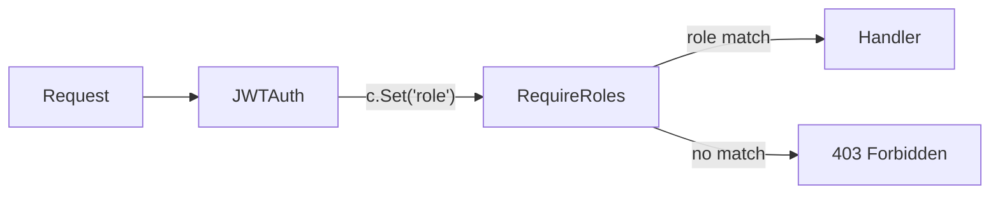

<!-- tags: golang -->
# 👤 Authorization & RBAC — NestJS Guards → Gin Role Middleware

> **Library**: Role-based and permission-based access control via Gin middleware, including resource ownership checks.

📅 Updated: 2026-04-19 · ⏱️ 12 min read

## 1. DEFINE

Authentication answers "who are you?" Authorization answers "what can you do?" In NestJS, `@Roles()` + `RolesGuard` handle this. In Gin, you write `RequireRoles("admin")` or `RequirePermission("create", "users")` as middleware.

| NestJS                                | Gin Equivalent                              |
| ------------------------------------- | ------------------------------------------- |
| `@Roles('admin')`                     | `RequireRoles("admin")` middleware          |
| `@SetMetadata('roles', [...])`        | Role stored in `c.Get("role")` from JWT     |
| `RolesGuard canActivate()`            | Middleware checks role → `c.Next()` or `c.Abort()` |
| CASL `ability.can('read', 'Article')` | `RequirePermission("read", "articles")`     |

### Key Invariants

- **Authorization middleware must run after JWTAuth.** It reads `role` from context set by the auth middleware.
- **Always handle missing `c.Get("role")`.** Type-assert with `ok` check — a missing role should return 403, not panic.

## 2. VISUAL


*Figure: RBAC pipeline — JWTAuth extracts role from token → RequireRoles checks against required roles → role match = handler, mismatch = 403. Role hierarchy: admin (full CRUD), editor (own resources), viewer (read-only).*



*Figure: Role → Permission mapping. JWTAuth sets role → RequireRoles checks it → RequirePermission checks action:resource.*

### Authorization Chain

```text
GET /admin/users
    → JWTAuth: c.Set("role", "admin")
    → RequireRoles("admin"): c.Get("role") == "admin" → c.Next()
    → Handler: return user list
```

## 3. CODE

### Example 1: Basic — Role Gatekeepers

```go
    // ━━━━━━━━━━━━━━━━━━━━━━━━━━━━━━━━━━━━━━━━━
    // RequireRoles: checks c.Get("role") against allowed list.
    // Must run after JWTAuth which sets the "role" key.
    // ━━━━━━━━━━━━━━━━━━━━━━━━━━━━━━━━━━━━━━━━━
    package middleware

    import (
        "net/http"
        "github.com/gin-gonic/gin"
    )

    func RequireRoles(roles ...string) gin.HandlerFunc {
        return func(c *gin.Context) {
            userRole, exists := c.Get("role")
            if !exists {
                c.AbortWithStatusJSON(http.StatusForbidden, gin.H{
                    "error": "no role assigned",
                })
                return
            }

            role := userRole.(string)
            for _, allowed := range roles {
                if role == allowed {
                    c.Next()
                    return
                }
            }

            c.AbortWithStatusJSON(http.StatusForbidden, gin.H{
                "error":    "insufficient permissions",
                "required": roles,
            })
        }
    }
```

### Example 2: Intermediate — Action Maps

```go
    // ━━━━━━━━━━━━━━━━━━━━━━━━━━━━━━━━━━━━━━━━━
    // Permission-based RBAC: rolePermissions maps role → actions.
    // RequirePermission checks action:resource pair for the user's role.
    // ━━━━━━━━━━━━━━━━━━━━━━━━━━━━━━━━━━━━━━━━━
    package middleware

    import (
        "net/http"
        "github.com/gin-gonic/gin"
    )

    type Permission struct {
        Action   string 
        Resource string 
    }

    var rolePermissions = map[string][]Permission{
        "admin": {
            {Action: "read", Resource: "users"},
            {Action: "create", Resource: "users"},
        },
        "viewer": {
            {Action: "read", Resource: "posts"},
        },
    }

    func RequirePermission(action, resource string) gin.HandlerFunc {
        return func(c *gin.Context) {
            role, _ := c.Get("role")
            userRole := role.(string)

            perms, ok := rolePermissions[userRole]
            if !ok {
                c.AbortWithStatusJSON(http.StatusForbidden, gin.H{
                    "error": "unknown role",
                })
                return
            }

            for _, p := range perms {
                if p.Action == action && p.Resource == resource {
                    c.Next()
                    return
                }
            }

            c.AbortWithStatusJSON(http.StatusForbidden, gin.H{
                "error":    "permission denied",
                "required": action + ":" + resource,
            })
        }
    }
```

### Example 3: Advanced — Resource Ownership

```go
    // ━━━━━━━━━━━━━━━━━━━━━━━━━━━━━━━━━━━━━━━━━
    // Resource ownership: allow access if user owns the resource OR is admin.
    // getOwnerID is a callback to look up the resource owner.
    // ━━━━━━━━━━━━━━━━━━━━━━━━━━━━━━━━━━━━━━━━━
    package middleware

    import (
        "net/http"
        "github.com/gin-gonic/gin"
    )

    func RequireOwnerOrAdmin(getOwnerID func(c *gin.Context) string) gin.HandlerFunc {
        return func(c *gin.Context) {
            userID, _ := c.Get("userID")
            role, _ := c.Get("role")

            if role == "admin" {
                c.Next()
                return
            }

            ownerID := getOwnerID(c)
            if ownerID != userID.(string) {
                c.AbortWithStatusJSON(http.StatusForbidden, gin.H{
                    "error": "restricted modify resources",
                })
                return
            }

            c.Next()
        }
    }
```

---

## 4. PITFALLS

| # | Severity | Defect | Impact | Fix |
| --- | --- | --- | --- | --- |
| 1 | 🔴 Fatal | Type-asserting `c.Get("role")` without `ok` check | Missing JWT middleware causes panic: `interface conversion` | Use `role, ok := c.Get("role"); if !ok { c.Abort() }` |
| 2 | 🟡 Common | Hardcoding role-permission maps in source code | Permissions can't change without redeployment | Load from config, database, or feature flags |

---

## 5. REF

| Resource | Link |
| --- | --- |
| NestJS Authz | [docs.nestjs.com/security/authorization](https://docs.nestjs.com/security/authorization) |

---

## 6. RECOMMEND

| Extension | When | Rationale | Resource |
| --- | --- | --- | --- |
| CORS, CSRF & Helmet | When frontend and API are on different origins | CORS allows cross-origin requests; CSRF prevents forged form submissions | [./03-cors-csrf-helmet.md](./03-cors-csrf-helmet.md) |
