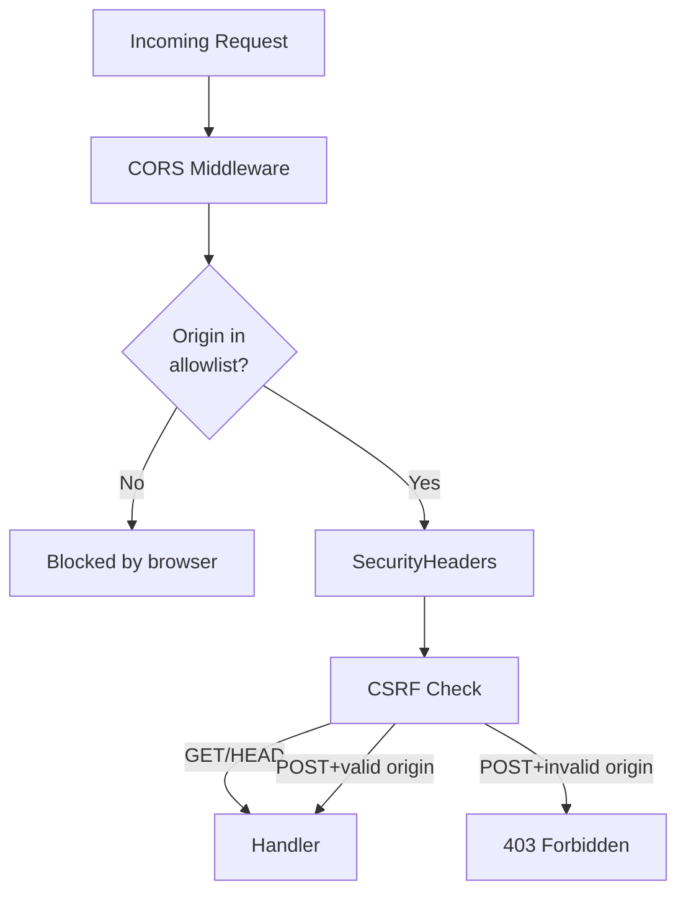

<!-- tags: golang -->
# 🛡️ CORS, CSRF & Security Headers — NestJS Helmet → Gin Middleware

> **Library**: CORS via `gin-contrib/cors`, security headers (Helmet equivalent), and CSRF origin validation.

📅 Updated: 2026-04-19 · ⏱️ 12 min read

## 1. DEFINE

CORS controls which origins can call your API. Security headers prevent XSS, clickjacking, and MIME-sniffing. CSRF protection ensures state-changing requests come from your own frontend.

| NestJS                     | Gin Equivalent                           |
| -------------------------- | ---------------------------------------- |
| `app.enableCors(options)`  | `r.Use(cors.New(cors.Config{...}))`      |
| `app.use(helmet())`        | Custom `SecurityHeaders()` middleware    |
| `app.use(csurf())`         | Origin validation middleware + SameSite cookies |
| `@Header('X-Custom', 'v')` | `c.Header("X-Custom", "v")`              |

### Key Invariants

- **Never use `AllowOrigins: ["*"]` with `AllowCredentials: true`.** Browsers reject this.
- **Set `X-Content-Type-Options: nosniff` on every response.** Prevents MIME-type sniffing.

## 2. VISUAL


*Figure: Three security layers — CORS (origin allowlist + preflight), Helmet-equivalent headers (nosniff, DENY, HSTS, CSP), CSRF (origin validation + SameSite cookies).*



*Figure: Three defense layers — CORS (origin allowlist), security headers (browser hardening), CSRF (origin validation on writes).*

### Defense Layers

```text
Request from https://evil.com → POST /api/transfer
    ├── CORS: origin not in AllowOrigins → browser blocks preflight
    ├── Security headers: X-Frame-Options: DENY prevents iframe embedding
    └── CSRF: Origin header != allowed list → 403 Forbidden
```

## 3. CODE

### Example 1: Basic — CORS Configurations

```go
    // ━━━━━━━━━━━━━━━━━━━━━━━━━━━━━━━━━━━━━━━━━
    // CORS: explicit origin allowlist, methods, and headers.
    // AllowCredentials: true sends cookies cross-origin.
    // ━━━━━━━━━━━━━━━━━━━━━━━━━━━━━━━━━━━━━━━━━
    package main

    import (
        "time"
        "github.com/gin-contrib/cors"
        "github.com/gin-gonic/gin"
    )

    func main() {
        r := gin.Default()

        r.Use(cors.New(cors.Config{
            AllowOrigins:     []string{"https://example.com", "http://localhost:3000"},
            AllowMethods:     []string{"GET", "POST", "PUT", "PATCH", "DELETE", "OPTIONS"},
            AllowHeaders:     []string{"Origin", "Content-Type", "Authorization", "Accept"},
            ExposeHeaders:    []string{"Content-Length", "X-Request-ID"},
            AllowCredentials: true,
            MaxAge:           12 * time.Hour,
        }))

        r.GET("/api/data", func(c *gin.Context) {
            c.JSON(200, gin.H{"message": "CORS enabled"})
        })

        r.Run(":8080")
    }
```

### Example 2: Intermediate — Security Headers

```go
    // ━━━━━━━━━━━━━━━━━━━━━━━━━━━━━━━━━━━━━━━━━
    // SecurityHeaders: Gin equivalent of Helmet.js.
    // Sets all OWASP-recommended headers per response.
    // ━━━━━━━━━━━━━━━━━━━━━━━━━━━━━━━━━━━━━━━━━
    package middleware

    import "github.com/gin-gonic/gin"

    func SecurityHeaders() gin.HandlerFunc {
        return func(c *gin.Context) {
            c.Header("X-Content-Type-Options", "nosniff")
            c.Header("X-Frame-Options", "DENY")
            c.Header("X-XSS-Protection", "1; mode=block")
            c.Header("Strict-Transport-Security", "max-age=31536000; includeSubDomains")
            c.Header("Content-Security-Policy", "default-src 'self'; script-src 'self'")
            c.Header("Referrer-Policy", "strict-origin-when-cross-origin")
            c.Header("Permissions-Policy", "camera=(), microphone=(), geolocation=()")
            c.Header("Server", "")

            c.Next()
        }
    }
```

### Example 3: Advanced — CSRF Protection

```go
    // ━━━━━━━━━━━━━━━━━━━━━━━━━━━━━━━━━━━━━━━━━
    // CSRF: validates Origin header on state-changing methods.
    // Falls back to Referer if Origin is empty.
    // ━━━━━━━━━━━━━━━━━━━━━━━━━━━━━━━━━━━━━━━━━
    package middleware

    import (
        "net/http"
        "github.com/gin-gonic/gin"
    )

    func APICSRFProtection() gin.HandlerFunc {
        return func(c *gin.Context) {
            if c.Request.Method == "GET" || c.Request.Method == "HEAD" {
                c.Next()
                return
            }

            origin := c.GetHeader("Origin")
            if origin == "" {
                origin = c.GetHeader("Referer")
            }

            allowed := []string{"https://example.com", "http://localhost:3000"}
            for _, a := range allowed {
                if origin == a {
                    c.Next()
                    return
                }
            }

            c.AbortWithStatusJSON(http.StatusForbidden, gin.H{
                "error": "invalid origin",
            })
        }
    }
```

---

## 4. PITFALLS

| # | Severity | Defect | Impact | Fix |
| --- | --- | --- | --- | --- |
| 1 | 🔴 Fatal | `AllowOrigins: ["*"]` with `AllowCredentials: true` | Browsers reject this; no CORS at all | Use explicit origin allowlist |
| 2 | 🔴 Fatal | Missing `X-Frame-Options: DENY` | API responses can be loaded in iframes for clickjacking | Add `SecurityHeaders()` middleware globally |

---

## 5. REF

| Resource | Link |
| --- | --- |
| gin-contrib/cors | [github.com/gin-contrib/cors](https://github.com/gin-contrib/cors) |
| OWASP Security Headers | [owasp.org/www-project-secure-headers](https://owasp.org/www-project-secure-headers/) |

---

## 6. RECOMMEND

| Extension | When | Rationale | Resource |
| --- | --- | --- | --- |
| Rate Limiting | When you need to throttle abusive traffic | Complements CORS/CSRF by limiting request volume per IP | [./04-rate-limiting.md](./04-rate-limiting.md) |
