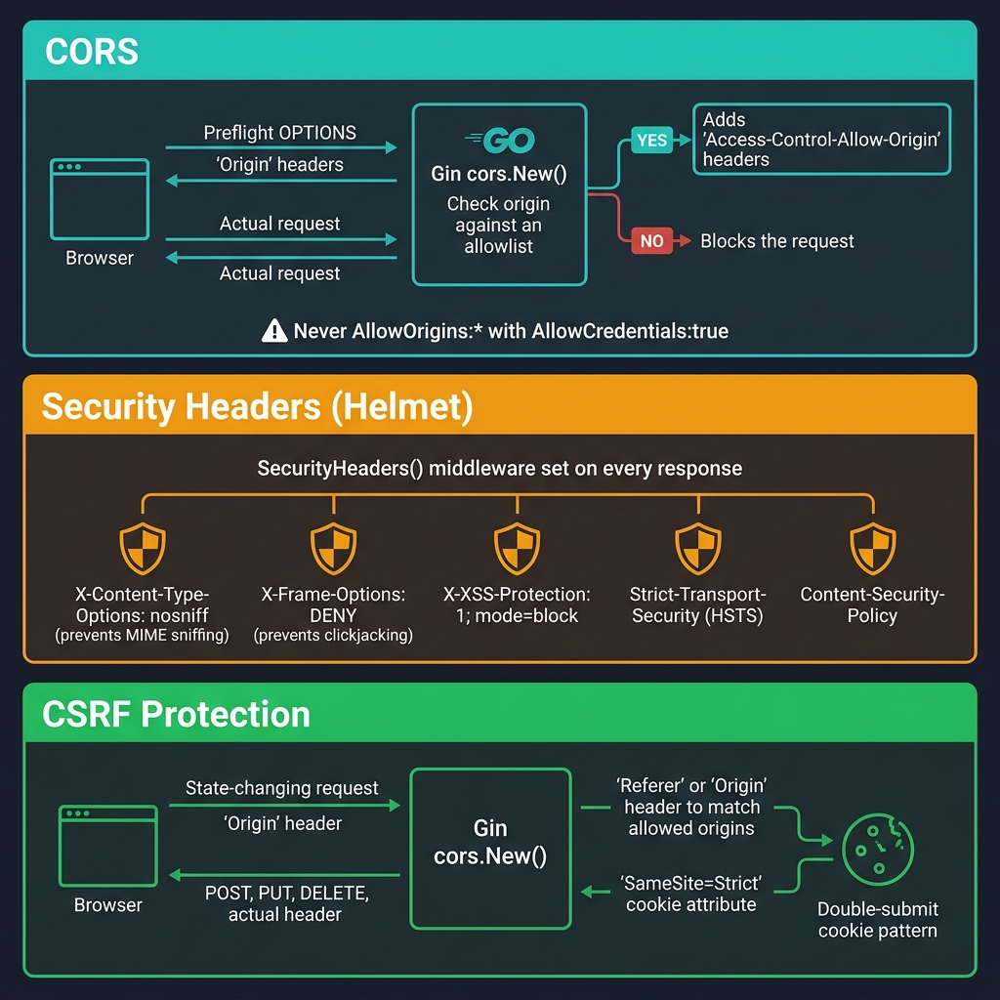

<!-- tags: golang --> # 🛡️ CORS, CSRF & Tiêu đề bảo mật — Mũ bảo hiểm NestJS → Gin Middleware

> **Thư viện**: CORS qua `gin-contrib/cors` , tiêu đề bảo mật (tương đương với Mũ bảo hiểm) và xác thực nguồn gốc CSRF.

📅 Cập nhật: 2026-04-19 · ⏱️ 12 phút đọc

## 1. ĐỊNH NGHĨA

CORS kiểm soát nguồn gốc nào có thể gọi API của bạn. Tiêu đề bảo mật ngăn chặn XSS, clickjacking và đánh hơi MIME. Bảo vệ CSRF đảm bảo các yêu cầu thay đổi trạng thái đến từ giao diện người dùng của riêng bạn.

| NestJS | Tương đương Gin |
| -------------------------- | ---------------------------------------- |
| `app.enableCors(options)` | `r.Use(cors.New(cors.Config{...}))` |
| `app.use(helmet())` | Phần mềm trung gian `SecurityHeaders()` tùy chỉnh |
| `app.use(csurf())` | Phần mềm trung gian xác thực nguồn gốc + cookie SameSite |
| `@Header('X-Custom', 'v')` | `c.Header("X-Custom", "v")` |

### Bất biến chính

- **Không bao giờ sử dụng `AllowOrigins: ["*"]` với `AllowCredentials: true` .** Trình duyệt từ chối điều này.
- **Đặt `X-Content-Type-Options: nosniff` trên mọi phản hồi.** Ngăn chặn việc đánh hơi kiểu MIME.

## 2. HÌNH ẢNH  *Hình: Ba lớp bảo mật — CORS (danh sách cho phép nguồn gốc + preflight), tiêu đề tương đương với mũ bảo hiểm (nosniff, DENY, HSTS, CSP), CSRF (xác thực nguồn gốc + cookie SameSite).*```mermaid
flowchart TD
    A["Incoming Request"] --> B["CORS Middleware"]
    B --> C{"Origin in\nallowlist?"}
    C -->|No| D["Blocked by browser"]
    C -->|Yes| E["SecurityHeaders"]
    E --> F["CSRF Check"]
    F -->|"GET/HEAD"| G["Handler"]
    F -->|"POST+invalid origin"| H["403 Forbidden"]
    F -->|"POST+valid origin"| G
```*Hình: Ba lớp bảo vệ — CORS (danh sách cho phép nguồn gốc), tiêu đề bảo mật (tăng cường trình duyệt), CSRF (xác thực nguồn gốc khi ghi).*

### Lớp phòng thủ```text
Request from https://evil.com → POST /api/transfer
    ├── CORS: origin not in AllowOrigins → browser blocks preflight
    ├── Security headers: X-Frame-Options: DENY prevents iframe embedding
    └── CSRF: Origin header != allowed list → 403 Forbidden
```## 3. MÃ

### Ví dụ 1: Cơ bản - Cấu hình CORS```go
    // ━━━━━━━━━━━━━━━━━━━━━━━━━━━━━━━━━━━━━━━━━
    // CORS: explicit origin allowlist, methods, and headers.
    // AllowCredentials: true sends cookies cross-origin.
    // ━━━━━━━━━━━━━━━━━━━━━━━━━━━━━━━━━━━━━━━━━
    package main

    import (
        "time"
        "github.com/gin-contrib/cors"
        "github.com/gin-gonic/gin"
    )

    func main() {
        r := gin.Default()

        r.Use(cors.New(cors.Config{
            AllowOrigins:     []string{"https://example.com", "http://localhost:3000"},
            AllowMethods:     []string{"GET", "POST", "PUT", "PATCH", "DELETE", "OPTIONS"},
            AllowHeaders:     []string{"Origin", "Content-Type", "Authorization", "Accept"},
            ExposeHeaders:    []string{"Content-Length", "X-Request-ID"},
            AllowCredentials: true,
            MaxAge:           12 * time.Hour,
        }))

        r.GET("/api/data", func(c *gin.Context) {
            c.JSON(200, gin.H{"message": "CORS enabled"})
        })

        r.Run(":8080")
    }
```### Ví dụ 2: Trung cấp — Tiêu đề bảo mật```go
    // ━━━━━━━━━━━━━━━━━━━━━━━━━━━━━━━━━━━━━━━━━
    // SecurityHeaders: Gin equivalent of Helmet.js.
    // Sets all OWASP-recommended headers per response.
    // ━━━━━━━━━━━━━━━━━━━━━━━━━━━━━━━━━━━━━━━━━
    package middleware

    import "github.com/gin-gonic/gin"

    func SecurityHeaders() gin.HandlerFunc {
        return func(c *gin.Context) {
            c.Header("X-Content-Type-Options", "nosniff")
            c.Header("X-Frame-Options", "DENY")
            c.Header("X-XSS-Protection", "1; mode=block")
            c.Header("Strict-Transport-Security", "max-age=31536000; includeSubDomains")
            c.Header("Content-Security-Policy", "default-src 'self'; script-src 'self'")
            c.Header("Referrer-Policy", "strict-origin-when-cross-origin")
            c.Header("Permissions-Policy", "camera=(), microphone=(), geolocation=()")
            c.Header("Server", "")

            c.Next()
        }
    }
```### Ví dụ 3: Nâng cao - Bảo vệ CSRF```go
    // ━━━━━━━━━━━━━━━━━━━━━━━━━━━━━━━━━━━━━━━━━
    // CSRF: validates Origin header on state-changing methods.
    // Falls back to Referer if Origin is empty.
    // ━━━━━━━━━━━━━━━━━━━━━━━━━━━━━━━━━━━━━━━━━
    package middleware

    import (
        "net/http"
        "github.com/gin-gonic/gin"
    )

    func APICSRFProtection() gin.HandlerFunc {
        return func(c *gin.Context) {
            if c.Request.Method == "GET" || c.Request.Method == "HEAD" {
                c.Next()
                return
            }

            origin := c.GetHeader("Origin")
            if origin == "" {
                origin = c.GetHeader("Referer")
            }

            allowed := []string{"https://example.com", "http://localhost:3000"}
            for _, a := range allowed {
                if origin == a {
                    c.Next()
                    return
                }
            }

            c.AbortWithStatusJSON(http.StatusForbidden, gin.H{
                "error": "invalid origin",
            })
        }
    }
```---

## 4. Cạm bẫy

| # | Mức độ nghiêm trọng | Khiếm khuyết | Tác động | Sửa chữa |
| --- | --- | --- | --- | --- |
| 1 | 🔴 Gây tử vong | `AllowOrigins: ["*"]` với `AllowCredentials: true` | Trình duyệt từ chối điều này; hoàn toàn không có CORS | Sử dụng danh sách cho phép xuất xứ rõ ràng |
| 2 | 🔴 Gây tử vong | Thiếu `X-Frame-Options: DENY` | Phản hồi API có thể được tải trong iframe để clickjacking | Thêm phần mềm trung gian `SecurityHeaders()` trên toàn cầu |

---

## 5. GIỚI THIỆU

| Tài nguyên | Liên kết |
| --- | --- |
| gin-contrib/cors | [github.com/gin-contrib/cors](https://github.com/gin-contrib/cors) |
| Tiêu đề bảo mật OWASP | [owasp.org/www-project-secure-headers](https://owasp.org/www-project-secure-headers/) |

---

## 6. KHUYẾN NGHỊ

| Gia hạn | Khi nào | Cơ sở lý luận | Tài nguyên |
| --- | --- | --- | --- |
| Giới hạn tỷ lệ | Khi bạn cần điều tiết lưu lượng truy cập lạm dụng | Bổ sung CORS/CSRF bằng cách giới hạn khối lượng yêu cầu trên mỗi IP | [./04-rate-limiting.md](./04-rate-limiting.md) |