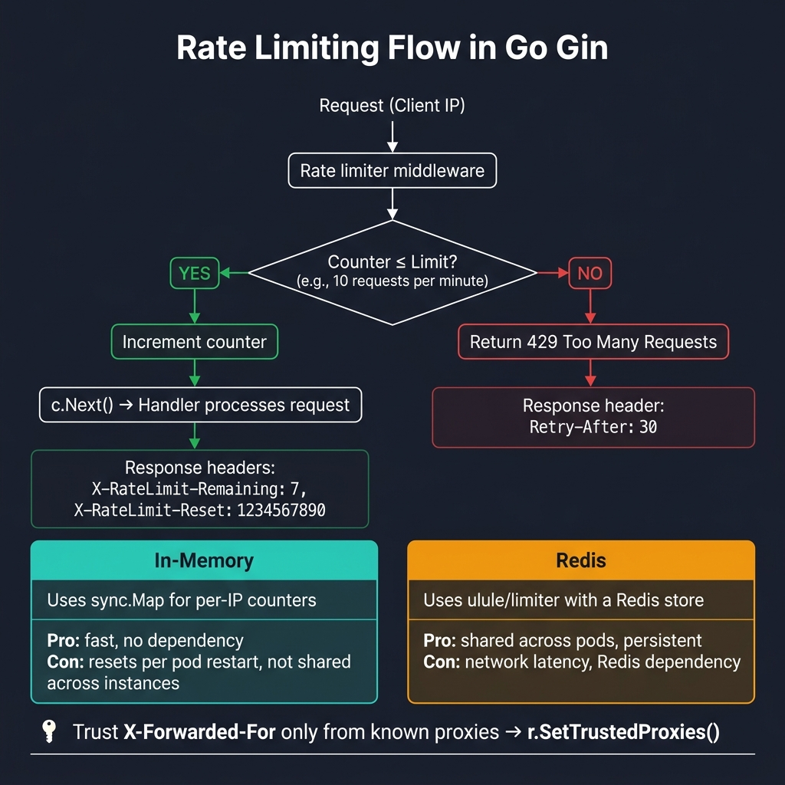

<!-- tags: golang --> # ⏱️ Giới hạn tỷ lệ — NestJS Throttler → Gin Limiter

> **Thư viện**: Yêu cầu điều tiết trên mỗi IP sử dụng bộ đếm trong bộ nhớ hoặc được Redis hỗ trợ `ulule/limiter` .

📅 Đã cập nhật: 19-04-2026 · ⏱️ 10 phút đọc

## 1. ĐỊNH NGHĨA

Không giới hạn tốc độ, một khách hàng có thể làm cạn kiệt các kết nối cơ sở dữ liệu của bạn hoặc các điểm cuối đăng nhập cưỡng bức. NestJS sử dụng `@nestjs/throttler` . Trong Go, hãy sử dụng bộ đếm mỗi IP (trong bộ nhớ) hoặc `ulule/limiter` (Redis) làm phần mềm trung gian.

| NestJS | Tương đương Gin |
| ----------------------------- | ------------------------------ |
| `ThrottlerModule.forRoot()` | `limiter.New(store, rate)` + phần mềm trung gian |
| `@Throttle(10, 60)` | `NewRateLimiter(10, 1*time.Minute)` |
| `@SkipThrottle()` | Không đính kèm phần mềm trung gian giới hạn vào tuyến đường |
| Lưu trữ Redis | `sredis.NewStoreWithOptions(client)` |

### Bất biến chính

- **Chỉ tin cậy `X-Forwarded-For` từ các proxy đã biết.** Gọi `r.SetTrustedProxies()` để tránh IP máy khách giả mạo.
- **Sử dụng Redis để triển khai nhiều phiên bản.** Đặt lại bộ đếm trong bộ nhớ cho mỗi nhóm.

## 2. HÌNH ẢNH  *Hình: Luồng giới hạn tốc độ — bộ đếm trên mỗi IP ≤ giới hạn → mức tăng + c.Next(); vượt quá giới hạn → 429 + Thử lại sau. Bộ nhớ: trong bộ nhớ (nhanh, mỗi nhóm) so với Redis (được chia sẻ giữa các phiên bản).*```mermaid
flowchart TD
    A["Request (IP)"] --> B["Rate Limiter"]
    B --> C{"counter\n≤ limit?"}
    C -->|Yes| D["Increment counter\nc.Next()"]
    C -->|No| E["429 Too Many Requests\nretry_after: window"]
```*Hình: Phần mềm trung gian giới hạn tốc độ — kiểm tra bộ đếm trên mỗi IP, mức tăng, trả về `429 Too Many Requests` khi vượt quá.*

### Luồng giới hạn tốc độ```text
GET /api/data (IP: 10.0.0.1)
    ├── Counter: 99/100 → increment to 100 → c.Next()
    └── Counter: 101/100 → 429 {"error": "rate limit exceeded", "retry_after": 60}
```## 3. MÃ

### Ví dụ 1: Cơ bản — Nhóm trong bộ nhớ```go
    // ━━━━━━━━━━━━━━━━━━━━━━━━━━━━━━━━━━━━━━━━━
    // In-memory rate limiter: per-IP counter with sliding window.
    // Background goroutine cleans expired entries.
    // ━━━━━━━━━━━━━━━━━━━━━━━━━━━━━━━━━━━━━━━━━
    package middleware

    import (
        "fmt"
        "net/http"
        "sync"
        "time"
        "github.com/gin-gonic/gin"
    )

    type RateLimiter struct {
        mu       sync.Mutex
        visitors map[string]*visitor
        limit    int
        window   time.Duration
    }

    type visitor struct {
        count    int
        lastSeen time.Time
    }

    func NewRateLimiter(limit int, window time.Duration) *RateLimiter {
        rl := &RateLimiter{
            visitors: make(map[string]*visitor),
            limit:    limit,
            window:   window,
        }
        go rl.cleanup()
        return rl
    }

    func (rl *RateLimiter) cleanup() {
        for {
            time.Sleep(rl.window)
            rl.mu.Lock()
            for ip, v := range rl.visitors {
                if time.Since(v.lastSeen) > rl.window {
                    delete(rl.visitors, ip)
                }
            }
            rl.mu.Unlock()
        }
    }

    func (rl *RateLimiter) Middleware() gin.HandlerFunc {
        return func(c *gin.Context) {
            ip := c.ClientIP()

            rl.mu.Lock()
            v, exists := rl.visitors[ip]
            if !exists || time.Since(v.lastSeen) > rl.window {
                rl.visitors[ip] = &visitor{count: 1, lastSeen: time.Now()}
                rl.mu.Unlock()
                c.Next()
                return
            }

            v.count++
            v.lastSeen = time.Now()
            remaining := rl.limit - v.count
            rl.mu.Unlock()

            c.Header("X-RateLimit-Limit", fmt.Sprintf("%d", rl.limit))
            c.Header("X-RateLimit-Remaining", fmt.Sprintf("%d", max(0, remaining)))

            if remaining < 0 {
                c.AbortWithStatusJSON(http.StatusTooManyRequests, gin.H{
                    "error":       "rate limit exceeded",
                    "retry_after": rl.window.Seconds(),
                })
                return
            }

            c.Next()
        }
    }
```### Ví dụ 2: Trung cấp — Chính sách theo từng tuyến đường```go
    // ━━━━━━━━━━━━━━━━━━━━━━━━━━━━━━━━━━━━━━━━━
    // Per-route rate limits: strict for login/OTP, relaxed for general API.
    // Global limiter applies to all routes.
    // ━━━━━━━━━━━━━━━━━━━━━━━━━━━━━━━━━━━━━━━━━
    package main

    import (
        "time"
        "github.com/gin-gonic/gin"
    )

    func main() {
        r := gin.Default()

        globalLimiter := NewRateLimiter(100, 1*time.Minute)
        r.Use(globalLimiter.Middleware())

        loginLimiter := NewRateLimiter(5, 1*time.Minute)
        r.POST("/auth/login", loginLimiter.Middleware())

        otpLimiter := NewRateLimiter(3, 5*time.Minute)
        r.POST("/auth/otp", otpLimiter.Middleware())

        r.GET("/health") 

        r.Run(":8080")
    }
```### Ví dụ 3: Nâng cao — Redis Store```go
    // ━━━━━━━━━━━━━━━━━━━━━━━━━━━━━━━━━━━━━━━━━
    // Redis-backed limiter via ulule/limiter.
    // Shared counters across all pods.
    // ━━━━━━━━━━━━━━━━━━━━━━━━━━━━━━━━━━━━━━━━━
    package main

    import (
        "context"
        "log"
        "net/http"
        "github.com/gin-gonic/gin"
        limiter "github.com/ulule/limiter/v3"
        mgin "github.com/ulule/limiter/v3/drivers/middleware/gin"
        sredis "github.com/ulule/limiter/v3/drivers/store/redis"
        "github.com/redis/go-redis/v9"
    )

    func main() {
        client := redis.NewClient(&redis.Options{
            Addr: "localhost:6379",
        })
        if err := client.Ping(context.Background()).Err(); err != nil {
            log.Fatal("Redis connection failed:", err)
        }

        rate, _ := limiter.NewRateFromFormatted("100-M")

        store, _ := sredis.NewStoreWithOptions(client, limiter.StoreOptions{
            Prefix: "api_limiter",
        })

        instance := limiter.New(store, rate)

        r := gin.Default()
        r.Use(mgin.NewMiddleware(instance))

        r.GET("/api/data", func(c *gin.Context) {
            c.JSON(http.StatusOK, gin.H{"message": "within rate limit"})
        })

        r.Run(":8080")
    }
```---

## 4. Cạm bẫy

| # | Mức độ nghiêm trọng | Khiếm khuyết | Tác động | Sửa chữa |
| --- | --- | --- | --- | --- |
| 1 | 🔴 Gây tử vong | Sử dụng `c.ClientIP()` mà không có `SetTrustedProxies` | Kẻ tấn công giả mạo `X-Forwarded-For` để vượt qua giới hạn tốc độ | Gọi `r.SetTrustedProxies([]string{"10.0.0.0/8"})` |
| 2 | 🟡 Chung | Bộ đếm trong bộ nhớ khi triển khai Kubernetes nhiều nhóm | Mỗi nhóm có bộ đếm riêng biệt; giới hạn hiệu quả = giới hạn × nhóm | Sử dụng cửa hàng được Redis hỗ trợ cho trạng thái chia sẻ |

---

## 5. GIỚI THIỆU

| Tài nguyên | Liên kết |
| --- | --- |
| ulule/bộ giới hạn | [github.com/ulule/limiter](https://github.com/ulule/limiter) |

---

## 6. KHUYẾN NGHỊ

| Gia hạn | Khi nào | Cơ sở lý luận | Tài nguyên |
| --- | --- | --- | --- |
| Cấu hình | Khi cần cấu hình giới hạn tốc độ | Tải giới hạn/cửa sổ từ cấu hình thay vì mã hóa cứng | [../techniques/01-configuration.md](../techniques/01-configuration.md) |