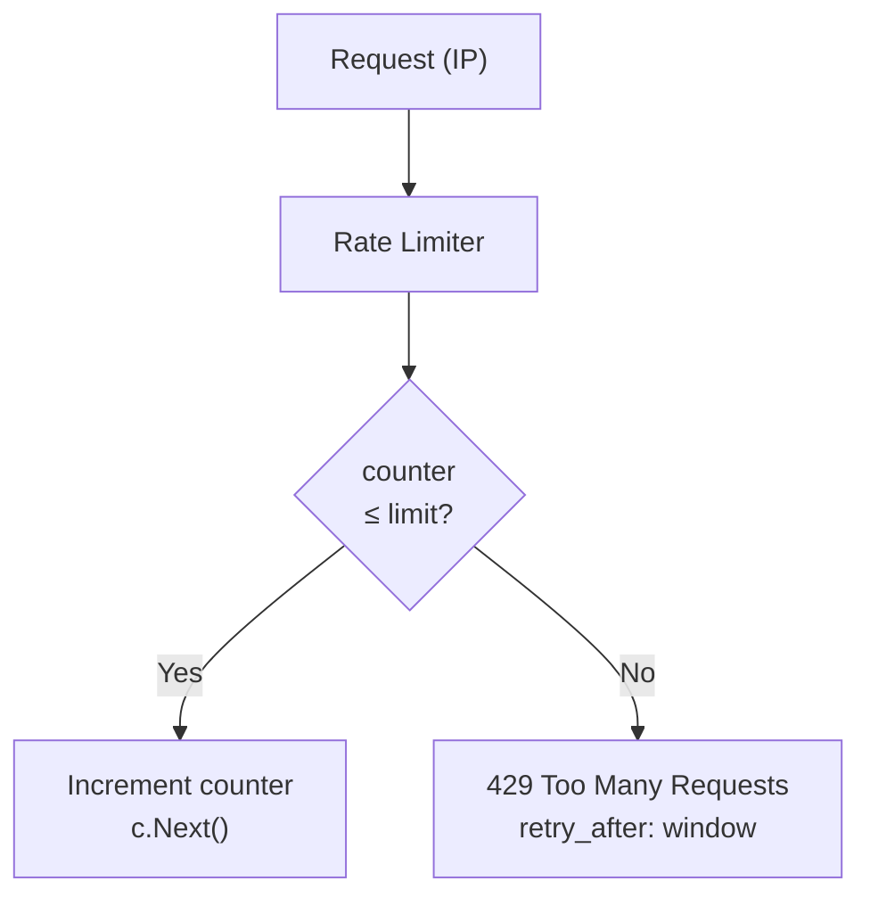

<!-- tags: golang -->
# ⏱️ Rate Limiting — NestJS Throttler → Gin Limiter

> **Library**: Throttle requests per IP using in-memory counters or Redis-backed `ulule/limiter`.

📅 Updated: 2026-04-19 · ⏱️ 10 min read

## 1. DEFINE

Without rate limiting, a single client can exhaust your database connections or brute-force login endpoints. NestJS uses `@nestjs/throttler`. In Go, use a per-IP counter (in-memory) or `ulule/limiter` (Redis) as middleware.

| NestJS                      | Gin Equivalent                          |
| --------------------------- | --------------------------------------- |
| `ThrottlerModule.forRoot()` | `limiter.New(store, rate)` + middleware |
| `@Throttle(10, 60)`         | `NewRateLimiter(10, 1*time.Minute)`     |
| `@SkipThrottle()`           | Don't attach limiter middleware to route |
| Redis storage               | `sredis.NewStoreWithOptions(client)`    |

### Key Invariants

- **Trust `X-Forwarded-For` only from known proxies.** Call `r.SetTrustedProxies()` to avoid spoofed client IPs.
- **Use Redis for multi-instance deployments.** In-memory counters reset per pod.

## 2. VISUAL


*Figure: Rate limit flow — per-IP counter ≤ limit → increment + c.Next(); over limit → 429 + Retry-After. Storage: in-memory (fast, per-pod) vs Redis (shared across instances).*



*Figure: Rate limiter middleware — check counter per IP, increment, return `429 Too Many Requests` when exceeded.*

### Rate Limit Flow

```text
GET /api/data (IP: 10.0.0.1)
    ├── Counter: 99/100 → increment to 100 → c.Next()
    └── Counter: 101/100 → 429 {"error": "rate limit exceeded", "retry_after": 60}
```

## 3. CODE

### Example 1: Basic — In-Memory Buckets

```go
    // ━━━━━━━━━━━━━━━━━━━━━━━━━━━━━━━━━━━━━━━━━
    // In-memory rate limiter: per-IP counter with sliding window.
    // Background goroutine cleans expired entries.
    // ━━━━━━━━━━━━━━━━━━━━━━━━━━━━━━━━━━━━━━━━━
    package middleware

    import (
        "fmt"
        "net/http"
        "sync"
        "time"
        "github.com/gin-gonic/gin"
    )

    type RateLimiter struct {
        mu       sync.Mutex
        visitors map[string]*visitor
        limit    int
        window   time.Duration
    }

    type visitor struct {
        count    int
        lastSeen time.Time
    }

    func NewRateLimiter(limit int, window time.Duration) *RateLimiter {
        rl := &RateLimiter{
            visitors: make(map[string]*visitor),
            limit:    limit,
            window:   window,
        }
        go rl.cleanup()
        return rl
    }

    func (rl *RateLimiter) cleanup() {
        for {
            time.Sleep(rl.window)
            rl.mu.Lock()
            for ip, v := range rl.visitors {
                if time.Since(v.lastSeen) > rl.window {
                    delete(rl.visitors, ip)
                }
            }
            rl.mu.Unlock()
        }
    }

    func (rl *RateLimiter) Middleware() gin.HandlerFunc {
        return func(c *gin.Context) {
            ip := c.ClientIP()

            rl.mu.Lock()
            v, exists := rl.visitors[ip]
            if !exists || time.Since(v.lastSeen) > rl.window {
                rl.visitors[ip] = &visitor{count: 1, lastSeen: time.Now()}
                rl.mu.Unlock()
                c.Next()
                return
            }

            v.count++
            v.lastSeen = time.Now()
            remaining := rl.limit - v.count
            rl.mu.Unlock()

            c.Header("X-RateLimit-Limit", fmt.Sprintf("%d", rl.limit))
            c.Header("X-RateLimit-Remaining", fmt.Sprintf("%d", max(0, remaining)))

            if remaining < 0 {
                c.AbortWithStatusJSON(http.StatusTooManyRequests, gin.H{
                    "error":       "rate limit exceeded",
                    "retry_after": rl.window.Seconds(),
                })
                return
            }

            c.Next()
        }
    }
```

### Example 2: Intermediate — Per-Route Policies

```go
    // ━━━━━━━━━━━━━━━━━━━━━━━━━━━━━━━━━━━━━━━━━
    // Per-route rate limits: strict for login/OTP, relaxed for general API.
    // Global limiter applies to all routes.
    // ━━━━━━━━━━━━━━━━━━━━━━━━━━━━━━━━━━━━━━━━━
    package main

    import (
        "time"
        "github.com/gin-gonic/gin"
    )

    func main() {
        r := gin.Default()

        globalLimiter := NewRateLimiter(100, 1*time.Minute)
        r.Use(globalLimiter.Middleware())

        loginLimiter := NewRateLimiter(5, 1*time.Minute)
        r.POST("/auth/login", loginLimiter.Middleware())

        otpLimiter := NewRateLimiter(3, 5*time.Minute)
        r.POST("/auth/otp", otpLimiter.Middleware())

        r.GET("/health") 

        r.Run(":8080")
    }
```

### Example 3: Advanced — Redis Store

```go
    // ━━━━━━━━━━━━━━━━━━━━━━━━━━━━━━━━━━━━━━━━━
    // Redis-backed limiter via ulule/limiter.
    // Shared counters across all pods.
    // ━━━━━━━━━━━━━━━━━━━━━━━━━━━━━━━━━━━━━━━━━
    package main

    import (
        "context"
        "log"
        "net/http"
        "github.com/gin-gonic/gin"
        limiter "github.com/ulule/limiter/v3"
        mgin "github.com/ulule/limiter/v3/drivers/middleware/gin"
        sredis "github.com/ulule/limiter/v3/drivers/store/redis"
        "github.com/redis/go-redis/v9"
    )

    func main() {
        client := redis.NewClient(&redis.Options{
            Addr: "localhost:6379",
        })
        if err := client.Ping(context.Background()).Err(); err != nil {
            log.Fatal("Redis connection failed:", err)
        }

        rate, _ := limiter.NewRateFromFormatted("100-M")

        store, _ := sredis.NewStoreWithOptions(client, limiter.StoreOptions{
            Prefix: "api_limiter",
        })

        instance := limiter.New(store, rate)

        r := gin.Default()
        r.Use(mgin.NewMiddleware(instance))

        r.GET("/api/data", func(c *gin.Context) {
            c.JSON(http.StatusOK, gin.H{"message": "within rate limit"})
        })

        r.Run(":8080")
    }
```

---

## 4. PITFALLS

| # | Severity | Defect | Impact | Fix |
| --- | --- | --- | --- | --- |
| 1 | 🔴 Fatal | Using `c.ClientIP()` without `SetTrustedProxies` | Attacker spoofs `X-Forwarded-For` to bypass rate limits | Call `r.SetTrustedProxies([]string{"10.0.0.0/8"})` |
| 2 | 🟡 Common | In-memory counters in multi-pod Kubernetes deploy | Each pod has separate counters; effective limit = limit × pods | Use Redis-backed store for shared state |

---

## 5. REF

| Resource | Link |
| --- | --- |
| ulule/limiter | [github.com/ulule/limiter](https://github.com/ulule/limiter) |

---

## 6. RECOMMEND

| Extension | When | Rationale | Resource |
| --- | --- | --- | --- |
| Configuration | When rate limits need to be configurable | Load limit/window from config instead of hardcoding | [../techniques/01-configuration.md](../techniques/01-configuration.md) |
