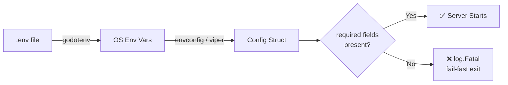

<!-- tags: golang, modules -->
# ⚙️ Configuration — NestJS ConfigModule → Go Viper/envconfig

> **Library**: Load env vars into typed Go structs using `envconfig` or `viper` — replacing NestJS `ConfigModule`.

📅 Updated: 2026-04-19 · ⏱️ 12 min read

## 1. DEFINE

Scattered `os.Getenv()` calls across a codebase hide missing values until runtime panics. Typed config structs with `required:"true"` tags crash fast at startup — before the first request arrives.

| NestJS                                  | Go Equivalent                                 |
| --------------------------------------- | --------------------------------------------- |
| `ConfigModule.forRoot({ envFilePath })` | `godotenv.Load()` or `viper.ReadInConfig()`   |
| `configService.get('DB_HOST')`          | `cfg.Database.Host` (typed struct field)       |
| Joi schema validation                   | Struct tags: `required:"true"`, `default:"x"` |
| `@nestjs/config` namespaces             | Nested config structs (AppConfig, DBConfig)    |

### Key Invariants

- **Fail at startup, not at request time.** Use `required:"true"` or `log.Fatal` if essential vars are missing.
- **Never commit `.env` files to git.** Use `.env.example` with placeholder values.

## 2. VISUAL


*Figure: Config flow — .env, OS env, CLI flags, YAML merge through envconfig/viper into a typed Go struct. Missing required fields crash at startup (fail-fast).*



*Figure: Config loading pipeline — `.env` file → OS env vars → struct binding → startup validation gate. Missing required fields crash the process immediately.*

### Config Resolution Order

```text
1. .env file loaded by godotenv (optional)
2. OS environment variables (override .env)
3. envconfig/viper binds to Config struct
4. Missing required fields → log.Fatal at startup
```

## 3. CODE

### Example 1: Basic — Struct-based Config

```go
    // ━━━━━━━━━━━━━━━━━━━━━━━━━━━━━━━━━━━━━━━━━
    // envconfig binds env vars to struct fields by tag name.
    // required:"true" crashes startup if the var is missing.
    // ━━━━━━━━━━━━━━━━━━━━━━━━━━━━━━━━━━━━━━━━━
    package config

    import (
        "log"
        "github.com/kelseyhightower/envconfig"
        "github.com/joho/godotenv"
    )

    type Config struct {
        App      AppConfig
        Database DatabaseConfig
    }

    type AppConfig struct {
        Name string `envconfig:"APP_NAME" default:"my-api"`
        Port int    `envconfig:"PORT" default:"8080"`
        Env  string `envconfig:"APP_ENV" default:"development"`
    }

    type DatabaseConfig struct {
        Host     string `envconfig:"DB_HOST" required:"true"`
        Port     int    `envconfig:"DB_PORT" default:"5432"`
        User     string `envconfig:"DB_USER" required:"true"`
        Password string `envconfig:"DB_PASSWORD" required:"true"`
        Name     string `envconfig:"DB_NAME" required:"true"`
    }

    func Load() *Config {
        _ = godotenv.Load()

        var cfg Config
        if err := envconfig.Process("", &cfg.App); err != nil {
            log.Fatalf("App config error: %v", err)
        }
        if err := envconfig.Process("", &cfg.Database); err != nil {
            log.Fatalf("Database config error: %v", err)
        }

        return &cfg
    }
```

### Example 2: Intermediate — Viper Configurations

```go
    // ━━━━━━━━━━━━━━━━━━━━━━━━━━━━━━━━━━━━━━━━━
    // Viper: reads YAML config file, merges with env vars.
    // AutomaticEnv overrides file values with OS env vars.
    // ━━━━━━━━━━━━━━━━━━━━━━━━━━━━━━━━━━━━━━━━━
    package config

    import (
        "log"
        "github.com/spf13/viper"
    )

    func LoadWithViper(env string) *Config {
        v := viper.New()

        v.SetConfigName(env)           
        v.SetConfigType("yaml")
        v.AddConfigPath("./configs")
        v.AddConfigPath(".")

        v.AutomaticEnv()

        v.SetDefault("server.port", 8080)
        v.SetDefault("database.sslmode", "disable")

        if err := v.ReadInConfig(); err != nil {
            log.Printf("No config file found, using env vars: %v", err)
        }

        var cfg Config
        if err := v.Unmarshal(&cfg); err != nil {
            log.Fatalf("Config unmarshal error: %v", err)
        }

        return &cfg
    }
```

---

## 4. PITFALLS

| # | Severity | Defect | Impact | Fix |
| --- | --- | --- | --- | --- |
| 1 | 🔴 Fatal | Committing `.env` with real credentials to git | Database passwords exposed in version history | Use `.env.example` + `.gitignore`; inject secrets via CI/CD |
| 2 | 🟡 Common | Using `os.Getenv()` directly instead of typed config struct | Missing var returns empty string; silent runtime bugs | Bind all vars to a struct with `required:"true"` tags |

---

## 5. REF

| Resource | Link |
| --- | --- |
| envconfig | [github.com/kelseyhightower/envconfig](https://github.com/kelseyhightower/envconfig) |
| viper | [github.com/spf13/viper](https://github.com/spf13/viper) |

---

## 6. RECOMMEND

| Extension | When | Rationale | Resource |
| --- | --- | --- | --- |
| Database & ORM | After config is loaded | Use `cfg.Database` to open GORM/sqlx connections | [./02-database-orm.md](./02-database-orm.md) |
