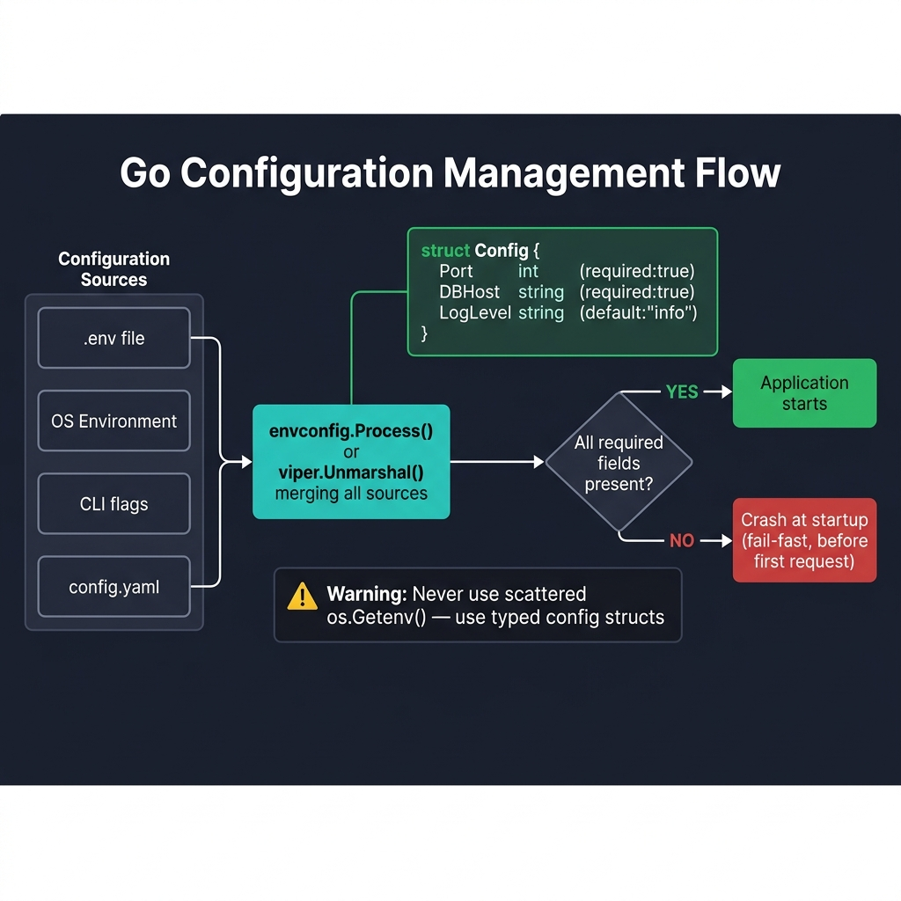

<!-- tags: golang, modules --> # ⚙️ Cấu hình — NestJS ConfigModule → Go Viper/envconfig

> **Thư viện**: Tải các vars env vào các cấu trúc Go đã gõ bằng cách sử dụng `envconfig` hoặc `viper` — thay thế NestJS `ConfigModule` .

📅 Cập nhật: 2026-04-19 · ⏱️ 12 phút đọc

## 1. ĐỊNH NGHĨA

Các lệnh gọi `os.Getenv()` rải rác trên một cơ sở mã sẽ ẩn các giá trị bị thiếu cho đến khi thời gian chạy bị hoảng loạn. Cấu trúc cấu hình đã nhập có thẻ `required:"true"` gặp sự cố nhanh khi khởi động — trước khi yêu cầu đầu tiên đến.

| NestJS | Đi tương đương |
| ------------------------------ | --------------------------------------------- |
| `ConfigModule.forRoot({ envFilePath })` | `godotenv.Load()` hoặc `viper.ReadInConfig()` |
| `configService.get('DB_HOST')` | `cfg.Database.Host` (trường cấu trúc đã nhập) |
| Xác thực lược đồ Joi | Thẻ cấu trúc: `required:"true"` , `default:"x"` |
| `@nestjs/config` không gian tên | Cấu trúc cấu hình lồng nhau (AppConfig, DBConfig) |

### Bất biến chính

- **Không thành công khi khởi động, không phải lúc yêu cầu.** Sử dụng `required:"true"` hoặc `log.Fatal` nếu thiếu các lọ thiết yếu.
- **Không bao giờ chuyển các tệp `.env` sang git.** Sử dụng `.env.example` với các giá trị giữ chỗ.

## 2. HÌNH ẢNH  *Hình: Luồng cấu hình — .env, OS env, cờ CLI, YAML hợp nhất thông qua envconfig/viper thành cấu trúc Go đã gõ. Thiếu các trường bắt buộc bị lỗi khi khởi động (không nhanh).*```mermaid
flowchart LR
    A[".env file"] -->|godotenv| B["OS Env Vars"]
    B -->|envconfig / viper| C["Config Struct"]
    C --> D{"required fields\npresent?"}
    D -->|Yes| E["✅ Server Starts"]
    D -->|No| F["❌ log.Fatal\nfail-fast exit"]
```*Hình: Đường dẫn tải cấu hình — tệp `.env` → OS env vars → liên kết cấu trúc → cổng xác thực khởi động. Việc thiếu các trường bắt buộc sẽ làm hỏng quy trình ngay lập tức.*

### Thứ tự giải quyết cấu hình```text
1. .env file loaded by godotenv (optional)
2. OS environment variables (override .env)
3. envconfig/viper binds to Config struct
4. Missing required fields → log.Fatal at startup
```## 3. MÃ

### Ví dụ 1: Cơ bản — Cấu hình dựa trên cấu trúc```go
    // ━━━━━━━━━━━━━━━━━━━━━━━━━━━━━━━━━━━━━━━━━
    // envconfig binds env vars to struct fields by tag name.
    // required:"true" crashes startup if the var is missing.
    // ━━━━━━━━━━━━━━━━━━━━━━━━━━━━━━━━━━━━━━━━━
    package config

    import (
        "log"
        "github.com/kelseyhightower/envconfig"
        "github.com/joho/godotenv"
    )

    type Config struct {
        App      AppConfig
        Database DatabaseConfig
    }

    type AppConfig struct {
        Name string `envconfig:"APP_NAME" default:"my-api"`
        Port int    `envconfig:"PORT" default:"8080"`
        Env  string `envconfig:"APP_ENV" default:"development"`
    }

    type DatabaseConfig struct {
        Host     string `envconfig:"DB_HOST" required:"true"`
        Port     int    `envconfig:"DB_PORT" default:"5432"`
        User     string `envconfig:"DB_USER" required:"true"`
        Password string `envconfig:"DB_PASSWORD" required:"true"`
        Name     string `envconfig:"DB_NAME" required:"true"`
    }

    func Load() *Config {
        _ = godotenv.Load()

        var cfg Config
        if err := envconfig.Process("", &cfg.App); err != nil {
            log.Fatalf("App config error: %v", err)
        }
        if err := envconfig.Process("", &cfg.Database); err != nil {
            log.Fatalf("Database config error: %v", err)
        }

        return &cfg
    }
```### Ví dụ 2: Trung cấp — Cấu hình Viper```go
    // ━━━━━━━━━━━━━━━━━━━━━━━━━━━━━━━━━━━━━━━━━
    // Viper: reads YAML config file, merges with env vars.
    // AutomaticEnv overrides file values with OS env vars.
    // ━━━━━━━━━━━━━━━━━━━━━━━━━━━━━━━━━━━━━━━━━
    package config

    import (
        "log"
        "github.com/spf13/viper"
    )

    func LoadWithViper(env string) *Config {
        v := viper.New()

        v.SetConfigName(env)           
        v.SetConfigType("yaml")
        v.AddConfigPath("./configs")
        v.AddConfigPath(".")

        v.AutomaticEnv()

        v.SetDefault("server.port", 8080)
        v.SetDefault("database.sslmode", "disable")

        if err := v.ReadInConfig(); err != nil {
            log.Printf("No config file found, using env vars: %v", err)
        }

        var cfg Config
        if err := v.Unmarshal(&cfg); err != nil {
            log.Fatalf("Config unmarshal error: %v", err)
        }

        return &cfg
    }
```---

## 4. Cạm bẫy

| # | Mức độ nghiêm trọng | Khiếm khuyết | Tác động | Sửa chữa |
| --- | --- | --- | --- | --- |
| 1 | 🔴 Gây tử vong | Cam kết `.env` bằng thông tin xác thực thực sự cho git | Mật khẩu cơ sở dữ liệu bị lộ trong lịch sử phiên bản | Sử dụng `.env.example` + `.gitignore` ; tiêm bí mật qua CI/CD |
| 2 | 🟡 Chung | Sử dụng trực tiếp `os.Getenv()` thay vì gõ config struct | Thiếu var trả về chuỗi trống; lỗi thời gian chạy im lặng | Liên kết tất cả các vars với một cấu trúc bằng thẻ `required:"true"` |

---

## 5. GIỚI THIỆU

| Tài nguyên | Liên kết |
| --- | --- |
| envconfig | [github.com/kelseyhightower/envconfig](https://github.com/kelseyhightower/envconfig) |
| rắn lục | [github.com/spf13/viper](https://github.com/spf13/viper) |

---

## 6. KHUYẾN NGHỊ

| Gia hạn | Khi nào | Cơ sở lý luận | Tài nguyên |
| --- | --- | --- | --- |
| Cơ sở dữ liệu & ORM | Sau khi tải xong cấu hình | Sử dụng `cfg.Database` để mở kết nối GORM/sqlx | [./02-database-orm.md](./02-database-orm.md) |