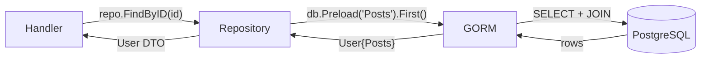

<!-- tags: golang -->
# 🗄️ Database & ORM — NestJS TypeORM → Go GORM/sqlx

> **Library**: Connect to PostgreSQL via GORM (ORM) or sqlx (raw SQL), implement the Repository pattern, and avoid N+1 queries.

📅 Updated: 2026-04-19 · ⏱️ 14 min read

## 1. DEFINE

GORM maps Go structs to database tables via struct tags. For NestJS developers: `@Entity()` becomes a struct, `repository.find()` becomes `db.Find(&users)`, and `@ManyToOne` becomes `gorm:"foreignKey:AuthorID"`.

| NestJS / TypeORM                | Go / GORM Equivalent                      |
| ------------------------------- | ----------------------------------------- |
| `@Entity()` decorator           | Plain struct + GORM tags                  |
| `@Column()`, `@PrimaryColumn()` | `gorm:"primaryKey"`, `gorm:"column:name"` |
| `TypeOrmModule.forRoot()`       | `gorm.Open(postgres.Open(dsn), &gorm.Config{})` |
| `repository.find()`             | `db.Find(&users)`                         |
| Relations: `@ManyToOne`         | `gorm:"foreignKey:UserID"`                |

### Key Invariants

- **Always `db.Preload("Posts")` for relations.** Without it, GORM loads only the parent — leading to nil slices.
- **Use the Repository pattern.** Handlers should never touch `*gorm.DB` directly.

## 2. VISUAL


*Figure: Database layer — Handler (HTTP) → Service (business logic) → Repository (GORM ORM or sqlx raw SQL) → PostgreSQL with connection pool tuning.*



*Figure: Handler → Repository → GORM → PostgreSQL. The handler never touches `*gorm.DB` directly.*

### Data Flow

```text
GET /users/:id
    └── Handler calls repo.FindByID(id)
        └── Repository calls db.Preload("Posts").First(&user, id)
            └── GORM generates: SELECT * FROM users WHERE id = $1;
                              SELECT * FROM posts WHERE author_id = $1;
```

## 3. CODE

### Example 1: Basic — GORM Setup

```go
    // ━━━━━━━━━━━━━━━━━━━━━━━━━━━━━━━━━━━━━━━━━
    // Open GORM connection, AutoMigrate User table.
    // Handlers use db directly (fine for tiny apps).
    // ━━━━━━━━━━━━━━━━━━━━━━━━━━━━━━━━━━━━━━━━━
    package main

    import (
        "log"
        "net/http"
        "time"
        "github.com/gin-gonic/gin"
        "gorm.io/driver/postgres"
        "gorm.io/gorm"
    )

    type User struct {
        ID        uint           `gorm:"primaryKey" json:"id"`
        Name      string         `gorm:"size:100;not null" json:"name"`
        Email     string         `gorm:"uniqueIndex;not null" json:"email"`
        CreatedAt time.Time      `json:"created_at"`
        UpdatedAt time.Time      `json:"updated_at"`
        DeletedAt gorm.DeletedAt `gorm:"index" json:"-"` 
    }

    func main() {
        dsn := "host=localhost user=postgres password=secret dbname=mydb port=5432 sslmode=disable"
        db, err := gorm.Open(postgres.Open(dsn), &gorm.Config{})
        if err != nil {
            log.Fatal("DB connection failed:", err)
        }

        db.AutoMigrate(&User{})
        r := gin.Default()

        r.GET("/users", func(c *gin.Context) {
            var users []User
            db.Find(&users)
            c.JSON(http.StatusOK, gin.H{"data": users})
        })

        r.POST("/users", func(c *gin.Context) {
            var user User
            if err := c.ShouldBindJSON(&user); err != nil {
                c.JSON(http.StatusBadRequest, gin.H{"error": err.Error()})
                return
            }
            db.Create(&user)
            c.JSON(http.StatusCreated, gin.H{"data": user})
        })

        r.Run(":8080")
    }
```

### Example 2: Intermediate — Repository Pattern

```go
    // ━━━━━━━━━━━━━━━━━━━━━━━━━━━━━━━━━━━━━━━━━
    // Repository pattern: inject *gorm.DB via constructor.
    // Preload("Posts") avoids N+1 on HasMany relations.
    // ━━━━━━━━━━━━━━━━━━━━━━━━━━━━━━━━━━━━━━━━━
    package users

    import (
        "time"
        "gorm.io/gorm"
    )

    type User struct {
        ID        uint           `gorm:"primaryKey" json:"id"`
        Name      string         `gorm:"size:100" json:"name"`
        Email     string         `gorm:"uniqueIndex" json:"email"`
        Posts     []Post         `gorm:"foreignKey:AuthorID" json:"posts,omitempty"` 
        CreatedAt time.Time      `json:"created_at"`
        DeletedAt gorm.DeletedAt `gorm:"index" json:"-"`
    }

    type Post struct {
        ID       uint   `gorm:"primaryKey" json:"id"`
        Title    string `json:"title"`
        AuthorID uint   `json:"author_id"`
    }

    type Repository struct {
        db *gorm.DB
    }

    func NewRepository(db *gorm.DB) *Repository {
        return &Repository{db: db}
    }

    func (r *Repository) FindAll(page, limit int) ([]User, int64, error) {
        var users []User
        var total int64

        r.db.Model(&User{}).Count(&total)
        err := r.db.Offset((page - 1) * limit).
            Limit(limit).
            Find(&users).Error

        return users, total, err
    }

    func (r *Repository) FindByID(id uint) (*User, error) {
        var user User
        err := r.db.Preload("Posts").First(&user, id).Error
        return &user, err
    }
```

---

## 4. PITFALLS

| # | Severity | Defect | Impact | Fix |
| --- | --- | --- | --- | --- |
| 1 | 🔴 Fatal | Calling `db.Find(&users)` inside a loop for related data | N+1 queries: 1 query per parent row | Use `db.Preload("Posts")` for eager loading |
| 2 | 🟡 Common | Using `db.AutoMigrate` in production | Uncontrolled schema changes with no rollback | Use a migration tool (goose, golang-migrate) |

---

## 5. REF

| Resource | Link |
| --- | --- |
| GORM Docs | [gorm.io/docs](https://gorm.io/docs/) |
| sqlx | [github.com/jmoiron/sqlx](https://github.com/jmoiron/sqlx) |

---

## 6. RECOMMEND

| Extension | When | Rationale | Resource |
| --- | --- | --- | --- |
| Validation & DTO | When binding request data before saving to DB | Validate input structs before they reach GORM | [./03-validation-dto.md](./03-validation-dto.md) |
