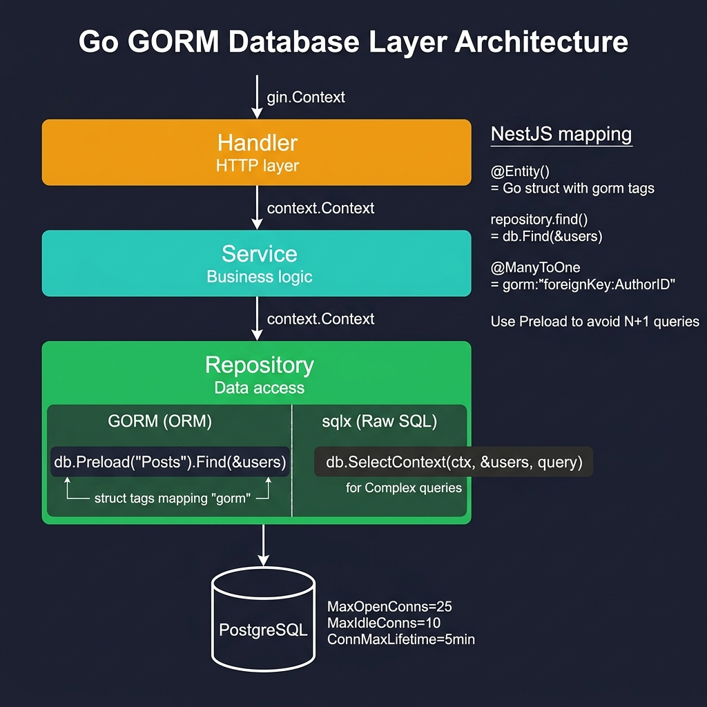

<!-- tags: golang --> # 🗄️ Cơ sở dữ liệu & ORM — NestJS TypeORM → Đi GORM/sqlx

> **Thư viện**: Kết nối với PostgreSQL thông qua GORM (ORM) hoặc sqlx (SQL thô), triển khai mẫu Kho lưu trữ và tránh các truy vấn N+1.

📅 Cập nhật: 2026-04-19 · ⏱️ 14 phút đọc

## 1. ĐỊNH NGHĨA

Bản đồ GORM Chuyển cấu trúc tới các bảng cơ sở dữ liệu thông qua thẻ struct. Đối với các nhà phát triển NestJS: `@Entity()` trở thành một cấu trúc, `repository.find()` trở thành `db.Find(&users)` và `@ManyToOne` trở thành `gorm:"foreignKey:AuthorID"` .

| NestJS / TypeORM | Đi/Tương đương GORM |
| ------------------------------- | ----------------------------------------- |
| `@Entity()` trang trí | Cấu trúc đơn giản + thẻ GORM |
| `@Column()` , `@PrimaryColumn()` | `gorm:"primaryKey"` , `gorm:"column:name"` |
| `TypeOrmModule.forRoot()` | `gorm.Open(postgres.Open(dsn), &gorm.Config{})` |
| `repository.find()` | `db.Find(&users)` |
| Quan hệ: `@ManyToOne` | `gorm:"foreignKey:UserID"` |

### Bất biến chính

- **Luôn luôn `db.Preload("Posts")` cho các mối quan hệ.** Nếu không có nó, GORM chỉ tải phần tử mẹ — dẫn đến các lát cắt không có giá trị.
- **Sử dụng mẫu Kho lưu trữ.** Trình xử lý không bao giờ được chạm trực tiếp vào `*gorm.DB` .

## 2. HÌNH ẢNH  *Hình: Lớp cơ sở dữ liệu — Trình xử lý (HTTP) → Dịch vụ (logic nghiệp vụ) → Kho lưu trữ (GORM ORM hoặc sqlx raw SQL) → PostgreSQL với điều chỉnh nhóm kết nối.*```mermaid
flowchart LR
    A["Handler"] -->|"repo.FindByID(id)"| B["Repository"]
    B -->|"db.Preload('Posts').First()"| C["GORM"]
    C -->|"SELECT + JOIN"| D[("PostgreSQL")]
    D -->|"rows"| C
    C -->|"User{Posts}"| B
    B -->|"User DTO"| A
```*Hình: Trình xử lý → Kho lưu trữ → GORM → PostgreSQL. Trình xử lý không bao giờ chạm trực tiếp vào `*gorm.DB` .*

### Luồng dữ liệu```text
GET /users/:id
    └── Handler calls repo.FindByID(id)
        └── Repository calls db.Preload("Posts").First(&user, id)
            └── GORM generates: SELECT * FROM users WHERE id = $1;
                              SELECT * FROM posts WHERE author_id = $1;
```## 3. MÃ

### Ví dụ 1: Cơ bản — Thiết lập GORM```go
    // ━━━━━━━━━━━━━━━━━━━━━━━━━━━━━━━━━━━━━━━━━
    // Open GORM connection, AutoMigrate User table.
    // Handlers use db directly (fine for tiny apps).
    // ━━━━━━━━━━━━━━━━━━━━━━━━━━━━━━━━━━━━━━━━━
    package main

    import (
        "log"
        "net/http"
        "time"
        "github.com/gin-gonic/gin"
        "gorm.io/driver/postgres"
        "gorm.io/gorm"
    )

    type User struct {
        ID        uint           `gorm:"primaryKey" json:"id"`
        Name      string         `gorm:"size:100;not null" json:"name"`
        Email     string         `gorm:"uniqueIndex;not null" json:"email"`
        CreatedAt time.Time      `json:"created_at"`
        UpdatedAt time.Time      `json:"updated_at"`
        DeletedAt gorm.DeletedAt `gorm:"index" json:"-"` 
    }

    func main() {
        dsn := "host=localhost user=postgres password=secret dbname=mydb port=5432 sslmode=disable"
        db, err := gorm.Open(postgres.Open(dsn), &gorm.Config{})
        if err != nil {
            log.Fatal("DB connection failed:", err)
        }

        db.AutoMigrate(&User{})
        r := gin.Default()

        r.GET("/users", func(c *gin.Context) {
            var users []User
            db.Find(&users)
            c.JSON(http.StatusOK, gin.H{"data": users})
        })

        r.POST("/users", func(c *gin.Context) {
            var user User
            if err := c.ShouldBindJSON(&user); err != nil {
                c.JSON(http.StatusBadRequest, gin.H{"error": err.Error()})
                return
            }
            db.Create(&user)
            c.JSON(http.StatusCreated, gin.H{"data": user})
        })

        r.Run(":8080")
    }
```### Ví dụ 2: Trung cấp — Mẫu kho lưu trữ```go
    // ━━━━━━━━━━━━━━━━━━━━━━━━━━━━━━━━━━━━━━━━━
    // Repository pattern: inject *gorm.DB via constructor.
    // Preload("Posts") avoids N+1 on HasMany relations.
    // ━━━━━━━━━━━━━━━━━━━━━━━━━━━━━━━━━━━━━━━━━
    package users

    import (
        "time"
        "gorm.io/gorm"
    )

    type User struct {
        ID        uint           `gorm:"primaryKey" json:"id"`
        Name      string         `gorm:"size:100" json:"name"`
        Email     string         `gorm:"uniqueIndex" json:"email"`
        Posts     []Post         `gorm:"foreignKey:AuthorID" json:"posts,omitempty"` 
        CreatedAt time.Time      `json:"created_at"`
        DeletedAt gorm.DeletedAt `gorm:"index" json:"-"`
    }

    type Post struct {
        ID       uint   `gorm:"primaryKey" json:"id"`
        Title    string `json:"title"`
        AuthorID uint   `json:"author_id"`
    }

    type Repository struct {
        db *gorm.DB
    }

    func NewRepository(db *gorm.DB) *Repository {
        return &Repository{db: db}
    }

    func (r *Repository) FindAll(page, limit int) ([]User, int64, error) {
        var users []User
        var total int64

        r.db.Model(&User{}).Count(&total)
        err := r.db.Offset((page - 1) * limit).
            Limit(limit).
            Find(&users).Error

        return users, total, err
    }

    func (r *Repository) FindByID(id uint) (*User, error) {
        var user User
        err := r.db.Preload("Posts").First(&user, id).Error
        return &user, err
    }
```---

## 4. Cạm bẫy

| # | Mức độ nghiêm trọng | Khiếm khuyết | Tác động | Sửa chữa |
| --- | --- | --- | --- | --- |
| 1 | 🔴 Gây tử vong | Gọi `db.Find(&users)` bên trong vòng lặp cho dữ liệu liên quan | Truy vấn N+1: 1 truy vấn trên mỗi hàng gốc | Sử dụng `db.Preload("Posts")` để tải háo hức |
| 2 | 🟡 Chung | Sử dụng `db.AutoMigrate` trong sản xuất | Thay đổi lược đồ không được kiểm soát mà không cần khôi phục | Sử dụng công cụ di chuyển (goose, golang-migrate) |

---

## 5. GIỚI THIỆU

| Tài nguyên | Liên kết |
| --- | --- |
| Tài liệu GORM | [gorm.io/docs](https://gorm.io/docs/) |
| sqlx | [github.com/jmoiron/sqlx](https://github.com/jmoiron/sqlx) |

---

## 6. KHUYẾN NGHỊ

| Gia hạn | Khi nào | Cơ sở lý luận | Tài nguyên |
| --- | --- | --- | --- |
| Xác thực & DTO | Khi liên kết dữ liệu yêu cầu trước khi lưu vào DB | Xác thực cấu trúc đầu vào trước khi chúng đạt GORM | [./03-validation-dto.md](./03-validation-dto.md) |