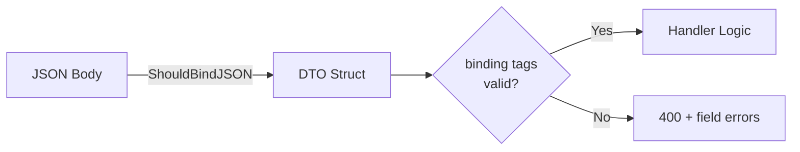

<!-- tags: golang -->
# ✅ Validation & DTO — NestJS Pipes → Gin Binding Tags

> **Library**: Validate request payloads using `binding:` struct tags, custom validators, and human-readable error messages.

📅 Updated: 2026-04-19 · ⏱️ 12 min read

## 1. DEFINE

NestJS uses `class-validator` decorators. Gin uses struct tags with `go-playground/validator`. The mental model is identical: declare rules on the DTO struct, and the framework rejects invalid input before your handler runs.

| NestJS / class-validator       | Gin / validator Equivalent             |
| ------------------------------ | -------------------------------------- |
| `@IsString()`                  | Go type system enforces this at compile time |
| `@IsEmail()`                   | `binding:"required,email"`             |
| `@MinLength(3)`                | `binding:"min=3"`                      |
| `@IsOptional()`                | Omit `required` from binding tag       |
| `@ValidateNested()`            | `binding:"dive"` for nested structs    |

### Key Invariants

- **Create separate DTOs for Create vs Update.** Update DTOs use pointer fields for PATCH semantics.
- **Register custom validators once at startup.** Calling `RegisterValidation` per-request wastes CPU and causes races.

## 2. VISUAL


*Figure: DTO validation — request body decoded into struct with binding tags + custom validators. Valid = clean DTO for handler; invalid = structured field-level error response.*



*Figure: Request body → DTO struct binding → validation gate. Invalid fields return 400 with per-field error details.*

### Validation Flow

```text
POST /users {"name":"","email":"bad","age":10}
    ├── ShouldBindJSON decodes into CreateUserDTO
    ├── Validator checks: name min=2 → FAIL, email format → FAIL, age gte=18 → FAIL
    └── Handler returns 400 with per-field error details
```

## 3. CODE

### Example 1: Basic — Struct Binding

```go
    // ━━━━━━━━━━━━━━━━━━━━━━━━━━━━━━━━━━━━━━━━━
    // CreateUserDTO: binding tags validate all fields.
    // UpdateUserDTO: pointer fields for PATCH (nil = not sent).
    // ━━━━━━━━━━━━━━━━━━━━━━━━━━━━━━━━━━━━━━━━━
    package dto

    type CreateUserDTO struct {
        Name     string `json:"name" binding:"required,min=2,max=100"`
        Email    string `json:"email" binding:"required,email"`
        Password string `json:"password" binding:"required,min=8"`
        Age      int    `json:"age" binding:"required,gte=18,lte=120"`
        Role     string `json:"role" binding:"required,oneof=admin user moderator"`
    }

    type UpdateUserDTO struct {
        Name  *string `json:"name,omitempty" binding:"omitempty,min=2,max=100"`
        Email *string `json:"email,omitempty" binding:"omitempty,email"`
        Age   *int    `json:"age,omitempty" binding:"omitempty,gte=18,lte=120"`
    }

    type PaginationDTO struct {
        Page  int    `form:"page" binding:"omitempty,gte=1"`
        Limit int    `form:"limit" binding:"omitempty,gte=1,lte=100"`
        Sort  string `form:"sort" binding:"omitempty,oneof=asc desc"`
    }

    func (p *PaginationDTO) SetDefaults() {
        if p.Page == 0 { p.Page = 1 }
        if p.Limit == 0 { p.Limit = 20 }
        if p.Sort == "" { p.Sort = "desc" }
    }
```

### Example 2: Intermediate — Custom Validators

```go
    // ━━━━━━━━━━━━━━━━━━━━━━━━━━━━━━━━━━━━━━━━━
    // Custom validators: strongpassword, phone, slug.
    // Register once at startup via binding.Validator.Engine().
    // ━━━━━━━━━━━━━━━━━━━━━━━━━━━━━━━━━━━━━━━━━
    package validator

    import (
        "regexp"
        "unicode"
        "github.com/gin-gonic/gin/binding"
        "github.com/go-playground/validator/v10"
    )

    func RegisterCustomValidators() {
        if v, ok := binding.Validator.Engine().(*validator.Validate); ok {
            v.RegisterValidation("strongpassword", func(fl validator.FieldLevel) bool {
                password := fl.Field().String()
                var hasUpper, hasLower, hasDigit, hasSpecial bool
                for _, c := range password {
                    switch {
                    case unicode.IsUpper(c): hasUpper = true
                    case unicode.IsLower(c): hasLower = true
                    case unicode.IsDigit(c): hasDigit = true
                    case unicode.IsPunct(c) || unicode.IsSymbol(c): hasSpecial = true
                    }
                }
                return hasUpper && hasLower && hasDigit && hasSpecial
            })

            v.RegisterValidation("phone", func(fl validator.FieldLevel) bool {
                phone := fl.Field().String()
                re := regexp.MustCompile(`^\+?[1-9]\d{9,14}$`)
                return re.MatchString(phone)
            })

            v.RegisterValidation("slug", func(fl validator.FieldLevel) bool {
                slug := fl.Field().String()
                re := regexp.MustCompile(`^[a-z0-9]+(-[a-z0-9]+)*$`)
                return re.MatchString(slug)
            })
        }
    }
```

### Example 3: Advanced — Message Translations

```go
    // ━━━━━━━━━━━━━━━━━━━━━━━━━━━━━━━━━━━━━━━━━
    // FormatValidationErrors: converts validator.ValidationErrors
    // into a JSON-friendly array with field name, message, value.
    // ━━━━━━━━━━━━━━━━━━━━━━━━━━━━━━━━━━━━━━━━━
    package middleware

    import (
        "net/http"
        "github.com/gin-gonic/gin"
        "github.com/go-playground/validator/v10"
    )

    var validationMessages = map[string]string{
        "required":       "field is required",
        "email":          "must be a valid email",
        "min":            "must be at least %s characters",
        "max":            "must be at most %s characters",
        "gte":            "must be greater than or equal to %s",
    }

    type ValidationError struct {
        Field   string `json:"field"`
        Message string `json:"message"`
        Value   any    `json:"value,omitempty"`
    }

    func FormatValidationErrors(err error) []ValidationError {
        var errors []ValidationError

        if validationErrors, ok := err.(validator.ValidationErrors); ok {
            for _, e := range validationErrors {
                errors = append(errors, ValidationError{
                    Field:   e.Field(),
                    Message: formatMessage(e),
                    Value:   e.Value(),
                })
            }
        }
        return errors
    }

    func formatMessage(e validator.FieldError) string {
        if msg, ok := validationMessages[e.Tag()]; ok {
            return msg
        }
        return e.Error()
    }

    func ValidationErrorHandler(c *gin.Context, err error) {
        c.JSON(http.StatusBadRequest, gin.H{
            "error":   "validation failed",
            "details": FormatValidationErrors(err),
        })
    }
```

---

## 4. PITFALLS

| # | Severity | Defect | Impact | Fix |
| --- | --- | --- | --- | --- |
| 1 | 🔴 Fatal | Missing `binding:"dive"` on nested struct slices | Inner struct fields are never validated | Add `binding:"dive"` to the slice tag |
| 2 | 🟡 Common | Returning raw `validator.ValidationErrors` to the client | Exposes internal Go struct names and tags | Use `FormatValidationErrors` to build a clean error array |

---

## 5. REF

| Resource | Link |
| --- | --- |
| go-playground | [pkg.go.dev/github.com/go-playground/validator/v10](https://pkg.go.dev/github.com/go-playground/validator/v10) |

---

## 6. RECOMMEND

| Extension | When | Rationale | Resource |
| --- | --- | --- | --- |
| Caching | When validated responses can be cached | Avoids re-querying for identical validated requests | [./04-caching.md](./04-caching.md) |
