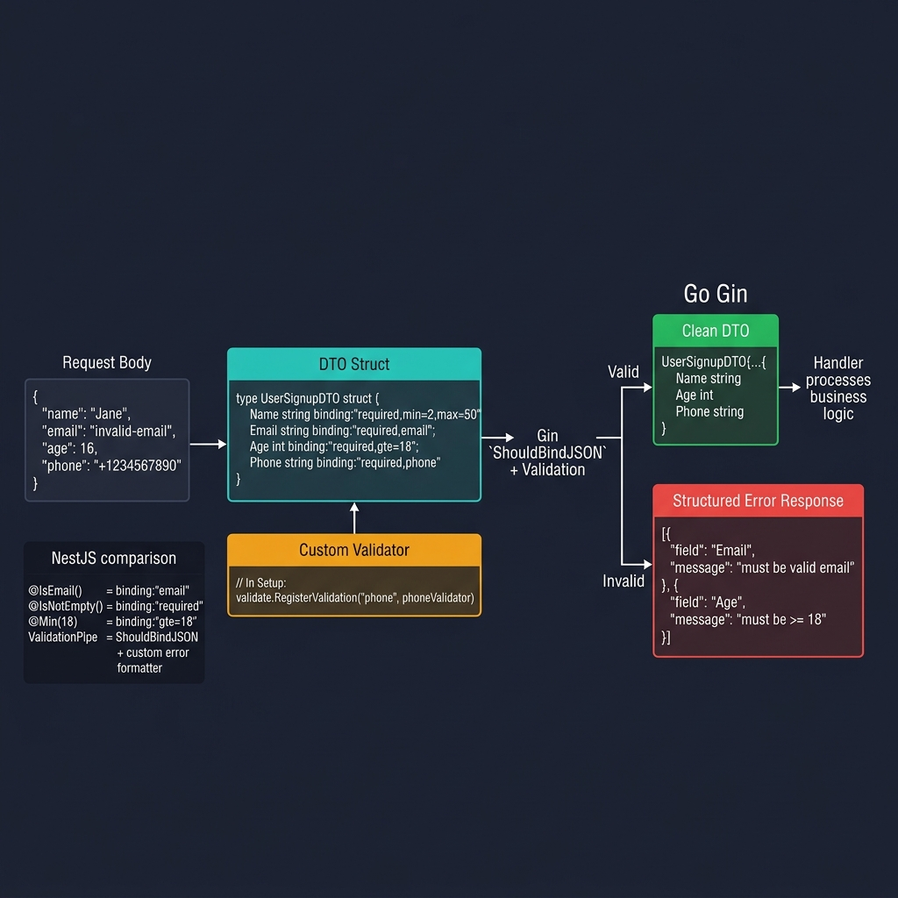

<!-- tags: golang --> # ✅ Xác thực & DTO — NestJS Pipes → Thẻ Gin Binding

> **Thư viện**: Xác thực tải trọng yêu cầu bằng cách sử dụng thẻ cấu trúc `binding:` , trình xác thực tùy chỉnh và thông báo lỗi mà con người có thể đọc được.

📅 Cập nhật: 2026-04-19 · ⏱️ 12 phút đọc

## 1. ĐỊNH NGHĨA

NestJS sử dụng trang trí `class-validator` . Gin sử dụng thẻ struct với `go-playground/validator` . Mô hình tinh thần giống hệt nhau: khai báo các quy tắc trên cấu trúc DTO và khung từ chối đầu vào không hợp lệ trước khi trình xử lý của bạn chạy.

| NestJS / trình xác thực lớp | Gin / trình xác nhận tương đương |
| ------------------------------ | -------------------------------------- |
| `@IsString()` | Hệ thống kiểu Go thực thi điều này tại thời điểm biên dịch |
| `@IsEmail()` | `binding:"required,email"` |
| `@MinLength(3)` | `binding:"min=3"` |
| `@IsOptional()` | Bỏ qua `required` khỏi thẻ liên kết |
| `@ValidateNested()` | `binding:"dive"` cho các cấu trúc lồng nhau |

### Bất biến chính

- **Tạo các DTO riêng biệt cho Tạo và Cập nhật.** Cập nhật DTO sử dụng các trường con trỏ cho ngữ nghĩa PATCH.
- **Đăng ký trình xác nhận tùy chỉnh một lần khi khởi động.** Gọi `RegisterValidation` theo yêu cầu sẽ gây lãng phí CPU và gây ra các cuộc đua.

## 2. HÌNH ẢNH  *Hình: Xác thực DTO — phần thân yêu cầu được giải mã thành cấu trúc với các thẻ liên kết + trình xác thực tùy chỉnh. Hợp lệ = DTO sạch cho trình xử lý; không hợp lệ = phản hồi lỗi cấp trường có cấu trúc.*```mermaid
flowchart LR
    A["JSON Body"] -->|ShouldBindJSON| B["DTO Struct"]
    B --> C{"binding tags\nvalid?"}
    C -->|Yes| D["Handler Logic"]
    C -->|No| E["400 + field errors"]
```*Hình: Nội dung yêu cầu → Liên kết cấu trúc DTO → cổng xác thực. Các trường không hợp lệ trả về 400 kèm theo chi tiết lỗi trên mỗi trường.*

### Luồng xác thực```text
POST /users {"name":"","email":"bad","age":10}
    ├── ShouldBindJSON decodes into CreateUserDTO
    ├── Validator checks: name min=2 → FAIL, email format → FAIL, age gte=18 → FAIL
    └── Handler returns 400 with per-field error details
```## 3. MÃ

### Ví dụ 1: Cơ bản — Liên kết cấu trúc```go
    // ━━━━━━━━━━━━━━━━━━━━━━━━━━━━━━━━━━━━━━━━━
    // CreateUserDTO: binding tags validate all fields.
    // UpdateUserDTO: pointer fields for PATCH (nil = not sent).
    // ━━━━━━━━━━━━━━━━━━━━━━━━━━━━━━━━━━━━━━━━━
    package dto

    type CreateUserDTO struct {
        Name     string `json:"name" binding:"required,min=2,max=100"`
        Email    string `json:"email" binding:"required,email"`
        Password string `json:"password" binding:"required,min=8"`
        Age      int    `json:"age" binding:"required,gte=18,lte=120"`
        Role     string `json:"role" binding:"required,oneof=admin user moderator"`
    }

    type UpdateUserDTO struct {
        Name  *string `json:"name,omitempty" binding:"omitempty,min=2,max=100"`
        Email *string `json:"email,omitempty" binding:"omitempty,email"`
        Age   *int    `json:"age,omitempty" binding:"omitempty,gte=18,lte=120"`
    }

    type PaginationDTO struct {
        Page  int    `form:"page" binding:"omitempty,gte=1"`
        Limit int    `form:"limit" binding:"omitempty,gte=1,lte=100"`
        Sort  string `form:"sort" binding:"omitempty,oneof=asc desc"`
    }

    func (p *PaginationDTO) SetDefaults() {
        if p.Page == 0 { p.Page = 1 }
        if p.Limit == 0 { p.Limit = 20 }
        if p.Sort == "" { p.Sort = "desc" }
    }
```### Ví dụ 2: Trung cấp — Trình xác thực tùy chỉnh```go
    // ━━━━━━━━━━━━━━━━━━━━━━━━━━━━━━━━━━━━━━━━━
    // Custom validators: strongpassword, phone, slug.
    // Register once at startup via binding.Validator.Engine().
    // ━━━━━━━━━━━━━━━━━━━━━━━━━━━━━━━━━━━━━━━━━
    package validator

    import (
        "regexp"
        "unicode"
        "github.com/gin-gonic/gin/binding"
        "github.com/go-playground/validator/v10"
    )

    func RegisterCustomValidators() {
        if v, ok := binding.Validator.Engine().(*validator.Validate); ok {
            v.RegisterValidation("strongpassword", func(fl validator.FieldLevel) bool {
                password := fl.Field().String()
                var hasUpper, hasLower, hasDigit, hasSpecial bool
                for _, c := range password {
                    switch {
                    case unicode.IsUpper(c): hasUpper = true
                    case unicode.IsLower(c): hasLower = true
                    case unicode.IsDigit(c): hasDigit = true
                    case unicode.IsPunct(c) || unicode.IsSymbol(c): hasSpecial = true
                    }
                }
                return hasUpper && hasLower && hasDigit && hasSpecial
            })

            v.RegisterValidation("phone", func(fl validator.FieldLevel) bool {
                phone := fl.Field().String()
                re := regexp.MustCompile(`^\+?[1-9]\d{9,14}$`)
                return re.MatchString(phone)
            })

            v.RegisterValidation("slug", func(fl validator.FieldLevel) bool {
                slug := fl.Field().String()
                re := regexp.MustCompile(`^[a-z0-9]+(-[a-z0-9]+)*$`)
                return re.MatchString(slug)
            })
        }
    }
```### Ví dụ 3: Nâng cao — Dịch tin nhắn```go
    // ━━━━━━━━━━━━━━━━━━━━━━━━━━━━━━━━━━━━━━━━━
    // FormatValidationErrors: converts validator.ValidationErrors
    // into a JSON-friendly array with field name, message, value.
    // ━━━━━━━━━━━━━━━━━━━━━━━━━━━━━━━━━━━━━━━━━
    package middleware

    import (
        "net/http"
        "github.com/gin-gonic/gin"
        "github.com/go-playground/validator/v10"
    )

    var validationMessages = map[string]string{
        "required":       "field is required",
        "email":          "must be a valid email",
        "min":            "must be at least %s characters",
        "max":            "must be at most %s characters",
        "gte":            "must be greater than or equal to %s",
    }

    type ValidationError struct {
        Field   string `json:"field"`
        Message string `json:"message"`
        Value   any    `json:"value,omitempty"`
    }

    func FormatValidationErrors(err error) []ValidationError {
        var errors []ValidationError

        if validationErrors, ok := err.(validator.ValidationErrors); ok {
            for _, e := range validationErrors {
                errors = append(errors, ValidationError{
                    Field:   e.Field(),
                    Message: formatMessage(e),
                    Value:   e.Value(),
                })
            }
        }
        return errors
    }

    func formatMessage(e validator.FieldError) string {
        if msg, ok := validationMessages[e.Tag()]; ok {
            return msg
        }
        return e.Error()
    }

    func ValidationErrorHandler(c *gin.Context, err error) {
        c.JSON(http.StatusBadRequest, gin.H{
            "error":   "validation failed",
            "details": FormatValidationErrors(err),
        })
    }
```---

## 4. Cạm bẫy

| # | Mức độ nghiêm trọng | Khiếm khuyết | Tác động | Sửa chữa |
| --- | --- | --- | --- | --- |
| 1 | 🔴 Gây tử vong | Thiếu `binding:"dive"` trên các lát cấu trúc lồng nhau | Các trường cấu trúc bên trong không bao giờ được xác thực | Thêm `binding:"dive"` vào thẻ lát |
| 2 | 🟡 Chung | Trả lại `validator.ValidationErrors` thô cho khách hàng | Hiển thị tên và thẻ cấu trúc Go nội bộ | Sử dụng `FormatValidationErrors` để xây dựng một mảng lỗi rõ ràng |

---

## 5. GIỚI THIỆU

| Tài nguyên | Liên kết |
| --- | --- |
| go-sân chơi | [pkg.go.dev/github.com/go-playground/validator/v10](https://pkg.go.dev/github.com/go-playground/validator/v10) |

---

## 6. KHUYẾN NGHỊ

| Gia hạn | Khi nào | Cơ sở lý luận | Tài nguyên |
| --- | --- | --- | --- |
| Bộ nhớ đệm | Khi phản hồi được xác thực có thể được lưu vào bộ đệm | Tránh truy vấn lại các yêu cầu được xác thực giống hệt nhau | [./04-caching.md](./04-caching.md) |