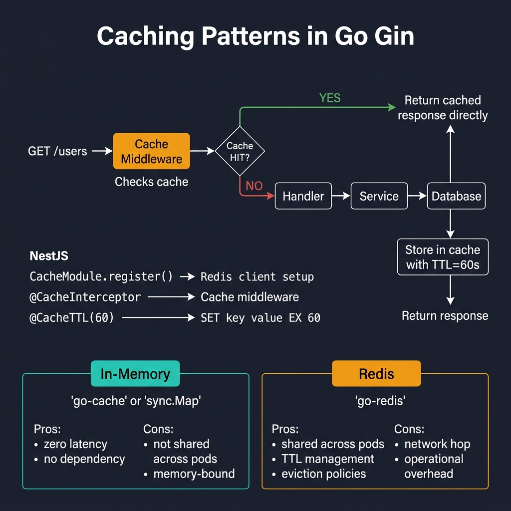
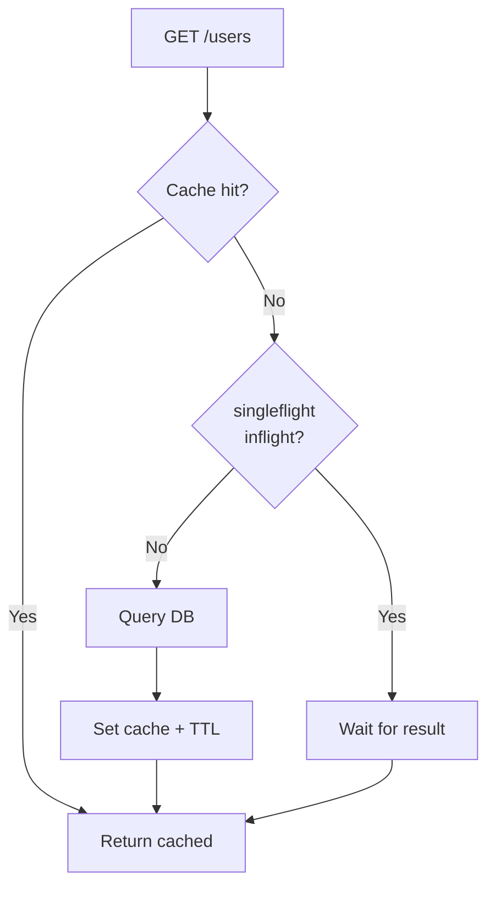

<!-- tags: golang, memory, modules -->
# 💾 Caching — NestJS CacheModule → Go Redis/In-memory

> **Library**: Cache responses using Redis or in-memory stores to reduce database load and latency.

📅 Updated: 2026-04-19 · ⏱️ 10 min read

## 1. DEFINE

Without caching, every GET request hits the database. With a 60-second Redis TTL, the database handles one query per minute instead of thousands. Gin has no built-in cache module — you implement it with Redis or a middleware interceptor.

| NestJS                               | Go Equivalent                          |
| ------------------------------------ | -------------------------------------- |
| `CacheModule.register()`             | `redis.NewClient()` or `cache.New()`   |
| `@CacheKey('users')`                 | Manual cache key: `"users:list"`        |
| `@CacheTTL(30)`                      | `rdb.Set(ctx, key, data, 30*time.Second)` |
| `@UseInterceptors(CacheInterceptor)` | CacheMiddleware (checks cache before handler) |

### Key Invariants

- **Invalidate on write.** `POST/PUT/DELETE` must `rdb.Del()` the affected cache keys.
- **Use `singleflight` for cache stampede.** Without it, 1000 concurrent cache misses trigger 1000 identical DB queries.

## 2. VISUAL



*Figure: Cache-aside — request hits cache middleware first. HIT = return cached response. MISS = fetch from DB, store in cache with TTL. In-memory (fast, per-pod) vs Redis (shared, persistent).*



*Figure: Cache-aside with singleflight — only one goroutine queries DB on miss; others wait for the result.*

### Cache-Aside Flow

```text
GET /users
    ├── Redis hit?  → return cached JSON (source: cache)
    └── Redis miss? → query DB → serialize → SET in Redis (TTL 60s) → return JSON (source: db)
```

## 3. CODE

### Example 1: Basic — Redis Client Cache

```go
    // ━━━━━━━━━━━━━━━━━━━━━━━━━━━━━━━━━━━━━━━━━
    // Cache-aside: check Redis → miss → query DB → SET cache.
    // createUser invalidates cache to avoid stale data.
    // ━━━━━━━━━━━━━━━━━━━━━━━━━━━━━━━━━━━━━━━━━
    package main

    import (
        "encoding/json"
        "net/http"
        "time"
        "github.com/gin-gonic/gin"
        "github.com/redis/go-redis/v9"
    )

    var rdb *redis.Client

    func init() {
        rdb = redis.NewClient(&redis.Options{Addr: "localhost:6379"})
    }

    func fetchUsersFromDB() []map[string]any {
        return []map[string]any{
            {"id": 1, "name": "Alice"},
        }
    }

    func listUsers(c *gin.Context) {
        ctx := c.Request.Context()

        cached, err := rdb.Get(ctx, "users:list").Result()
        if err == nil {
            var users []map[string]any
            json.Unmarshal([]byte(cached), &users)
            c.JSON(http.StatusOK, gin.H{"data": users, "source": "cache"})
            return
        }

        users := fetchUsersFromDB()

        data, _ := json.Marshal(users)
        rdb.Set(ctx, "users:list", data, 60*time.Second)

        c.JSON(http.StatusOK, gin.H{"data": users, "source": "db"})
    }

    func createUser(c *gin.Context) {
        rdb.Del(c.Request.Context(), "users:list") 
        c.JSON(http.StatusCreated, gin.H{"message": "created"})
    }
```

### Example 2: Intermediate — Response Interceptors

```go
    // ━━━━━━━━━━━━━━━━━━━━━━━━━━━━━━━━━━━━━━━━━
    // CacheMiddleware: intercepts GET requests, returns cached
    // response or captures handler output to cache.
    // ━━━━━━━━━━━━━━━━━━━━━━━━━━━━━━━━━━━━━━━━━
    package middleware

    import (
        "crypto/sha256"
        "encoding/hex"
        "encoding/json"
        "net/http"
        "time"
        "github.com/gin-gonic/gin"
        "github.com/redis/go-redis/v9"
    )

    func CacheMiddleware(rdb *redis.Client, ttl time.Duration) gin.HandlerFunc {
        return func(c *gin.Context) {
            if c.Request.Method != http.MethodGet {
                c.Next()
                return
            }

            hash := sha256.Sum256([]byte(c.Request.URL.RequestURI()))
            key := "cache:" + hex.EncodeToString(hash[:])
            ctx := c.Request.Context()

            cached, err := rdb.Get(ctx, key).Result()
            if err == nil {
                var response map[string]any
                json.Unmarshal([]byte(cached), &response)
                c.JSON(http.StatusOK, response)
                c.Abort()
                return
            }

            w := &responseCapture{ResponseWriter: c.Writer}
            c.Writer = w

            c.Next()

            if c.Writer.Status() == http.StatusOK && len(w.body) > 0 {
                rdb.Set(ctx, key, w.body, ttl)
            }
        }
    }

    type responseCapture struct {
        gin.ResponseWriter
        body []byte
    }

    func (w *responseCapture) Write(b []byte) (int, error) {
        w.body = append(w.body, b...)
        return w.ResponseWriter.Write(b)
    }
```

---

## 4. PITFALLS

| # | Severity | Defect | Impact | Fix |
| --- | --- | --- | --- | --- |
| 1 | 🔴 Fatal | No cache invalidation on writes | Clients see stale data after create/update | `rdb.Del()` affected keys in every write handler |
| 2 | 🔴 Fatal | Cache stampede: 1000 concurrent misses query DB simultaneously | Database connection pool exhausted | Use `golang.org/x/sync/singleflight` to deduplicate |

---

## 5. REF

| Resource | Link |
| --- | --- |
| Redis Go | [redis.io/docs/latest/develop/clients/go/](https://redis.io/docs/latest/develop/clients/go/) |

---

## 6. RECOMMEND

| Extension | When | Rationale | Resource |
| --- | --- | --- | --- |
| Logging | When debugging cache hits/misses in production | Structured logs with request ID help trace cache behavior | [./05-logging.md](./05-logging.md) |
