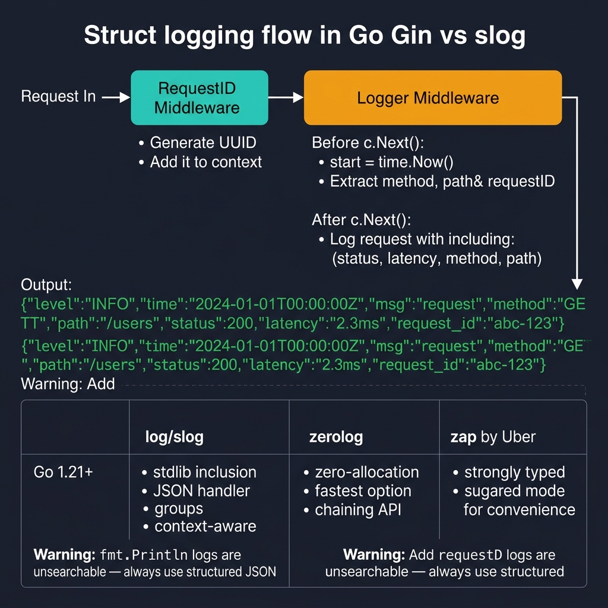
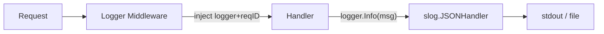

<!-- tags: golang -->
# 📋 Logging — NestJS Logger → Go slog/zap/zerolog

> **Library**: Structured logging with Go 1.21+ `log/slog`, request-scoped context, and correlation IDs.

📅 Updated: 2026-04-19 · ⏱️ 10 min read

## 1. DEFINE

`fmt.Println` logs are unsearchable. Structured JSON logs with request IDs, method, path, status, and duration let you `grep` any request in production. Go 1.21+ ships `log/slog` in the standard library.

| NestJS                         | Go Equivalent                         |
| ------------------------------ | ------------------------------------- |
| `Logger.log/warn/error()`      | `slog.Info/Warn/Error()`              |
| `app.useLogger(WinstonModule)` | `slog.SetDefault(jsonHandler)`        |
| `@Injectable() LoggerService`  | Inject `*slog.Logger` via constructor |
| Request logs                   | Middleware logs method/path/status/duration |

### Key Invariants

- **Log request ID in every line.** Without it, you can’t correlate logs across middleware and handlers.
- **Never log passwords, tokens, or PII.** Scrub sensitive fields before logging.

## 2. VISUAL



*Figure: Logging flow — RequestID middleware generates UUID → Logger middleware wraps c.Next() with timing → structured JSON output with method, path, status, latency, request_id.*



*Figure: Request → middleware injects request-scoped logger with X-Request-ID → handler logs structured JSON via slog.*

### Log Correlation

```text
Request arrives → RequestID middleware generates UUID
    → Creates slog.Logger.With("request_id", uuid)
    → Stores in c.Set("logger", logger)
    → Handler: logger.Info("user created", "user_id", 42)
    → Output: {"level":"INFO","request_id":"abc-123","msg":"user created","user_id":42}
```

## 3. CODE

### Example 1: Basic — Native Structure Logging

```go
    // ━━━━━━━━━━━━━━━━━━━━━━━━━━━━━━━━━━━━━━━━━
    // slog.NewJSONHandler outputs structured JSON logs.
    // RequestLogger middleware logs method/path/status/duration.
    // ━━━━━━━━━━━━━━━━━━━━━━━━━━━━━━━━━━━━━━━━━
    package main

    import (
        "log/slog"
        "os"
        "time"
        "github.com/gin-gonic/gin"
    )

    func main() {
        logger := slog.New(slog.NewJSONHandler(os.Stdout, &slog.HandlerOptions{
            Level: slog.LevelInfo,
        }))
        slog.SetDefault(logger)

        r := gin.New() 
        r.Use(RequestLogger(logger), gin.Recovery())

        r.GET("/health", func(c *gin.Context) {
            slog.Info("health check", "status", "ok")
            c.JSON(200, gin.H{"status": "ok"})
        })

        r.Run(":8080")
    }

    func RequestLogger(logger *slog.Logger) gin.HandlerFunc {
        return func(c *gin.Context) {
            start := time.Now()

            c.Next()

            logger.LogAttrs(c.Request.Context(), slog.LevelInfo, "http request",
                slog.String("method", c.Request.Method),
                slog.String("path", c.Request.URL.Path),
                slog.Int("status", c.Writer.Status()),
                slog.Duration("duration", time.Since(start)),
                slog.String("ip", c.ClientIP()),
            )
        }
    }
```

### Example 2: Intermediate — Contextual Scoping

```go
    // ━━━━━━━━━━━━━━━━━━━━━━━━━━━━━━━━━━━━━━━━━
    // RequestID middleware: generates UUID, creates scoped logger,
    // stores in gin.Context for downstream handlers.
    // ━━━━━━━━━━━━━━━━━━━━━━━━━━━━━━━━━━━━━━━━━
    package middleware

    import (
        "log/slog"
        "github.com/gin-gonic/gin"
        "github.com/google/uuid"
    )

    func RequestID() gin.HandlerFunc {
        return func(c *gin.Context) {
            id := c.GetHeader("X-Request-ID")
            if id == "" {
                id = uuid.New().String()
            }
            c.Set("requestID", id)
            c.Header("X-Request-ID", id)

            logger := slog.Default().With(
                "request_id", id,
                "method", c.Request.Method,
                "path", c.Request.URL.Path,
            )
            c.Set("logger", logger)

            c.Next()
        }
    }
```

---

## 4. PITFALLS

| # | Severity | Defect | Impact | Fix |
| --- | --- | --- | --- | --- |
| 1 | 🔴 Fatal | Logging passwords, JWT tokens, or credit card numbers | Credentials exposed in log aggregators | Scrub sensitive fields; never log `Authorization` header values |
| 2 | 🟡 Common | Using `fmt.Println` instead of structured logger | Logs are unsearchable, no request correlation | Use `slog` with JSON handler and request ID |

---

## 5. REF

| Resource | Link |
| --- | --- |
| log/slog | [pkg.go.dev/log/slog](https://pkg.go.dev/log/slog) |

---

## 6. RECOMMEND

| Extension | When | Rationale | Resource |
| --- | --- | --- | --- |
| Sessions & Cookies | When you need to persist user state across requests | Session data ties to request IDs for debugging auth flows | [./06-session-cookies.md](./06-session-cookies.md) |
