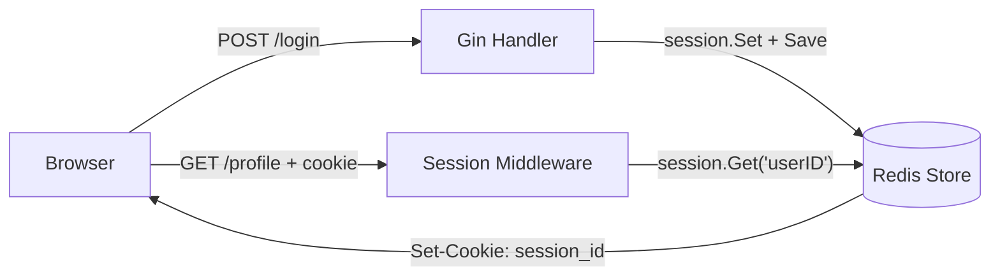

<!-- tags: golang -->
# 🍪 Session & Cookies — NestJS express-session → Gin gin-contrib/sessions

> **Library**: Set/read cookies with `c.SetCookie`/`c.Cookie`, and manage server-side sessions via `gin-contrib/sessions` with Redis.

📅 Updated: 2026-04-19 · ⏱️ 10 min read

## 1. DEFINE

Cookies are client-side key-value pairs sent on every request. Sessions are server-side state keyed by a session ID cookie. Use cookies for preferences; use sessions backed by Redis for auth state.

| NestJS                       | Gin Equivalent                           |
| ---------------------------- | ---------------------------------------- |
| `express-session`            | `gin-contrib/sessions`                   |
| `req.session.userId`         | `session.Set("userID", id)`              |
| `res.cookie('name', 'val')`  | `c.SetCookie("name", "val", ...)`        |
| `@Req() req.cookies`         | `c.Cookie("name")`                       |
| Redis session store          | `redis.NewStore(10, "tcp", addr, ...)` |

### Key Invariants

- **Always set `HttpOnly: true` and `Secure: true` in production.** Without them, cookies are exposed to XSS and man-in-the-middle attacks.
- **Call `session.Save()` after every mutation.** `Set()` alone does not persist changes.

## 2. VISUAL


*Figure: Cookies = client-side (preferences, HttpOnly+Secure+SameSite). Sessions = server-side (auth state) with session ID cookie → Redis lookup. Never store sensitive data in cookies.*



*Figure: Cookie vs Session — cookies live in the browser; sessions live in Redis, identified by a session ID cookie.*

### Session Flow

```text
POST /login
    ├── Validate credentials
    ├── session.Set("userID", "user-123")
    ├── session.Save() → writes to Redis, sets session cookie
    └── Response includes Set-Cookie: app_session=abc123
```

## 3. CODE

### Example 1: Basic — Native Cookies

```go
    // ━━━━━━━━━━━━━━━━━━━━━━━━━━━━━━━━━━━━━━━━━
    // Native cookies: SetCookie writes, Cookie reads, SetCookie(-1) deletes.
    // HttpOnly=true prevents JavaScript access.
    // ━━━━━━━━━━━━━━━━━━━━━━━━━━━━━━━━━━━━━━━━━
    package main

    import (
        "net/http"
        "github.com/gin-gonic/gin"
    )

    func main() {
        r := gin.Default()

        r.POST("/preferences", func(c *gin.Context) {
            theme := c.PostForm("theme")
            c.SetCookie("theme", theme, 86400*30, "/", "", false, true)
            c.JSON(http.StatusOK, gin.H{"message": "preference saved"})
        })

        r.GET("/preferences", func(c *gin.Context) {
            theme, err := c.Cookie("theme")
            if err != nil {
                theme = "light" 
            }
            c.JSON(http.StatusOK, gin.H{"theme": theme})
        })

        r.DELETE("/preferences", func(c *gin.Context) {
            c.SetCookie("theme", "", -1, "/", "", false, true)
            c.JSON(http.StatusOK, gin.H{"message": "preference cleared"})
        })

        r.Run(":8080")
    }
```

### Example 2: Intermediate — Persistent Redis Stores

```go
    // ━━━━━━━━━━━━━━━━━━━━━━━━━━━━━━━━━━━━━━━━━
    // Redis-backed sessions: state survives server restarts.
    // session.Save() is required after Set() or Clear().
    // ━━━━━━━━━━━━━━━━━━━━━━━━━━━━━━━━━━━━━━━━━
    package main

    import (
        "net/http"
        "github.com/gin-contrib/sessions"
        "github.com/gin-contrib/sessions/redis"
        "github.com/gin-gonic/gin"
    )

    func main() {
        r := gin.Default()

        store, _ := redis.NewStore(10, "tcp", "localhost:6379", "", "secret")
        r.Use(sessions.Sessions("app_session", store))

        r.POST("/login", func(c *gin.Context) {
            session := sessions.Default(c)
            session.Set("userID", "user-123")
            session.Save()
            c.JSON(http.StatusOK, gin.H{"message": "logged in"})
        })

        r.GET("/profile", func(c *gin.Context) {
            session := sessions.Default(c)
            userID := session.Get("userID")
            if userID == nil {
                c.JSON(http.StatusUnauthorized, gin.H{"error": "not logged in"})
                return
            }
            c.JSON(http.StatusOK, gin.H{"userID": userID})
        })

        r.POST("/logout", func(c *gin.Context) {
            session := sessions.Default(c)
            session.Clear()
            session.Save()
            c.JSON(http.StatusOK, gin.H{"message": "logged out"})
        })

        r.Run(":8080")
    }
```

---

## 4. PITFALLS

| # | Severity | Defect | Impact | Fix |
| --- | --- | --- | --- | --- |
| 1 | 🔴 Fatal | Setting `HttpOnly: false` and `Secure: false` in production | Session cookies exposed to XSS and MITM attacks | Always `HttpOnly: true`, `Secure: true`, `SameSite: Strict` |
| 2 | 🟡 Common | Forgetting `session.Save()` after `session.Set()` | Session changes are lost; user appears logged out | Call `session.Save()` after every mutation |

---

## 5. REF

| Resource | Link |
| --- | --- |
| gin-contrib/sessions | [github.com/gin-contrib/sessions](https://github.com/gin-contrib/sessions) |

---

## 6. RECOMMEND

| Extension | When | Rationale | Resource |
| --- | --- | --- | --- |
| Error Handling | When you need structured error responses | Centralized error middleware catches all handler errors | [./07-error-handling.md](./07-error-handling.md) |
