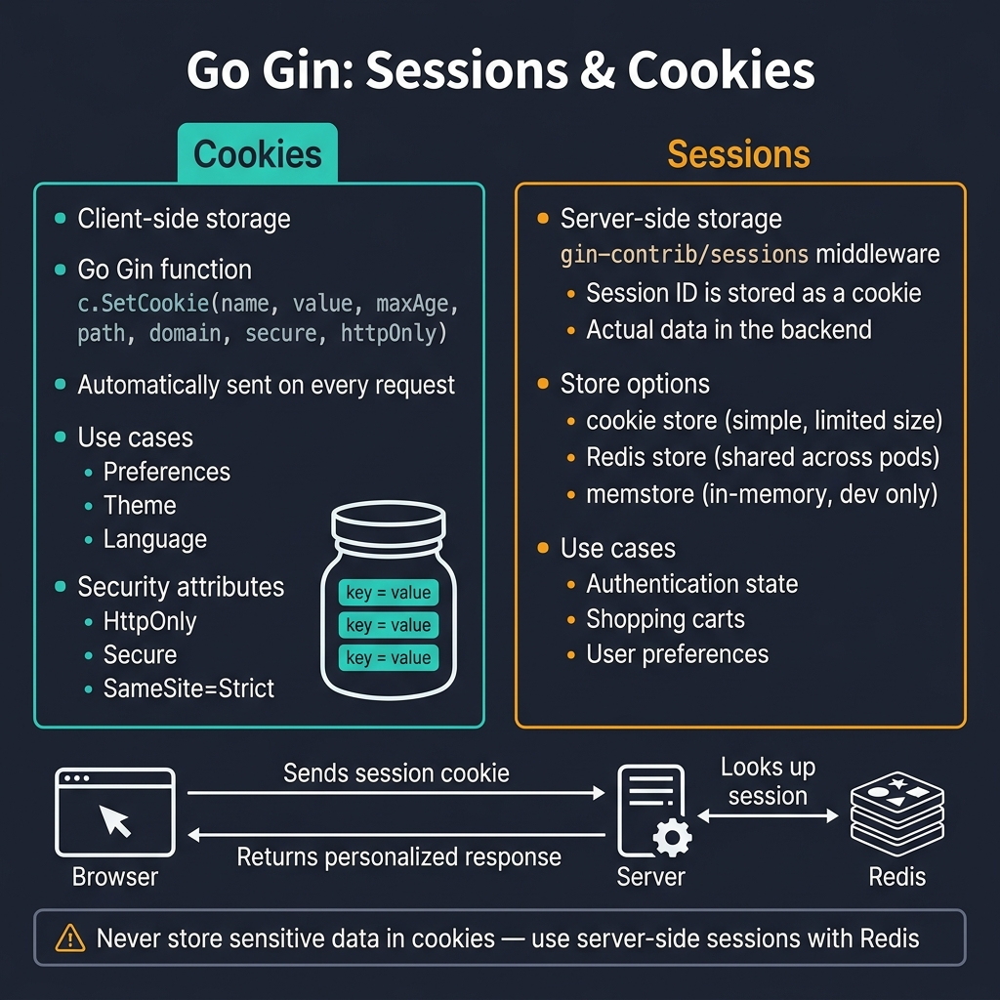

<!-- tags: golang --> # 🍪 Phiên & Cookies — NestJS express-session → Gin gin-contrib/sessions

> **Thư viện**: Đặt/đọc cookie với `c.SetCookie` / `c.Cookie` và quản lý các phiên phía máy chủ thông qua `gin-contrib/sessions` với Redis.

📅 Đã cập nhật: 19-04-2026 · ⏱️ 10 phút đọc

## 1. ĐỊNH NGHĨA

Cookie là cặp khóa-giá trị phía máy khách được gửi theo mọi yêu cầu. Phiên là trạng thái phía máy chủ được khóa bằng cookie ID phiên. Sử dụng cookie cho các tùy chọn; sử dụng các phiên được Redis hỗ trợ cho trạng thái xác thực.

| NestJS | Tương đương Gin |
| ---------------------------- | ---------------------------------------- |
| `express-session` | `gin-contrib/sessions` |
| `req.session.userId` | `session.Set("userID", id)` |
| `res.cookie('name', 'val')` | `c.SetCookie("name", "val", ...)` |
| `@Req() req.cookies` | `c.Cookie("name")` |
| Cửa hàng phiên Redis | `redis.NewStore(10, "tcp", addr, ...)` |

### Bất biến chính

- **Luôn đặt `HttpOnly: true` và `Secure: true` trong quá trình sản xuất.** Nếu không có chúng, cookie sẽ có nguy cơ bị tấn công XSS và kẻ trung gian.
- **Gọi `session.Save()` sau mỗi lần đột biến.** `Set()` không duy trì các thay đổi.

## 2. HÌNH ẢNH  *Hình: Cookie = phía máy khách (tùy chọn, HttpOnly+Secure+SameSite). Phiên = phía máy chủ (trạng thái xác thực) với cookie ID phiên → Tra cứu Redis. Không bao giờ lưu trữ dữ liệu nhạy cảm trong cookie.*```mermaid
flowchart LR
    A["Browser"] -->|"POST /login"| B["Gin Handler"]
    B -->|"session.Set + Save"| C[("Redis Store")]
    C -->|"Set-Cookie: session_id"| A
    A -->|"GET /profile + cookie"| D["Session Middleware"]
    D -->|"session.Get('userID')"| C
```*Hình: Cookie và Phiên — cookie tồn tại trong trình duyệt; các phiên hoạt động trong Redis, được xác định bằng cookie ID phiên.*

### Luồng phiên```text
POST /login
    ├── Validate credentials
    ├── session.Set("userID", "user-123")
    ├── session.Save() → writes to Redis, sets session cookie
    └── Response includes Set-Cookie: app_session=abc123
```## 3. MÃ

### Ví dụ 1: Cơ bản — Cookie gốc```go
    // ━━━━━━━━━━━━━━━━━━━━━━━━━━━━━━━━━━━━━━━━━
    // Native cookies: SetCookie writes, Cookie reads, SetCookie(-1) deletes.
    // HttpOnly=true prevents JavaScript access.
    // ━━━━━━━━━━━━━━━━━━━━━━━━━━━━━━━━━━━━━━━━━
    package main

    import (
        "net/http"
        "github.com/gin-gonic/gin"
    )

    func main() {
        r := gin.Default()

        r.POST("/preferences", func(c *gin.Context) {
            theme := c.PostForm("theme")
            c.SetCookie("theme", theme, 86400*30, "/", "", false, true)
            c.JSON(http.StatusOK, gin.H{"message": "preference saved"})
        })

        r.GET("/preferences", func(c *gin.Context) {
            theme, err := c.Cookie("theme")
            if err != nil {
                theme = "light" 
            }
            c.JSON(http.StatusOK, gin.H{"theme": theme})
        })

        r.DELETE("/preferences", func(c *gin.Context) {
            c.SetCookie("theme", "", -1, "/", "", false, true)
            c.JSON(http.StatusOK, gin.H{"message": "preference cleared"})
        })

        r.Run(":8080")
    }
```### Ví dụ 2: Trung cấp — Persistent Redis Stores```go
    // ━━━━━━━━━━━━━━━━━━━━━━━━━━━━━━━━━━━━━━━━━
    // Redis-backed sessions: state survives server restarts.
    // session.Save() is required after Set() or Clear().
    // ━━━━━━━━━━━━━━━━━━━━━━━━━━━━━━━━━━━━━━━━━
    package main

    import (
        "net/http"
        "github.com/gin-contrib/sessions"
        "github.com/gin-contrib/sessions/redis"
        "github.com/gin-gonic/gin"
    )

    func main() {
        r := gin.Default()

        store, _ := redis.NewStore(10, "tcp", "localhost:6379", "", "secret")
        r.Use(sessions.Sessions("app_session", store))

        r.POST("/login", func(c *gin.Context) {
            session := sessions.Default(c)
            session.Set("userID", "user-123")
            session.Save()
            c.JSON(http.StatusOK, gin.H{"message": "logged in"})
        })

        r.GET("/profile", func(c *gin.Context) {
            session := sessions.Default(c)
            userID := session.Get("userID")
            if userID == nil {
                c.JSON(http.StatusUnauthorized, gin.H{"error": "not logged in"})
                return
            }
            c.JSON(http.StatusOK, gin.H{"userID": userID})
        })

        r.POST("/logout", func(c *gin.Context) {
            session := sessions.Default(c)
            session.Clear()
            session.Save()
            c.JSON(http.StatusOK, gin.H{"message": "logged out"})
        })

        r.Run(":8080")
    }
```---

## 4. Cạm bẫy

| # | Mức độ nghiêm trọng | Khiếm khuyết | Tác động | Sửa chữa |
| --- | --- | --- | --- | --- |
| 1 | 🔴 Gây tử vong | Đặt `HttpOnly: false` và `Secure: false` trong sản xuất | Cookie phiên tiếp xúc với các cuộc tấn công XSS và MITM | Luôn luôn `HttpOnly: true` , `Secure: true` , `SameSite: Strict` |
| 2 | 🟡 Chung | Quên `session.Save()` sau `session.Set()` | Các thay đổi trong phiên bị mất; người dùng xuất hiện đã đăng xuất | Gọi `session.Save()` sau mỗi đột biến |

---

## 5. GIỚI THIỆU

| Tài nguyên | Liên kết |
| --- | --- |
| gin-đóng góp/phiên | [github.com/gin-contrib/sessions](https://github.com/gin-contrib/sessions) |

---

## 6. KHUYẾN NGHỊ

| Gia hạn | Khi nào | Cơ sở lý luận | Tài nguyên |
| --- | --- | --- | --- |
| Xử lý lỗi | Khi bạn cần phản hồi lỗi có cấu trúc | Phần mềm trung gian lỗi tập trung bắt tất cả các lỗi xử lý | [./07-error-handling.md](./07-error-handling.md) |