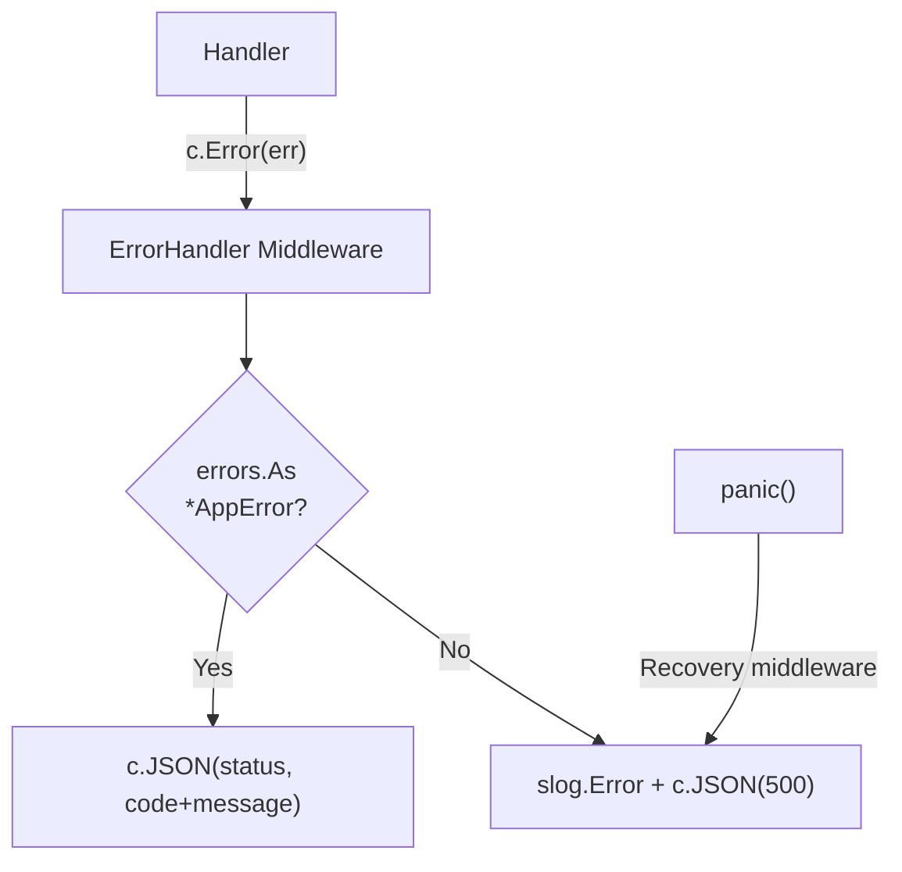

<!-- tags: golang, error-handling -->
# ❌ Error Handling — NestJS Exception Filters → Gin Error Middleware

> **Library**: Domain error types (`AppError`), global error middleware, and custom recovery for panics.

📅 Updated: 2026-04-19 · ⏱️ 12 min read

## 1. DEFINE

NestJS throws `HttpException` subclasses caught by `@Catch()` filters. Gin uses `c.Error(err)` to collect errors, then a middleware reads `c.Errors` after `c.Next()` to build the response. Define an `AppError` struct for typed errors; unknown errors become 500.

| NestJS                              | Gin Equivalent                            |
| ----------------------------------- | ----------------------------------------- |
| `throw new HttpException(msg, 400)` | `c.Error(apperror.BadRequest(msg)); return` |
| `throw new NotFoundException()`     | `c.Error(apperror.NotFound(msg)); return`  |
| `@Catch() ExceptionFilter`          | `ErrorHandler()` middleware after `c.Next()` |
| `app.useGlobalFilters(filter)`      | `r.Use(ErrorHandler())`                   |

### Key Invariants

- **Always `return` after `c.Error()`.** Without it, the handler continues and may write a second response.
- **Mount Recovery before ErrorHandler.** Panics must be caught before the error middleware runs.

## 2. VISUAL


*Figure: Three error paths — AppError (typed, custom HTTP status) via c.Error → error middleware; unknown errors → 500 + logged stack; panics → gin.CustomRecovery catches and returns 500.*



*Figure: Error flow — handler calls `c.Error(err)` → ErrorHandler maps AppError to JSON or returns 500 for unknown errors. Recovery catches panics.*

### Error Resolution

```text
Handler: c.Error(apperror.NotFound("user not found")); return
    → ErrorHandler reads c.Errors.Last()
    → errors.As → *AppError matched → c.JSON(404, {code, message})

Handler: c.Error(fmt.Errorf("unexpected"))
    → ErrorHandler: no *AppError match → log + c.JSON(500, generic error)
```

## 3. CODE

### Example 1: Basic — Domain Error Types

```go
    // ━━━━━━━━━━━━━━━━━━━━━━━━━━━━━━━━━━━━━━━━━
    // AppError carries HTTP status + error code + message.
    // Factory functions (BadRequest, NotFound, etc.) for each status.
    // ━━━━━━━━━━━━━━━━━━━━━━━━━━━━━━━━━━━━━━━━━
    package apperror

    import (
        "fmt"
        "net/http"
    )

    type AppError struct {
        StatusCode int    `json:"-"`
        Code       string `json:"code"`
        Message    string `json:"message"`
        Detail     string `json:"detail,omitempty"`
    }

    func (e *AppError) Error() string { return e.Message }

    func BadRequest(msg string) *AppError {
        return &AppError{StatusCode: http.StatusBadRequest, Code: "BAD_REQUEST", Message: msg}
    }

    func NotFound(msg string) *AppError {
        return &AppError{StatusCode: http.StatusNotFound, Code: "NOT_FOUND", Message: msg}
    }

    func Unauthorized(msg string) *AppError {
        return &AppError{StatusCode: http.StatusUnauthorized, Code: "UNAUTHORIZED", Message: msg}
    }

    func Forbidden(msg string) *AppError {
        return &AppError{StatusCode: http.StatusForbidden, Code: "FORBIDDEN", Message: msg}
    }

    func Conflict(msg string) *AppError {
        return &AppError{StatusCode: http.StatusConflict, Code: "CONFLICT", Message: msg}
    }

    func InternalError(msg string) *AppError {
        return &AppError{StatusCode: http.StatusInternalServerError, Code: "INTERNAL_ERROR", Message: msg}
    }

    func (e *AppError) WithDetail(detail string) *AppError {
        e.Detail = detail
        return e
    }

    func (e *AppError) WithDetailf(format string, args ...any) *AppError {
        e.Detail = fmt.Sprintf(format, args...)
        return e
    }
```

### Example 2: Intermediate — Global Error Handlers

```go
    // ━━━━━━━━━━━━━━━━━━━━━━━━━━━━━━━━━━━━━━━━━
    // ErrorHandler runs after c.Next(), reads c.Errors.
    // Recovery catches panics and returns 500 JSON.
    // ━━━━━━━━━━━━━━━━━━━━━━━━━━━━━━━━━━━━━━━━━
    package middleware

    import (
        "errors"
        "log/slog"
        "net/http"
        "myapp/internal/apperror"
        "github.com/gin-gonic/gin"
    )

    func ErrorHandler() gin.HandlerFunc {
        return func(c *gin.Context) {
            c.Next()

            if len(c.Errors) == 0 {
                return
            }

            err := c.Errors.Last().Err

            var appErr *apperror.AppError
            if errors.As(err, &appErr) {
                c.JSON(appErr.StatusCode, gin.H{
                    "error":   appErr.Code,
                    "message": appErr.Message,
                    "detail":  appErr.Detail,
                })
                return
            }

            slog.Error("unhandled error", "error", err.Error())
            c.JSON(http.StatusInternalServerError, gin.H{
                "error":   "INTERNAL_ERROR",
                "message": "an unexpected error occurred",
            })
        }
    }

    func Recovery() gin.HandlerFunc {
        return gin.CustomRecovery(func(c *gin.Context, recovered any) {
            slog.Error("panic recovered", "panic", recovered)
            c.JSON(http.StatusInternalServerError, gin.H{
                "error":   "INTERNAL_ERROR",
                "message": "an unexpected error occurred",
            })
        })
    }
```

---

## 4. PITFALLS

| # | Severity | Defect | Impact | Fix |
| --- | --- | --- | --- | --- |
| 1 | 🔴 Fatal | Returning raw Go error messages to the client | Internal details leaked (file paths, SQL) | Use `AppError` for client-facing errors; log raw errors server-side |
| 2 | 🔴 Fatal | Recovery middleware placed after ErrorHandler | Panics bypass ErrorHandler and crash the process | Mount: `r.Use(Recovery(), ErrorHandler())` — Recovery first |

---

## 5. REF

| Resource | Link |
| --- | --- |
| Gin Errors | [gin-gonic.com/en/docs/examples/error-handling-middleware](https://gin-gonic.com/en/docs/examples/error-handling-middleware/) |

---

## 6. RECOMMEND

| Extension | When | Rationale | Resource |
| --- | --- | --- | --- |
| Context & Timeout | When you need request deadlines and cancellation | Context propagation ensures DB queries cancel when client disconnects | [../advanced/01-context-timeout.md](../advanced/01-context-timeout.md) |
