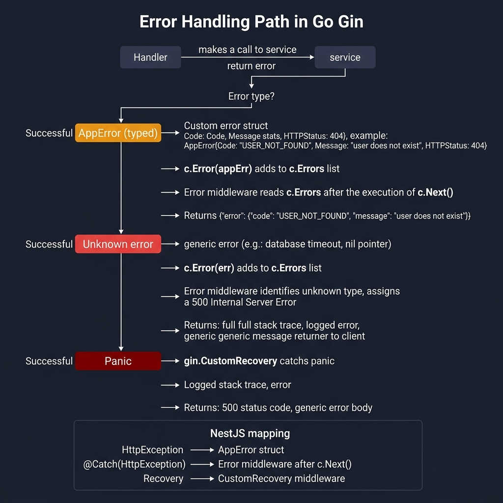

<!-- tags: golang, error-handling --> # ❌ Xử lý lỗi — Bộ lọc ngoại lệ NestJS → Lỗi Gin Middleware

> **Thư viện**: Các loại lỗi miền ( `AppError` ), phần mềm trung gian lỗi toàn cầu và khôi phục tùy chỉnh cho các lỗi hoảng loạn.

📅 Cập nhật: 2026-04-19 · ⏱️ 12 phút đọc

## 1. ĐỊNH NGHĨA

NestJS ném các lớp con `HttpException` bị bắt bởi các bộ lọc `@Catch()` . Gin sử dụng `c.Error(err)` để thu thập lỗi, sau đó phần mềm trung gian đọc `c.Errors` sau `c.Next()` để xây dựng phản hồi. Xác định cấu trúc `AppError` cho các lỗi đánh máy; lỗi không xác định trở thành 500.

| NestJS | Tương đương Gin |
| ----------------------------------- | ----------------------------------------- |
| `throw new HttpException(msg, 400)` | `c.Error(apperror.BadRequest(msg)); return` |
| `throw new NotFoundException()` | `c.Error(apperror.NotFound(msg)); return` |
| `@Catch() ExceptionFilter` | `ErrorHandler()` phần mềm trung gian sau `c.Next()` |
| `app.useGlobalFilters(filter)` | `r.Use(ErrorHandler())` |

### Bất biến chính

- **Luôn luôn `return` sau `c.Error()` .** Nếu không có nó, trình xử lý sẽ tiếp tục và có thể viết phản hồi thứ hai.
- **Mount Recovery trước ErrorHandler.** Phải phát hiện được sự hoảng loạn trước khi phần mềm trung gian lỗi chạy.

## 2. HÌNH ẢNH  *Hình: Ba đường dẫn lỗi — AppError (đã nhập, trạng thái HTTP tùy chỉnh) thông qua c.Error → phần mềm trung gian lỗi; lỗi không xác định → 500 + ngăn xếp được ghi lại; hoảng sợ → gin.CustomRecovery bắt và trả về 500.*```mermaid
flowchart TD
    A["Handler"] -->|"c.Error(err)"| B["ErrorHandler Middleware"]
    B --> C{"errors.As\n*AppError?"}
    C -->|Yes| D["c.JSON(status, code+message)"]
    C -->|No| E["slog.Error + c.JSON(500)"]
    F["panic()"] -->|"Recovery middleware"| E
```*Hình: Luồng lỗi — trình xử lý gọi `c.Error(err)` → ErrorHandler ánh xạ AppError tới JSON hoặc trả về 500 đối với các lỗi không xác định. Quá trình phục hồi gây hoảng loạn.*

### Giải quyết lỗi```text
Handler: c.Error(apperror.NotFound("user not found")); return
    → ErrorHandler reads c.Errors.Last()
    → errors.As → *AppError matched → c.JSON(404, {code, message})

Handler: c.Error(fmt.Errorf("unexpected"))
    → ErrorHandler: no *AppError match → log + c.JSON(500, generic error)
```## 3. MÃ

### Ví dụ 1: Cơ bản — Các loại lỗi tên miền```go
    // ━━━━━━━━━━━━━━━━━━━━━━━━━━━━━━━━━━━━━━━━━
    // AppError carries HTTP status + error code + message.
    // Factory functions (BadRequest, NotFound, etc.) for each status.
    // ━━━━━━━━━━━━━━━━━━━━━━━━━━━━━━━━━━━━━━━━━
    package apperror

    import (
        "fmt"
        "net/http"
    )

    type AppError struct {
        StatusCode int    `json:"-"`
        Code       string `json:"code"`
        Message    string `json:"message"`
        Detail     string `json:"detail,omitempty"`
    }

    func (e *AppError) Error() string { return e.Message }

    func BadRequest(msg string) *AppError {
        return &AppError{StatusCode: http.StatusBadRequest, Code: "BAD_REQUEST", Message: msg}
    }

    func NotFound(msg string) *AppError {
        return &AppError{StatusCode: http.StatusNotFound, Code: "NOT_FOUND", Message: msg}
    }

    func Unauthorized(msg string) *AppError {
        return &AppError{StatusCode: http.StatusUnauthorized, Code: "UNAUTHORIZED", Message: msg}
    }

    func Forbidden(msg string) *AppError {
        return &AppError{StatusCode: http.StatusForbidden, Code: "FORBIDDEN", Message: msg}
    }

    func Conflict(msg string) *AppError {
        return &AppError{StatusCode: http.StatusConflict, Code: "CONFLICT", Message: msg}
    }

    func InternalError(msg string) *AppError {
        return &AppError{StatusCode: http.StatusInternalServerError, Code: "INTERNAL_ERROR", Message: msg}
    }

    func (e *AppError) WithDetail(detail string) *AppError {
        e.Detail = detail
        return e
    }

    func (e *AppError) WithDetailf(format string, args ...any) *AppError {
        e.Detail = fmt.Sprintf(format, args...)
        return e
    }
```### Ví dụ 2: Trung gian — Trình xử lý lỗi toàn cục```go
    // ━━━━━━━━━━━━━━━━━━━━━━━━━━━━━━━━━━━━━━━━━
    // ErrorHandler runs after c.Next(), reads c.Errors.
    // Recovery catches panics and returns 500 JSON.
    // ━━━━━━━━━━━━━━━━━━━━━━━━━━━━━━━━━━━━━━━━━
    package middleware

    import (
        "errors"
        "log/slog"
        "net/http"
        "myapp/internal/apperror"
        "github.com/gin-gonic/gin"
    )

    func ErrorHandler() gin.HandlerFunc {
        return func(c *gin.Context) {
            c.Next()

            if len(c.Errors) == 0 {
                return
            }

            err := c.Errors.Last().Err

            var appErr *apperror.AppError
            if errors.As(err, &appErr) {
                c.JSON(appErr.StatusCode, gin.H{
                    "error":   appErr.Code,
                    "message": appErr.Message,
                    "detail":  appErr.Detail,
                })
                return
            }

            slog.Error("unhandled error", "error", err.Error())
            c.JSON(http.StatusInternalServerError, gin.H{
                "error":   "INTERNAL_ERROR",
                "message": "an unexpected error occurred",
            })
        }
    }

    func Recovery() gin.HandlerFunc {
        return gin.CustomRecovery(func(c *gin.Context, recovered any) {
            slog.Error("panic recovered", "panic", recovered)
            c.JSON(http.StatusInternalServerError, gin.H{
                "error":   "INTERNAL_ERROR",
                "message": "an unexpected error occurred",
            })
        })
    }
```---

## 4. Cạm bẫy

| # | Mức độ nghiêm trọng | Khiếm khuyết | Tác động | Sửa chữa |
| --- | --- | --- | --- | --- |
| 1 | 🔴 Gây tử vong | Trả lại thông báo lỗi Go thô cho máy khách | Chi tiết nội bộ bị rò rỉ (đường dẫn tệp, SQL) | Sử dụng `AppError` cho các lỗi xảy ra với máy khách; ghi lỗi thô phía máy chủ |
| 2 | 🔴 Gây tử vong | Phần mềm trung gian khôi phục được đặt sau ErrorHandler | Hoảng loạn bỏ qua ErrorHandler và làm hỏng quá trình | Mount: `r.Use(Recovery(), ErrorHandler())` — Phục hồi trước |

---

## 5. GIỚI THIỆU

| Tài nguyên | Liên kết |
| --- | --- |
| Lỗi Gin | [gin-gonic.com/en/docs/examples/error-handling-middleware](https://gin-gonic.com/en/docs/examples/error-handling-middleware/) |

---

## 6. KHUYẾN NGHỊ

| Gia hạn | Khi nào | Cơ sở lý luận | Tài nguyên |
| --- | --- | --- | --- |
| Bối cảnh & Thời gian chờ | Khi bạn cần thời hạn yêu cầu và hủy bỏ | Truyền bá bối cảnh đảm bảo các truy vấn DB bị hủy khi máy khách ngắt kết nối | [../advanced/01-context-timeout.md](../advanced/01-context-timeout.md) |