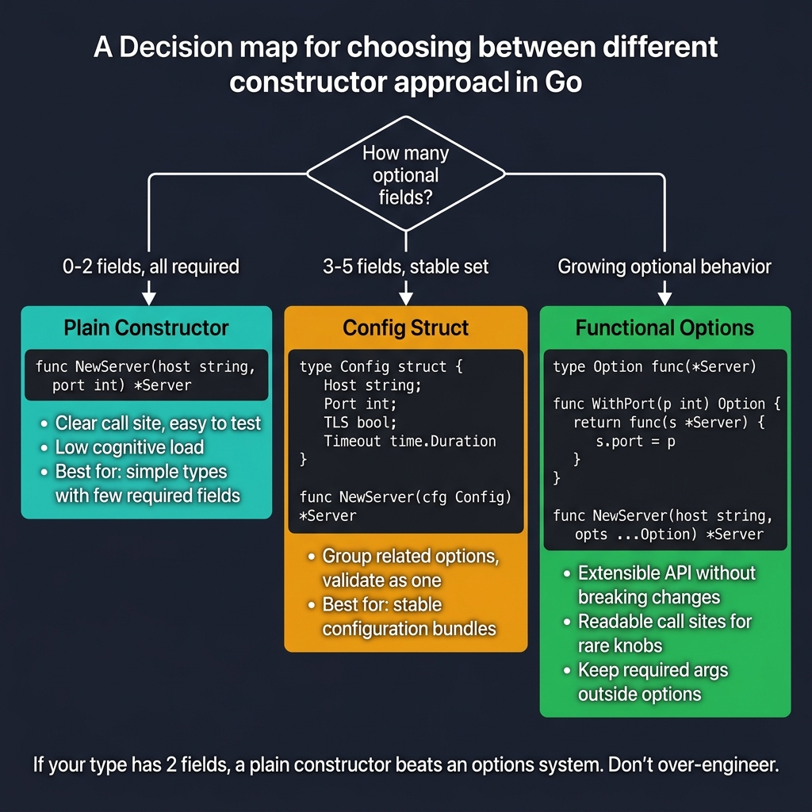

<!-- tags: golang, idioms, constructors, functional-options -->
# 🏗️ Constructors & Functional Options in Go

> **Idiom**: Creating instances and handling optional configurations using explicit constructor functions and the Functional Options pattern.

📅 Updated: 2026-04-14 · ⏱️ 12 min read

| Aspect | Detail |
| --- | --- |
| **Type** | Go idiom |
| **Use when** | Structs require validation, default values, or feature many optional parameters. |
| **Avoid when** | Struct zero-values are immediately safe and functional without prior setup. |

## 1. DEFINE

A large networking component requires an IP address, a protocol type, read timeouts, write timeouts, TLS certificates, and a custom logger. The initial implementation utilizes a single massive struct initialization `server := Server{...}`. While simple, the developer soon realizes downstream teams frequently forget to assign timeouts, causing the application to hang infinitely upon dropped connections.

Go lacks native parameter overloading or traditional class-based `constructor` methods. When allocating standard parameters, developers must manually enforce structurally safe instantiation. Attempting to pass 10 parameters directly into a single `NewServer(addr, port, timeout, logger, isTLS, ...)` function creates extreme fragility. Calling signatures become unreadable and adding a single new configuration field breaks every existing consumer across the entire monolithic codebase.

By applying **Constructors and Functional Options**, developers abstract massive unmanageable footprints. A primary constructor function (`NewHTTPServer`) demands absolute required parameters (e.g., `addr`). The constructor assigns critical structural defaults natively. Subsequently, the function accepts a variadic slice of option closures (`...ServerOption`). These closures mutate the underlying instance safely, allowing infinitely scalable configurations without altering the core function signature. 

### 1.1 Invariants & Failure Modes

| Boundary | Core Responsibility |
| --- | --- |
| **Zero-Value Deficits** | When internal pointers or nested maps require allocation, a struct's zero-value fails immediately. Constructors guarantee memory safety. |
| **Encapsulation** | Functional options allow developers to keep configuration struct fields private (`s.readTimeout`), exposing mutations purely through controlled functions. |

| Rule | Rationale |
| --- | --- |
| **Enforce Required Fields** | Pass non-negotiable parameters natively as direct arguments inside the `New()` signature. |
| **Apply Sane Defaults** | The core constructor must map reasonable production-grade limits prior to evaluating user-provided functional option closures. |

### 1.2 Failure Cascades

- **The Naked Struct Panic:** Exposing public structs (`type Server struct`) containing internal uninitialized maps guarantees nil-pointer panics when consumers bypass your intended instantiation logic.
- **The Positional Nightmare:** Implementing `NewClient(url, 5, 10, true, nil, nil)` requires developers to memorize exact positional placements. Any signature modification shatters backward compatibility instantly.

## 2. VISUAL

Isolating connected component layers smoothly identifies explicit baseline boundaries protecting downstream logic.



*Figure: Decision tree — 0-2 required fields → Plain Constructor (NewServer(host, port)), 3-5 stable fields → Config Struct (NewServer(cfg)), growing optional behavior → Functional Options (NewServer(host, WithPort(8080))). Warning: don't over-engineer 2-field types.*

## 3. CODE

Integrating defined operations connects specific configuration parameters gracefully avoiding rigid unmaintainable API signatures.

### Example 1: Basic — Constructor with clear defaults

> **Goal**: Demand an address but default all networking limits ensuring immediate out-of-the-box system safety.
> **Approach**: Build a `NewHTTPServer` generating a pre-configured pointer evaluated strictly via optional loops.
> **Complexity**: O(N) configuration evaluation.

```go
// server.go — Constructor + Functional Options: Stable server bootstrap.
package main

import (
	"errors"
	"fmt"
	"log/slog"
	"net/http"
	"time"
)

type HTTPServer struct {
	addr         string
	readTimeout  time.Duration
	writeTimeout time.Duration
	logger       *slog.Logger
}

type ServerOption func(*HTTPServer) error

func NewHTTPServer(addr string, opts ...ServerOption) (*HTTPServer, error) {
	if addr == "" {
		return nil, errors.New("addr is required")
	}

	// Maps absolute execution defaults protecting underlying system constraints instantly.
	server := &HTTPServer{
		addr:         addr,
		readTimeout:  5 * time.Second,
		writeTimeout: 10 * time.Second,
		logger:       slog.Default(),
	}

	for _, opt := range opts {
		if err := opt(server); err != nil {
			return nil, fmt.Errorf("apply option: %w", err)
		}
	}

	return server, nil
}

func (s *HTTPServer) ListenAndServe(handler http.Handler) error {
	httpServer := &http.Server{
		Addr:         s.addr,
		Handler:      handler,
		ReadTimeout:  s.readTimeout,
		WriteTimeout: s.writeTimeout,
	}
	return httpServer.ListenAndServe()
}
```

> **Takeaway**: Required fields (`addr`) block bad instantiations upfront while functional slices extend underlying struct variations flawlessly.

---

### Example 2: Intermediate — Functional options closures

> **Goal**: Create explicit typed configuration methods masking mutable private struct fields.
> **Approach**: Return `ServerOption` closures capturing parameter inputs via lexical scope.
> **Complexity**: O(1) closure allocations.

```go
// options.go — Functional options make optional configuration explicit and evolvable.
package main

func WithReadTimeout(d time.Duration) ServerOption {
	return func(s *HTTPServer) error {
		if d <= 0 {
			return errors.New("read timeout must be > 0 against constraints")
		}
		s.readTimeout = d
		return nil
	}
}

func WithWriteTimeout(d time.Duration) ServerOption {
	return func(s *HTTPServer) error {
		if d <= 0 {
			return errors.New("write timeout must be > 0 applying baseline security")
		}
		s.writeTimeout = d
		return nil
	}
}

func WithLogger(logger *slog.Logger) ServerOption {
	return func(s *HTTPServer) error {
		if logger == nil {
			return errors.New("logger must not be nil protecting internal boundaries")
		}
		s.logger = logger
		return nil
	}
}
```

> **Takeaway**: Explicit option parameters parse individual configurations allowing immediate constraint rejection avoiding massive unified validation structures.

---

### Example 3: Advanced — Environment presets via grouped options

> **Goal**: Distribute clustered pre-defined application definitions switching staging vs. production parameters quickly.
> **Approach**: Formulate composite `ServerOption` wrappers layering multiple underlying configurations.
> **Complexity**: O(1) function wrapping.

```go
// presets.go — Compose opinionated defaults avoiding complex monolithic structures.
package main

import (
	"log/slog"
	"os"
)

func WithProductionDefaults() ServerOption {
	return func(s *HTTPServer) error {
		s.readTimeout = 3 * time.Second
		s.writeTimeout = 5 * time.Second
		return nil
	}
}

func WithDevelopmentDefaults() ServerOption {
	return func(s *HTTPServer) error {
		s.readTimeout = 30 * time.Second
		s.writeTimeout = 30 * time.Second
		return nil
	}
}

func ExecuteBootstrap() (*HTTPServer, error) {
	logger := slog.New(slog.NewJSONHandler(os.Stdout, nil))

	return NewHTTPServer(
		":8080",
		WithProductionDefaults(),
		WithLogger(logger),
		WithWriteTimeout(8*time.Second), // Evaluates sequentially overwriting production defaults safely.
	)
}
```

> **Takeaway**: Functional patterns enable powerful composition chaining entire environments while preserving discrete developer overrides seamlessly.

## 4. PITFALLS

Executing functional parameter properties reliably prevents downstream application instability completely.

| # | Severity | Defect | Impact | Fix |
|---|----------|-----|---------|-----|
| 1 | 🔴 Fatal | Constructing complex components utilizing naked primitive public structs bypassing internal validation. | Developers specify raw empty initializations triggering absolute nil-pointer crashes tracking uninitialized nested mapping arrays. | Restrict critical struct fields privately demanding explicit `NewStruct()` constructor routing logic perfectly. |
| 2 | 🟡 Common | Adding massive rigid parameter clusters natively inside primary constructor signatures. | Requires rewriting entire interface boundaries fracturing backwards compatibility directly disrupting extensive interconnected modules. | Isolate flexible parameters parsing distinct variadic `...Option` slice iterations isolating external modifications effectively. |
| 3 | 🟡 Common | Advancing unchecked isolated defaults completely ignoring negative timing values. | Abstracting dangerous unknown validations executes internal configuration bugs deploying disconnected timeout limits crashing API connections. | Configure explicit boundary checks validating raw inputs directly inside mapped functional option definitions efficiently. |

## 5. REF

| Resource | Link | Description |
| --- | --- | --- |
| Effective Go | [go.dev/doc/effective_go](https://go.dev/doc/effective_go) | Evaluates internal idiomatic initialization limits definitively. |
| Functional Options | [dave.cheney.net/functional-options](https://dave.cheney.net/2014/10/17/functional-options-for-friendly-apis) | Reviews complex parameter grouping configurations defining explicit pattern advantages. |

## 6. RECOMMEND

Executing specific parameters dynamically relies strictly upon proper configuration extraction mechanisms.

| Extension | When to proceed | Rationale | File/Link |
| --- | --- | --- | --- |
| Interfaces | Evaluating detached complex properties managing middleware injection systems natively. | Defines strict functional abstraction patterns implementing distinct implementation boundaries securely. | [02-interfaces-decorators-and-middleware.md](./02-interfaces-decorators-and-middleware.md) |
| Struct Tags | Injecting generic structural decoding definitions natively parsing JSON logic. | Enforces rigid external encoding transformations parsing strict reflection boundaries cleanly. | [../fundamental/helper/12-class-struct.md](../fundamental/helper/12-class-struct.md) |

**Navigation**: [← Idioms Overview](./README.md) · [→ Interfaces & Middleware](./02-interfaces-decorators-and-middleware.md)
