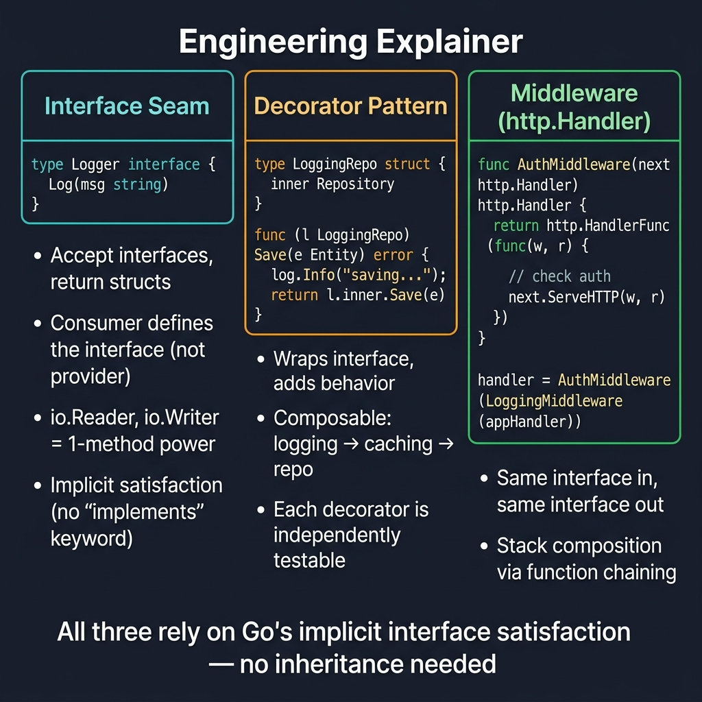

<!-- tags: golang, idioms, architecture, middleware -->
# 🧩 Interfaces, Decorators & Middleware in Go

> **Idiom**: Small independent interfaces orchestrating automated structural boundaries replacing rigid class inheritance models.

📅 Updated: 2026-04-14 · ⏱️ 13 min read

| Aspect | Detail |
| --- | --- |
| **Type** | Go idiom |
| **Use when** | Cross-cutting concerns like authorization, logging, metrics, or caching require extraction from primary business logic. |
| **Avoid when** | Establishing an abstraction purely "for the sake of an interface" without a definitive consumer needing the contract. |

## 1. DEFINE

In traditional OOP models, developers frequently inject massive God-Interfaces (`IUserService`) possessing dozens of methods into deeply nested components. This triggers catastrophic blast radii—modifying a single unused method forces recompilation and restructuring across 50 unrelated files. 

Go rejects massive monolithic interfaces natively. Instead, Go prioritizes **Consumer-Defined Interfaces**. Interfaces reside alongside the code attempting to *use* them, mapping exclusively the exact subset of methods strictly required by the consumer.

This structural flexibility allows developers to seamlessly implement **Adapters, Decorators, and Middleware**. Because small interfaces evaluate implicitly (duck typing), developers effortlessly wrap base structures inside identical architectural borders, augmenting system behaviors cleanly without directly polluting the underlying business logic.

### 1.1 Invariants & Failure Modes

| Boundary | Core Responsibility |
| --- | --- |
| **Interface Composition** | Distributes active structural logic confidently limiting coupling constraints natively. (`type Reader interface { Read(...) }`) |
| **Adapter Pattern** | Orchestrates strict underlying implementations bridging incompatible structs cleanly. |
| **Decorator Pattern** | Configures active external behaviors extending existing struct functionality flawlessly. |
| **Middleware Pipeline** | Executes explicit chain pipelines evaluating parameters sequentially over HTTP layers. |

### 1.2 Failure Cascades

- 🔴 **Premature Abstraction:** Developers define interfaces alongside implementations out of habit, resulting in massive rigid bounds preventing optimal consumer flexibility.
- 🔴 **God Middlewares:** Generating extreme monolithic wrappers passing raw unverified contexts rather than strongly-typed structural components.

## 2. VISUAL

Validating explicit configurations implements correct structured topological boundaries preventing disconnected execution leaks.



*Figure: Three composition patterns — Interface Seam (accept interfaces, return structs, implicit satisfaction), Decorator (wraps interface, adds logging/caching), Middleware (http.Handler in/out, function chaining). All rely on Go's implicit interface satisfaction — no inheritance.*

## 3. CODE

Integrating optimal functional boundaries evaluates explicit dependencies completely safely avoiding rigid structural couplings.

### Example 1: Basic — Small consumer-side interface

> **Goal**: Define exclusively what the caller natively requires instead of exporting massive package boundaries.
> **Approach**: The consumer specifies exactly which method limits it calls.
> **Complexity**: O(1) interface allocation.

```go
// service.go — Keep the contract strictly limited to internal operational needs.
package main

import "context"

type User struct {
	ID    string
	Email string
}

// UserReader is declared by the caller, defining only the absolute necessity.
type UserReader interface {
	FindByID(ctx context.Context, id string) (*User, error)
}

type userService struct{}

func (s *userService) FindByID(ctx context.Context, id string) (*User, error) {
	return &User{ID: id, Email: "user@example.com"}, nil
}
```

> **Takeaway**: Establishing explicit nested properties correctly limits architecture bounds protecting specific implementations from external module updates natively.

---

### Example 2: Intermediate — Decorator capturing cross-cutting concerns

> **Goal**: Add precise operational timings without polluting core business implementations.
> **Approach**: Wrap the `UserReader` utilizing identical interface bounds while intercepting requests directly.
> **Complexity**: O(1) allocation wrapping.

```go
// decorator.go — Add cross-cutting constraints protecting core logic completely.
package main

import (
	"log/slog"
	"time"
)

type loggingUserReader struct {
	next   UserReader
	logger *slog.Logger
}

func WithUserLogging(next UserReader, logger *slog.Logger) UserReader {
	return &loggingUserReader{next: next, logger: logger}
}

func (d *loggingUserReader) FindByID(ctx context.Context, id string) (*User, error) {
	start := time.Now()
	// Evaluates the exact underlying boundaries securely bypassing core code mutations.
	user, err := d.next.FindByID(ctx, id)
	d.logger.Info("find user", "id", id, "duration", time.Since(start), "error", err)
	return user, err
}
```

> **Takeaway**: Resolving specific active logic cleanly wraps strict implementations keeping the underlying `userService` oblivious to metric tracking logic directly.

---

### Example 3: Advanced — Functional Middleware Chains

> **Goal**: Compose complex HTTP constraints mapping authorization and logging sequences.
> **Approach**: Wrap `http.Handler` interfaces forming rigid explicit HTTP middleware wrappers natively.
> **Complexity**: O(N) chain nesting iteration.

```go
// middleware.go — Compose HTTP concerns without heavy monolithic frameworks natively.
package main

import (
	"context"
	"errors"
	"log/slog"
	"net/http"
	"time"
)

type ctxKey string
const userIDKey ctxKey = "userID"

type Middleware func(http.Handler) http.Handler

func Chain(handler http.Handler, middlewares ...Middleware) http.Handler {
	for i := len(middlewares) - 1; i >= 0; i-- {
		handler = middlewares[i](handler)
	}
	return handler
}

func RequestLogger(logger *slog.Logger) Middleware {
	return func(next http.Handler) http.Handler {
		return http.HandlerFunc(func(w http.ResponseWriter, r *http.Request) {
			start := time.Now()
			next.ServeHTTP(w, r)
			logger.Info("http request", "method", r.Method, "path", r.URL.Path, "duration", time.Since(start))
		})
	}
}

func RequireBearerToken(validate func(string) (string, error)) Middleware {
	return func(next http.Handler) http.Handler {
		return http.HandlerFunc(func(w http.ResponseWriter, r *http.Request) {
			token := r.Header.Get("Authorization")
			if token == "" {
				http.Error(w, "missing token", http.StatusUnauthorized)
				return
			}

			// Validate explicit security expectations blocking detached unverified users completely.
			userID, err := validate(token)
			if err != nil {
				http.Error(w, "invalid token", http.StatusUnauthorized)
				return
			}

			ctx := context.WithValue(r.Context(), userIDKey, userID)
			next.ServeHTTP(w, r.WithContext(ctx))
		})
	}
}

func validateToken(token string) (string, error) {
	if token != "Bearer demo-token" {
		return "", errors.New("token rejected")
	}
	return "user-123", nil
}
```

> **Takeaway**: Publishing specific handler updates intelligently chains flawless parameters gracefully passing strongly typed context values recursively.

---

### Example 4: Expert — Stacking complex decorators dynamically

> **Goal**: Inject flexible caching and logging capabilities utilizing dynamic composition completely.
> **Approach**: Return interface wrappers executing nested structural hierarchies inside construction routines reliably.
> **Complexity**: O(1) recursive composition mapping.

```go
// composition.go — Build intricate service limits composing interface wrappers cleanly.
package main

type cachingUserReader struct {
	next  UserReader
	cache map[string]*User
}

func WithUserCache(next UserReader) UserReader {
	return &cachingUserReader{
		next:  next,
		cache: map[string]*User{},
	}
}

func (c *cachingUserReader) FindByID(ctx context.Context, id string) (*User, error) {
	if user, ok := c.cache[id]; ok {
		return user, nil
	}

	user, err := c.next.FindByID(ctx, id)
	if err != nil {
		return nil, err
	}
	c.cache[id] = user
	return user, nil
}

func BuildUserReader(base UserReader, logger *slog.Logger) UserReader {
	// Establishes absolute isolated layers safely composing interfaces cleanly.
	return WithUserLogging(WithUserCache(base), logger)
}
```

> **Takeaway**: Releasing critical comprehensive boundaries dependably nests caching internal bounds ensuring outer logic maps exactly correctly elegantly.

## 4. PITFALLS

Evaluating fundamental Decorator patterns natively requires mapping optimal interface decoupling cleanly avoiding monolithic tangles correctly.

| # | Severity | Defect | Consequence | Fix |
|---|----------|-----|---------|-----|
| 1 | 🔴 Fatal | Defining detached unrelated definitions inside massively coupled provider interfaces rigidly. | Passing massive complex components breaks consumer dependencies demanding massive recompilations across unconnected domains. | Define strict targeted consumer interfaces effectively limiting structural exposure securely mapping explicit caller dependencies neatly. |
| 2 | 🔴 Fatal | Ignoring explicit HTTP response errors wrapping unverified middlewares silently. | Dropping critical reliable connections securely passing unauthenticated payloads corrupting subsequent internal requests silently. | Emphasize explicit early returns halting middleware chains completely responding specifically with HTTP unauthorized status flags. |
| 3 | 🟡 Common | Missing absolute priority boundaries wrapping caching before logging logic independently. | Tracing complex ambiguous logs generates extreme visibility deficits bypassing actual query times completely inside application monitoring layers. | Formulate exact structured pipeline hierarchies positioning caching layers securely below global diagnostic logic dependably. |

## 5. REF

| Resource | Link | Description |
| --- | --- | --- |
| Context | [go.dev/blog/context](https://go.dev/blog/context) | Evaluates distinct detached logic efficiently managing deadline hierarchies. |
| net/http | [pkg.go.dev/net/http](https://pkg.go.dev/net/http) | Resolves complex HTTP integrations defining clean Handler interface boundaries natively. |

## 6. RECOMMEND

Executing explicit functional configurations correctly reduces vast architectural code coupling dependencies natively perfectly.

| Extension | When to proceed | Rationale | File/Link |
| --- | --- | --- | --- |
| Pipelines & Cancellation | Evaluating detached pipeline boundaries separating massive background operations intelligently. | Configures explicit concurrent bounds passing critical cancellation limits precisely stopping unmanaged resource leaks smoothly. | [03-pipelines-worker-pools-and-cancellation.md](./03-pipelines-worker-pools-and-cancellation.md) |
| Functional Options | Abstracting complex nested struct parameter configurations cleanly. | Defines rigid constructor extraction ensuring internal instance safety securely applying defaults cleanly. | [01-constructors-and-functional-options.md](./01-constructors-and-functional-options.md) |

**Navigation**: [← Constructors](./01-constructors-and-functional-options.md) · [→ Pipelines](./03-pipelines-worker-pools-and-cancellation.md)
